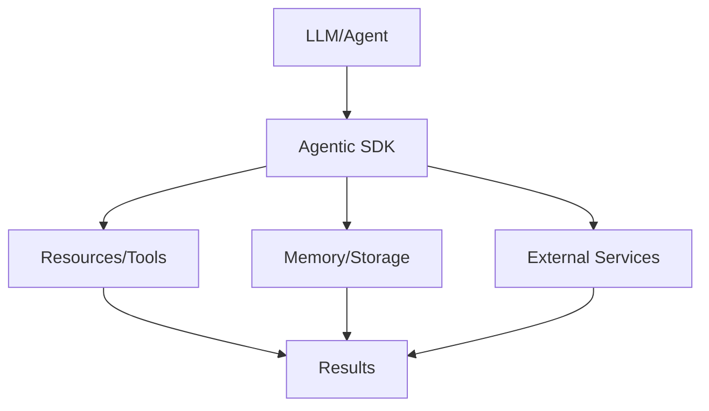

# Agentic SDK

## Detailed Explanation

Agentic SDK is a critical modern technique in AI engineering. Frameworks for building production agents. This represents the practical state-of-the-art in how production AI systems are built and connected today. Understanding this technique is essential for building scalable, reliable AI systems that integrate seamlessly with external resources and services. The key insight is that Agentic SDK bridges the gap between LLMs and external systems, enabling agents to access tools, memory, and resources in a standardized way.

## Core Intuition

Think of Agentic SDK as the standardized language that lets LLMs talk to the rest of your infrastructure. Instead of each model needing custom integrations, you define once and use everywhere.

## How It Works

1. Define your resources, tools, or memory requirements
2. Implement the Agentic SDK protocol or use an SDK
3. Connect to your LLM or agent framework
4. Handle requests and responses through the standard interface
5. Scale across multiple models and deployments
6. Monitor and optimize the connections



## Architecture / Trade-offs

Agentic frameworks differ significantly in flexibility, feature completeness, and production readiness. The choice depends on your use case, team expertise, and scaling needs.

### Agent Framework Comparison

| Framework | Learning Curve | Built-in Features | Flexibility | Production Maturity | Community |
|-----------|----------------|-------------------|-------------|-------------------|-----------|
| LangChain | Steep (many APIs) | Chains, memory, tools | High (composable) | Medium (evolving) | Very large |
| LlamaIndex | Moderate (data-focused) | Indexing, retrieval, chunking | Moderate (opinionated) | Medium (RAG-focused) | Growing |
| CrewAI | Moderate (role-based) | Multi-agent coordination, task framework | Low (opinionated) | Low (newer) | Small |
| AutoGen (Microsoft) | Moderate (conversation loop) | Multi-agent, code execution | High (customizable) | Medium (research-grade) | Growing |
| Claude SDK (Anthropic) | Low (simple API) | Tool use, agentic loops | High (control-focused) | High (production-ready) | Focused |

**LangChain**: Largest ecosystem, most tutorials. Steep learning curve (50+ abstractions). Good for complex pipelines. Production stability variable.

**LlamaIndex**: Best for RAG-focused agents. Simple, focused API. Good for retrieval-heavy workloads. Less suitable for general agentic workflows.

**CrewAI**: Simple mental model (assign roles to agents). Opinion enforces structure. Best for teams wanting conventions. Limited flexibility for custom workflows.

**AutoGen**: Research project from Microsoft. Good for complex multi-turn conversations. Less polished than production frameworks. Good for experimentation.

**Claude SDK**: Minimal, control-focused. You write the agentic loop. Best for teams wanting determinism and full visibility. Smallest ecosystem but highest production clarity.

### Use Case Decision Matrix

| Use Case | Best Framework | Why |
|----------|----------------|-----|
| RAG + semantic search | LlamaIndex | Purpose-built for retrieval |
| Complex multi-step workflows | LangChain | Composable chains, many integrations |
| Multi-agent coordination | AutoGen or CrewAI | Built-in multi-agent patterns |
| High-determinism production | Claude SDK | Maximum control and observability |
| Customer service chatbot | CrewAI | Simple role-based framework |
| Research/experimentation | AutoGen | Flexible, academic backing |

## Design Challenges

Production agentic systems face challenges that emerge only at scale:

- **Determinism vs Adaptability**: Given the same input, agents should produce the same output (for testing, debugging, reproducibility). But LLMs are stochastic—temperature and randomness mean same input → different output. Frameworks abstract this away, hiding sources of non-determinism. Result: bugs that don't reproduce, tests that flake, impossible to debug. Requires explicit seed control, determinism testing, replaying logs, frozen models.

- **Observability & Debugging Agent Behavior**: Agent made a wrong decision. Why? Did it misunderstand the goal? Retrieve wrong facts? Use wrong tool? Hallucinate? Framework logs show: "called tool X". No insight into reasoning. Requires detailed trace logging: prompt sent to LLM, response received, decision made, consequences. At scale, logging everything is expensive (cost, storage). Tradeoff: sample logging (10% of calls) or detailed logging (expensive).

- **Cost Control & Budget Management**: Each agent API call costs money (GPT-4 = $0.03/1K tokens). Long-running agent with reasoning chains can cost $1-10 per task. At scale (1000 tasks/day), costs are $1000-10000/day. No budget limits, costs explode. Without visibility, you don't know if agent is hallucinating (making extra API calls) or if load is just high. Requires cost tracking per agent, per task, anomaly detection, hard limits (fail if cost > threshold).

- **Handling Tool Failures & Cascading Errors**: Agent calls Tool A (fails). Falls back to Tool B (succeeds, but gives wrong answer). Agent uses wrong answer. Makes bad decision. Error cascades. Frameworks need: fallback strategies (try Tool B if A fails), error types (temporary failure vs permanent), retry logic with backoff, circuit breakers (disable failing tools), graceful degradation.

- **Multi-turn Context Window Management**: Long conversations (100 turns) exceed LLM context window. Which turns to keep? Summarize old turns? Drop them? If you drop important context, agent forgets key facts. If you keep everything, hit token limits. Requires summarization strategy, prioritization (what's important?), semantic compression (multiple turns → one summary fact).

## Interview Q&A

**Q: What makes an agent framework production-ready vs research-grade?**
A: Production readiness requires: (1) Determinism—same input produces same output (testable). (2) Observability—see why agent made decisions (debuggable). (3) Cost control—limits on spending (operational). (4) Error handling—tool failures don't cascade (reliable). (5) Reproducibility—replay past runs, understand decisions (auditable). Research frameworks (AutoGen) prioritize flexibility. Production frameworks (Claude SDK) prioritize control and visibility. Question what you need: are you building a POC (flexibility OK) or shipping to users (control essential)?

**Q: How do you ensure agent reproducibility (same input = same output)?**
A: (1) Fix random seed (reproducible randomness in LLM sampling). (2) Lock model version (don't upgrade mid-experiment). (3) Log everything (prompts, LLM responses, tool calls, decisions). (4) Replay from logs (replay same inputs, see if outputs match). Challenges: LLM temperature (randomness), API updates, tool behavior changes. Requires versioning strategy: freeze model + tool versions for important runs, semantic versioning for upgrades. In testing, use seeded temperature=0 (deterministic). In production, use small temperature (low variance but not zero) for slight variation without breaking reproducibility.

**Q: What's the difference between agentic frameworks vs simple function calling?**
A: Function calling: you define tools as functions, model learns tool signatures, you call tools. Static, coupled. Agentic frameworks: agent autonomously chooses tools, chains them, adapts. Dynamic, decoupled. Example: function calling with ["calculator", "database"] means model must learn both. Framework agent discovers tools at runtime, uses "best" tool for task. Frameworks enable: dynamic tool discovery, tool fallbacks, sequential reasoning (use output of tool A as input to tool B). Cost: added complexity, harder to debug.

**Q: How do you handle cost explosion when agents call APIs repeatedly?**
A: Problem: agent calls GPT-4 per reasoning step. 10 steps × $0.03/1K tokens = $0.30 per task. 1000 tasks/day = $300/day. Causes: hallucination (extra steps), inefficient prompts, unnecessary reasoning. Solutions: (1) Use cheaper models (GPT-3.5 where possible). (2) Batch operations (multiple tasks at once). (3) Caching (save expensive computations). (4) Thought budgets (max N reasoning steps). (5) Monitoring (alert if cost per task > threshold). Tradeoff: cheaper models = worse performance, thought limits = poorer reasoning. Requires tuning per use case.

**Q: How do you prevent agents from forgetting important context in long conversations?**
A: Problem: conversation 100 turns. GPT-4 context = 8K tokens. Conversation + tools + reasoning = 6K tokens. Only room for 2K tokens of history = ~10 turns. Agent forgets earlier context. Solutions: (1) Summarization—periodically compress old turns into one summary fact. (2) Semantic tagging—mark turns as "important" vs "filler", keep important only. (3) Separate memory store—keep detailed history in database, retrieve relevant facts per query. (4) Context window budgeting—allocate tokens (50% for history, 30% for tools, 20% for reasoning). Requires testing: does agent make better decisions with more context (usually yes, up to point)?

**Q: How do you debug why an agent made a bad decision?**
A: Requires detailed tracing: (1) What was the goal/prompt? (2) What facts did agent retrieve? (3) What tools did agent call? (4) What were tool results? (5) What reasoning did agent do (show thoughts)? (6) What was final decision? Missing any step makes debugging impossible. Implement structured logging: log each step as JSON (queryable, analyzable). Enable detailed tracing in prod for failed tasks (log everything). Tools: prompt replay (send exact same prompt to model, see response), step-by-step inspection (manually check each decision), A/B testing (compare agent behavior across versions).

## Best Practices

- Use official SDKs when available (don't reinvent the wheel)
- Version your protocol implementations and clients independently
- Implement proper error handling for all resource types
- Monitor connection latency and resource availability
- Test with multiple LLM models to ensure compatibility
- Document your resource schemas clearly for other developers
- Plan for scaling: Agentic SDK should work with thousands of resources

## Common Pitfalls

- **Non-deterministic behavior hides bugs & breaks testing**: Two agents started with same task make different decisions (different temperatures, stochastic model). One succeeds, one fails. Impossible to debug (behavior doesn't reproduce). Tests flake (pass sometimes, fail randomly). Result: low confidence in agent reliability. Fix: Use temperature=0 in development/testing (deterministic), log all randomness sources, implement determinism tests (run 5 times, should be identical), avoid relying on stochastic behavior.

- **Cost explosion from uncontrolled API calls**: Agent is intelligent but expensive. Calls GPT-4 per reasoning step. Intermediate tool calls cost money. Chain of thought reasoning is cheap locally but expensive remotely. Multiply by 1000 tasks. Costs escalate silently (no warning). Monthly bill shocks. Result: impossible to scale. Fix: Implement cost tracking per agent/task, set hard limits (fail if cost > $1), use cheaper models for simple tasks, batch inference (multiple tasks per call), monitor cost anomalies (alert if cost/task increases).

- **Agent hallucination cascades through tool calls**: Agent makes up a fact (user lives in NYC—actually Boston). Calls address lookup tool with NYC. Gets wrong results. Bases next decision on wrong facts. Cascading errors. Result: complete agent failure from single hallucination. Fix: Validate facts before using in tool calls (fact checking), tool result validation (does result make sense?), error recovery (if tool result seems wrong, try different approach), limit chain depth (max 3-4 sequential tool calls).

- **Hard to debug multi-turn agent behavior**: Agent made wrong decision in turn 5. Why? Check turn 1-4 context. Was context wrong? Were tool results misinterpreted? Was prompt unclear? No insight—logs show "made decision" not "why". Result: spend hours debugging unclear issues. Fix: Log every decision step (prompt → LLM response → decision logic → action). Record full traces (write to database, queryable). Replay capability (given same inputs, reproduce same outputs). Structured logging (JSON, easy to search).

- **Tools fail silently or with unclear errors**: Agent calls database tool. Tool times out (no error message). Agent interprets null result as "no data found". Makes decision on missing info. Actually, tool failed. Wrong decision made silently. Fix: Implement explicit error types (timeout ≠ not found), retry with backoff (transient failures), circuit breaker (disable tool if failing consistently), fallback strategies (use different tool, simplify task), failure alerts (notify if tool down).

## Code Examples

### Example 1: Basic Implementation

```python
# Basic Agentic SDK pattern
class Resource:
    def __init__(self, name, description):
        self.name = name
        self.description = description
    
    def execute(self, params):
        return {'name': self.name, 'result': params}

# Define resources
calculator = Resource('calculator', 'Basic math operations')
memory = Resource('memory', 'Agent memory storage')

# Execute
result = calculator.execute({'operation': 'add', 'a': 5, 'b': 3})
print(result)
```

### Example 2: Production with Error Handling

```python
import logging
from typing import Dict, Any
import time

logger = logging.getLogger(__name__)

class ManagedResource:
    def __init__(self, name: str, timeout: int = 30):
        self.name = name
        self.timeout = timeout
        self.available = True
    
    def execute(self, request: Dict[str, Any]) -> Dict[str, Any]:
        try:
            logger.info(f'Executing {self.name}: {request}')
            start = time.time()
            
            # Check availability
            if not self.available:
                return {'error': 'Resource unavailable'}
            
            # Execute with timeout
            result = self._do_execute(request)
            latency = time.time() - start
            
            logger.info(f'Completed in {latency:.2f}s')
            return {'success': True, 'result': result, 'latency': latency}
            
        except Exception as e:
            logger.error(f'Error: {e}')
            return {'error': str(e)}
    
    def _do_execute(self, request):
        # Your implementation here
        return request

# Usage
resource = ManagedResource('api-gateway', timeout=5)
response = resource.execute({'endpoint': '/data', 'query': 'test'})
print(response)
```

## Related Concepts

- [Agentic Testing Harness](./03-agentic-testing-harness.md)
- [Persistent AI Memory](./04-persistent-ai-memory.md)
- [LLMOps](./18-llmops.md)
- [AI Gateway & Routing](./19-ai-gateway-routing.md)
