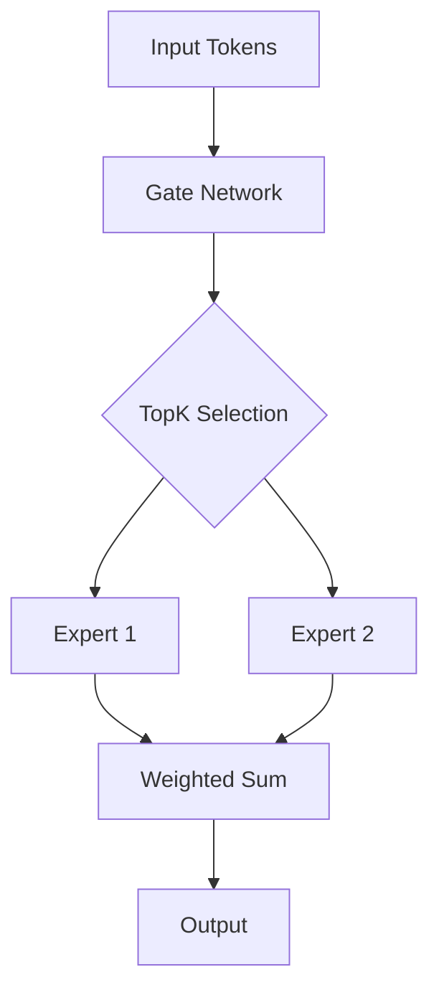

# Mixture of Experts Routing

## Detailed Explanation

Mixture of Experts (MoE) and long context are critical techniques for modern LLMs:

**MoE** enables scaling to trillion-parameter models with sparse activation. Instead of using all parameters, a gating network routes each token to only k expert subnetworks. This achieves 3-4x speedup while maintaining or improving quality. Mixtral 8x7B (2x parameters of 7B single model, <50% extra compute) demonstrates the efficiency gains. DeepSeek-V2 uses 64 experts with auxiliary-loss-free load balancing.

**Long Context** extends models from 4K tokens (BERT era) to 128K-1M tokens (2026). Techniques like RoPE, position interpolation, and sparse attention enable efficient long-range reasoning. Critical for RAG systems, code analysis, and document understanding where context is key.

## Core Intuition
Imagine a company with 100 expert employees where each task only needs 2 specialists. Instead of activating everyone (100% compute), you route each task to the right 2 people. The router learns who handles what. By year-end, you've done the same work with only 2% of total activation cost.

## How It Works

1. **Compute gating logits**: Pass input through linear gate: h(x) = x·W_g ∈ ℝ^{num_experts}
2. **Select top-k experts**: Apply TopK(softmax(h(x)), k=2) to get sparse selection
3. **Normalize scores**: Re-normalize selected expert weights to sum to 1
4. **Capacity check**: Each expert has capacity = ceil(capacity_factor × tokens / num_experts). Tokens exceeding capacity are dropped (passed through residual)
5. **Weighted aggregation**: Output = Σ(g_i × E_i(x)) for selected experts only

## Architecture / Trade-offs

| Aspect | MoE | Single Dense |
|--------|-----|-------------|
| Active Parameters | k/n% | 100% |
| Compute | Low | High |
| Quality | Higher | Baseline |
| Implementation | Complex | Simple |
| Load Balancing | Required | N/A |

**Key Trade-offs**:
- More experts (n): better quality, harder to balance
- Higher k: more compute, better quality
- Larger capacity_factor: more memory, fewer drops

## Design Challenges

1. **Load Imbalance**: Some experts overloaded, others empty. Fix: auxiliary loss L_aux = α·Σ f_i·P_i with α=0.01-0.001
2. **Token Dropping**: Capacity exceeded, tokens dropped. Fix: increase capacity_factor to 1.25-2.0
3. **Communication Overhead**: In distributed setting, all-gather of expert outputs. Fix: expert parallelism via careful sharding

## Interview Q&A

**Q1: How do you prevent load imbalance where some experts get overloaded?**
A: Use auxiliary loss L_aux that penalizes imbalanced routing. Set α=0.01 and monitor f_i distribution. Also increase capacity_factor to 1.25 to provide buffer.
**Q2: What's the trade-off between Top-1 and Top-2 routing?**
A: Top-1: 1x compute per token, max efficiency, higher drop rate. Top-2: 2x compute, 2% quality gain, lower drops. Mixtral uses Top-2 as sweet spot.
**Q3: How do you handle token dropout during inference?**
A: Increase capacity_factor from 1.0 (training) to 2.0 (inference). Reserve extra buffer so no tokens are dropped. Monitor expert utilization.
**Q4: Can you use learned routing instead of softmax TopK?**
A: Yes, use learned gates with sigmoid or gumbel-softmax. More flexible but harder to train. DeepSeek uses biased gating for auxiliary-loss-free routing.

## Best Practices

- **Auxiliary Loss**: Always use L_aux in training. Monitor f_i (expert routing fraction). If any expert < 5%, increase α or improve initialization
- **Capacity Factor**: Use 1.0 during training (tight), 2.0 during inference (loose). Prevents drops under batch variation
- **Expert Initialization**: Initialize gate W_g small (~0.1 std) so experts start equally likely. Large init causes early collapse
- **Load Balancing**: Monitor expert utilization per batch. Ideal: uniform distribution. Use load_balance_loss_weight based on deviation
- **Top-K Selection**: Start with Top-2 (safe), move to Top-1 if compute budget tight. Never use Top-1 without strong loss monitoring
- **Inference Optimization**: Batch requests to fill expert capacity. Use dynamic batching to group by predicted expert
- **Distributed Training**: Use expert parallelism (experts on different GPUs) for large models. Minimize all-gather communication

## Common Pitfalls

- **Token dropping silently degrades quality if capacity_factor too low. Always monitor drop rate.**: Token dropping silently degrades quality if capacity_factor too low. Always monitor drop rate.
- **Load imbalance between experts causes GPU underutilization. Increase α or improve load balancing.**: Load imbalance between experts causes GPU underutilization. Increase α or improve load balancing.
- **Training instability from sparse gradients. Use gradient clipping and careful learning rate scheduling.**: Training instability from sparse gradients. Use gradient clipping and careful learning rate scheduling.

## Key Formula

L_aux = α·N_E·Σ(f_i·P_i), where f_i = fraction routed to expert i, P_i = mean probability allocated, α = 0.01

## Production Considerations

- **Monitoring**: Track expert utilization, token drop rate, auxiliary loss weight, gate entropy
- **Scaling**: MoE scales to 1T+ parameters. Distribution across devices critical
- **Cost Tradeoff**: More experts = more memory (expert weights). 8 experts is sweet spot for 7B-70B range
- **Inference Batching**: Important to batch to amortize expert activations. Single-sample inference underutilizes experts

---

**Related Concepts**: 
- Token Pruning (36): Remove unimportant tokens before MoE
- Router Learning (39): Learn routing policies adaptively
- Conditional Computation (53): Gate subnetworks dynamically

**Notebook**: `modern-ai/notebooks/mixture-of-experts.ipynb`
**Implementation**: `modern-ai/implementations/mixture-of-experts.py`
