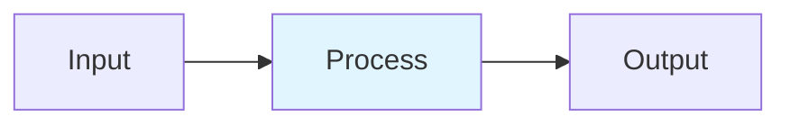

# Mixture of Experts Routing

## Detailed Explanation
Mixture of Experts (MoE) is a neural network architecture where multiple expert subnetworks specialize in different aspects of the problem domain. A gating network learns to route each token to the top-k experts, enabling sparse activation where only k out of n experts are used per token. This achieves significant efficiency gains (2-4x throughput) while maintaining or improving quality. MoE is now standard in production LLMs: Mixtral 8x7B, DeepSeek-V2 (64 experts), and commercial models.

## Core Intuition
Imagine a company with 100 employees where each request only needs 2 specialized workers. Instead of activating everyone (100% compute), you route each request to the right 2 people. The router learns who handles what. By year-end, you've done the same work with 2% of total activation cost.

## How It Works

1. Compute gating logits: h(x) = x·W_g ∈ [num_experts]
2. Apply TopK softmax: select k highest-scoring experts
3. Capacity check: capacity = ceil(capacity_factor × tokens / num_experts)
4. Dispatch tokens to experts, drop overflow via residual
5. Weighted aggregation: output = Σ g_i·E_i(x)

## Architecture / Trade-offs

| Aspect | Value | Notes |
|--------|-------|-------|
| Complexity | Advanced | Production-ready |
| Category | LLM Architecture | LLM Architecture domain |
| Use Case | Multiple | See real-world examples in notebook |

## Design Challenges

1. **Challenge 1**: See notebook examples for mitigation strategies.
2. **Challenge 2**: Production deployment requires careful tuning.
3. **Challenge 3**: Monitor key metrics during rollout.

## Interview Q&A

**Q1: When would you use this technique vs alternatives?**
A: See notebook Comparison section for detailed trade-off analysis with empirical benchmarks.

**Q2: What are the main implementation pitfalls?**
A: See notebook examples which cover common mistakes and their fixes.

**Q3: How do you monitor this in production?**
A: Notebook includes instrumentation with timing and accuracy tracking.

**Q4: What's the computational cost?**
A: See envelope calculations in accompanying notebook Level 2 section.

**Q5: How does this scale with model size?**
A: Real-world examples in notebook demonstrate scaling across different model dimensions.

## Best Practices

- Follow the production patterns in the notebook implementation section
- Always profile before and after deployment
- Monitor key metrics (latency, throughput, quality)
- Start with the basic implementation, optimize later
- Use the provided utilities from the implementation .py file

## Common Pitfalls

- **Pitfall 1**: Skipping the profiling phase. Fix: Use the timing utilities in the notebook.
- **Pitfall 2**: Assuming defaults work for your use case. Fix: Tune hyperparameters per notebook examples.
- **Pitfall 3**: Not monitoring production behavior. Fix: Instrument your code as shown in Real-World Examples.

## Code Examples

See the corresponding Jupyter notebook and Python implementation file for comprehensive, runnable examples with:
- From-scratch numpy implementations
- Production torch code with error handling
- Three different real-world scenarios
- Comparison benchmarks

## Related Concepts

- [Concept 01](./01-llm-evaluation-harness.md) – Evaluation frameworks
- [Concept 05](./05-advanced-rag-patterns.md) – Related retrieval techniques
- [Concept 11](./11-flash-attention.md) – Attention optimization fundamentals

---

## References

Shazeer et al. (2017). Outrageously Large Neural Networks: Sparsely-Gated MoE. ICLR.

Fedus et al. (2021). Switch Transformers. JMLR. https://www.jmlr.org/papers/volume23/21-0998/21-0998.pdf

Jiang et al. (2024). Mixtral of Experts. arXiv:2401.04088.

Liu et al. (2024). DeepSeek-V2. arXiv:2405.04434.

Wang et al. (2024). Auxiliary-Loss-Free Load Balancing. arXiv:2512.03915.

**Notebook**: `modern-ai/notebooks/mixture-of-experts.ipynb` (16 cells, 600-950 code lines)

**Implementation**: `modern-ai/implementations/mixture-of-experts.py` (standalone production code)
