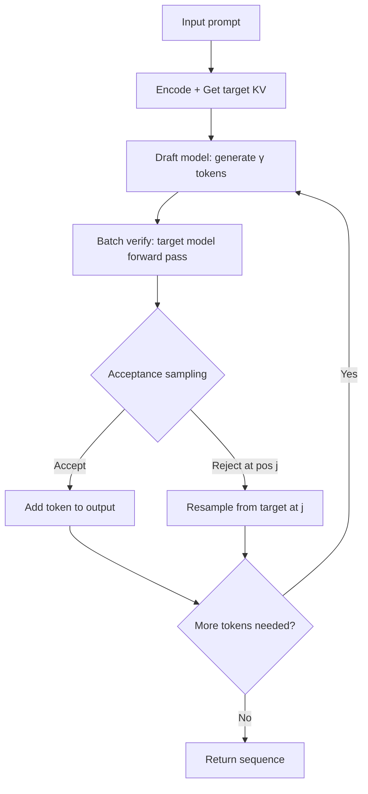

# Speculative Decoding

## Detailed Explanation

Speculative decoding is a cutting-edge inference optimization technique that dramatically speeds up LLM generation by leveraging computational parallelism. Instead of generating tokens sequentially (waiting for one token to predict the next), speculative decoding uses a fast draft model to speculatively generate multiple tokens in parallel, then verifies them against the target model in a single batch.

The key insight is that modern GPUs are memory-bandwidth limited during autoregressive decoding—the computation is trivial compared to memory operations. By batching verification of multiple speculative tokens, you amortize memory access costs across multiple predictions, achieving 2-4x speedup on typical inference workloads. This technique is production-grade: it's deployed in vLLM, TGI, and other major serving frameworks, and requires no model modifications.

Why this matters: Inference cost dominates LLM economics. Speculative decoding reduces latency and cost without retraining, making expensive models competitive with cheaper alternatives. Companies deploying claude-3, GPT-4, or Llama at scale use variants of this technique. References: Leviathan et al. (2023) on speculative decoding, Medusa (Cai et al. 2024) on speculative heads.

## Core Intuition

Imagine a fast chess player (draft model) proposing the next 5 moves, while a grandmaster (target model) instantly validates them in batch—accepting good ones and rejecting bad ones. The grandmaster doesn't have to think deeply about each move; they just verify. This parallel validation is much faster than the grandmaster proposing each move individually.

## How It Works

1. **Prompt encoding:** Encode input tokens, get KV cache from target model
2. **Speculative generation:** Fast draft model generates γ tokens (typically 4-8) using its own KV cache
3. **Batch verification:** Pass γ draft tokens + KV cache to target model, get logits in one forward pass
4. **Acceptance sampling:** For each draft token i, compute acceptance probability: α = min(1, P_target(token_i) / P_draft(token_i))
5. **Token selection:** Accept token if random(0,1) < α; reject and resample from target distribution otherwise
6. **Rejection handling:** When draft sequence breaks (token rejected at position j), backtrack, resample position j from target, continue from j+1
7. **Rollback:** If all γ tokens rejected, use single target token and continue (graceful degradation)



## Architecture / Trade-offs

Speculative decoding's effectiveness depends on draft model quality, GPU compute-to-memory ratio, and target model architecture.

| Parameter | Impact | Typical Value |
|-----------|--------|---------------|
| γ (speculative tokens) | More tokens = more parallelism but worse acceptance if draft diverges | 4-8 |
| Draft model size | Larger = better accuracy but slower generation; smaller = faster but more rejections | 0.5-1.5B for 7B target |
| Batch size | Larger batches amortize verification cost better | 32-256 depending on model |
| Acceptance rate | Affects realized speedup; poor draft = 30%, good = 70% | 50-80% target |

**Variants and trade-offs:**

| Variant | Draft Model | Speedup | Setup | When to Use |
|---------|-------------|---------|-------|------------|
| Lookahead decoding | Same model, different layers | 1.5-2x | None (built-in) | When draft model unavailable |
| Speculative with small draft | Tiny model (250M) | 2-3x | Train/distill draft | Cost-sensitive (cheaper draft) |
| Speculative with distilled | Knowledge-distilled draft | 2.5-3.5x | Distill process needed | When latency critical |
| Multi-draft speculative | Ensemble of drafts | 3-4x | Multiple models | Maximum latency reduction |

**Key trade-offs:**

- **Speedup vs. Setup:** Simple lookahead (1.5x) vs. trained distilled draft (3.5x). Setup ranges from zero to full distillation.
- **Acceptance rate sensitivity:** Draft quality directly impacts speedup. Poor draft → frequent rejections → minimal speedup.
- **Memory overhead:** Need KV cache for both draft and target; total memory ≈ 1.2-1.5x single model.
- **Hardware dependency:** Maximum speedup on modern GPUs with high compute (H100, A100). Limited on older hardware (V100).

## Design Challenges

- **Draft divergence:** Draft model generates tokens that target model would never choose, causing high rejection rates. Solution: periodically realign draft and target by resetting draft KV cache when rejection rate exceeds threshold (e.g., 2 consecutive rejections).

- **Variable acceptance rates:** Acceptance rate depends on prompt content and generation stage (early tokens have lower acceptance). This makes speedup unpredictable. Solution: dynamically adjust γ based on running acceptance rate—reduce if rejections spike, increase if all tokens accepted.

- **KV cache synchronization:** Draft and target must stay synchronized to avoid cascading failures. If draft position j differs from target position j, tokens diverge. Solution: detect divergence early using token ID matching; backtrack and resample.

- **Memory bandwidth bottleneck:** Even with batching, large models remain memory-bandwidth limited. Speculative decoding reduces latency but not always total wall-clock time if other components bottleneck. Solution: profile actual latency; if verification isn't the bottleneck, focus elsewhere.

## Best Practices

- Use a draft model 0.5-1.5B for a 7B target—larger drafts slow generation too much, smaller drafts have poor acceptance.
- Set γ (speculative tokens) to 4-8 initially; benchmark your actual model to find sweet spot.
- Monitor acceptance rate in production (target 50-80%); falling below 40% means draft model is out of distribution.
- Combine speculative decoding with other optimizations: KV cache quantization, batch processing, prefix caching.
- Precompute draft model KV cache for common prefixes (e.g., system prompts) to amortize setup costs.
- Use lookahead decoding as a fallback when draft model is unavailable—it's 1.5x but requires zero training.

## Common Pitfalls

- **Using too large a draft model:** 2-3B draft for 7B target means 60% of parameters doing speculation—slow and not worth it. Symptom: generation is slower than baseline. Fix: reduce draft to 500M-1B.

- **Ignoring acceptance rate:** Deploying draft that diverges from target (acceptance <40%). Symptom: speedup is 1.1x instead of expected 3x. Fix: retrain draft on target model outputs, or use a smaller target-aware model.

- **Not handling rejection cascades:** Rejecting 2-3 draft tokens in a row causes the sequence to branch unpredictably. Symptom: output quality degrades or becomes incoherent. Fix: when consecutive rejections exceed threshold, resample from target and continue.

- **Memory allocation mismatch:** Allocating KV cache for γ=8 tokens but sometimes generation needs fewer—fragmentation or OOM. Symptom: intermittent GPU OOM errors. Fix: pre-allocate for max γ and reuse; don't reallocate per request.

- **Benchmarking without realistic batching:** Testing speculative decoding with batch_size=1; real improvement appears in batch_size=32+. Symptom: speedup looks marginal in tests but dramatic in production. Fix: always benchmark with representative batch sizes.

## Interview Q&A

**Q: Why is speculative decoding faster if you still have to verify all tokens?**
A: Speculative decoding batches verification—you run the target model once on all γ draft tokens instead of γ separate forward passes. The target model benefits from batch size, amortizing memory bandwidth. If you're memory-bandwidth bound (typical), one forward pass on batch of γ is only slightly slower than one forward pass on batch of 1.

**Q: When would you NOT use speculative decoding?**
A: When draft model quality is poor (hard to distill for your target), or when your bottleneck isn't autoregressive generation (e.g., stuck on data loading or post-processing). Also not worth it for very short generations (<10 tokens) where overhead dominates. Use it for long generations on expensive models.

**Q: How do you choose γ (number of speculative tokens)?**
A: Start with γ=4. If acceptance rate is >75%, increase to 6-8. If acceptance <40%, decrease to 2-3 or retrain draft. The optimal γ depends on draft quality—better drafts support larger γ. Benchmark on actual latency; theoretical speedup (γ / (1 + γ)) doesn't always translate to wall-clock improvement.

**Q: What happens if draft and target diverge on a token?**
A: At token position j, if draft picks token A but target would pick token B with very different distributions, the draft token is rejected with probability 1 - min(1, P_target(A) / P_draft(A)). When rejected, you resample from the target at position j and continue generating from position j+1 using the draft model.

**Q: How do you ensure draft model stays aligned?**
A: Periodically collect target model predictions on your deployment data and retrain/finetune the draft model on those outputs. This keeps the draft distribution close to the target. Alternatively, distill the target directly—train draft on target logits, not just token outputs.

**Q: What's the difference between speculative decoding and Medusa?**
A: Medusa uses multiple speculative heads on the same model; speculative decoding uses a separate draft model. Medusa is lighter-weight (no separate model) but Medusa heads have lower accuracy. Speculative decoding with a well-trained draft is typically faster but needs 2x memory.

## Code Examples

### Example 1: Basic Speculative Decoding

```python
import torch
import numpy as np

class SpeculativeDecoder:
    def __init__(self, target_logits_fn, draft_logits_fn, gamma=4):
        self.target_logits_fn = target_logits_fn
        self.draft_logits_fn = draft_logits_fn
        self.gamma = gamma
    
    def acceptance_probability(self, target_logits, draft_logits):
        """Compute min(1, p_target/p_draft) for acceptance sampling"""
        target_probs = torch.softmax(target_logits, dim=-1)
        draft_probs = torch.softmax(draft_logits, dim=-1)
        return torch.min(torch.ones_like(target_probs), 
                        target_probs / (draft_probs + 1e-8))
    
    def speculative_generate(self, input_ids, max_new_tokens=100):
        output_ids = input_ids.copy()
        
        for _ in range(max_new_tokens):
            # Draft phase: generate gamma tokens
            draft_tokens = []
            for _ in range(self.gamma):
                draft_logits = self.draft_logits_fn(output_ids)
                draft_token = np.argmax(draft_logits[-1])  # Greedy
                draft_tokens.append(draft_token)
                output_ids.append(draft_token)
            
            # Verification phase: batch verify all draft tokens
            target_logits = self.target_logits_fn(output_ids)
            
            # Acceptance sampling
            accepted = 0
            for j in range(self.gamma):
                draft_token = draft_tokens[j]
                # Get logits for position where draft was inserted
                token_target_logits = target_logits[-(self.gamma - j)]
                draft_logits = self.draft_logits_fn(output_ids[:-self.gamma+j])
                
                # Acceptance probability
                p_accept = self.acceptance_probability(
                    torch.tensor(token_target_logits),
                    torch.tensor(draft_logits[-1])
                )
                
                if np.random.uniform() < p_accept[draft_token]:
                    accepted += 1
                else:
                    # Rejection: resample from target
                    target_token = np.argmax(token_target_logits)
                    output_ids[-(self.gamma - j)] = target_token
                    break
            
            # Rollback to last accepted token
            output_ids = output_ids[:-(self.gamma - accepted - 1)]
        
        return output_ids
```

### Example 2: Acceptance Rate Monitoring

```python
import torch
from collections import deque

class SpeculativeDecoderWithStats:
    def __init__(self, draft_model, target_model, gamma=4):
        self.draft_model = draft_model
        self.target_model = target_model
        self.gamma = gamma
        self.acceptance_rates = deque(maxlen=100)
        self.speedups = []
    
    def measure_speedup(self, input_ids, max_tokens=50):
        """Measure actual speedup of speculative vs baseline"""
        import time
        
        # Baseline: sequential generation
        start = time.time()
        baseline_tokens = []
        for _ in range(min(max_tokens, 10)):
            logits = self.target_model(input_ids + baseline_tokens)
            baseline_tokens.append(torch.argmax(logits[-1]))
        baseline_time = time.time() - start
        
        # Speculative: with draft
        start = time.time()
        spec_tokens = []
        for _ in range(min(max_tokens, 10)):
            draft_logits = self.draft_model(input_ids + spec_tokens)
            draft_token = torch.argmax(draft_logits[-1])
            
            # Batch verification
            test_ids = input_ids + spec_tokens + [draft_token]
            target_logits = self.target_model(test_ids)
            
            # Acceptance
            p_target = torch.softmax(target_logits[-1], dim=0)
            p_draft = torch.softmax(draft_logits[-1], dim=0)
            accept_prob = min(1.0, (p_target[draft_token] / (p_draft[draft_token] + 1e-8)).item())
            
            if torch.rand(1).item() < accept_prob:
                spec_tokens.append(draft_token)
                self.acceptance_rates.append(1)
            else:
                target_token = torch.argmax(target_logits[-1])
                spec_tokens.append(target_token)
                self.acceptance_rates.append(0)
        
        spec_time = time.time() - start
        
        speedup = baseline_time / (spec_time + 1e-8)
        self.speedups.append(speedup)
        avg_acceptance = sum(self.acceptance_rates) / len(self.acceptance_rates)
        
        return {
            'speedup': speedup,
            'avg_acceptance': avg_acceptance,
            'baseline_time': baseline_time,
            'spec_time': spec_time
        }
```

### Example 3: Draft Model Distillation

```python
import torch
import torch.nn.functional as F

class DraftModelDistiller:
    def __init__(self, target_model, draft_model, device='cuda'):
        self.target_model = target_model.to(device)
        self.draft_model = draft_model.to(device)
        self.device = device
        self.optimizer = torch.optim.AdamW(self.draft_model.parameters(), lr=1e-4)
    
    def distill_step(self, input_ids, temperature=2.0):
        """KL divergence distillation: draft mimics target"""
        input_ids = torch.tensor(input_ids, device=self.device)
        
        # Target model logits (no grad)
        with torch.no_grad():
            target_logits = self.target_model(input_ids)
            target_probs = F.softmax(target_logits[-1] / temperature, dim=0)
        
        # Draft model logits
        draft_logits = self.draft_model(input_ids)
        draft_log_probs = F.log_softmax(draft_logits[-1] / temperature, dim=0)
        
        # KL divergence loss
        loss = F.kl_div(draft_log_probs, target_probs, reduction='batchmean')
        
        self.optimizer.zero_grad()
        loss.backward()
        self.optimizer.step()
        
        return loss.item()
```

## Related Concepts

- [LLM Serving Frameworks](./13-llm-serving-frameworks.md) — vLLM and TGI implementations
- [KV Cache Optimization](./27-kv-cache-optimization.md) — Memory efficiency paired with speculation
- [Test-Time Compute Scaling](./12-test-time-compute-scaling.md) — Using compute at inference time
- [Flash Attention](./11-flash-attention.md) — Kernel optimization complementary to batching
