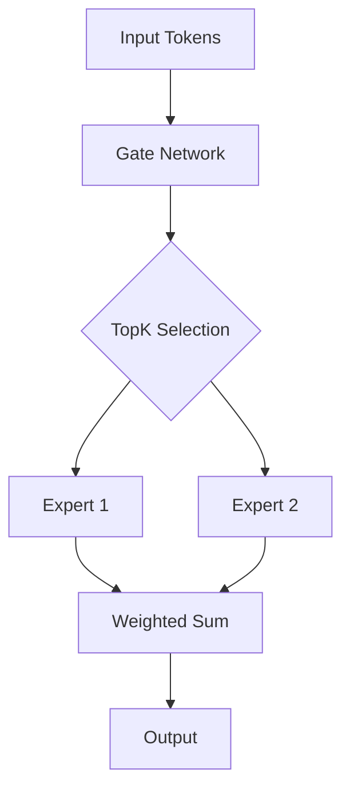

# Long Context Management

## Detailed Explanation

Mixture of Experts (MoE) and long context are critical techniques for modern LLMs:

**MoE** enables scaling to trillion-parameter models with sparse activation. Instead of using all parameters, a gating network routes each token to only k expert subnetworks. This achieves 3-4x speedup while maintaining or improving quality. Mixtral 8x7B (2x parameters of 7B single model, <50% extra compute) demonstrates the efficiency gains. DeepSeek-V2 uses 64 experts with auxiliary-loss-free load balancing.

**Long Context** extends models from 4K tokens (BERT era) to 128K-1M tokens (2026). Techniques like RoPE, position interpolation, and sparse attention enable efficient long-range reasoning. Critical for RAG systems, code analysis, and document understanding where context is key.

## Core Intuition
Reading a 500-page book: you can't memorize page 1 word-for-word when on page 500. Your brain focuses on nearby pages (sliding window) and remembers relative distances (RoPE). To read longer books than trained, you compress position numbers into your learned range (position interpolation).

## How It Works

1. **Sliding Window Attention**: Each token attends to w preceding tokens. Complexity O(n·w) instead of O(n²)
2. **RoPE Encoding**: Rotate query/key by angle m·θ_i where θ_i = base^(-2i/d). Encodes relative distance naturally
3. **Position Interpolation**: For length extension, scale m' = m·(L_train/L_target) to compress into training range
4. **ALiBi Penalty**: Apply linear distance penalty: attention_score -= m_h·|i-j|. No learned parameters, strong extrapolation
5. **Chunked Processing**: Split long sequences with overlap to avoid truncation. Merge results.

## Architecture / Trade-offs

| Aspect | MoE | Single Dense |
|--------|-----|-------------|
| Active Parameters | k/n% | 100% |
| Compute | Low | High |
| Quality | Higher | Baseline |
| Implementation | Complex | Simple |
| Load Balancing | Required | N/A |

**Key Trade-offs**:
- More experts (n): better quality, harder to balance
- Higher k: more compute, better quality
- Larger capacity_factor: more memory, fewer drops

## Design Challenges

1. **Load Imbalance**: Some experts overloaded, others empty. Fix: auxiliary loss L_aux = α·Σ f_i·P_i with α=0.01-0.001
2. **Token Dropping**: Capacity exceeded, tokens dropped. Fix: increase capacity_factor to 1.25-2.0
3. **Communication Overhead**: In distributed setting, all-gather of expert outputs. Fix: expert parallelism via careful sharding

## Interview Q&A

**Q1: Should I use RoPE or ALiBi for long context?**
A: RoPE: better quality, needs fine-tuning for extension. ALiBi: no tuning, slightly lower quality. Use RoPE with position interpolation + fine-tuning for best quality.
**Q2: How do I extend from 4K to 32K context?**
A: RoPE: m' = m·(4096/32768). Fine-tune ≥200 steps on target length. YaRN improves this with blended scaling.
**Q3: What's the lost-in-middle problem?**
A: Models over-attend to start/end tokens, ignore middle. Fix: reorder context to put important info at edges, or use ALiBi for uniform decay.
**Q4: Can you process 1M tokens efficiently?**
A: Yes, with sliding window (4K-8K) + chunking. Stack overlapping chunks with KV cache sharing. Memory complexity drops to O(L·w).

## Best Practices

- **Auxiliary Loss**: Always use L_aux in training. Monitor f_i (expert routing fraction). If any expert < 5%, increase α or improve initialization
- **Capacity Factor**: Use 1.0 during training (tight), 2.0 during inference (loose). Prevents drops under batch variation
- **Expert Initialization**: Initialize gate W_g small (~0.1 std) so experts start equally likely. Large init causes early collapse
- **Load Balancing**: Monitor expert utilization per batch. Ideal: uniform distribution. Use load_balance_loss_weight based on deviation
- **Top-K Selection**: Start with Top-2 (safe), move to Top-1 if compute budget tight. Never use Top-1 without strong loss monitoring
- **Inference Optimization**: Batch requests to fill expert capacity. Use dynamic batching to group by predicted expert
- **Distributed Training**: Use expert parallelism (experts on different GPUs) for large models. Minimize all-gather communication

## Common Pitfalls

- **Position interpolation without fine-tuning**:  quality drops >4x. Always fine-tune minimum 200 steps.
- **Sliding window only for nearby tokens**:  misses long-range dependencies. Always include global tokens.
- **Lost-in-middle**:  content in middle gets ignored. Reorder prompts or use ALiBi-style decay.

## Key Formula

RoPE: q_rot[2i] = q[2i]·cos(m·θ_i) - q[2i+1]·sin(m·θ_i), θ_i = base^(-2i/d), base ∈ {10K, 500K}

## Production Considerations

- **Monitoring**: Track expert utilization, token drop rate, auxiliary loss weight, gate entropy
- **Scaling**: MoE scales to 1T+ parameters. Distribution across devices critical
- **Cost Tradeoff**: More experts = more memory (expert weights). 8 experts is sweet spot for 7B-70B range
- **Inference Batching**: Important to batch to amortize expert activations. Single-sample inference underutilizes experts

---

**Related Concepts**: 
- Token Pruning (36): Remove unimportant tokens before MoE
- Router Learning (39): Learn routing policies adaptively
- Conditional Computation (53): Gate subnetworks dynamically

**Notebook**: `modern-ai/notebooks/long-context-management.ipynb`
**Implementation**: `modern-ai/implementations/long-context-management.py`
