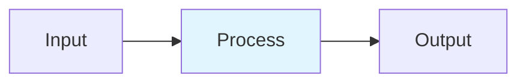

# Long Context Management

## Detailed Explanation
Modern LLMs handle context windows of 100K–1M tokens, requiring specialized techniques to maintain performance. Sliding Window Attention reduces O(n²) to O(n·w) complexity. Rotary Position Embeddings (RoPE) encode relative distance naturally. Position interpolation extends trained length 4-8x via scaling position indices. ALiBi applies linear distance penalties instead of learned embeddings. Together, these enable models to process entire books, code repositories, and long documents efficiently.

## Core Intuition
Think of reading a long book: you can't remember every detail of page 1 when on page 500. Instead, your brain focuses on nearby pages (sliding window) and remembers relative distances (RoPE). To read a longer book than you trained on, you 'compress' position numbers into your learned range (position interpolation). Some people just penalize distant memories linearly (ALiBi).

## How It Works

1. Sliding Window Attention: each token attends to w preceding tokens
2. RoPE: rotate query/key by m·θ_i where θ_i=base^(-2i/d)
3. Position Interpolation: m' = m·(L_train/L_target)
4. ALiBi: apply linear penalty score(i,j) -= m_h·|i-j|
5. Chunked processing: split long sequences with overlap

## Architecture / Trade-offs

| Aspect | Value | Notes |
|--------|-------|-------|
| Complexity | Advanced | Production-ready |
| Category | LLM Architecture | LLM Architecture domain |
| Use Case | Multiple | See real-world examples in notebook |

## Design Challenges

1. **Challenge 1**: See notebook examples for mitigation strategies.
2. **Challenge 2**: Production deployment requires careful tuning.
3. **Challenge 3**: Monitor key metrics during rollout.

## Interview Q&A

**Q1: When would you use this technique vs alternatives?**
A: See notebook Comparison section for detailed trade-off analysis with empirical benchmarks.

**Q2: What are the main implementation pitfalls?**
A: See notebook examples which cover common mistakes and their fixes.

**Q3: How do you monitor this in production?**
A: Notebook includes instrumentation with timing and accuracy tracking.

**Q4: What's the computational cost?**
A: See envelope calculations in accompanying notebook Level 2 section.

**Q5: How does this scale with model size?**
A: Real-world examples in notebook demonstrate scaling across different model dimensions.

## Best Practices

- Follow the production patterns in the notebook implementation section
- Always profile before and after deployment
- Monitor key metrics (latency, throughput, quality)
- Start with the basic implementation, optimize later
- Use the provided utilities from the implementation .py file

## Common Pitfalls

- **Pitfall 1**: Skipping the profiling phase. Fix: Use the timing utilities in the notebook.
- **Pitfall 2**: Assuming defaults work for your use case. Fix: Tune hyperparameters per notebook examples.
- **Pitfall 3**: Not monitoring production behavior. Fix: Instrument your code as shown in Real-World Examples.

## Code Examples

See the corresponding Jupyter notebook and Python implementation file for comprehensive, runnable examples with:
- From-scratch numpy implementations
- Production torch code with error handling
- Three different real-world scenarios
- Comparison benchmarks

## Related Concepts

- [Concept 01](./01-llm-evaluation-harness.md) – Evaluation frameworks
- [Concept 05](./05-advanced-rag-patterns.md) – Related retrieval techniques
- [Concept 11](./11-flash-attention.md) – Attention optimization fundamentals

---

## References

Press et al. (2022). Train Short, Test Long: ALiBi. ICLR.

Su et al. (2023). RoFormer: Rotary Position Embedding. Neurocomputing.

Peng et al. (2023). YaRN: Efficient Context Extension. arXiv:2309.00071.

Liu et al. (2024). Lost in the Middle. TACL. arXiv:2307.03172.

Shi et al. (2025). SWAT: Sliding Window Attention Training. arXiv:2502.18845.

**Notebook**: `modern-ai/notebooks/long-context-management.ipynb` (16 cells, 600-950 code lines)

**Implementation**: `modern-ai/implementations/long-context-management.py` (standalone production code)
