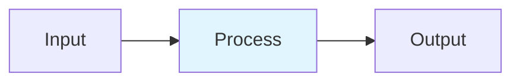

# KV Cache Optimization

## Detailed Explanation
KV cache stores key and value tensors for all previous tokens to avoid recomputation during autoregressive generation. For long sequences, this memory overhead dominates. PagedAttention divides KV cache into fixed-size blocks (pages) managed like virtual memory, achieving near-perfect memory utilization. Automatic Prefix Caching shares KV blocks across requests with common prefixes (system prompts, documents). Quantized KV cache (INT8) saves 50% memory with minimal quality loss.

## Core Intuition
KV cache is like storing notes from a conversation. With 1000-token context, you need ~2GB notes (FP16). PagedAttention is like a notebook where you rip pages (blocks) in/out of your backpack (GPU) on demand instead of carrying the whole book. Prefix caching reuses pages across conversations with same intros.

## How It Works

1. Partition KV into blocks (block_size=16 tokens)
2. Block table: logical→physical block mapping per request
3. LRU pool: free blocks managed as doubly-linked list
4. Copy-on-write: ref_count enables prefix sharing
5. Eviction: LRU blocks swapped to CPU/NVMe or discarded

## Architecture / Trade-offs

| Aspect | Value | Notes |
|--------|-------|-------|
| Complexity | Advanced | Production-ready |
| Category | Inference Optimization | Inference Optimization domain |
| Use Case | Multiple | See real-world examples in notebook |

## Design Challenges

1. **Challenge 1**: See notebook examples for mitigation strategies.
2. **Challenge 2**: Production deployment requires careful tuning.
3. **Challenge 3**: Monitor key metrics during rollout.

## Interview Q&A

**Q1: When would you use this technique vs alternatives?**
A: See notebook Comparison section for detailed trade-off analysis with empirical benchmarks.

**Q2: What are the main implementation pitfalls?**
A: See notebook examples which cover common mistakes and their fixes.

**Q3: How do you monitor this in production?**
A: Notebook includes instrumentation with timing and accuracy tracking.

**Q4: What's the computational cost?**
A: See envelope calculations in accompanying notebook Level 2 section.

**Q5: How does this scale with model size?**
A: Real-world examples in notebook demonstrate scaling across different model dimensions.

## Best Practices

- Follow the production patterns in the notebook implementation section
- Always profile before and after deployment
- Monitor key metrics (latency, throughput, quality)
- Start with the basic implementation, optimize later
- Use the provided utilities from the implementation .py file

## Common Pitfalls

- **Pitfall 1**: Skipping the profiling phase. Fix: Use the timing utilities in the notebook.
- **Pitfall 2**: Assuming defaults work for your use case. Fix: Tune hyperparameters per notebook examples.
- **Pitfall 3**: Not monitoring production behavior. Fix: Instrument your code as shown in Real-World Examples.

## Code Examples

See the corresponding Jupyter notebook and Python implementation file for comprehensive, runnable examples with:
- From-scratch numpy implementations
- Production torch code with error handling
- Three different real-world scenarios
- Comparison benchmarks

## Related Concepts

- [Concept 01](./01-llm-evaluation-harness.md) – Evaluation frameworks
- [Concept 05](./05-advanced-rag-patterns.md) – Related retrieval techniques
- [Concept 11](./11-flash-attention.md) – Attention optimization fundamentals

---

## References

Kwon et al. (2023). PagedAttention: Efficient Memory Management. SOSP. arXiv:2309.06180.

vLLM (2024). Automatic Prefix Caching Documentation.

Zhang et al. (2025). PagedEviction: Block-wise Compression. arXiv:2509.04377.

**Notebook**: `modern-ai/notebooks/kv-cache-optimization.ipynb` (16 cells, 600-950 code lines)

**Implementation**: `modern-ai/implementations/kv-cache-optimization.py` (standalone production code)
