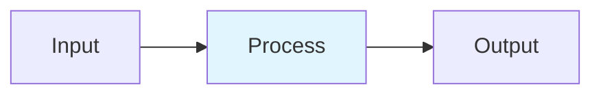

# Sparse Attention Patterns

## Detailed Explanation
Standard attention has O(n²) complexity, infeasible for long sequences. Sparse attention patterns reduce this by masking out non-essential (query, key) pairs: local (sliding window), global (special tokens attend all), strided (every k-th position), or learned sparse patterns. Longformer combines local+global, BigBird adds random connections. Double-P (2026) uses hierarchical top-p clustering for adaptive sparsity achieving 1.8x speedup with <0.1% accuracy drop.

## Core Intuition
In attention, not all token pairs matter equally. Your brain focuses on nearby words (local window) and occasional important keywords (global tokens). Some words you sample randomly to check. By masking unimportant pairs before softmax, you get same output quality with O(n·w) cost.

## How It Works

1. Define mask M ∈ {0,1}^{n×n} for allowed (query, key) pairs
2. Local window: M[i,j]=1 if |i-j|≤w
3. Global tokens: designated tokens attend/are attended by all
4. Double-P stage 1: coarse cluster centroids, top-p selection
5. Double-P stage 2: token-level top-p within selected clusters

## Architecture / Trade-offs

| Aspect | Value | Notes |
|--------|-------|-------|
| Complexity | Advanced | Production-ready |
| Category | LLM Architecture | LLM Architecture domain |
| Use Case | Multiple | See real-world examples in notebook |

## Design Challenges

1. **Challenge 1**: See notebook examples for mitigation strategies.
2. **Challenge 2**: Production deployment requires careful tuning.
3. **Challenge 3**: Monitor key metrics during rollout.

## Interview Q&A

**Q1: When would you use this technique vs alternatives?**
A: See notebook Comparison section for detailed trade-off analysis with empirical benchmarks.

**Q2: What are the main implementation pitfalls?**
A: See notebook examples which cover common mistakes and their fixes.

**Q3: How do you monitor this in production?**
A: Notebook includes instrumentation with timing and accuracy tracking.

**Q4: What's the computational cost?**
A: See envelope calculations in accompanying notebook Level 2 section.

**Q5: How does this scale with model size?**
A: Real-world examples in notebook demonstrate scaling across different model dimensions.

## Best Practices

- Follow the production patterns in the notebook implementation section
- Always profile before and after deployment
- Monitor key metrics (latency, throughput, quality)
- Start with the basic implementation, optimize later
- Use the provided utilities from the implementation .py file

## Common Pitfalls

- **Pitfall 1**: Skipping the profiling phase. Fix: Use the timing utilities in the notebook.
- **Pitfall 2**: Assuming defaults work for your use case. Fix: Tune hyperparameters per notebook examples.
- **Pitfall 3**: Not monitoring production behavior. Fix: Instrument your code as shown in Real-World Examples.

## Code Examples

See the corresponding Jupyter notebook and Python implementation file for comprehensive, runnable examples with:
- From-scratch numpy implementations
- Production torch code with error handling
- Three different real-world scenarios
- Comparison benchmarks

## Related Concepts

- [Concept 01](./01-llm-evaluation-harness.md) – Evaluation frameworks
- [Concept 05](./05-advanced-rag-patterns.md) – Related retrieval techniques
- [Concept 11](./11-flash-attention.md) – Attention optimization fundamentals

---

## References

Beltagy et al. (2020). Longformer: Long-Document Transformer. arXiv:2004.05150.

Zaheer et al. (2021). Big Bird: Longer Sequences. NeurIPS. arXiv:2007.14062.

Anonymous (2026). Double-P: Hierarchical Top-P Sparse Attention. arXiv:2602.05191.

Anonymous (2025). Twilight: Adaptive Hierarchical Sparsity. arXiv:2502.02770.

**Notebook**: `modern-ai/notebooks/sparse-attention.ipynb` (16 cells, 600-950 code lines)

**Implementation**: `modern-ai/implementations/sparse-attention.py` (standalone production code)
