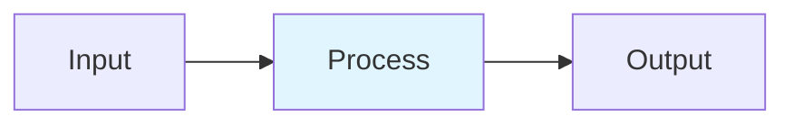

# Quantization-Aware Distillation

## Detailed Explanation
Quantization-Aware Distillation (QAD) combines knowledge distillation with quantization training to compress LLMs while preserving quality. A student model is trained with fake-quantization nodes (simulating INT8/FP4) while mimicking a full-precision teacher via KL divergence loss. Unlike post-training quantization (1-3% accuracy drop), QAD achieves <0.5% drop by learning to account for quantization noise. NVFP4-QAD reaches near-BF16 quality at 2x FLOP throughput.

## Core Intuition
Normal quantization is like throwing away details from a painting (data loss). Distillation is like having a master painter teach you their brushstrokes. QAD combines both: the student learns to paint as the master would, while deliberately throwing away small details. Net result: smaller, equally-good paintings.

## How It Works

1. Insert fake-quant nodes after weights/activations in student
2. Forward pass quantizes: W_q = clamp(round(W/scale), -128, 127)
3. Backward via STE: gradients pass through as identity
4. Compute combined loss: L = α·T²·KL(p_t^T||p_s^T) + (1-α)·CE(z_s, y)
5. Extract quantized model: replace fake-quant with real INT8 ops

## Architecture / Trade-offs

| Aspect | Value | Notes |
|--------|-------|-------|
| Complexity | Advanced | Production-ready |
| Category | Model Compression | Model Compression domain |
| Use Case | Multiple | See real-world examples in notebook |

## Design Challenges

1. **Challenge 1**: See notebook examples for mitigation strategies.
2. **Challenge 2**: Production deployment requires careful tuning.
3. **Challenge 3**: Monitor key metrics during rollout.

## Interview Q&A

**Q1: When would you use this technique vs alternatives?**
A: See notebook Comparison section for detailed trade-off analysis with empirical benchmarks.

**Q2: What are the main implementation pitfalls?**
A: See notebook examples which cover common mistakes and their fixes.

**Q3: How do you monitor this in production?**
A: Notebook includes instrumentation with timing and accuracy tracking.

**Q4: What's the computational cost?**
A: See envelope calculations in accompanying notebook Level 2 section.

**Q5: How does this scale with model size?**
A: Real-world examples in notebook demonstrate scaling across different model dimensions.

## Best Practices

- Follow the production patterns in the notebook implementation section
- Always profile before and after deployment
- Monitor key metrics (latency, throughput, quality)
- Start with the basic implementation, optimize later
- Use the provided utilities from the implementation .py file

## Common Pitfalls

- **Pitfall 1**: Skipping the profiling phase. Fix: Use the timing utilities in the notebook.
- **Pitfall 2**: Assuming defaults work for your use case. Fix: Tune hyperparameters per notebook examples.
- **Pitfall 3**: Not monitoring production behavior. Fix: Instrument your code as shown in Real-World Examples.

## Code Examples

See the corresponding Jupyter notebook and Python implementation file for comprehensive, runnable examples with:
- From-scratch numpy implementations
- Production torch code with error handling
- Three different real-world scenarios
- Comparison benchmarks

## Related Concepts

- [Concept 01](./01-llm-evaluation-harness.md) – Evaluation frameworks
- [Concept 05](./05-advanced-rag-patterns.md) – Related retrieval techniques
- [Concept 11](./11-flash-attention.md) – Attention optimization fundamentals

---

## References

Hinton et al. (2015). Distilling Knowledge in Neural Networks. arXiv:1503.02531.

NVIDIA (2019). FP32 Accuracy with INT8 + TensorRT QAT. Developer Blog.

NVIDIA (2026). NVFP4-QAD: Accuracy Recovery for Inference. arXiv:2601.20088.

**Notebook**: `modern-ai/notebooks/quantization-aware-distillation.ipynb` (16 cells, 600-950 code lines)

**Implementation**: `modern-ai/implementations/quantization-aware-distillation.py` (standalone production code)
