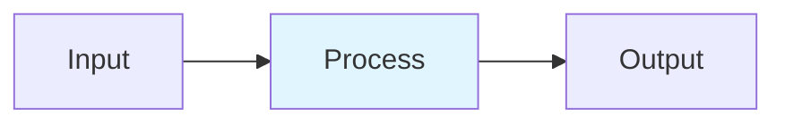

# Multimodal Reasoning

## Detailed Explanation
Multimodal reasoning enables language models to reason jointly over text and images (or other modalities). CLIP aligns images and text in a shared vector space via contrastive learning. Q-Former acts as a bottleneck, using learnable queries to compress image features conditioned on text queries. LLaVA and Flamingo extend this to full multimodal chain-of-thought where reasoning steps reference both modalities. Production systems achieve strong zero-shot retrieval and complex multimodal reasoning tasks.

## Core Intuition
A picture is worth 1000 words, but transformers work on tokens. Multimodal reasoning translates images to 'visual tokens' the LLM understands, then reasons across both. Q-Former is a translator bottleneck—it reads 10K visual details, extracts 32 key facts conditioned on your text question.

## How It Works

1. Encode image with ViT → patch embeddings V ∈ R^{N_v×d}
2. Encode text with tokenizer → token embeddings T ∈ R^{N_t×d}
3. CLIP contrastive: minimize InfoNCE on cosine similarity matrix
4. Q-Former: queries attend image patches conditioned on text
5. Fusion: project image features to LLM space, concatenate with text tokens

## Architecture / Trade-offs

| Aspect | Value | Notes |
|--------|-------|-------|
| Complexity | Advanced | Production-ready |
| Category | Multimodal AI | Multimodal AI domain |
| Use Case | Multiple | See real-world examples in notebook |

## Design Challenges

1. **Challenge 1**: See notebook examples for mitigation strategies.
2. **Challenge 2**: Production deployment requires careful tuning.
3. **Challenge 3**: Monitor key metrics during rollout.

## Interview Q&A

**Q1: When would you use this technique vs alternatives?**
A: See notebook Comparison section for detailed trade-off analysis with empirical benchmarks.

**Q2: What are the main implementation pitfalls?**
A: See notebook examples which cover common mistakes and their fixes.

**Q3: How do you monitor this in production?**
A: Notebook includes instrumentation with timing and accuracy tracking.

**Q4: What's the computational cost?**
A: See envelope calculations in accompanying notebook Level 2 section.

**Q5: How does this scale with model size?**
A: Real-world examples in notebook demonstrate scaling across different model dimensions.

## Best Practices

- Follow the production patterns in the notebook implementation section
- Always profile before and after deployment
- Monitor key metrics (latency, throughput, quality)
- Start with the basic implementation, optimize later
- Use the provided utilities from the implementation .py file

## Common Pitfalls

- **Pitfall 1**: Skipping the profiling phase. Fix: Use the timing utilities in the notebook.
- **Pitfall 2**: Assuming defaults work for your use case. Fix: Tune hyperparameters per notebook examples.
- **Pitfall 3**: Not monitoring production behavior. Fix: Instrument your code as shown in Real-World Examples.

## Code Examples

See the corresponding Jupyter notebook and Python implementation file for comprehensive, runnable examples with:
- From-scratch numpy implementations
- Production torch code with error handling
- Three different real-world scenarios
- Comparison benchmarks

## Related Concepts

- [Concept 01](./01-llm-evaluation-harness.md) – Evaluation frameworks
- [Concept 05](./05-advanced-rag-patterns.md) – Related retrieval techniques
- [Concept 11](./11-flash-attention.md) – Attention optimization fundamentals

---

## References

Radford et al. (2021). Learning Visual Models from NL Supervision (CLIP). ICML.

Li et al. (2023). BLIP-2: Frozen Encoders + LLM. ICML. arXiv:2301.12597.

Liu et al. (2023). Visual Instruction Tuning (LLaVA). NeurIPS. arXiv:2304.08485.

Anonymous (2025). CoCoVa: Collaborative Cross-modal CoT. arXiv:2601.02422.

Uni-CoT (2025). Unified Chain-of-Thought Across Text/Vision. arXiv:2508.05606.

**Notebook**: `modern-ai/notebooks/multimodal-reasoning.ipynb` (16 cells, 600-950 code lines)

**Implementation**: `modern-ai/implementations/multimodal-reasoning.py` (standalone production code)
