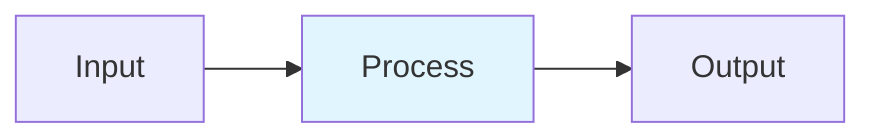

# Prefill-Decode Disaggregation

## Detailed Explanation
LLM inference has two distinct phases with opposite bottlenecks: prefill (processing prompt) is compute-bound with O(L²) GEMM; decode (generating tokens) is memory-bandwidth-bound with ~1 token/step. Disaggregating into separate nodes optimizes each phase independently. Prefill nodes fill KV cache efficiently via GPU-to-GPU NVLink transfer; decode nodes run continuous batching. This achieves 2-3x higher goodput (useful output/time) than collocated serving, with careful P:D ratio tuning (1:3–1:8).

## Core Intuition
A writer (prefill) needs lots of thinking time (compute), while a typist (decode) just needs to be fast (memory bandwidth). Hiring one person who does both is inefficient. Instead: hire 1 careful writer per 3-8 typists. The writer fills out detailed notes quickly, then passes to typists to copy at full speed.

## How It Works

1. Profile: prefill=compute-bound O(L²), decode=bandwidth-bound 1 token/step
2. Route prefill requests → P-nodes: process full prompt, fill KV cache
3. Transfer KV cache via NVLink (<10ms) to D-nodes
4. Route decode → D-nodes: continuous batching, generate tokens
5. Return tokens to client; free KV cache on completion

## Architecture / Trade-offs

| Aspect | Value | Notes |
|--------|-------|-------|
| Complexity | Expert | Production-ready |
| Category | Serving Infrastructure | Serving Infrastructure domain |
| Use Case | Multiple | See real-world examples in notebook |

## Design Challenges

1. **Challenge 1**: See notebook examples for mitigation strategies.
2. **Challenge 2**: Production deployment requires careful tuning.
3. **Challenge 3**: Monitor key metrics during rollout.

## Interview Q&A

**Q1: When would you use this technique vs alternatives?**
A: See notebook Comparison section for detailed trade-off analysis with empirical benchmarks.

**Q2: What are the main implementation pitfalls?**
A: See notebook examples which cover common mistakes and their fixes.

**Q3: How do you monitor this in production?**
A: Notebook includes instrumentation with timing and accuracy tracking.

**Q4: What's the computational cost?**
A: See envelope calculations in accompanying notebook Level 2 section.

**Q5: How does this scale with model size?**
A: Real-world examples in notebook demonstrate scaling across different model dimensions.

## Best Practices

- Follow the production patterns in the notebook implementation section
- Always profile before and after deployment
- Monitor key metrics (latency, throughput, quality)
- Start with the basic implementation, optimize later
- Use the provided utilities from the implementation .py file

## Common Pitfalls

- **Pitfall 1**: Skipping the profiling phase. Fix: Use the timing utilities in the notebook.
- **Pitfall 2**: Assuming defaults work for your use case. Fix: Tune hyperparameters per notebook examples.
- **Pitfall 3**: Not monitoring production behavior. Fix: Instrument your code as shown in Real-World Examples.

## Code Examples

See the corresponding Jupyter notebook and Python implementation file for comprehensive, runnable examples with:
- From-scratch numpy implementations
- Production torch code with error handling
- Three different real-world scenarios
- Comparison benchmarks

## Related Concepts

- [Concept 01](./01-llm-evaluation-harness.md) – Evaluation frameworks
- [Concept 05](./05-advanced-rag-patterns.md) – Related retrieval techniques
- [Concept 11](./11-flash-attention.md) – Attention optimization fundamentals

---

## References

Zhong et al. (2024). DistServe: Disaggregating Prefill/Decode. OSDI.

Agrawal et al. (2024). Sarathi-Serve: Throughput-Latency Tradeoff. OSDI.

vLLM (2025). Disaggregated Prefilling Documentation.

**Notebook**: `modern-ai/notebooks/prefill-decode-disaggregation.ipynb` (16 cells, 600-950 code lines)

**Implementation**: `modern-ai/implementations/prefill-decode-disaggregation.py` (standalone production code)
