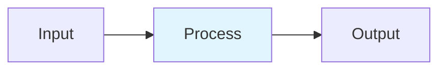

# Post-Training Specialization

## Detailed Explanation
Post-training specializes base LLMs for specific domains or tasks through a multi-stage pipeline: SFT (supervised fine-tuning) on high-quality demonstrations, then preference alignment via RLHF/DPO to match human values. Modern approaches use Direct Preference Optimization (DPO) to avoid reward model overhead, optimizing directly on preference pairs. Careful data curation, replay buffers, and monitoring for catastrophic forgetting are essential to prevent quality degradation on general tasks.

## Core Intuition
A general student learns foundational knowledge (base model). Then a domain expert teaches them specific skills via examples (SFT). Finally, a mentor gives feedback on preferences to refine judgment (DPO). Each stage requires care—learning too narrowly makes them forget gen-ed knowledge (catastrophic forgetting).

## How It Works

1. SFT: fine-tune on high-quality demonstration data, CE loss on completions only
2. Collect preference pairs: pairs of responses with human preference labels
3. DPO: directly optimize preference: L = -log σ(β·log(π_θ(y_w)/π_ref(y_w)) - β·log(π_θ(y_l)/π_ref(y_l)))
4. Monitor forgetting: track accuracy on general benchmarks (MMLU, HellaSwag)
5. Replay general data (5-20% of batch) to mitigate catastrophic forgetting

## Architecture / Trade-offs

| Aspect | Value | Notes |
|--------|-------|-------|
| Complexity | Advanced | Production-ready |
| Category | Training | Training domain |
| Use Case | Multiple | See real-world examples in notebook |

## Design Challenges

1. **Challenge 1**: See notebook examples for mitigation strategies.
2. **Challenge 2**: Production deployment requires careful tuning.
3. **Challenge 3**: Monitor key metrics during rollout.

## Interview Q&A

**Q1: When would you use this technique vs alternatives?**
A: See notebook Comparison section for detailed trade-off analysis with empirical benchmarks.

**Q2: What are the main implementation pitfalls?**
A: See notebook examples which cover common mistakes and their fixes.

**Q3: How do you monitor this in production?**
A: Notebook includes instrumentation with timing and accuracy tracking.

**Q4: What's the computational cost?**
A: See envelope calculations in accompanying notebook Level 2 section.

**Q5: How does this scale with model size?**
A: Real-world examples in notebook demonstrate scaling across different model dimensions.

## Best Practices

- Follow the production patterns in the notebook implementation section
- Always profile before and after deployment
- Monitor key metrics (latency, throughput, quality)
- Start with the basic implementation, optimize later
- Use the provided utilities from the implementation .py file

## Common Pitfalls

- **Pitfall 1**: Skipping the profiling phase. Fix: Use the timing utilities in the notebook.
- **Pitfall 2**: Assuming defaults work for your use case. Fix: Tune hyperparameters per notebook examples.
- **Pitfall 3**: Not monitoring production behavior. Fix: Instrument your code as shown in Real-World Examples.

## Code Examples

See the corresponding Jupyter notebook and Python implementation file for comprehensive, runnable examples with:
- From-scratch numpy implementations
- Production torch code with error handling
- Three different real-world scenarios
- Comparison benchmarks

## Related Concepts

- [Concept 01](./01-llm-evaluation-harness.md) – Evaluation frameworks
- [Concept 05](./05-advanced-rag-patterns.md) – Related retrieval techniques
- [Concept 11](./11-flash-attention.md) – Attention optimization fundamentals

---

## References

Ouyang et al. (2022). Training Language Models via Human Feedback (InstructGPT). NeurIPS.

Rafailov et al. (2023). Direct Preference Optimization. NeurIPS. arXiv:2305.18290.

Liu et al. (2024). β-DPO: Dynamic Beta. arXiv:2407.08639.

Meta AI (2024). The Llama 3 Herd of Models. arXiv:2407.21783.

Xiao (2024). Avoiding Amnesia: Catastrophic Forgetting Mitigation. Medium.

**Notebook**: `modern-ai/notebooks/post-training-specialization.ipynb` (16 cells, 600-950 code lines)

**Implementation**: `modern-ai/implementations/post-training-specialization.py` (standalone production code)
