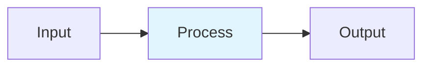

# Decode-Length Prediction

## Detailed Explanation
LLM output length varies wildly: a factual question might need 20 tokens, while creative writing needs 500+. Predicting length from the prompt enables better batching and resource allocation. Bin-based classification (K=20 bins) works better than regression for skewed distributions. Entropy-Guided Token Pooling (EGTP) uses model activations as additional features. Reserving KV cache at P75 (not mean) of predicted distribution prevents OOM from underestimation.

## Core Intuition
Planning a party: guest count ranges 10–200. Predicting exact number (regression) fails; it's usually off by 20%. Instead, classify as 'small/medium/large' (bins), then reserve 25% extra. You rarely run short, and the extra capacity costs less than waiting for exact numbers.

## How It Works

1. Extract features: prompt length, log-perplexity, embedding stats, question type
2. Train K=20-bin classifier with soft Gaussian labels
3. Entropy-Guided: run first few tokens, extract hidden-state entropy as feature
4. Predict: output distribution over 20 length bins
5. Reserve KV cache at P75 (not mean) of predicted distribution

## Architecture / Trade-offs

| Aspect | Value | Notes |
|--------|-------|-------|
| Complexity | Intermediate | Production-ready |
| Category | Serving Optimization | Serving Optimization domain |
| Use Case | Multiple | See real-world examples in notebook |

## Design Challenges

1. **Challenge 1**: See notebook examples for mitigation strategies.
2. **Challenge 2**: Production deployment requires careful tuning.
3. **Challenge 3**: Monitor key metrics during rollout.

## Interview Q&A

**Q1: When would you use this technique vs alternatives?**
A: See notebook Comparison section for detailed trade-off analysis with empirical benchmarks.

**Q2: What are the main implementation pitfalls?**
A: See notebook examples which cover common mistakes and their fixes.

**Q3: How do you monitor this in production?**
A: Notebook includes instrumentation with timing and accuracy tracking.

**Q4: What's the computational cost?**
A: See envelope calculations in accompanying notebook Level 2 section.

**Q5: How does this scale with model size?**
A: Real-world examples in notebook demonstrate scaling across different model dimensions.

## Best Practices

- Follow the production patterns in the notebook implementation section
- Always profile before and after deployment
- Monitor key metrics (latency, throughput, quality)
- Start with the basic implementation, optimize later
- Use the provided utilities from the implementation .py file

## Common Pitfalls

- **Pitfall 1**: Skipping the profiling phase. Fix: Use the timing utilities in the notebook.
- **Pitfall 2**: Assuming defaults work for your use case. Fix: Tune hyperparameters per notebook examples.
- **Pitfall 3**: Not monitoring production behavior. Fix: Instrument your code as shown in Real-World Examples.

## Code Examples

See the corresponding Jupyter notebook and Python implementation file for comprehensive, runnable examples with:
- From-scratch numpy implementations
- Production torch code with error handling
- Three different real-world scenarios
- Comparison benchmarks

## Related Concepts

- [Concept 01](./01-llm-evaluation-harness.md) – Evaluation frameworks
- [Concept 05](./05-advanced-rag-patterns.md) – Related retrieval techniques
- [Concept 11](./11-flash-attention.md) – Attention optimization fundamentals

---

## References

Jin et al. (2024). Multi-Bin Batching for Throughput. arXiv:2412.04504.

Anonymous (2026). EGTP: Entropy-Guided Length Prediction. ICLR. arXiv:2602.11812.

Anonymous (2026). Uncertainty-Aware Output Length Prediction. arXiv:2604.00499.

**Notebook**: `modern-ai/notebooks/decode-length-prediction.ipynb` (16 cells, 600-950 code lines)

**Implementation**: `modern-ai/implementations/decode-length-prediction.py` (standalone production code)
