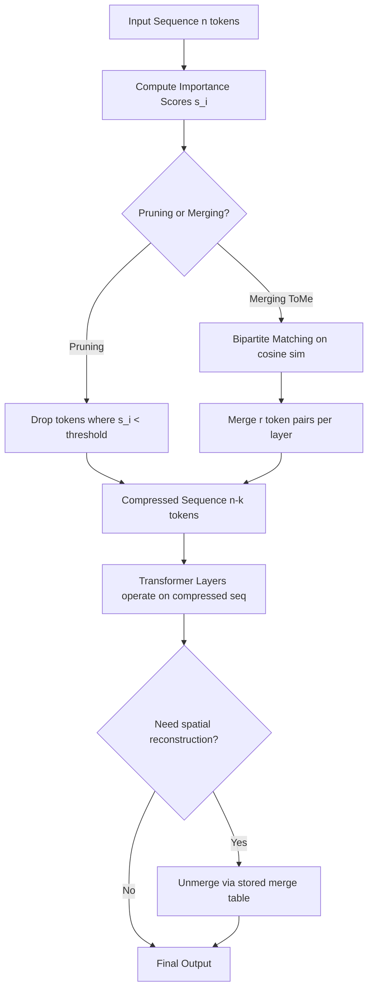

# Token Pruning and Merging

## Detailed Explanation

Token pruning and merging are inference acceleration techniques that reduce the number of tokens processed by transformer attention layers. In a standard transformer, every token in the sequence attends to every other token, resulting in O(n²) attention complexity. For long contexts, this becomes the dominant cost.

Token pruning removes tokens that carry low information — padding, repeated content, or tokens with low attention weight — before or between transformer layers. The discarded tokens do not participate in subsequent computation, directly reducing FLOPs and memory.

Token merging (ToMe, 2022) takes a softer approach: instead of discarding tokens, it fuses similar adjacent tokens into a single merged representation using bipartite soft matching. The merged token carries a weighted average of its constituents' keys and values, preserving more information than hard pruning. This is reversible — spatial resolution can be restored at the output if needed (e.g., for image generation tasks).

Practitioners care about these techniques because inference on long documents (legal, medical, code) routinely bottlenecks on attention compute. A 2-5x speedup with under 2% accuracy drop is practically achievable, which can mean the difference between a feature being economically viable or not. The most common misconception is that any pruning approach degrades quality proportionally to how much is removed; in practice, the last 30-40% of tokens are often redundant and can be removed with near-zero impact.

Real-world applications include: vision transformer acceleration (ToMe applied to ViT achieves 2x speedup on ImageNet), long-document LLM inference (pruning after the first 12 layers), and real-time video processing pipelines.

## Core Intuition

Imagine a court transcript where the judge asks "Did you see the defendant on the night of the 14th?" and receives a two-paragraph answer — most of it filler words and repetition. Token pruning is like a court reporter who drops the filler mid-sentence, while token merging is like a reporter who collapses "I did in fact observe the defendant" into "I saw the defendant." The court (the later transformer layers) gets the same verdict with far less work.

## How It Works

1. **Compute token importance scores** — After each transformer layer, compute a scalar importance score per token using attention rollout (sum of incoming attention weights), gradient norms `s_i = ||∂L/∂h_i||`, or activation magnitude. This identifies which tokens downstream layers rely on.
2. **Identify redundant token pairs** — For merging: compute pairwise cosine similarity between token representations. Pairs with `cos(h_i, h_j) > θ` (typically 0.85–0.95) are candidates for merging.
3. **Bipartite soft matching (ToMe)** — Partition tokens into two sets r and s of equal size. Find the maximum matching between r and s using greedy nearest-neighbor on cosine similarity. Each matched pair is a merge candidate.
4. **Merge tokens** — For each matched pair (i, j): average the key and value vectors `k_merged = (k_i + k_j)/2`, `v_merged = (v_i + v_j)/2`. Sum the queries to preserve representation energy. Size: sequence shrinks by r tokens per layer.
5. **Run attention on compressed sequence** — Subsequent transformer layers operate on the reduced token sequence. FLOPs scale as O(n²), so reducing n from 256 to 128 cuts attention cost by 4x.
6. **Unmerge at output (optional)** — For tasks requiring spatial resolution (segmentation, generation), the merge table is stored and inverted at the final layer to restore original token positions.

## Architecture / Trade-offs

### Comparison: Pruning Strategies by Speed vs Quality

| Method | Tokens Remaining | Speedup | Accuracy Drop | Reversible | Implementation Complexity |
|--------|-----------------|---------|---------------|------------|--------------------------|
| No pruning (baseline) | 100% | 1.0x | 0% | N/A | None |
| Hard token pruning | 60–70% | 1.8–2.2x | 3–8% | No | Low |
| ToMe r=4 (merge 4/layer) | ~75% at layer 6 | 1.5x | <1% | Yes | Medium |
| ToMe r=8 | ~50% at layer 6 | 2.5–3x | 1–2% | Yes | Medium |
| Aggressive ToMe r=16 | ~30% at layer 6 | 4–5x | 3–5% | Yes | Medium |

### Comparison: Importance Score Methods

| Score Method | Compute Cost | Quality | Works Without Labels | Notes |
|--------------|-------------|---------|----------------------|-------|
| Attention rollout | Low (reuse attention) | Good | Yes | Reliable for encoder models |
| Gradient norm | High (backward pass) | Best | No | Needs calibration data |
| Activation magnitude | Very low | Moderate | Yes | Fast but less precise |
| Random (baseline) | None | Poor | Yes | Only for ablation |

### Trade-off Analysis

Hard pruning gives larger speedups but is irreversible — if a pruned token was needed later, the error propagates. It works well at the start of inference (where padding tokens dominate) but is risky in middle layers. ToMe's bipartite matching adds ~5ms overhead per layer but preserves information by merging rather than discarding, making it recoverable. For production use: apply ToMe in early/middle layers (high redundancy), avoid pruning in the final 2-3 layers where representations are task-specific.

## Interview Q&A

**Q: When would you choose token merging (ToMe) over hard token pruning in production?**
A: Choose ToMe when spatial reconstruction is needed (image generation, dense prediction) or when accuracy is critical and you cannot tolerate information loss. Hard pruning is acceptable when tokens are clearly redundant (padding, repeated boilerplate) and the task only needs a single output (classification, QA). The 5ms overhead of bipartite matching per layer is negligible for large models; the accuracy insurance is worth it.

**Q: What breaks when you apply token pruning without adjusting position embeddings?**
A: Absolute position embeddings (sinusoidal, learned) assign fixed position IDs to tokens. When you remove token 5 from a 10-token sequence, tokens 6-10 now have the wrong position IDs — the model expects them at positions 6-10 but the context suggests positions 5-9. This corrupts positional context and degrades performance significantly. Fix: switch to relative position embeddings (RoPE, ALiBi) before applying pruning, or reindex remaining token positions after each pruning step.

**Q: How do you determine the right pruning threshold without labeled data?**
A: Use a calibration set of 50-100 representative inputs. For each threshold value in {0.7, 0.8, 0.9}, measure average tokens retained and perplexity on the calibration set. Plot the Pareto frontier of tokens-retained vs perplexity. In practice, thresholds that keep 65-75% of tokens maintain perplexity within 1-2 points of baseline. If no calibration data is available, default to attention rollout scores with a 0.85 cosine similarity threshold for merging — this is a conservative starting point.

**Q: What's the first sign that token pruning is hurting your model's accuracy?**
A: Look for disproportionate degradation on long-range dependency tasks (coreference resolution, multi-hop QA). If accuracy drops more than 3% on these but stays flat on local tasks (named entity, classification), you're pruning tokens that carry long-range context. Debug by logging which token positions are pruned most frequently — if important content words (named entities, numbers) are being pruned, your importance scoring function is miscalibrated.

**Q: How does ToMe scale to very long sequences (4096+ tokens)?**
A: ToMe's bipartite matching is O(n) per layer since the partition sizes are fixed and greedy nearest-neighbor is linear. For 4096 tokens, ToMe with r=32 merges 32 pairs per layer, reducing sequence length by 32 × (number of layers applied). After 12 layers, a 4096-token sequence becomes ~2688 tokens — a 35% reduction. The bottleneck becomes the matching itself; use approximate nearest-neighbor (FAISS) for sequences above 8192 tokens.

**Q: When should you NOT apply token pruning or merging?**
A: Avoid in: (1) decoder generation — the KV cache assumes fixed token positions; merging mid-generation breaks cache validity; (2) tasks requiring exact token-level outputs (extractive QA returning character spans); (3) models with absolute positional embeddings unless you reindex. Also avoid during the first 2 transformer layers — early layers build basic syntactic structure and have high token heterogeneity; pruning here destroys needed diversity.

## Best Practices

- Apply merging in layers 4-8 of 12-layer models (middle layers have highest redundancy); keep first and last 2-3 layers intact.
- Use ToMe's r parameter (tokens merged per layer) rather than a fixed threshold — r gives predictable latency: each r unit saves roughly 2-4ms per inference on a V100.
- Start with r=4 (conservative, ~1.5x speedup) and increase to r=8 or r=16 only after validating accuracy drop is under 2%.
- Profile before deploying: measure actual wall-clock speedup, not theoretical FLOPs. Memory bandwidth is often the true bottleneck on modern GPUs.
- Use relative position embeddings (RoPE, ALiBi) in your base model before applying pruning — this eliminates position corruption issues.
- Cache merge tables for repeated inference on the same document (e.g., RAG retrieval over fixed corpora) — the matching computation is reusable.
- Monitor accuracy on long-range dependency benchmarks (SCROLLS, MuSiQue) specifically, not just average accuracy — these tasks are most sensitive to pruning.

## Common Pitfalls

- **Position embedding corruption after pruning**: Removing tokens from a sequence with absolute position embeddings corrupts the position IDs of all subsequent tokens. Symptom: model accuracy degrades far more than expected, especially on positional tasks. Fix: use RoPE or ALiBi embeddings before applying pruning, or reindex surviving tokens immediately after each pruning step.

- **Over-pruning the attention sink token**: The first token (often `[CLS]` or BOS) accumulates disproportionately high attention in many models — this is the "attention sink" phenomenon. Pruning it because it scores high in attention rollout (it receives attention, not necessarily carries meaning) breaks downstream attention patterns entirely. Fix: always exempt the first and last tokens from pruning/merging.

- **Applying ToMe to autoregressive decoders during generation**: The KV cache stores key/value pairs at fixed sequence positions. Merging tokens mid-generation invalidates cache entries and forces recomputation. Symptom: generation appears correct but is 2-3x slower than expected. Fix: apply ToMe only during prefill (encoding the prompt), then run generation on the compressed KV cache without further merging.

- **Using gradient-norm importance scores without calibration data**: Gradient norms require a backward pass, adding 100-300% latency overhead during importance computation. Without a proper calibration set, importance scores can be noisy or domain-mismatched. Symptom: tokens important for your task are pruned while generic stop-words are retained. Fix: use attention rollout (no backward pass) for production, gradient norms only during offline sensitivity analysis.

- **Comparing throughput without fixing batch size**: Token merging reduces sequence length but throughput gains depend on batch size. At batch size 1, the gain may only be 1.3x despite removing 40% of tokens (memory bandwidth bound). At batch size 32, gains approach theoretical 2-5x (compute bound). Always benchmark at your production batch size.

## Related Concepts

- [Adaptive Layer Selection](./37-adaptive-layer-selection.md)
- [Layer Skipping](./38-layer-skipping.md)
- [Mixed-Bit Quantization](./42-mixed-bit-quantization.md)
- [Embedding Quantization](./43-embedding-quantization.md)
- [Attention Pattern Learning](./45-attention-pattern-learning.md)
