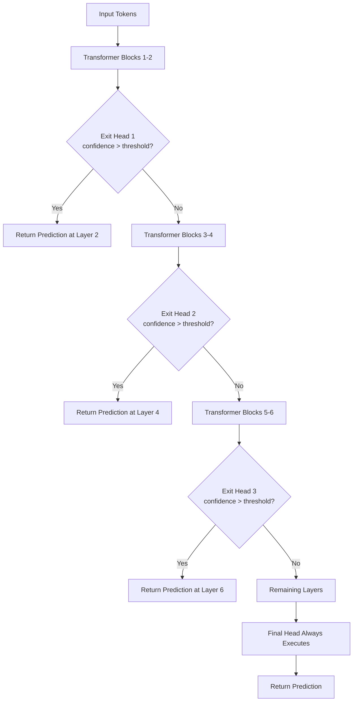

# Adaptive Layer Selection

## Detailed Explanation

Adaptive layer selection, also called early exit or dynamic depth inference, allows a model to terminate computation at intermediate transformer layers when it has sufficient confidence, rather than always running through all N layers. This exploits the observation that easy inputs — clear sentiment, unambiguous classification, high-frequency patterns — can be correctly classified at layer 4-6 of a 12-layer model, while hard inputs need the full 12 layers.

The canonical implementation is DeeBERT (2020), which adds lightweight exit heads (a linear classifier + softmax) after layers 4, 6, 8, and 10 of BERT-12. At inference, each exit head computes `confidence = max(softmax(logits))`. If `confidence > threshold`, the model returns the prediction immediately without executing later layers. Otherwise, the hidden state is passed forward to the next layer. The final layer always produces a prediction as a fallback.

The practical impact is significant: on SST-2 (sentiment classification), 70-80% of test examples exit before layer 8, yielding an average exit layer of ~5.5, giving roughly 2x speedup with less than 1% accuracy drop. The threshold is a knob trading off speed and accuracy: raising it routes more samples to later layers (accurate, slow); lowering it forces early exits (fast, more errors).

Common misconception: adaptive layer selection requires retraining from scratch. In practice, exit heads can be added and fine-tuned on top of a frozen pretrained model in 1-2 epochs, making this a cheap post-hoc optimization.

## Core Intuition

Think of a hospital triage system where a nurse at the front desk can immediately diagnose "this patient has a sprained ankle" and send them to outpatient care, while complex cases escalate to specialist physicians. Adaptive layer selection is that triage — obvious inputs get resolved fast at an early checkpoint, and only the difficult, ambiguous cases get routed all the way to the expensive senior consultant (the final layers). The trick is the nurse needs to know when she's confident enough to stop escalating.

## How It Works

1. **Add lightweight exit heads** — After every K transformer layers (typically every 2nd layer), attach a small exit head: a single linear projection from hidden dimension to num_classes, followed by softmax. These heads share the model backbone and add minimal parameters (hidden_dim x num_classes per head).
2. **Forward pass with confidence gating** — At each exit head, compute `confidence = max(softmax(W_exit · h_l))`. This is the model's probability on its top predicted class at layer l.
3. **Exit decision** — If `confidence > threshold` (e.g., 0.9): record the prediction and stop computation. No further layers execute for this sample.
4. **Continue to next layer** — If `confidence <= threshold`: pass the hidden state `h_l` forward unchanged to layer l+1. The hidden state continues as if no exit head were present.
5. **Final layer fallback** — If no exit triggers before the last layer, the model's primary head always produces a prediction. This guarantees 100% of inputs are handled.
6. **Batch-level handling** — In batched inference, samples exit at different layers. Use a mask to freeze exited samples while continuing to process non-exited ones. Alternatively, sort samples by expected difficulty to group them into same-exit batches.

## Architecture / Trade-offs

### Exit Threshold vs Accuracy vs Latency (DeeBERT on SST-2)

| Threshold | Avg Exit Layer | Accuracy | Speedup | % Reaching Final Layer |
|-----------|---------------|----------|---------|------------------------|
| 0.7 (aggressive) | 3.2 | 91.2% | 2.8x | 8% |
| 0.9 (balanced) | 5.5 | 93.1% | 2.0x | 22% |
| 0.95 (conservative) | 7.8 | 93.5% | 1.5x | 45% |
| 1.0 (disabled) | 12.0 | 93.6% | 1.0x | 100% |

### Comparison: Early Exit Architectures

| Architecture | Exit Head Type | Training Strategy | Exit Points | Speedup Range | Avg Exit Layer (12-layer) | Best For |
|--------------|---------------|-------------------|------------|---------------|--------------------------|---------|
| DeeBERT | Linear + softmax | Two-stage: freeze backbone, train exits | Every 2nd layer | 1.5–2.0x | 7.2 | Classification |
| PABEE | Linear + patience criterion | Multi-exit joint training | Every layer | 1.8–2.5x | 6.8 | Sequence labeling |
| BERxiT | Learned gating | End-to-end with auxiliary loss | Every 3rd layer | 1.4–1.9x | 8.1 | Regression + classification |
| SkipBERT | RL router | Reinforcement learning | Dynamic | 2.0–3.0x | 5.5 | Variable-length tasks |

### Trade-off Analysis

The threshold is the primary control. Low thresholds maximize throughput but hurt accuracy on hard examples (long-tail classes, negation, sarcasm). High thresholds provide near-full-model accuracy at reduced average cost. In practice, the threshold should be set based on your SLA: if you need 95% accuracy, sweep threshold on a validation set and pick the highest value that meets the constraint. For latency-critical APIs (< 50ms), use threshold 0.8 and accept a 1-2% accuracy penalty.

## Interview Q&A

**Q: How do you train exit classifiers that are well-calibrated at early layers?**
A: Naive training treats each exit independently, but early exits see less-processed representations and tend to be overconfident (they output high softmax values even when wrong). Fix this with two-stage training: (1) fine-tune the backbone normally to convergence; (2) freeze the backbone and train each exit head with its own cross-entropy loss plus temperature calibration. Alternatively, use the PABEE patience mechanism — only exit if the prediction is stable across K consecutive exit heads — which naturally reduces overconfident early exits.

**Q: What happens when you batch samples with different exit layers?**
A: A batch of 32 samples may have 20 exit at layer 4 and 12 continue to layer 12. GPU execution processes all samples together, so early-exit samples still compute all layers unless you implement masking. The most common fix is masked execution: zero-out exited samples' activations so they don't consume compute in later attention heads. For maximum efficiency, sort-and-split: group samples by predicted difficulty and run separate forward passes per difficulty tier.

**Q: When is adaptive layer selection NOT a good fit?**
A: Three scenarios: (1) Generation tasks — autoregressive generation cannot exit early because each generated token depends on the full hidden state from all layers; (2) Tasks where easy vs hard examples are not separable by confidence (adversarial inputs always look confident at early layers); (3) Ultra-low latency requirements where checking confidence at each exit adds unacceptable overhead (sub-5ms SLAs). For generation, consider layer skipping instead, which is compatible with the decoder loop.

**Q: How do you detect that your exit heads are making systematic errors?**
A: Log the exit layer for each prediction alongside correctness. If accuracy at exit layer 4 is much lower than at layer 8 (e.g., 82% vs 93%), early exits are miscalibrated. Specifically, measure the false positive rate of the confidence gate — how often does `confidence > threshold` but the prediction is wrong? A well-calibrated gate should have a false positive rate under 2%. If it's higher, increase threshold or add temperature scaling (T=1.5-2.0) to the exit head's softmax.

**Q: How does confidence-based gating compare to entropy-based gating?**
A: Confidence (max softmax probability) and entropy (sum of -p*log(p)) are inversely related for well-calibrated models but differ for miscalibrated ones. Entropy gating is more robust because it accounts for all class probabilities, not just top-1. A model assigning 0.6 to class A and 0.39 to class B has high confidence but high entropy (0.97 bits). Use entropy gating for problems with more than 5 output classes; confidence gating is sufficient for binary classification.

**Q: What is the trade-off between placing exit heads at every layer vs every 3rd layer?**
A: More exit points give finer-grained control and lower average exit layer, but add overhead: each exit head adds a forward pass through a linear layer plus confidence check. For 12-layer BERT, placing exits at every layer adds 12 confidence checks; every 3rd layer adds 4. Empirically, exits at layers 3, 6, 9 capture 95% of the benefit of per-layer exits with 3x less overhead. Diminishing returns set in after 4-5 exit points.

## Best Practices

- Train exit heads for 2-3 epochs on a frozen backbone before joint fine-tuning — cold-starting joint training causes the backbone to optimize toward early-exit objectives and degrades final-layer quality.
- Place exit heads at layers 3, 6, 9 of a 12-layer model (every 3rd) rather than every 2nd layer; fewer exits reduce inference overhead and improve training stability.
- Use temperature scaling (T=1.5-2.0) on exit head logits to calibrate confidence — uncalibrated softmax systematically overestimates confidence and causes too-aggressive early exits.
- Set threshold using P(correct | confidence > threshold) >= target accuracy on a held-out validation set, not training data — exit heads overfit to training distribution.
- In production, log average exit layer per request hourly. Drift in exit layer distribution signals input distribution shift (new user query patterns reaching your service).
- Apply adaptive layer selection to encoder-only models first (BERT, RoBERTa, DeBERTa) where it's most effective; decoder integration requires careful KV cache handling.
- Benchmark at your production batch size: at batch size 1 the speedup may only be 1.2-1.5x; the theoretical 2x requires batch size >= 16.

## Common Pitfalls

- **Exit classifiers are overconfident at early layers**: Early transformer layers produce less-refined representations, but a linear classifier trained on top finds patterns in noise and outputs high-probability predictions. Symptom: 40% of inputs exit at layer 2 with 92%+ confidence but only 80% accuracy. Fix: use patience criterion (require stable predictions across 2-3 consecutive exits) or label smoothing (epsilon=0.1) during exit head training to reduce overconfidence.

- **Batch padding overhead negates speedup**: When samples exit at different layers, the batch still pads to the maximum active sequence length. A batch where 30 of 32 samples exit at layer 4 but 2 continue to layer 12 still executes 12 full layers. Symptom: measured speedup is 1.1x despite 90% early exit rate. Fix: implement exit masking to zero out exited samples, or use dynamic batching to group by expected exit layer.

- **Fixed threshold across domains**: A threshold calibrated on news articles will cause excessive early exits on medical text (harder, lower early-layer confidence). Symptom: accuracy drops 5-10% when serving a different domain. Fix: use per-domain thresholds, or set a conservative global threshold and rely on empirical exit layer distribution to bound worst-case accuracy.

- **Hard gates during training block gradient flow**: If exit points use hard binary gates, gradients cannot flow back through exit points that did not fire, starving the backbone of training signal from easy samples. Symptom: backbone overfits to hard examples; early exit accuracy stays low throughout training. Fix: use straight-through estimator or soft gating during training; hard threshold only at inference.

## Related Concepts

- [Layer Skipping](./38-layer-skipping.md)
- [Router Learning](./39-router-learning.md)
- [Token Pruning and Merging](./36-token-pruning-merging.md)
- [Attention Pattern Learning](./45-attention-pattern-learning.md)
