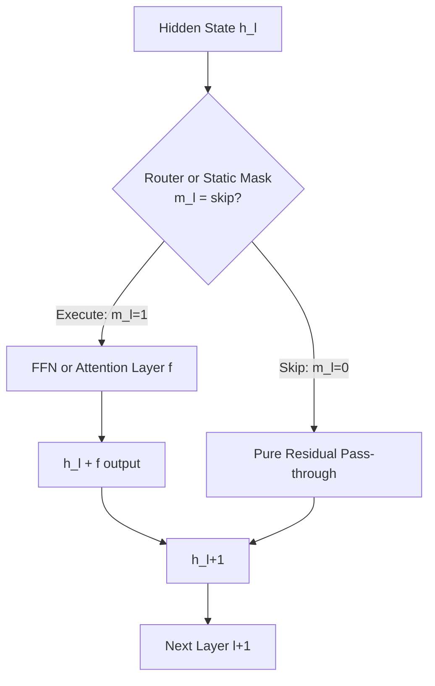

# Layer Skipping

## Detailed Explanation

Layer skipping is an inference optimization technique where individual transformer blocks are bypassed for a given input, with the hidden state passing directly through the residual connection (`h_{l+1} = h_l`) as if the layer did not exist. Unlike adaptive layer selection (early exit), layer skipping does not terminate computation entirely — it selectively omits specific middle layers while continuing forward through the rest of the network, making it compatible with autoregressive decoding.

The motivation comes from two observations. First, not all transformer layers contribute equally to task performance. Sensitivity analysis measuring `||∂L/∂W_l||` (gradient norm with respect to layer l's weights) shows that many middle layers have near-zero gradient norms, indicating they are redundant for the task. Second, measuring `cos(h_{l-1}, h_l)` (cosine similarity between input and output of layer l) reveals that some layers are nearly identity transformations: they pass their input through unchanged. A layer where `cos(h_{l-1}, h_l) > 0.95` can be skipped with minimal impact.

Two implementations exist: static skipping (identify redundant layers via calibration, skip them for all inputs) and dynamic skipping (a lightweight router predicts skip/execute per layer per token at inference time). Static is simpler and has zero overhead; dynamic is more powerful but requires training a router.

Real-world savings: skipping 30% of FFN sublayers in a 7B parameter model reduces inference FLOPs by ~20-25% and decreases latency by 15-18% on A100 GPUs. The accuracy trade-off is typically under 1% on benchmarks when layers are selected by sensitivity rather than randomly.

## Core Intuition

Imagine a factory assembly line where every product passes through every station even if some stations do nothing for that particular product. Layer skipping is the floor manager who looks at each product and routes it around the stations that add no value for it. The key insight is that the "do nothing" stations are identifiable ahead of time via testing, and bypassing them saves time without changing the final product.

## How It Works

1. **Calibration: compute layer sensitivity scores** — Run a representative calibration dataset through the model and compute two metrics per layer: gradient norm `||∂L/∂W_l||` (how much each layer affects the loss) and cosine similarity `cos(h_{l-1}, h_l)` (how much the layer transforms its input). Layers with low gradient norm AND high cosine similarity are prime skip candidates.
2. **Rank and select layers for skipping** — Sort layers by sensitivity score (ascending). Select the top-k% lowest-sensitivity layers as candidates. Typical: skip 20-40% of FFN sublayers, almost never skip attention sublayers unless gradient norm is near zero.
3. **Train a skip router (dynamic skipping)** — A 2-layer MLP taking the current hidden state `h_l` as input, outputting a binary skip decision `m_l ∈ {0,1}`. Router is trained jointly with an efficiency objective: minimize task loss + lambda * (skip_rate - target_skip_rate)^2.
4. **Apply skip mask at inference** — For each layer l, evaluate router: `m_l = router(h_l)`. If `m_l = 0`: `h_{l+1} = h_l` (pure residual pass-through). If `m_l = 1`: execute the layer normally.
5. **Residual pass-through preserves information** — Because transformer layers use residual connections `h_{l+1} = h_l + f(h_l)`, skipping a layer is equivalent to setting `f(h_l) = 0`. The hidden state dimension and position encoding are preserved exactly.
6. **No impact on output shape** — Unlike token pruning, layer skipping does not change sequence length or hidden dimension. The output has the same shape as if no skipping occurred, making it transparent to downstream layers and compatible with KV caching in decoders.

## Architecture / Trade-offs

### Static vs Dynamic Layer Skipping

| Approach | Selection Method | Overhead at Inference | Accuracy | Best For |
|----------|-----------------|----------------------|----------|---------|
| Static (fixed) | Calibration sensitivity scores | Zero | -0.5 to -1.5% | Production, known input distribution |
| Dynamic (per-sample) | Trained router MLP | 1-3ms per layer | -0.3 to -0.8% | Variable input difficulty |
| RL-trained router | Reward = accuracy - latency | 2-5ms per layer | -0.2 to -0.5% | Maximum efficiency |
| Random skip (baseline) | Random | Zero | -5 to -15% | Ablation study only |

### Skip Rate vs Latency vs Accuracy (Llama-7B, 32 layers)

| Layers Skipped | Skip Rate | FLOPs Reduction | Latency Reduction | Accuracy Drop (MMLU) |
|---------------|-----------|----------------|------------------|----------------------|
| 0 | 0% | 0% | 0% | 0% |
| 4 FFN layers | 12% | 8% | 6% | <0.5% |
| 8 FFN layers | 25% | 16% | 13% | 0.8% |
| 12 FFN layers | 37% | 23% | 18% | 2.1% |
| 8 FFN + 4 Attn | 37% | 22% | 15% | 3.5% |

### Trade-off Analysis

FFN sublayers are much safer to skip than attention sublayers. FFN layers perform position-wise feed-forward transformations that are relatively independent; attention layers compute cross-token interactions that are critical for coherence. Skip FFN first, skip attention only if gradient norms are extremely low (< 0.01 normalized). Skip rate of 20-25% offers the best Pareto point: meaningful speedup with near-zero accuracy loss.

## Interview Q&A

**Q: When is it safe to skip attention sublayers vs FFN sublayers?**
A: FFN sublayers are far safer to skip. They perform pointwise transformations on individual token representations and are relatively redundant in middle layers. Attention sublayers compute cross-token interactions — skipping them breaks the model's ability to resolve long-range dependencies and coreferences. Skip attention layers only if calibration shows `cos(h_{l-1}, h_l) > 0.97` AND gradient norm < 0.01. In practice, skip FFN layers first; add attention skipping only if FFN skipping alone doesn't meet your latency target.

**Q: How do you choose which layers to skip without hurting accuracy?**
A: Use two-step calibration: (1) compute gradient norms on a held-out calibration set of 500-1000 samples from your task; (2) compute cosine similarity between layer input and output. Rank by sensitivity = gradient_norm / (1 - cosine_similarity). Skip layers with lowest sensitivity first. Validate on a small evaluation set after each additional skip to build a Pareto curve. Never skip the first 2 or last 2 layers — they perform input embedding processing and output normalization respectively.

**Q: How does layer skipping interact with KV caching in autoregressive generation?**
A: Layer skipping is KV-cache friendly because it does not change sequence length or hidden dimension. When a layer is skipped, its KV cache entry simply copies the previous layer's output: `KV_l = KV_{l-1}` (or equivalently, the skip router sets `f(h_l) = 0`). The decoder continues generating with the same sequence length and position encoding intact. This is a key advantage over token pruning, which requires KV cache surgery when tokens are removed mid-generation.

**Q: What is the first sign that your layer skipping configuration is too aggressive?**
A: Watch for increased perplexity on long-range dependency tasks before accuracy drops on classification. Generation tasks show degradation first: outputs become repetitive, lose coreference coherence, or hallucinate entities. On benchmarks, look for disproportionate drops on tasks requiring multi-hop reasoning (ARC, HellaSwag) vs single-sentence tasks (SST-2, BoolQ). If multi-hop drops > 3% while single-sentence drops < 1%, you are over-skipping attention layers.

**Q: Can layer skipping be combined with quantization for compounding savings?**
A: Yes, and it's a common production pattern. Apply quantization first (reduces weights and activations to INT4/INT8), then apply layer skipping on the quantized model. The savings compound multiplicatively: INT4 quantization gives 4x memory reduction, 25% layer skipping gives 1.3x FLOPs reduction. Total effect: ~5x memory + ~1.3x compute. Calibrate layer importance on the quantized model, not the original — quantization changes gradient distributions and may make different layers more/less sensitive.

**Q: How do you handle variable-length inputs when using static layer skipping?**
A: Static skipping selects the same set of layers to skip for all inputs regardless of length. For short inputs, most layers may have low sensitivity; for very long inputs (> 4096 tokens), more layers may be essential for maintaining long-range context. Validate your static skip configuration on inputs across the full length distribution. If accuracy degrades specifically on long inputs, consider a length-conditional configuration: no skipping for inputs > 2000 tokens, 20% skipping for inputs < 512 tokens.

## Best Practices

- Always prioritize skipping FFN sublayers over attention sublayers; FFN layers account for 67% of transformer FLOPs but are more redundant than attention in middle layers.
- Use gradient norm as the primary sensitivity metric and cosine similarity as a tiebreaker — gradient norm is more reliable for task-specific sensitivity, cosine similarity catches general redundancy.
- Never skip the first 4 or last 2 layers of a model — the first layers build token representations from embeddings, and the last layers transform to output space; both are high-sensitivity by definition.
- Validate on your production task distribution, not generic benchmarks — a layer that is redundant for IMDB sentiment may be critical for domain-specific classification.
- Start with 15-20% skip rate (static) before considering dynamic routing — the overhead of a router network sometimes exceeds savings for small models (< 1B parameters).
- Monitor inference latency per layer in production to catch cases where a skipped layer's router overhead exceeds the layer's compute cost (common with tiny FFN layers in small models).
- Re-calibrate layer sensitivity after fine-tuning — fine-tuning changes gradient distributions and can make previously redundant layers essential for the new task.

## Common Pitfalls

- **Skipping attention layers breaks long-range dependencies**: Attention sublayers are responsible for relating tokens across long distances. Skipping even one attention layer in a 12-layer model can collapse coreference resolution accuracy by 8-15%. Symptom: model handles sentence-level tasks fine but fails on paragraph-level or multi-hop QA. Fix: restrict skipping to FFN sublayers only, or verify gradient norm is below 0.005 before adding any attention layer to the skip list.

- **Calibrating skip sets on training data causes distribution mismatch**: If the calibration set used to identify redundant layers is the training set, you may skip layers that are non-redundant on real-world inputs. Symptom: skip configuration shows 1% accuracy drop in testing but 5-8% drop in production. Fix: use a held-out calibration set representative of production inputs, not the training distribution.

- **Static skip sets are fragile to domain shift**: A layer identified as redundant for news articles may be essential for medical text. Symptom: accuracy regression when serving a new user population. Fix: maintain multiple static skip configurations per domain, or use dynamic routing with domain as a conditioning signal. Monitor per-domain accuracy continuously.

- **Router overhead exceeds savings for small models**: A 2-layer MLP router adds 0.5-2ms per layer decision. For small models where each layer takes 1-3ms total, the router cost is 25-100% of the layer cost it's supposed to save. Symptom: end-to-end latency does not improve despite 30% skip rate. Fix: use static skipping for models under 3B parameters; dynamic routing is only beneficial at 7B+ where individual layers take 10+ ms.

## Related Concepts

- [Adaptive Layer Selection](./37-adaptive-layer-selection.md)
- [Token Pruning and Merging](./36-token-pruning-merging.md)
- [Router Learning](./39-router-learning.md)
- [Mixed-Bit Quantization](./42-mixed-bit-quantization.md)
