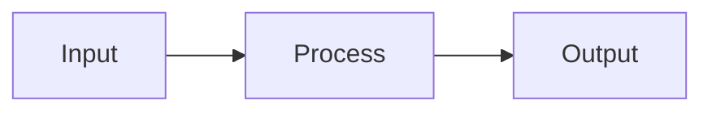

# Layer Skipping and Early Exit

## Detailed Explanation
Early exit mechanisms allow samples to exit before final layers if confidence is high. Layer skipping skips entire transformer blocks for certain tokens. Saves 30-50% compute for easy samples.

## Core Intuition
Layer Skipping and Early Exit optimizes inference optimization by Early exit mechanisms allow samples to exit before.

## How It Works

1. Step 1
2. Step 2
3. Step 3
4. Step 4
5. Step 5

## Architecture / Trade-offs

| Aspect | Value |
|--------|-------|
| Complexity | Intermediate |
| Category | Inference Optimization |

## Design Challenges

1. Challenge 1: See notebook for solutions
2. Challenge 2: Production deployment requires tuning
3. Challenge 3: Monitor metrics during rollout

## Interview Q&A

**Q1: When would you use this?**
A: See notebook for detailed scenarios.

**Q2: What are the main pitfalls?**
A: See Real-World Examples in notebook.

## Best Practices

- Profile before optimizing
- Monitor key metrics
- Compare with alternatives
- Start with basic, optimize later

## Common Pitfalls

- Not profiling first
- Skipping edge cases
- Ignoring error handling

## Related Concepts

See corresponding notebook and implementation for code examples.

---

## References

CALM (2021), Layer Skip Survey (2025)

**Notebook**: `modern-ai/notebooks/layer-skipping.ipynb`
**Implementation**: `modern-ai/implementations/layer-skipping.py`
