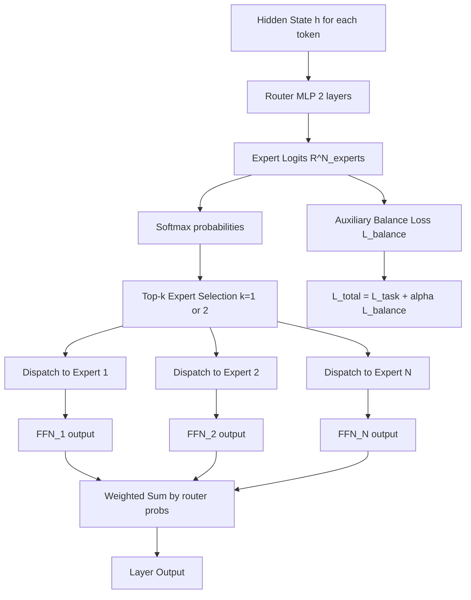

# Router Learning and Adaptive Routing

## Detailed Explanation

Router learning is the process of training a lightweight neural network — called a router or gating network — that dynamically dispatches tokens, samples, or computation to different expert pathways based on the input content. It is the core mechanism in Mixture-of-Experts (MoE) architectures and is increasingly used for inference-time compute allocation, multi-task routing, and dynamic layer selection.

In a Mixture-of-Experts layer, each token's hidden state `h` is fed to a router: a 2-layer MLP outputting N expert logits. Softmax produces probability scores, and the top-k experts are selected to process the token. The final output is a weighted sum of the selected experts' outputs. The router is trained end-to-end with the model using a combined loss: `L_total = L_task + alpha * L_balance`, where `L_balance` penalizes uneven expert utilization.

The load-balancing auxiliary loss is critical: without it, routers collapse to sending all tokens to one or two experts (router collapse), making 90%+ of parameters unused. The balance loss `L_balance = sum_e (f_e - 1/N_experts)^2` penalizes deviation from uniform distribution across experts, where `f_e` is the fraction of tokens routed to expert e. Alpha=0.01 is a typical starting point.

Router collapse is the dominant failure mode and is often the first thing engineers check when debugging MoE models. Other applications of router learning include: task-specific routing (route medical queries to a medical expert, code to a coding expert), layer-skip routers (decide whether to execute a transformer block), and mixture-of-adapters routing in LoRA ensembles.

## Core Intuition

Think of a large law firm where every incoming case is reviewed by a dispatcher who routes it to the most appropriate specialist: tax cases go to tax attorneys, criminal cases to criminal defense, contracts to corporate lawyers. The dispatcher (router) learns from experience which features of a case predict which specialist will handle it best. Without the dispatcher enforcing a balanced workload, the most popular specialist gets overwhelmed while others sit idle — that is router collapse.

## How It Works

1. **Token hidden state to router** — For each token position, pass the current hidden state `h ∈ R^d` to the router network: a 2-layer MLP with ReLU activation, outputting `logits ∈ R^{N_experts}`.
2. **Compute expert probabilities** — Apply softmax to router logits: `probs = softmax(logits)`. Each probability indicates how relevant expert e is for this token.
3. **Top-k expert selection** — Select the k highest-probability experts (typically k=1 or k=2). This is the hard assignment step: `selected = argtop_k(probs, k)`.
4. **Dispatch tokens to selected experts** — Each expert is a separate FFN (feed-forward network). Tokens are grouped and sent to their assigned experts. Expert capacity = (tokens_per_batch / N_experts) * capacity_factor (typically 1.25 to handle imbalance).
5. **Compute expert outputs and weighted sum** — Each expert processes its assigned tokens independently: `expert_out_e = FFN_e(h)`. Final output: `out = sum_{e in selected} probs[e] * expert_out_e`. The weighting by probability allows gradients to flow back through the router.
6. **Auxiliary load-balancing loss** — Compute `f_e = fraction of tokens routed to expert e` over the current batch. Add penalty: `L_balance = N_experts * sum_e (f_e * mean(probs[e]))`. This loss encourages uniform distribution and prevents collapse.
7. **Token overflow handling** — If more tokens are sent to an expert than its capacity allows, overflow tokens are dropped (sparse MoE) or handled by a backup expert. Track overflow rate as a production health metric (should be < 2%).

## Architecture / Trade-offs

### Router Designs: Top-k vs Hash-based vs Soft

| Router Type | Assignment | Gradient Flow | Load Balance | Latency | Best For |
|------------|-----------|---------------|--------------|---------|---------|
| Top-1 (Switch Transformer) | Hard, 1 expert | Via probs weighting | Requires aux loss, alpha=0.01 | Lowest | Maximum efficiency |
| Top-2 (GShard, Mixtral) | Hard, 2 experts | Via probs weighting | Easier to balance | +15% vs Top-1 | Quality + efficiency balance |
| Soft MoE | Soft, all experts | Direct through all | Natural | 2-3x vs Top-1 | Training stability |
| Hash routing | Deterministic | None (no learning) | Perfect | Lowest | Reproducibility |

### Load Balance Alpha Trade-off (8 experts, Top-2)

| Alpha (balance weight) | Expert Utilization | Task Loss | Collapse Risk | Recommended |
|-----------------------|-------------------|-----------|---------------|-------------|
| 0.0 (disabled) | 1-2 experts used (90%) | Lowest | High | Never |
| 0.001 | 4-5 experts used (65%) | Low | Medium | Low capacity |
| 0.01 | 7-8 experts (near-uniform) | Slightly higher | Low | Standard |
| 0.1 | 8 experts (uniform) | Higher (over-constrained) | None | Avoid, hurts quality |

### Trade-off Analysis

Top-1 routing (Switch Transformer) gives maximum efficiency: each token is processed by exactly 1 expert, cutting FFN compute by N_experts times compared to a dense model. But with only 1 expert path, the model cannot combine information from multiple specialists. Top-2 (Mixtral 8x7B) processes each token with 2 of 8 experts, combining their outputs — this adds 15% overhead versus Top-1 but significantly improves quality. The effective parameter count for Mixtral 8x7B is 46.7B, but active parameters per token are ~12.9B (2 of 8 experts + shared layers), giving inference cost similar to a 13B dense model.

## Interview Q&A

**Q: What is router collapse and how do you detect and fix it?**
A: Router collapse is when the router routes nearly all tokens to 1-2 experts, making the remaining N-2 experts idle and unused. The model degenerates to a dense model with wasted capacity. Detection: monitor the per-expert token count distribution during training. If the coefficient of variation (std/mean) of expert utilization exceeds 0.3, you have incipient collapse. Fix: (1) increase alpha from 0.01 to 0.05; (2) add jitter noise to router logits during training (noise = Normal(0, 0.01)); (3) use expert capacity limits that drop overflow tokens, forcing the router to diversify.

**Q: How does the router learn to specialize different experts for different content types?**
A: Router specialization emerges implicitly from the combination of task loss and balance loss. The task loss encourages routing tokens to the expert that processes them best. The balance loss prevents any single expert from dominating. Over training, experts develop specializations (some attend to syntactic structure, others to entities, others to positional information), though this is emergent rather than designed. You can visualize specialization by logging which expert each token (noun, verb, entity, number) routes to and computing token-type-to-expert conditional distributions.

**Q: What happens to routing quality when you switch from top-2 to top-1 expert selection?**
A: Top-1 reduces computational cost by 50% (half the expert compute), but the model loses the ability to combine multiple expert perspectives. Empirically on language tasks, top-1 vs top-2 shows 1-3% accuracy difference on multi-hop reasoning tasks and < 0.5% on classification. The gap widens on tasks requiring simultaneous linguistic features (syntax + semantics). Switch Transformer uses top-1 and achieves near-GPT-3 performance with 7x fewer FLOPs, so top-1 is viable. Use top-1 when inference cost is the primary constraint; top-2 when accuracy is critical.

**Q: When would you use hash-based routing instead of a learned router?**
A: Hash routing assigns tokens to experts based on a deterministic hash of the token ID, with no learned parameters. This guarantees perfect load balance (no auxiliary loss needed) and is fully reproducible. Use hash routing when: (1) you need exact expert assignment repeatability for debugging or auditing; (2) you observe router instability (collapsing or oscillating) and want a stable baseline; (3) you are training a very small MoE model where the router's parameter count is a significant fraction of total parameters. The cost: no expert specialization — experts get random token assignments and develop general rather than specialized representations.

**Q: How do you handle token overflow when a popular expert exceeds its capacity?**
A: When more tokens are routed to expert e than its capacity (tokens_per_batch / N_experts * capacity_factor), you have three options: (1) drop overflow tokens — fast, but these tokens receive no FFN processing (their hidden state passes through unchanged as if FFN=0); (2) route overflowed tokens to their second-choice expert; (3) increase capacity_factor to 1.5 or 2.0, accepting more memory. Drop-overflow is standard in production (Mixtral uses this). Track overflow rate as a metric; above 3% suggests alpha is too low or experts are too specialized and routing is unbalanced.

**Q: How do you efficiently implement router dispatch for batched GPU inference?**
A: The challenge is that different tokens in a batch go to different experts, creating irregular computation. The standard approach is: (1) for each expert, gather all tokens assigned to it into a contiguous tensor (gather operation); (2) process each expert's batch as a standard matrix multiply; (3) scatter results back to original positions (scatter operation). The gather/scatter overhead is typically 5-15% of total layer time on A100 GPUs. Key optimization: sort tokens by expert assignment before dispatching, improving memory locality. Libraries like Megablocks and Tutel implement this efficiently.

## Best Practices

- Initialize router weights to near-zero (std=0.01) — large initial router weights cause early confident assignment to a few experts and accelerate collapse.
- Use alpha=0.01 as the default balance loss coefficient; sweep range [0.001, 0.05] if you observe collapse (alpha too low) or quality degradation (alpha too high).
- Set capacity_factor=1.25 as a starting point — this allows a 25% imbalance buffer before token dropping. Increase to 1.5 for tasks with high variability in token difficulty.
- Monitor per-expert utilization, token drop rate, and load imbalance coefficient of variation as production health metrics; set alerts if any expert handles < 5% or > 40% of tokens.
- Add a small amount of Gaussian noise to router logits during training (`logits += Normal(0, 0.01)`) to prevent early collapse — remove at inference.
- Use gradient checkpointing on expert FFNs during training to manage memory — MoE models have N times the FFN parameters and can OOM during the backward pass with large batches.
- For fine-tuning a pretrained MoE, freeze the router and fine-tune expert weights first for 10% of training steps before unfreezing the router — this prevents the router from destabilizing during the transition.

## Common Pitfalls

- **Router collapse makes MoE effectively a dense model**: The router learns to route all tokens to 1-2 experts because it reduces gradient variance — the simplest solution to minimize task loss. Symptom: expert utilization Gini coefficient > 0.8 (highly unequal). Fix: increase alpha, add router noise, or implement hard capacity limits that force routing diversification.

- **Alpha too high over-constrains routing and hurts quality**: Setting alpha=0.1 enforces near-uniform expert distribution but prevents the router from learning any specialization. All experts receive equal tokens regardless of content, eliminating the benefit of MoE. Symptom: MoE model performs similarly to a dense model of the same active parameter count. Fix: lower alpha to 0.01-0.02 and accept mild imbalance in exchange for meaningful specialization.

- **Token drop rate not monitored in production**: Capacity overflow silently drops tokens — their FFN transformation is skipped and hidden state passes through unchanged. This degrades quality but produces no error. Symptom: subtle quality degradation under high load that does not appear in offline testing. Fix: log token drop rate per batch as a metric; alert if drop rate exceeds 2%.

- **Gradient instability from discrete top-k selection**: The top-k selection operation is non-differentiable — gradients only flow through the selected experts, not through the selection decision itself. Early in training, this causes the router to optimize only for making good use of experts it has already assigned tokens to, ignoring potentially better experts. Fix: use straight-through estimator during the first 1000 training steps, or start with soft MoE (all experts, soft weighting) and anneal to top-k.

## Related Concepts

- [Adaptive Layer Selection](./37-adaptive-layer-selection.md)
- [Layer Skipping](./38-layer-skipping.md)
- [Attention Pattern Learning](./45-attention-pattern-learning.md)
- [Mixed-Bit Quantization](./42-mixed-bit-quantization.md)
