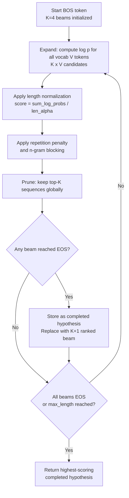

# Beam Search Optimization

## Detailed Explanation

Beam search is the standard decoding algorithm for sequence generation: it maintains K candidate sequences (beams) at each step, expanding each by one token from the full vocabulary, then pruning to keep only the K highest log-probability sequences. The algorithm produces better outputs than greedy decoding (K=1) because it explores multiple hypotheses in parallel, avoiding locally optimal but globally suboptimal token choices.

The standard algorithm has three key knobs: beam width K (number of hypotheses maintained), length normalization (divides total log-probability by sequence length raised to a power alpha, preventing the algorithm from favoring short sequences), and early stopping (halt when the best beam has an EOS token). The computational cost is O(K x V x T) where V is vocabulary size and T is sequence length.

Optimization addresses several practical problems with naive beam search: (1) diverse beam search — standard beams collapse to near-identical hypotheses because top-K sequences often differ only in the last token; (2) memory consumption — maintaining K beams with KV caches requires K times the memory of greedy decoding; (3) length bias — log-probability naturally decreases with sequence length, so without normalization the algorithm always prefers shorter outputs; (4) repetition — beams often repeat n-grams because they have high probability.

Modern implementations add: alpha-length normalization (0.6 is the WMT benchmark standard), repetition penalty (divide logits of previously seen tokens by a factor > 1), n-gram blocking (force tokens appearing in recent n-gram contexts to probability 0), and diverse beam search (penalize hypotheses similar to already-retained beams). These together yield translations and summaries with 2-5 BLEU/ROUGE points higher than naive beam search.

## Core Intuition

Beam search is like tracking the K most promising chess games simultaneously instead of committing to one move at a time. After each move, you keep only the K games with the best total position score and discard the rest. Length normalization prevents you from always preferring games that end in a draw quickly (short sequences) over games with a winning endgame (long, high-quality sequences). Diversity penalties ensure you are not tracking K nearly-identical games when it would be more useful to explore K genuinely different strategies.

## How It Works

1. **Initialize K beams from start token** — Create K identical beams, each containing only the BOS token. Score each beam with its initial log-probability (log p(BOS) = 0 by convention).
2. **Expand: generate all vocab candidates** — For each of the K active beams, compute log p(v | beam) for all V vocabulary tokens. This produces K x V candidate sequences. Memory: K x V logit tensors per step.
3. **Score with length normalization** — For each candidate, compute normalized score: `score = sum(log_probs) / (len(sequence))^alpha`, where alpha=0.6 is standard (from Google NMT). Without normalization, shorter sequences always score higher because they accumulate fewer log-probability terms.
4. **Prune: keep top-K sequences globally** — Sort all K x V candidates by normalized score and retain only the top-K. If a beam has reached EOS, store it as a completed hypothesis and replace it with the (K+1)-th ranked active sequence.
5. **Apply auxiliary penalties** — Repetition penalty: for each token t that appeared in the last R tokens of a beam, multiply its logit by 1/penalty_factor (default penalty=1.3). N-gram blocking: set log-probability of any token that would create a repeated n-gram to -infinity.
6. **Stop: all K beams hit EOS or max_length** — Return the highest-scoring completed hypothesis. If using diverse beam search: return the K completed hypotheses, sorted by score.

## Architecture / Trade-offs

### Beam Width vs Quality vs Memory (WMT14 EN-DE Translation)

| Beam Width K | BLEU Score | Memory (relative) | Latency (relative) | Notes |
|-------------|-----------|-------------------|-------------------|-------|
| 1 (greedy) | 25.8 | 1.0x | 1.0x | Fastest, lowest quality |
| 4 | 27.2 | 4.0x | 3.2x | Standard production setting |
| 8 | 27.6 | 8.0x | 6.1x | Marginal gain over K=4 |
| 16 | 27.8 | 16.0x | 11.8x | Diminishing returns |
| 32 | 27.9 | 32.0x | 22.5x | Never worth it |

### Length Normalization Alpha (WMT14, K=4)

| Alpha | Avg Output Length | BLEU | Effect |
|-------|------------------|------|--------|
| 0.0 (none) | 18.3 tokens | 24.1 | Strong short-output bias |
| 0.6 (standard) | 23.1 tokens | 27.2 | Balanced, recommended |
| 0.7 | 24.8 tokens | 27.0 | Slightly favors longer |
| 1.0 (full normalization) | 31.2 tokens | 25.6 | Over-corrects, too verbose |

### Diverse Beam Search Penalty

| Diversity Penalty lambda | Hypothesis Similarity | BLEU | Use Case |
|--------------------------|----------------------|------|---------|
| 0.0 (standard beam) | Very high (0.85 avg BLEU between beams) | 27.2 | Single best output |
| 0.5 | Moderate (0.65 similarity) | 26.8 | Multiple distinct candidates |
| 1.0 | Low (0.45 similarity) | 25.9 | Maximum diversity, re-ranking |

## Interview Q&A

**Q: Why does greedy decoding often produce worse outputs than beam search even with the same model?**
A: Greedy decoding commits to the highest-probability token at each step. If the optimal sequence requires choosing a lower-probability token at step 5 to enable high-probability tokens at steps 6-10, greedy never explores that path. Beam search keeps K hypotheses alive simultaneously, allowing it to recover from locally suboptimal choices. The classic example: "The company announced" -> greedy might choose "profits" (high probability), while beam search explores both "profits" and "layoffs" and selects "layoffs" when subsequent tokens confirm that context.

**Q: When should you NOT use beam search and prefer sampling instead?**
A: Beam search finds the highest-probability sequence, which is often too generic (the "safe" output). For creative tasks (story generation, dialogue, poetry), beam search produces repetitive, bland outputs because high-probability tokens tend to be common words and phrases. Use sampling with temperature (0.7-1.0) for creative tasks. Use nucleus sampling (top-p=0.9) to prevent low-quality rare tokens while maintaining diversity. Beam search is appropriate for translation, summarization, and code generation where the correct output has a well-defined structure and diversity is undesirable.

**Q: How does memory scale with beam width K and what can you do about it?**
A: Memory scales linearly with K: you maintain K complete KV caches. At K=8 for a 7B model, you need 8x the KV cache memory of greedy decoding — roughly 8 x 2GB = 16GB just for KV caches. Two mitigations: (1) use paged attention (vLLM) to share KV cache pages between beams that share a common prefix — beams diverge late, so early layers' KV caches are identical and can be shared; (2) reduce K at inference time if memory is the bottleneck and accept the quality trade-off. K=4 recovers 85% of K=8's quality at half the memory.

**Q: What is the length normalization alpha parameter and why does 0.6 work well?**
A: Without normalization, total log-probability decreases with sequence length (each additional token adds a negative log-probability term). Beam search minimizes this by preferring short sequences that accumulate fewer negative terms. Alpha compensates by dividing by length^alpha, penalizing short sequences. Alpha=0.0 gives no normalization; alpha=1.0 fully normalizes (divides by length directly). Alpha=0.6 is an empirically tuned sweet spot from Google NMT that produces natural-length outputs on translation benchmarks. For summarization (where shorter is usually better), use alpha=0.4-0.5; for question answering (where completeness matters), use alpha=0.7.

**Q: How does repetition penalty interact with beam search quality?**
A: Repetition penalty multiplies the logits of recently seen tokens by 1/penalty, reducing their probability. For beam search, this helps prevent all K beams from repeating the same n-grams (e.g., "the company, the company, the company"). Penalty=1.0 is no effect; penalty=1.3 is standard; penalty=1.5 can cause incoherence by avoiding grammatically necessary repetition ("the cat chased... but I saw the"). Best practice: apply penalty only to the last 20-50 tokens, not the full sequence, and cap it at 1.3 for structured tasks.

**Q: What is diverse beam search and when does it add value over standard beam search?**
A: Standard beam search K=8 often returns 8 very similar hypotheses (varying only in word choice for one or two positions). Diverse beam search adds a group-level penalty: `score(y_t) = log_p(y_t) - lambda * sim(y_t, beams_in_other_groups)`, forcing different beam groups to explore different regions of the output space. This adds value when you need to present multiple distinct candidates to users (e.g., 3 different phrasing options for an auto-reply) or when you plan to re-rank hypotheses with a separate model (re-ranker benefits from diverse candidates).

## Best Practices

- Use K=4 as the default beam width for production — it recovers 85-90% of K=8 quality at half the memory and 60% of the latency.
- Set length normalization alpha=0.6 for translation and summarization; lower values (0.4) for tasks where brevity is preferred; higher (0.8) for code generation where completeness matters.
- Apply repetition penalty=1.3 with a 50-token window for text generation; use n-gram blocking (no-repeat-ngram-size=4) for summarization where factual repetition is especially harmful.
- For beam search over vocabularies > 50k tokens, use vocabulary pruning: restrict candidates to top-K' tokens per step (K'=100) without computing full vocab distribution — this cuts beam search latency by 40-60% with < 0.3 BLEU loss.
- If using beam search in a streaming context (displaying tokens as they are generated), consider switching to top-p sampling — beam search cannot stream because it does not commit to tokens until a beam is complete.
- Monitor beam diversity in production: if the average pairwise similarity between returned beams exceeds 0.9, you are wasting compute on redundant hypotheses; consider reducing K or adding diversity penalty.

## Common Pitfalls

- **Memory explosion with large K and long sequences**: K=16 for a 7B model generating 512 tokens requires 32GB+ of KV cache alone. Symptom: OOM errors during beam search on long outputs. Fix: cap K at 4-8 for production; use paged KV attention to share cache across beams with common prefixes; or switch to sampling for long-form generation.

- **Length bias without normalization favors short outputs**: Without alpha normalization, beam search consistently outputs truncated summaries or one-word answers. Symptom: output length is always at the lower end of the expected range; ROUGE-L is high but ROUGE-1 is low (short outputs miss recall). Fix: add alpha=0.6 length normalization; verify by comparing avg output length with reference outputs.

- **N-gram blocking causes grammatical errors**: no-repeat-ngram-size=3 prevents any trigram from appearing twice. This can block grammatically necessary repetition ("the dog chased the... but I saw the dog"). Symptom: outputs contain pronouns substituted awkwardly (like avoiding "the company" and producing "it the corporation"). Fix: use a smaller n-gram size (4 or 5) or apply blocking only to content words, not function words.

- **Diverse beam search with high lambda destroys quality**: When lambda is too high, the diversity penalty overwhelms the language model score, forcing beams into low-probability regions. Symptom: diverse hypotheses are gibberish or have very low individual scores. Fix: cap lambda at 1.0; verify that each individual hypothesis has a length-normalized score within 2x of the best hypothesis.

## Related Concepts

- [Grammar-Constrained Generation](./41-grammar-constrained-generation.md)
- [Token Decompression](./44-token-decompression.md)
- [Attention Pattern Learning](./45-attention-pattern-learning.md)
- [Token Pruning and Merging](./36-token-pruning-merging.md)
