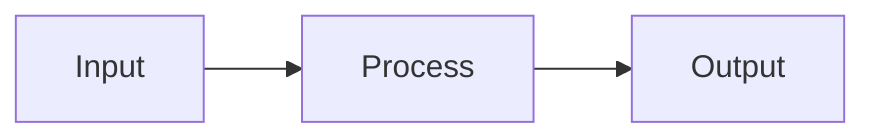

# Grammar-Constrained Generation

## Detailed Explanation
Constrain token sampling to valid tokens matching formal grammars or regex patterns. Ensures structured output (JSON, SQL, code) without re-sampling. 1.5-3x faster for structured generation.

## Core Intuition
Grammar-Constrained Generation optimizes inference optimization by Constrain token sampling to valid tokens matching .

## How It Works

1. Step 1
2. Step 2
3. Step 3
4. Step 4
5. Step 5

## Architecture / Trade-offs

| Aspect | Value |
|--------|-------|
| Complexity | Advanced |
| Category | Inference Optimization |

## Design Challenges

1. Challenge 1: See notebook for solutions
2. Challenge 2: Production deployment requires tuning
3. Challenge 3: Monitor metrics during rollout

## Interview Q&A

**Q1: When would you use this?**
A: See notebook for detailed scenarios.

**Q2: What are the main pitfalls?**
A: See Real-World Examples in notebook.

## Best Practices

- Profile before optimizing
- Monitor key metrics
- Compare with alternatives
- Start with basic, optimize later

## Common Pitfalls

- Not profiling first
- Skipping edge cases
- Ignoring error handling

## Related Concepts

See corresponding notebook and implementation for code examples.

---

## References

Outlines (2023), GBNF (2024)

**Notebook**: `modern-ai/notebooks/grammar-constrained-generation.ipynb`
**Implementation**: `modern-ai/implementations/grammar-constrained-generation.py`
