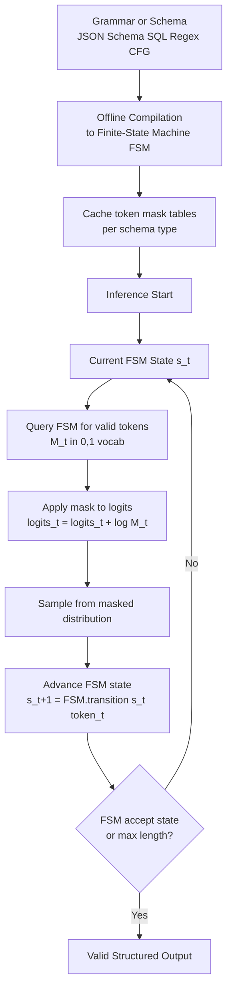

# Grammar-Constrained Generation

## Detailed Explanation

Grammar-constrained generation ensures that a language model can only produce tokens that are valid according to a formal grammar, schema, or pattern at each decoding step. Instead of post-processing or re-sampling invalid outputs, the constraint is enforced directly on the logit distribution: invalid tokens are masked to negative infinity before sampling, so the model never produces them.

The mechanism works through a finite-state machine (FSM) that tracks the current parse state given the tokens generated so far. At each step, the FSM computes a binary mask `M_t ∈ {0,1}^|V|` where `M_t[i] = 1` if token i is valid from the current state and 0 otherwise. The modified logits are: `logits_t' = logits_t + log(M_t)`, which sets invalid token log-probabilities to -infinity. The model samples from the valid subspace only.

This supports JSON schema (ensuring all fields are present, values have correct types), SQL (syntactically valid queries), regular expressions (phone numbers, email addresses), and context-free grammars via Earley parsing. The practical benefit is not just correctness — it is efficiency. Without constrained generation, you might retry 3-5 times before getting valid JSON from a model. With constraints, the first output is always valid, giving 1.5-3x throughput improvement for structured generation tasks.

The main challenge is grammar compilation: converting a JSON schema or CFG to a token-level FSM requires computing which token sequences are valid at each parser state. For large grammars and large vocabularies (128k tokens), this precomputation can take seconds and produces large lookup tables. The solution is offline compilation: compile schemas to token masks once and cache them per schema type.

## Core Intuition

Imagine typing a phone number into a form field that only accepts digits and dashes. You cannot type letters — the keyboard physically prevents it, so you never waste time typing an invalid character or having the form reject your input. Grammar-constrained generation is that phone number field applied to an LLM: the model can only "type" characters that are valid at the current position in the output structure, eliminating the need for validation-and-retry cycles.

## How It Works

1. **Compile grammar to FSM** — Before inference, parse the schema or grammar (JSON schema, regex, SQL grammar, CFG) into a finite-state machine where each state represents a valid parse position. Transitions on tokens advance the FSM state. This compilation is O(|grammar| x |vocab|) and is done offline, then cached.
2. **Maintain FSM state during generation** — As each token is generated, advance the FSM state: `state_{t+1} = FSM.transition(state_t, token_t)`. The FSM state encodes exactly what has been generated so far in terms of the grammar structure (e.g., "inside a JSON object, in the value position of key 'age'").
3. **Compute valid token mask for current state** — For state_t, query the FSM for all valid next tokens: `valid_tokens = FSM.next_valid(state_t)`. This returns a set of token IDs. Convert to binary mask `M_t ∈ {0,1}^|V|`.
4. **Apply mask to logits** — Compute masked logits: `logits_t' = logits_t + log(M_t)`. For tokens where M_t=0, `log(0) = -inf`, effectively zeroing their probability. For valid tokens, `log(1) = 0`, leaving logits unchanged.
5. **Sample from masked distribution** — Apply temperature, top-p, or beam search on the masked logit distribution. The sampled token is guaranteed to be valid by construction.
6. **Advance FSM and repeat** — After sampling token_t, advance FSM state and compute the next mask. Continue until the FSM reaches an accept state (grammar complete) or max_length is reached.

## Architecture / Trade-offs

### Comparison: Constraint Enforcement Strategies

| Strategy | Validity Guarantee | Latency Overhead | Model Quality | Implementation Complexity |
|----------|-------------------|-----------------|---------------|--------------------------|
| Post-hoc validation + retry | None per call | High (3-5x on failures) | Best (no constraint) | Low |
| Grammar-constrained (FSM) | 100% always | Low (5-15ms mask lookup) | Slightly lower (forced choices) | Medium |
| Fine-tuning for format | ~90-95% | None | Good | High (training cost) |
| Prompt engineering only | ~70-85% | None | Best | Low |
| Grammar + fine-tuning | 100% | 5-15ms | Best | High |

### FSM Compilation Cost by Grammar Type

| Grammar Type | Compilation Time | Mask Table Size | Cache Strategy | Notes |
|-------------|-----------------|-----------------|----------------|-------|
| Simple regex (phone) | <0.1s | <1MB | Always compile inline | No cache needed |
| Fixed JSON schema | 0.5-2s | 5-50MB | Cache per schema type | Reuse across requests |
| Complex SQL grammar | 5-30s | 100-500MB | Pre-compile at startup | Cold start only |
| Full CFG (Earley) | 30-300s | 1-10GB | Must pre-compile | Very large schemas only |

### Throughput Improvement (GPT-4 level model, JSON output)

| Method | Success Rate | Avg Retries | Effective Throughput |
|--------|-------------|------------|---------------------|
| Prompt only | 78% | 1.56 avg calls | 1.0x baseline |
| Grammar constrained | 100% | 1.0 (always) | 1.8x |
| Constrained + fine-tuned | 100% | 1.0 | 2.0x (faster sampling) |

## Interview Q&A

**Q: When does grammar-constrained generation hurt output quality compared to unconstrained generation?**
A: Quality degrades when the grammar forces the model to produce a valid token that is semantically incorrect. For example, in a JSON schema with `"age": {"type": "integer", "minimum": 0, "maximum": 120}`, if the model would naturally output "age": 150 (semantically plausible for the context), the grammar forces the last digit to be masked. The model chooses from the remaining valid integers. This is a forced choice in low-probability territory. Mitigation: use grammar constraints for structural validity (keys, brackets, types) and rely on the model for value content; avoid constraining semantic ranges unless correctness is critical.

**Q: How do you handle grammars that are too large to compile offline (full SQL with 500+ rules)?**
A: Three approaches: (1) incremental compilation — compute valid tokens lazily at each step using the Earley parser without precomputing the full FSM; this adds 10-50ms overhead per step but avoids offline compilation; (2) grammar approximation — compile a simplified version of the grammar (e.g., SQL without CTEs or window functions) and fall back to post-validation for complex queries; (3) hybrid — constrain only the high-level structure (SELECT...FROM...WHERE template) with a small FSM, and let the model fill in identifiers and values freely. The third approach is most practical for SQL in production.

**Q: What is the mask computation bottleneck and how is it optimized?**
A: The bottleneck is looking up valid next tokens for the current FSM state. Naive implementation: for each of the 128k vocabulary tokens, check if it is valid from the current state — O(|V|) per step. Optimized implementation: precompute for each FSM state a bitset of valid token IDs. Lookup becomes a single bitwise AND operation: O(|V|/64) per step with 64-bit words. For GPT-2-style tokenizers (50k vocab), this is 780 AND operations vs 50k checks — 64x faster. Libraries like Outlines and llama.cpp use this bitset optimization.

**Q: How does constrained generation interact with beam search?**
A: Each beam maintains its own independent FSM state because different beams have generated different token sequences. At each step, compute a separate mask for each beam and apply it to that beam's logits. Memory: N_beams x FSM state size (small, typically bytes per state). The interaction is clean because FSM state transitions are deterministic and independent. Beam search under constraints often produces higher-quality outputs than greedy constrained decoding because it explores multiple valid parse paths simultaneously.

**Q: What happens when the FSM reaches a dead state (no valid tokens exist)?**
A: A dead state means the generated sequence so far cannot lead to a valid completion — no tokens are valid from the current state. This can happen if the model has been forced to make choices that painted it into a structural corner. Fix: implement backtracking — when a dead state is reached, backtrack to the last decision point and mask out the token that led there. Alternatively, use a softer constraint: when fewer than 3 valid tokens exist, fall back to unconstrained sampling for one step, then resume constraints. Monitor dead state rate as a quality metric; above 1% suggests your grammar is over-constraining or your model is poorly calibrated to the schema.

**Q: How do you handle token boundary mismatches between the grammar and the tokenizer?**
A: Tokenizers split text at sub-word boundaries that may not align with grammar boundaries. For example, `{"key"` may be tokenized as `{`, `"`, `key`, `"` or as `{"`, `key`, `"`. The FSM must handle both paths. Solution: compute the FSM transition table over the tokenizer's vocabulary directly (character-level grammar compiled to byte-pair encoding transitions). Libraries like Outlines handle this by computing, for each grammar state, which BPE tokens can validly start and which can complete the current partial token. This adds complexity to FSM compilation but is handled transparently by the library.

## Best Practices

- Compile JSON schemas and SQL grammars at service startup, not per-request — compilation takes 0.5-30s and is a blocking operation; pre-compiled tables serve mask lookups in under 1ms.
- Use grammar constraints for structural correctness (JSON brackets, required keys, type annotations) and rely on the model for semantic content (values, identifiers) to minimize forced choices.
- Cache compiled FSMs by schema hash (MD5 of the schema JSON): most APIs use a small number of schemas (10-50 distinct ones) and cache hit rates exceed 99% in production.
- Set a fallback: if the FSM reaches a near-dead state (< 3 valid tokens), log it and fall back to unconstrained sampling for one step before resuming constraints — prevents complete generation failures.
- Monitor mask sparsity in production: if the average valid token count drops below 10 per step, your grammar is over-constraining the model and quality will degrade. Loosen the grammar or switch to post-validation.
- For regex constraints, prefer named capture groups over complex nested patterns — simpler regexes compile to smaller FSMs and have faster mask lookups.
- Use the Outlines or llama.cpp constrained generation implementations rather than building your own — FSM compilation with BPE tokenizer alignment is highly non-trivial.

## Common Pitfalls

- **Grammar compilation not pre-cached causes inference latency spikes**: Compiling a complex JSON schema takes 1-2s. If compiled on the first request, that request has 1-2s extra latency; all subsequent requests hit the cache. Symptom: p99 latency spikes on first-request-per-schema-type. Fix: pre-compile all production schemas at service startup; warm the cache before accepting traffic.

- **Dead states cause generation to freeze or produce garbage**: If the FSM enters a state with zero valid tokens and no backtracking is implemented, the sampler crashes or produces empty output. Symptom: certain inputs produce empty JSON outputs or generation-level exceptions. Fix: implement dead state detection and backtracking, or use Earley parsing which handles ambiguity gracefully.

- **Over-constraining degrades model quality on values**: Constraining "age must be integer between 0 and 120" forces the model to choose from a restricted set of digits. For edge cases (context implies age > 120), the model produces the closest valid value silently, potentially causing downstream errors. Symptom: structured outputs are valid JSON but contain semantically incorrect values. Fix: constrain structure only (field names, types), not semantic ranges; validate semantic constraints post-generation with domain logic.

- **Token boundary mismatches cause FSM to reject valid token sequences**: If a tokenizer merges `{"` into one token but the FSM treats `{` and `"` as separate transitions, the merged token is not in the FSM's transition table and gets masked out. Symptom: model produces valid JSON in testing (with one tokenizer) but fails with a different tokenizer version. Fix: compute FSM transitions over the actual BPE vocabulary using Outlines' vocabulary-aware FSM compiler.

## Related Concepts

- [Beam Search Optimization](./40-beam-search-optimization.md)
- [Token Decompression](./44-token-decompression.md)
- [Router Learning](./39-router-learning.md)
- [Attention Pattern Learning](./45-attention-pattern-learning.md)
