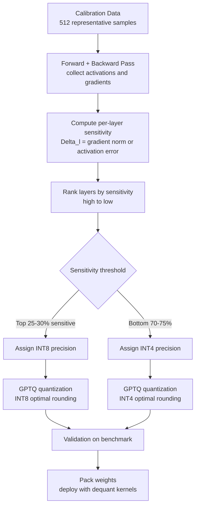

# Mixed-Bit Quantization

## Detailed Explanation

Mixed-bit quantization assigns different numerical precisions to different layers or weight groups within a model, rather than applying a single quantization scheme uniformly. The core insight is that transformer layers vary significantly in their sensitivity to quantization: first and last layers, attention QKV projections, and certain FFN layers preserve most of the model's task accuracy, while many middle FFN layers can tolerate aggressive quantization to INT4 or even INT2 with minimal impact.

The standard pipeline: (1) run a calibration dataset (500-1000 representative samples) through the model and compute per-layer sensitivity scores, typically measured as the change in output loss when quantizing each layer independently; (2) rank layers by sensitivity; (3) assign bit-widths — typically INT8 for high-sensitivity layers, INT4 for low-sensitivity layers; (4) apply GPTQ-style layer-wise quantization that minimizes `||WX - W_q X||^2` using optimal rounding with Hessian information.

Memory savings are concrete: a 7B parameter model in FP16 occupies 14GB. Uniform INT8 quantization gives 7GB. Mixed INT4/INT8 targeting 60% INT4 layers gives approximately 5.6GB — a 2.5x reduction. Critically, uniform INT4 causes 3-5% accuracy loss on benchmarks, while a mixed strategy preserving the top 25% most sensitive layers in INT8 keeps accuracy loss under 1%.

Common misconception: bit-width is purely a memory concern. In practice, INT4 on modern GPUs is also faster: NVIDIA H100 INT4 tensor cores are 2x faster than INT8 for matrix multiply, and 8x faster than FP16. Mixed quantization enables hitting specific hardware performance targets (e.g., fit in a single 24GB A10) while controlling the accuracy budget.

## Core Intuition

Think of a symphony orchestra where every instrument can play at full volume or at various reduced volumes to save energy. The conductor knows from rehearsal that the violin section carries the melody and must play at full volume, while some background percussion sections can be reduced without the audience noticing. Mixed-bit quantization is that conductor's score — full precision for the critical instruments (sensitive layers), reduced precision for the supporting ones, measured by how much each section contributes to the overall sound.

## How It Works

1. **Run calibration data through the model** — Feed 512-1024 representative inputs through the model and collect per-layer input/output activations and gradients. This is a standard forward + backward pass on calibration data.
2. **Compute per-layer sensitivity scores** — For each layer l, compute: `Delta_l = || ΔL / ΔW_l ||` — the gradient norm of the task loss with respect to layer l's weights. Alternatively, use activation-based sensitivity: `s_l = || X_l_fp16 - X_l_int4 || / || X_l_fp16 ||` (relative activation error when quantizing layer l to INT4 in isolation).
3. **Rank and assign bit-widths** — Sort layers by sensitivity score (descending). Assign INT8 to the top 25-30% most sensitive layers; assign INT4 to the remaining 70-75%. Keep embedding tables and final output projection in FP16 regardless — they are always high sensitivity.
4. **Apply GPTQ quantization per layer** — For each layer assigned to INT4/INT8: minimize `|| W * X - W_q * X ||^2` using the Hessian of the quantization error to determine optimal rounding for each weight. GPTQ processes columns sequentially, compensating for each column's rounding error in subsequent columns.
5. **Validate on held-out benchmark** — Measure perplexity and benchmark accuracy (MMLU, HellaSwag) on the quantized model. If accuracy drop exceeds budget (e.g., > 1%), increase INT8 allocation by 10% and re-quantize.
6. **Export and deploy** — Pack INT4 weights as two-per-byte (using 4-bit packing), store INT8 scale factors per group (group size 128 is standard). Dequantize on-the-fly during inference: `W_fp16 = (W_int4 - zero_point) * scale`.

## Architecture / Trade-offs

### Memory vs Accuracy: Quantization Schemes for Llama-7B

| Scheme | Memory | MMLU Accuracy | Perplexity (WikiText) | Notes |
|--------|--------|---------------|----------------------|-------|
| FP16 (baseline) | 14.0 GB | 67.0% | 5.09 | Reference |
| Uniform INT8 | 7.0 GB | 66.5% | 5.14 | Safe, minimal loss |
| Uniform INT4 (GPTQ) | 3.5 GB | 64.1% | 5.48 | 3-4% accuracy drop |
| Mixed INT4/INT8 (25% INT8) | 5.6 GB | 66.3% | 5.18 | Best Pareto point |
| Mixed INT4/INT8 (50% INT8) | 7.0 GB | 66.8% | 5.11 | Near-FP16 quality |
| AWQ (activation-aware) | 3.5 GB | 65.9% | 5.19 | Better than GPTQ INT4 |

### Bit-Width Assignment by Layer Type (Sensitivity Ranking)

| Layer Type | Sensitivity | Recommended Precision | Rationale |
|------------|------------|----------------------|-----------|
| Token embedding | Extremely high | FP16 | Input representation foundation |
| Final lm_head | Extremely high | FP16 | Maps to vocabulary logits |
| First 2 transformer layers | High | INT8 | Low-level feature extraction |
| Last 2 transformer layers | High | INT8 | Output feature refinement |
| Attention QKV (all) | Medium-high | INT8 | Query-key matching sensitive |
| Middle FFN layers (25-75% depth) | Low | INT4 | Most redundant layers |
| Attention output projections | Medium | INT8 | Aggregates multi-head attention |

### Hardware Throughput by Precision (A100 80GB vs H100)

| Precision | A100 TFLOPS | H100 TFLOPS | Memory Bandwidth | Best Use Case |
|-----------|------------|------------|-----------------|--------------|
| FP16 | 312 | 600 | 2 TB/s | Training, reference |
| INT8 | 624 | 1200 | 2 TB/s | Inference, 2x compute |
| INT4 | 624 (via INT8 path) | 1248 | 2 TB/s | High-throughput inference |
| FP8 (E4M3) | 624 | 1200 | 2 TB/s | Training + inference |

## Interview Q&A

**Q: How do you determine which layers to quantize to INT4 vs INT8 without hurting accuracy?**
A: Use sensitivity analysis: for each layer individually, measure the change in validation perplexity when you quantize only that layer to INT4 while keeping all others in FP16. Layers with Delta_perplexity < 0.05 are safe for INT4; layers with Delta_perplexity > 0.2 require INT8 or FP16. This is a sequential experiment on calibration data and takes 30-60 minutes for a 7B model. The resulting sensitivity ranking is stable across similar tasks — you do not need to repeat it for every fine-tuned variant of the same base model.

**Q: What is the difference between GPTQ and AWQ for mixed-bit quantization?**
A: GPTQ (Accurate Post-Training Quantization) minimizes quantization error by processing weight columns sequentially and compensating for rounding errors using the inverse Hessian of the activation covariance. It is slow to run (2-4 hours for 7B model) but produces consistently high quality. AWQ (Activation-Aware Weight Quantization) identifies the subset of weights most important for activation patterns (1% of weights carry 90% of the activation magnitude) and protects them at higher precision. AWQ is faster to run and more robust to calibration data distribution. For production, GPTQ gives slightly better perplexity on average; AWQ is better for models that will be deployed across diverse input distributions.

**Q: What is quantization group size and why does it matter?**
A: Rather than using a single scale factor for an entire weight matrix, per-group quantization divides each row into groups of G consecutive weights and computes a separate scale factor per group. Group size G=128 is standard; smaller groups (G=32) give higher accuracy but larger overhead (more scale factors stored). The scale factor captures local magnitude variations: weight values in the first 128 positions of a row may have magnitude 0.01, while the next 128 positions have magnitude 0.5. A single scale would either clip the large values or waste range on the small ones. Per-group scaling maintains representation precision across both regimes.

**Q: When should you use FP8 instead of INT4/INT8 for mixed-bit quantization?**
A: FP8 (E4M3 or E5M2 format) is a floating-point format supported natively on H100 GPUs that provides 8-bit precision with floating-point semantics (exponent + mantissa), unlike INT8 which is purely integer. FP8 is preferable for: (1) activations rather than weights — activations have dynamic ranges that fixed-point INT8 handles poorly; (2) training-aware quantization (QAT) where you need gradient-compatible quantized operations; (3) models with large activation outliers (common in LLMs) where INT8's limited dynamic range causes clipping. For weight-only quantization (most inference use cases), INT4/INT8 and FP8 perform similarly; INT4 packs more efficiently into GPU memory.

**Q: How do quantization-aware training (QAT) and post-training quantization (PTQ) differ in mixed-bit settings?**
A: PTQ (GPTQ, AWQ) quantizes a pretrained FP16 model without additional training — fast, no GPU cluster needed, slight accuracy loss. QAT simulates quantization during fine-tuning: straight-through estimator allows gradients to flow through rounding operations, and the model learns to use its weight capacity efficiently at low precision — requires training but recovers 0.5-1.5% accuracy over PTQ. In mixed-bit settings, QAT is harder because different layers have different quantization operators with different gradient behaviors. Use PTQ (GPTQ/AWQ) for production deployments where retraining is expensive; QAT for edge devices where model quality must be maximized at a fixed memory budget.

**Q: How do you validate that mixed-bit quantization meets your accuracy requirements?**
A: Run three evaluations: (1) perplexity on a held-out language modeling set (good proxy for overall capability degradation; a 0.1 increase in perplexity is typically safe); (2) task-specific benchmark (MMLU for knowledge, HumanEval for code, HellaSwag for commonsense) — these catch task-specific regressions that perplexity misses; (3) worst-case analysis — evaluate on your hardest production examples, the ones your team uses to catch model regressions. If benchmark accuracy drops > 1% or worst-case accuracy drops > 3%, increase the fraction of layers kept in INT8 by 10% and re-evaluate.

## Best Practices

- Always keep token embeddings and the final lm_head in FP16 regardless of overall memory target — these layers are disproportionately sensitive and their quantization causes non-local accuracy loss throughout the model.
- Use group size 128 as the default for INT4 quantization; group size 64 if accuracy is critical; group size 256 only if memory is extremely tight (gives 0.2-0.5% accuracy loss vs group size 128).
- Calibrate on task-representative data: if deploying for medical QA, calibrate on medical texts, not Wikipedia — sensitivity scores depend on activation patterns which are input-distribution-specific.
- Use GPTQ or AWQ implementation from the AutoGPTQ or llm-awq libraries rather than implementing rounding yourself — optimal Hessian-based rounding is non-trivial and these libraries are well-tested.
- Validate perplexity AND task accuracy — perplexity can stay stable while task accuracy degrades significantly for complex reasoning tasks.
- For models > 30B parameters, reduce calibration set size to 256-512 samples to manage memory during sensitivity analysis; quality impact is minimal above 128 samples.
- Monitor quantized model performance over time in production: user input distributions shift, and layers that were non-sensitive at calibration time may become sensitive under new query patterns.

## Common Pitfalls

- **Quantizing the first and last transformer layers to INT4**: These layers have the highest sensitivity to quantization. The first layers learn input token representations that propagate through all subsequent layers; the last layers map to the output vocabulary. INT4 quantization error in these layers causes global representation degradation. Symptom: 3-5% accuracy drop on all tasks, not just specific ones. Fix: maintain FP16 for all embedding layers and INT8 for the first and last 2-4 transformer layers.

- **Calibrating on a distribution that does not match production inputs**: Sensitivity scores computed on Wikipedia-style text will mark layers critical for encyclopedic knowledge but overlook layers critical for instruction-following or code. Symptom: quantized model shows good perplexity on held-out calibration data but poor performance on production queries. Fix: use a calibration set that mirrors your production query distribution; when in doubt, use ShareGPT or a diverse instruction dataset.

- **Ignoring outlier activations when setting INT8 scale factors**: Some transformer layers (especially in LLaMA and similar models) have activation outliers — values 100x larger than the mean. A naive per-tensor scale factor calibrates to the outlier, clipping all normal values. Symptom: severe accuracy degradation on certain query types that activate these outlier channels. Fix: use per-channel or per-group scale factors (group size 128), or use smooth quantization (SmoothQuant) which migrates outliers from activations to weights before quantizing.

- **Using INT4 for KV cache without awareness of precision impact**: Quantizing the KV cache (the growing key-value store in autoregressive generation) to INT4 reduces memory pressure for long-context generation but causes attention score errors that accumulate across long sequences. Symptom: generation quality degrades for inputs > 2048 tokens. Fix: keep KV cache in INT8, not INT4; or use INT4 KV cache only for the first 50% of layers where attention scores are less critical.

## Related Concepts

- [Embedding Quantization](./43-embedding-quantization.md)
- [Layer Skipping](./38-layer-skipping.md)
- [Token Pruning and Merging](./36-token-pruning-merging.md)
- [Router Learning](./39-router-learning.md)
