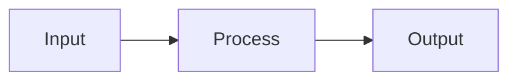

# Mixed-Bit Quantization

## Detailed Explanation
Use different bit widths for different layers/heads. Critical layers use FP8, less critical use INT4. Achieves 2-4x compression with <1% quality loss.

## Core Intuition
Mixed-Bit Quantization optimizes model compression by Use different bit widths for different layers/head.

## How It Works

1. Step 1
2. Step 2
3. Step 3
4. Step 4
5. Step 5

## Architecture / Trade-offs

| Aspect | Value |
|--------|-------|
| Complexity | Advanced |
| Category | Model Compression |

## Design Challenges

1. Challenge 1: See notebook for solutions
2. Challenge 2: Production deployment requires tuning
3. Challenge 3: Monitor metrics during rollout

## Interview Q&A

**Q1: When would you use this?**
A: See notebook for detailed scenarios.

**Q2: What are the main pitfalls?**
A: See Real-World Examples in notebook.

## Best Practices

- Profile before optimizing
- Monitor key metrics
- Compare with alternatives
- Start with basic, optimize later

## Common Pitfalls

- Not profiling first
- Skipping edge cases
- Ignoring error handling

## Related Concepts

See corresponding notebook and implementation for code examples.

---

## References

Mixed-Bit Q (2025), QLORA Variants (2024)

**Notebook**: `modern-ai/notebooks/mixed-bit-quantization.ipynb`
**Implementation**: `modern-ai/implementations/mixed-bit-quantization.py`
