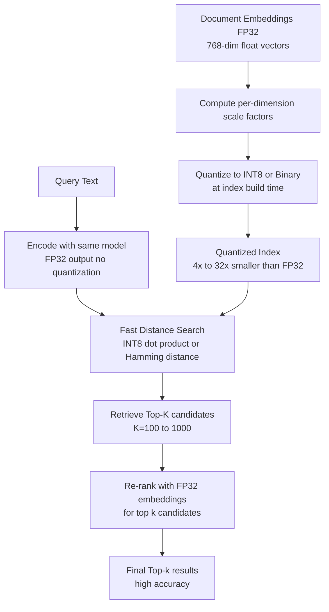

# Embedding Quantization

## Detailed Explanation

Embedding quantization reduces the memory footprint of dense vector embeddings — used in semantic search, retrieval-augmented generation (RAG), and recommendation systems — by converting floating-point vectors to lower-precision integer or binary representations. In retrieval systems, the embedding index is often the dominant memory consumer: 1 billion vectors at FP32 (4 bytes each) for 768-dimensional embeddings requires 3TB of memory, which is economically infeasible for most production systems.

The two main approaches are scalar quantization (INT8) and binary quantization. Scalar (INT8) quantization maps each float dimension to an 8-bit integer: `e_q = clamp(round(e / scale), -128, 127)` where `scale = max(|e|) / 127`. This yields 4x memory reduction (float32 to int8) with < 2% recall loss on standard benchmarks. Binary quantization takes each dimension to a single bit: `b_i = 1 if e_i > 0 else 0`. This gives 32x memory reduction and enables ultrafast distance computation via Hamming distance (popcount XOR), but with 3-8% recall loss.

A key insight often missed in practice: quantizing query embeddings loses significantly more quality than quantizing document embeddings. Queries are one-off computations where precision is cheap; document embeddings are stored at scale where compression is essential. The standard production pattern is asymmetric quantization: keep queries in FP32 for maximum precision, quantize the document index to INT8 or binary, and perform the dot product with appropriate dequantization. This yields 95-99% of full-precision recall while maintaining the memory savings.

Real-world applications: Pinecone and Weaviate offer INT8 quantization for their vector indexes; Faiss implements binary quantization with Hamming distance search; recommendation systems at Facebook scale to 100B items using binary embeddings for candidate retrieval followed by FP32 re-ranking.

## Core Intuition

Think of embedding quantization as converting a high-resolution photograph (FP32 embeddings) to different compression levels: JPEG at 90% quality (INT8, barely distinguishable from original), JPEG at 50% quality (INT4, noticeable artifacts but recognizable), or a black-and-white thumbnail (binary, just the gist). For a photo album with 1 billion photos, even the 90% quality compression saves enough storage to be economically critical, and for a quick first-pass search you just need to identify the rough subject, not every detail.

## How It Works

1. **Compute scale factors for scalar quantization** — For each embedding dimension d independently, compute `scale_d = max(|e[:, d]|) / 127` over a representative sample of embeddings (per-dimension scaling is more accurate than per-tensor). For binary quantization, no scale factor is needed.
2. **Quantize embeddings at index build time** — For INT8: `e_q[d] = clamp(round(e[d] / scale_d), -128, 127)`. For binary: `b[d] = 1 if e[d] > 0 else 0`. Pack binary vectors: 768 dimensions → 768/8 = 96 bytes per vector (vs 3072 bytes for FP32).
3. **Store quantized index** — Write quantized vectors + scale factors to the index. For INT8, store one scale factor per dimension per quantization group (e.g., 768 float32 scale factors per 768-dim embedding). For binary, store packed bit vectors only (no scale factors needed).
4. **Compute queries in FP32 (asymmetric)** — At query time, compute the query embedding in full FP32. Do not quantize the query. This maintains full precision on the search side where it is cheap.
5. **Distance computation** — For INT8 dot product: dequantize document vectors on-the-fly or compute in integer arithmetic and rescale: `dot_product = sum(q_fp32 * dequant(e_q)) = sum(q_fp32 * e_q * scale)`. For binary: `hamming_distance(q_binary, doc_binary) = popcount(XOR(q_binary, doc_binary))` — this runs at memory bandwidth limit on modern CPUs/GPUs.
6. **Re-rank top-k candidates in FP32** — After retrieving top-K candidates (typically K=100-1000) using quantized search, fetch the original FP32 embeddings for those candidates and re-compute exact distances. Return top-k' (e.g., k'=10) after exact re-ranking. This two-stage approach combines the speed of quantized retrieval with the accuracy of full-precision re-ranking.

## Architecture / Trade-offs

### Memory vs Recall: Quantization Schemes (768-dim BERT, 1M docs)

| Scheme | Storage per Vector | 1M Vectors | Recall@10 | Speed vs FP32 |
|--------|--------------------|------------|-----------|---------------|
| FP32 (baseline) | 3072 bytes | 3.0 GB | 100% | 1.0x |
| FP16 | 1536 bytes | 1.5 GB | 99.8% | 1.0x (memory bound) |
| INT8 scalar | 768 bytes + scales | 0.77 GB | 98.1% | 2.0x (int ops) |
| INT4 scalar | 384 bytes + scales | 0.39 GB | 95.3% | 2.5x |
| Binary (1-bit) | 96 bytes | 96 MB | 92.0% | 50x (Hamming) |
| Product Quantization (PQ) | 64 bytes (m=8) | 64 MB | 89.5% | 8x |

### Asymmetric vs Symmetric Quantization

| Configuration | Query Precision | Doc Precision | Recall@10 | Memory | Recommended |
|--------------|----------------|---------------|-----------|--------|-------------|
| Both FP32 | FP32 | FP32 | 100% | 3.0 GB | Development only |
| Symmetric INT8 | INT8 | INT8 | 96.5% | 0.77 GB | Avoid |
| Asymmetric (standard) | FP32 | INT8 | 98.1% | 0.77 GB | Production |
| Asymmetric binary | FP32 | Binary | 92% first-pass + FP32 rerank | 96 MB | High-scale retrieval |

### Product Quantization vs Scalar Quantization

| Method | Compression Ratio | Recall@10 | Training Required | Best For |
|--------|------------------|-----------|------------------|---------|
| Scalar INT8 | 4x | 98% | No | General retrieval |
| Product Quantization (m=8) | 48x | 89% | Yes (k-means per subspace) | Billion-scale search |
| OPQ (Optimized PQ) | 48x | 92% | Yes | Large-scale, quality matters |

## Interview Q&A

**Q: Why should you quantize document embeddings but keep query embeddings in FP32?**
A: Documents are stored at scale (billions of vectors) where compression is economically essential; each document embedding is accessed many times across many queries so amortizing the slight quality loss is acceptable. Query embeddings are computed once per request and are immediately discarded — they never need to be stored at scale. The compute cost of maintaining FP32 for query embeddings is just one forward pass per request. Asymmetric quantization: FP32 queries against INT8 documents achieves 98%+ of full-precision recall while maintaining the full 4x memory reduction on the document side.

**Q: What is product quantization and when does it outperform scalar quantization?**
A: Product quantization (PQ) divides each embedding vector into m subvectors (subspaces) and quantizes each subspace independently using a learned codebook with k=256 centroids. Each subvector is stored as an 8-bit index into its codebook. Distance computation uses precomputed lookup tables (distance from query subvector to each of 256 codebook entries per subspace). PQ achieves 40-50x compression vs FP32 vs 4x for INT8, but requires offline training (k-means per subspace on representative embeddings). PQ outperforms scalar quantization when memory is the hard constraint (billion-scale retrieval) and you can accept 8-12% recall loss. Use scalar INT8 when recall is critical and memory budget allows; use PQ when memory budget is absolute (e.g., on-device search with 1GB limit).

**Q: How do you calibrate INT8 scale factors and what goes wrong if calibration data is not representative?**
A: Per-dimension scale factors are computed as `scale_d = max(|e[:, d]|)` over the calibration set. If the calibration set underrepresents extreme activation values for a dimension, the scale factor is too small, causing overflow clipping when new embeddings with higher values are quantized. Conversely, if calibration overrepresents extreme values, the scale is too large and wastes the INT8 dynamic range on normal values. Symptom: recall drops disproportionately on certain query types that produce out-of-distribution embedding values. Fix: use a calibration set that covers your full production query distribution; use the 99.5th percentile of activation magnitude rather than the absolute max to reduce sensitivity to outliers.

**Q: How do you evaluate whether your embedding quantization meets recall requirements?**
A: Use Recall@K: for each query in your evaluation set, compute ground-truth top-K using FP32 search, then compute top-K using quantized search. Recall@K = fraction of FP32 top-K that appear in quantized top-K. For RAG applications, a Recall@10 of 95%+ typically maintains end-to-end task quality. Test across query types (short queries, long queries, domain-specific). Also evaluate the impact of re-ranking: if you re-rank the top-100 quantized candidates with FP32, measure Recall@10 after re-ranking vs before — re-ranking typically recovers 2-4 percentage points of recall.

**Q: What is the recall cost of binary quantization and how does re-ranking recover it?**
A: Binary quantization converts each float dimension to 1 bit (positive=1, negative=0), enabling 32x compression and Hamming distance search which runs at hardware limits (~50x faster than FP32 dot product). But binary embeddings lose all magnitude information — two vectors with cosine similarity 0.99 and 0.60 may have identical binary representations if they have the same sign pattern. Binary search has Recall@10 of 88-93% on standard benchmarks vs 98-99% for INT8. The two-stage approach recovers this: use binary search to get top-1000 candidates (extremely fast), then re-rank with FP32 to get final top-10. The combined recall@10 is 97-98%, near-indistinguishable from full-precision at 10x the memory savings vs INT8.

**Q: How do embedding quantization schemes interact with model fine-tuning?**
A: When you fine-tune the embedding model, the distribution of embedding values changes. Previously computed scale factors may be miscalibrated for the new model, and your quantized index (built with the old model's embeddings) is now stale — the old document embeddings are from the old model and are incompatible with new query embeddings. You must rebuild the entire quantized index after fine-tuning. This is a significant operational cost for billion-scale indexes. Mitigations: (1) fine-tune infrequently; (2) use an index update pipeline that re-embeds and re-quantizes incrementally; (3) distill the fine-tuned model into a model that preserves the original embedding distribution where possible.

## Best Practices

- Use asymmetric quantization as the default: keep query embeddings in FP32, quantize document index to INT8 — this preserves 98%+ recall at full 4x memory savings.
- Compute scale factors per-dimension (not per-tensor): per-tensor scale clips narrow dimensions to high magnitude; per-dimension scale handles heterogeneous dimension distributions accurately.
- Always implement a two-stage retrieval pipeline: fast quantized candidate retrieval (top-1000) followed by FP32 exact re-ranking (to top-10) — this decouples the memory vs recall trade-off.
- Calibrate scale factors on a sample of 50,000-100,000 embeddings from your production corpus; fewer than 10,000 may produce outlier-sensitive scale estimates.
- Monitor index recall continuously in production: as the document corpus evolves, new documents with out-of-distribution embedding values can degrade quantized retrieval quality without any code change.
- For binary embeddings, use Faiss IndexBinaryFlat or IndexBinaryIVF — these implement optimized Hamming search via popcount CPU intrinsics and are 10-50x faster than naive Python implementations.
- Re-quantize the index after any embedding model update — stale quantized indexes from an old model version cause severe recall drops when queried with a new model's embeddings.

## Common Pitfalls

- **Quantizing query embeddings symmetrically with document embeddings**: Many implementations quantize both queries and documents to INT8. This causes 2-4% recall drop vs asymmetric quantization at no memory savings on the query side (queries are not stored). Symptom: recall@10 is 96-97% instead of expected 98%+. Fix: apply quantization only to the stored document index; keep query embeddings in FP32 throughout the retrieval pipeline.

- **Using per-tensor scale factors causes clipping and recall loss**: A single scale factor for a 768-dimensional embedding is calibrated to the maximum absolute value across all dimensions. Dimensions with small magnitude are quantized to near-zero, losing their information. Symptom: certain semantic features encoded in low-magnitude dimensions are lost. Fix: use per-dimension scale factors; group size 64-128 dimensions per scale factor is a practical compromise between accuracy and scale storage overhead.

- **Not rebuilding the quantized index after model updates**: After fine-tuning the embedding model, the document embeddings in the existing quantized index are from the old model. New query embeddings are from the new model. The dot product between old document embeddings and new query embeddings is semantically meaningless. Symptom: retrieval quality degrades after model deployment even though the model itself tests well. Fix: rebuild the full index after any embedding model update; this is non-negotiable.

- **Binary quantization without re-ranking**: Deploying binary search and returning top-10 results directly (without FP32 re-ranking) gives only 88-92% recall. Symptom: end-to-end RAG quality drops unexpectedly. Fix: always implement the two-stage pipeline for binary quantization — binary search for candidates, FP32 re-rank for final results.

## Related Concepts

- [Mixed-Bit Quantization](./42-mixed-bit-quantization.md)
- [Token Pruning and Merging](./36-token-pruning-merging.md)
- [Beam Search Optimization](./40-beam-search-optimization.md)
- [Attention Pattern Learning](./45-attention-pattern-learning.md)
