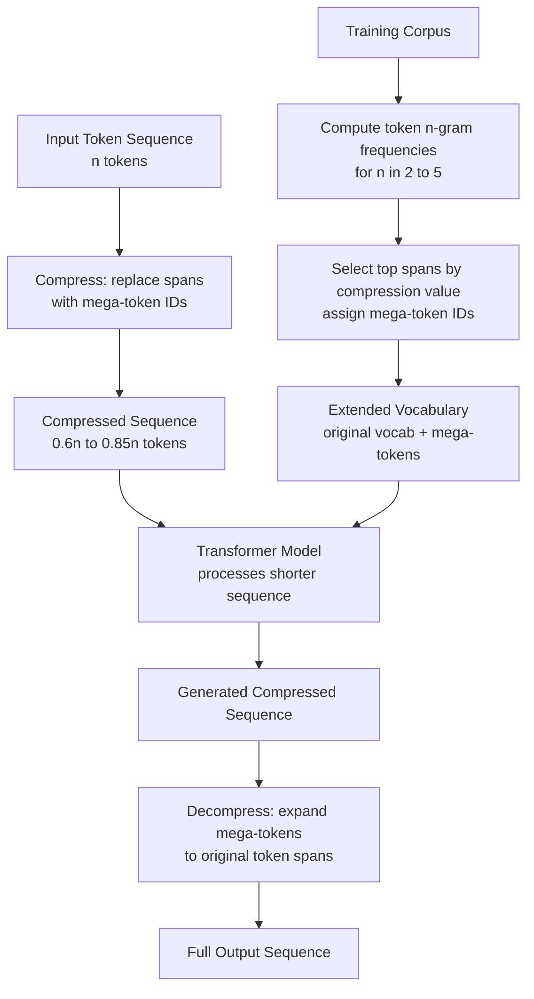

# Token Decompression and Recovery

## Detailed Explanation

Token decompression (also called span compression or mega-token expansion) is a technique that replaces frequently occurring multi-token spans in training data with single compressed token IDs, allowing the model to process shorter sequences, and then expands the compressed tokens back to their original multi-token form at output. It is conceptually an extension of the BPE (Byte Pair Encoding) tokenization philosophy: if BPE merges common character pairs into subword tokens, token decompression merges common subword sequences into larger "mega-tokens."

The mechanism: analyze the training corpus to find frequent multi-token spans (e.g., the 4-token span `import numpy as np` appears in 40% of Python files). Assign a new token ID to this span. During training and inference, compress the input by replacing matching spans with their single mega-token. The model processes a shorter sequence with fewer attention operations. At output, a decompression lookup table expands each mega-token back to its original token sequence before returning to the user.

The gain is domain-specific. For natural language text, most spans of length > 3 appear rarely and compression ratios are low (5-10% sequence length reduction). For structured domains — code, SQL, JSON, log files — frequent patterns are abundant: function signatures, import statements, boilerplate JSON keys. Token decompression achieves 20-40% sequence length reduction on code corpora, directly reducing attention computation by 35-65% (since attention is quadratic in sequence length).

The key operational challenge is KV cache compatibility: when compressed tokens are part of the context window, decompressing them in the KV cache at output time naively requires inserting new KV entries into the middle of the cache, which invalidates positional encodings for all subsequent entries. The correct approach is to decompress eagerly in the KV cache when each mega-token is generated, before the next token's attention computation.

## Core Intuition

Token decompression is like a legal team that has created standard clause shorthand codes for frequently used contract boilerplate. Instead of typing "the party of the first part agrees to indemnify and hold harmless" 500 times in a document, they use clause code "IH-7" and expand it only at printing time. The lawyer works with short clause codes (compressed sequence), thinks faster, and the final contract gets printed with all the full text restored. The model "thinks" in compressed token space and expands to readable form at output.

## How It Works

1. **Build frequency table of multi-token spans** — Scan the training corpus and count the frequency of all token n-grams for n in {2, 3, 4, 5}. For each span, compute `compression_value = (len(span) - 1) * freq(span)` — the total tokens saved if this span is compressed. Higher is better.
2. **Select spans for compression** — Apply a threshold: compress span if `compression_value > threshold`. Typical selection: top 1,000-10,000 spans by compression value, representing the most frequent and longest patterns. Assign each selected span a new token ID in the extended vocabulary.
3. **Compress training data** — Replace all occurrences of selected spans with their mega-token IDs using a greedy left-to-right scan (similar to BPE encoding but at the token level). Longer spans take priority over shorter overlapping spans.
4. **Train model on compressed sequences** — The model trains on sequences with mega-tokens in place. It learns the semantic meaning of mega-tokens from context, the same way it learns subword token meanings. Sequence length reduction directly speeds up training.
5. **Compress input at inference** — Before inference, apply the same compression lookup to input tokens. `compress(tokens) -> compressed_tokens` using the span-to-mega-token mapping table. This can be precomputed for known-format inputs (e.g., fixed JSON schema fields).
6. **Decompress output after generation** — After the model generates compressed token sequence, expand mega-tokens back to their original multi-token spans using the decompression lookup table. KV cache decompression: when a mega-token is generated, immediately expand it in the KV cache before computing attention for the next token.

## Architecture / Trade-offs

### Compression Ratio by Domain (GPT-2 tokenizer, 50k base vocabulary)

| Domain | Avg Span Length | Compression Ratio | Attention FLOPs Reduction | Accuracy Impact |
|--------|----------------|-------------------|--------------------------|----------------|
| Natural language (news) | 2.1 tokens | 8-12% | 15-22% | < 0.5% perplexity |
| Python code | 3.4 tokens | 25-35% | 44-58% | < 1% HumanEval |
| SQL queries | 4.2 tokens | 30-40% | 51-64% | < 0.5% accuracy |
| JSON (fixed schema) | 5.1 tokens | 35-50% | 58-75% | Negligible |
| Log files (structured) | 6.3 tokens | 40-55% | 64-80% | Negligible |

### Vocabulary Size vs Compression Quality

| Mega-token Vocabulary Size | Compression Ratio | Model Size Increase | Training Stability |
|---------------------------|-------------------|--------------------|--------------------|
| 1,000 mega-tokens | 5-10% | < 1% | Excellent |
| 5,000 mega-tokens | 12-20% | 1-2% | Good |
| 10,000 mega-tokens | 20-35% | 2-4% | Good |
| 50,000 mega-tokens | 35-55% | 10-20% | Harder (sparse mega-token usage) |

### Comparison: Token Decompression vs Alternative Compression Approaches

| Method | Compression Ratio | Lossless? | Compatible with KV Cache | Training Required |
|--------|------------------|-----------|--------------------------|------------------|
| Token decompression (span) | 20-40% | Yes | With care | Yes (full retraining or fine-tuning) |
| Token pruning (attention) | 30-50% | No | Yes (prune then cache) | No |
| Token merging (ToMe) | 25-50% | Near-lossless | Needs reindexing | Minimal (add-on) |
| Sliding window attention | N/A (scope reduction) | Yes | Yes | No |

## Interview Q&A

**Q: When does token decompression provide the most benefit vs other compression techniques?**
A: Token decompression provides the most benefit when the input domain has highly repetitive, structured patterns — code, SQL, JSON, log files. The compression is lossless (exact expansion), which is important for tasks where every token matters (code generation, SQL). For natural language, token pruning or attention mechanisms are better suited because the patterns are less predictable. Quantify the opportunity before investing: measure average compression ratio on your production corpus. If it is under 15%, the engineering cost of token decompression likely exceeds the benefit.

**Q: How do you handle the KV cache correctly when mega-tokens are generated?**
A: When the model generates a mega-token at position t, the KV cache stores one entry at position t. If we decompress this mega-token into k sub-tokens, the KV cache must be expanded from one entry to k entries, and all subsequent positions must be reindexed. This is expensive and breaks positional encodings. The correct approach: perform eager decompression — when a mega-token is placed into the KV cache, immediately expand it into k entries and advance the position counter by k. This happens before computing attention for the next token, ensuring positional coherence. The cost is k KV cache write operations instead of 1, but this is negligible compared to the savings from processing shorter sequences during attention.

**Q: What is the effect of adding mega-tokens on the model's vocabulary embedding table size and what is the training cost?**
A: Adding N mega-tokens to the vocabulary increases the embedding table by N rows (each of dimension d). For N=10,000 and d=4096, this adds 10000 * 4096 * 2 bytes = 80MB — less than 1% of a 7B model's 14GB. The more significant cost is training: the model must learn embeddings for all mega-tokens from their usage context. With 1,000-5,000 mega-tokens appearing frequently in training data, these embeddings converge in 1-2 epochs. With 50,000 mega-tokens, many will appear rarely and their embeddings will be noisy. Rule of thumb: use a mega-token vocabulary that covers 80% of compression opportunities with the fewest tokens; rarely appearing spans are not worth adding.

**Q: How do you validate that decompressed outputs are identical to what the model would have generated without compression?**
A: Exact equivalence is not guaranteed — the model trained with compressed sequences learns to process mega-tokens as atomic units, not as equivalent to their component sub-tokens processed sequentially. In practice, outputs for identical inputs with and without compression will differ by small amounts (different attention paths lead to slightly different continuations). Measure compression-induced drift by comparing: (1) perplexity on a held-out corpus with and without compression (should differ by < 0.5 points); (2) task-specific accuracy on your benchmark (should differ by < 1%). If drift is larger, reduce mega-token vocabulary size — fewer, more frequent mega-tokens cause less representation disruption.

**Q: How do you handle span boundary conflicts during compression (greedy vs optimal)?**
A: Consider the token sequence `[A, B, C]` where both `[A, B]` and `[B, C]` are registered mega-tokens. Greedy compression processes left-to-right and compresses `[A, B]` to `mega_AB`, leaving `[C]` alone. This may miss a more valuable compression opportunity. Optimal compression would enumerate all valid decompositions and choose the one minimizing total tokens. In practice: greedy is used because it is O(n) while optimal is NP-hard for arbitrary overlapping spans. Mitigate the greedy suboptimality by excluding overlapping span pairs from the mega-token vocabulary — ensure selected spans are non-overlapping for the most common sequences.

**Q: What happens to decompression at inference when the model generates a partial mega-token (the first few tokens of what should be a mega-token span)?**
A: The model may generate the start of a mega-token span without choosing the mega-token itself — e.g., generate `import numpy` as two separate tokens instead of the mega-token `MT_import_numpy_as_np`. This is not an error; the model has freedom to generate either form, and both decode to valid Python. The decompression lookup table only expands recognized mega-token IDs; unrecognized tokens pass through unchanged. For correctness-critical applications (SQL, JSON), use grammar-constrained generation to force the model to use mega-tokens when available, ensuring consistent decompression.

## Best Practices

- Target domains where compression ratios exceed 20% before investing in token decompression — measure on your actual production corpus before building the infrastructure.
- Select mega-token vocabulary by compression value = (span_length - 1) * frequency; do not add spans below frequency 0.01% of corpus tokens even if they are long.
- Limit mega-token vocabulary to 5,000-10,000 tokens; beyond this, embedding training becomes sparse and the embedding table size approaches diminishing returns.
- Implement eager KV cache decompression: expand mega-tokens to their sub-token KV entries immediately at generation time, not at post-processing time, to maintain positional coherence.
- Pre-compress known-format inputs at ingestion time (batch compress at document load for a fixed schema), not at query time, to eliminate per-request compression overhead.
- Validate compression-decompression round-trip fidelity on 100% of test inputs before deployment — a bug in the decompression lookup table silently corrupts all outputs.
- Monitor mega-token usage rate in production: if frequently used mega-tokens drop in usage, it signals distribution shift (new input patterns that bypass span matching) and may require updating the mega-token vocabulary.

## Common Pitfalls

- **Decompression overhead at inference negates training savings**: If decompression is performed lazily at the end of generation (after the full sequence is generated), the KV cache holds compressed representations and must be fully re-expanded. For sequences with 100 mega-tokens each expanding to 4 sub-tokens, this post-hoc expansion touches 400 KV cache entries. Symptom: generation is fast but post-processing latency spikes. Fix: decompress eagerly in the KV cache as each mega-token is generated.

- **Span frequency computed on training data but production inputs differ**: A mega-token for `numpy.array` appears 100,000 times in Python training data, but your production use case is SQL query rewriting — the mega-token never fires. Symptom: promised compression ratio does not materialize in production; actual compression is 2% instead of 20%. Fix: compute span frequency on a sample of your production input distribution, not the original training corpus.

- **Greedy compression misses valuable overlapping patterns**: Greedy left-to-right compression always takes the first match, potentially missing a longer or higher-value span starting one position later. Symptom: compression ratio is 10% lower than the theoretical maximum. Fix: use a two-pass compression: first pass identifies all non-overlapping mega-token spans; second pass greedily resolves remaining tokens. Or use the Aho-Corasick string matching algorithm for optimal non-overlapping span coverage.

- **Positional embedding corruption when mega-tokens expand**: If using absolute position embeddings and you expand a mega-token at position 50 to 4 sub-tokens after generation, positions 51+ are now at position 54+ in the decoded sequence but their KV cache entries were computed at position 51-N. For subsequent generation steps, these positions are misattributed. Fix: use relative position embeddings (RoPE, ALiBi) throughout the model, which are robust to position reindexing.

## Related Concepts

- [Grammar-Constrained Generation](./41-grammar-constrained-generation.md)
- [Beam Search Optimization](./40-beam-search-optimization.md)
- [Token Pruning and Merging](./36-token-pruning-merging.md)
- [Mixed-Bit Quantization](./42-mixed-bit-quantization.md)
