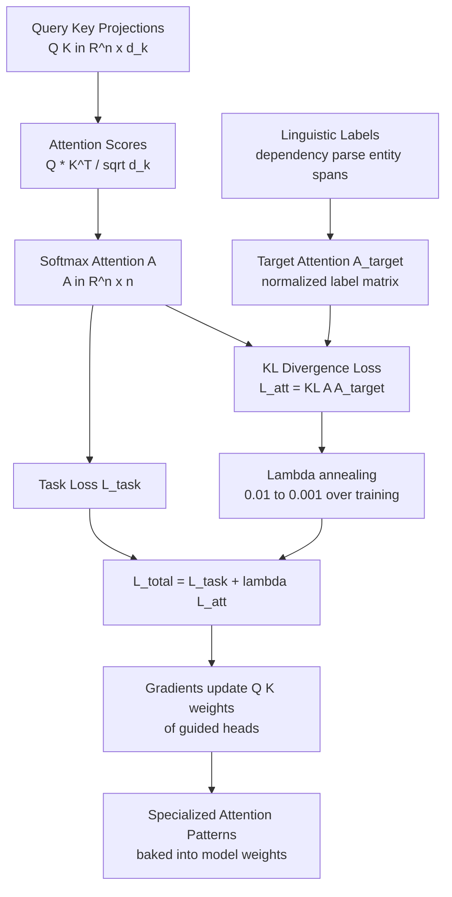

# Attention Pattern Learning

## Detailed Explanation

Attention pattern learning refers to techniques that guide, structure, or constrain the attention distributions in transformer models toward patterns that encode known linguistic or structural properties — rather than learning purely data-driven attention from scratch. Standard self-attention learns to attend to any position with any weight; structured attention learning adds an auxiliary loss or architectural bias that encourages specific attention heads to specialize: some attending to syntactic dependencies, others to entity coreference, others to local context.

The primary mechanism is an auxiliary loss on attention distributions: `L_att = lambda * KL(A || A_target)` where `A` is the model's attention matrix and `A_target` is a target distribution derived from linguistic annotation (dependency parse trees, entity span labels, sentence boundaries). By minimizing the KL divergence between learned and target attention patterns, the auxiliary loss guides individual heads toward interpretable specialization.

A related technique is differentiable sparse attention: instead of soft attention over all positions, a top-k mask is applied to attention logits via a straight-through estimator, forcing each head to attend to exactly k positions. This reduces attention computation from O(n^2) to O(n*k) and produces more interpretable, focused heads. The straight-through estimator allows gradients to flow through the discrete masking operation during training.

Practitioners care about attention pattern learning for three reasons: (1) efficiency — sparse attention patterns reduce computation; (2) interpretability — structured heads make the model's reasoning more auditable for regulated domains (medical, legal); (3) generalization — explicitly encoding syntactic structure helps models on low-resource languages where data-driven learning of syntax is difficult. Common misconception: forcing specific attention patterns always improves performance. In practice, the auxiliary loss must be annealed carefully — starting at lambda=0.01 and reducing to 0.001 over training — otherwise it over-constrains attention and hurts the primary task.

## Core Intuition

Think of a newsroom with 12 journalists (attention heads) assigned to cover a story. Without structure, all 12 reporters cluster around the most exciting quotes and no one covers context or background. Attention pattern learning is the editor who assigns beats: three reporters cover direct quotes (entity attention), three cover who said what (coreference attention), three cover timeline (positional attention), and three are free-form. The structured beats improve coverage while the free-form reporters still catch surprising angles. The editor's instructions are the auxiliary loss; the beats baked into finished reporters are the learned patterns.

## How It Works

1. **Compute standard self-attention scores** — For each head h at layer l, compute attention logits: `scores = (Q * K^T) / sqrt(d_k)`. Softmax gives attention probabilities `A ∈ R^{n x n}`.
2. **Generate target attention patterns from labels** — For syntactic attention: compute `A_dep[i][j] = 1` if token j is the syntactic head of token i (from a dependency parser). For entity attention: `A_ent[i][j] = 1` if tokens i and j refer to the same entity. Normalize rows to sum to 1.
3. **Compute auxiliary KL divergence loss** — `L_att_h = KL(A_h || A_target_h) = sum_i sum_j A_h[i][j] * log(A_h[i][j] / A_target_h[i][j])`. Sum over assigned heads.
4. **Add auxiliary loss to total objective** — `L_total = L_task + lambda * sum_h L_att_h`. Lambda starts at 0.01 and is annealed to 0.001 by the end of training. The gradient from L_att flows back through softmax to the query and key projections of the guided heads.
5. **Heads specialize during training** — Through the auxiliary loss gradient, guided heads develop attention patterns that align with their assigned target structure. Non-guided heads remain free to learn task-specific patterns. Over training, heads exhibit specialization: head 2 attends to subject-verb pairs, head 5 attends to entity mentions, head 8 attends local context.
6. **No overhead at inference** — The learned attention patterns are baked into the model's Q/K weight matrices. At inference, attention computation is standard O(n^2). If sparse attention was trained (top-k masking), the sparsity is optionally enforced at inference for speed gains.

## Architecture / Trade-offs

### Attention Pattern Types by Specialization

| Pattern Type | Label Source | Head Specialization | Task Benefit | Annotation Cost |
|-------------|-------------|--------------------|--------------|--------------------|
| Syntactic dependency | Dependency parser | Subject-verb-object links | Parsing, NLI | 20–50ms/sentence online; 0ms if precomputed offline |
| Entity coreference | Coreference annotator | Same-entity mentions | QA, summarization | 30–80ms/sentence online; 0ms if precomputed offline |
| Local context (n-gram) | None (window) | Adjacent tokens | Generation fluency | 0ms (no annotation needed; window computed on-the-fly) |
| Sentence boundary | Sentence splitter | Cross-sentence linking | Long-document tasks | ~5ms/sentence; lightweight rule-based splitter |
| Self-attention (diagonal) | None (identity) | Token identity | Skip connection behavior | 0ms (identity matrix; no annotation required) |

### Lambda (Auxiliary Loss Weight) vs Quality Trade-off

| Lambda Value | Head Specialization | Task Loss Impact | Interpretability | Recommended |
|-------------|--------------------|-----------------|--------------------|-------------|
| 0.0 (disabled) | None | 0% | Low (standard attention) | Baseline only |
| 0.001 | Weak | < 0.1% | Moderate | Low resource setting |
| 0.01 | Moderate | 0.2-0.5% | Good | Standard training |
| 0.05 | Strong | 1-2% | High | When interpretability critical |
| 0.1 | Very strong | 3-8% | Very high | Usually too costly |

### Sparse Attention Methods Comparison

| Method | Sparsity Pattern | Speedup | Quality vs Dense | Implementation |
|--------|-----------------|---------|-----------------|----------------|
| Top-k masking (learned) | Dynamic, input-dependent | 2-4x for k<<n | -0.5 to -1% | Medium (STE needed) |
| Sliding window (Longformer) | Fixed local + global | 4-8x long seqs | -0.2 to -0.5% | Low |
| Random + learned (BigBird) | Fixed random + global | 3-5x | -0.3 to -0.8% | Medium |
| Block sparse (GPT-3) | Fixed block pattern | 2-3x | -0.1 to -0.3% | Low |

## Interview Q&A

**Q: Why must the auxiliary attention loss be annealed during training, and what happens if it is not?**
A: The auxiliary loss imposes a target distribution on attention heads. If lambda stays high (0.1) throughout training, the attention heads are over-constrained to match the target patterns even when those patterns conflict with what the task needs. For example, a dependency-guided head may attend to syntactic heads when the task requires attending to answer entities. The result is that the model's attention is "correct" by the auxiliary metric but suboptimal for the task. Annealing: start at lambda=0.01 to establish the initial specialization bias, then reduce to 0.001 as the primary task loss dominates fine-grained learning. If lambda stays at 0.01, expect 1-3% task accuracy loss compared to unguided attention.

**Q: How do you decide which attention heads to guide and which to leave free?**
A: Guide roughly 1/3 of heads per layer; leave 2/3 free. Guided heads impose structural biases that may hurt flexibility. Empirically: guide heads that correspond to patterns with known linguistic importance (syntactic, coreference), and leave heads free that are expected to learn task-specific patterns. Use probing classifiers to diagnose what each free head has learned post-training — if free heads spontaneously learn syntactic patterns (common in large models), the auxiliary loss is redundant and adds training cost without benefit. Reduce guidance to only the layers where probing shows the least spontaneous structure.

**Q: What is the straight-through estimator and why is it needed for sparse attention?**
A: Top-k masking is non-differentiable: the function `top_k(scores, k)` returns a discrete binary mask, and the gradient of a discrete step function is zero everywhere. The straight-through estimator (STE) approximates the gradient: during the forward pass, apply the hard top-k mask; during the backward pass, pass gradients through as if the mask were not applied (straight through). This allows the Q/K weights to update based on which positions were attended to, even though the masking decision was discrete. Without STE, the Q/K weights receive no gradient from the sparsity mask and the model never learns to control which positions to include in the top-k set.

**Q: Do forced attention patterns improve performance on tasks without explicit linguistic labels?**
A: Moderately and inconsistently. On tasks with clear linguistic structure (NLI, relation extraction, coreference resolution), auxiliary pattern loss gives +1-3% accuracy. On tasks that are less syntactically structured (open-domain generation, retrieval), the benefit is near-zero or slightly negative. For low-resource settings (fewer than 100k training examples), linguistic inductive bias from auxiliary attention loss helps more because the model has less data to learn structure from scratch. In high-data regimes (> 1M examples), the model naturally develops structured attention and the auxiliary loss provides minimal additional gain.

**Q: How does attention pattern learning relate to probing classifiers for interpretability?**
A: Probing classifiers assess what information is encoded at each layer and head by training a small classifier on frozen layer outputs to predict linguistic properties (POS, dependency label, named entity). Attention pattern learning takes the reverse direction: instead of measuring what attention has learned, it imposes what attention should learn. The two are complementary: use probing first to understand which heads already specialize spontaneously, then apply auxiliary loss only to heads that lack desired specialization. This targeted approach is more efficient than applying the auxiliary loss to all heads.

**Q: What are the computational costs of attention pattern learning at training time?**
A: Three costs: (1) computing target attention from linguistic annotation — a dependency parser adds 5-20ms per sentence, or you precompute labels offline for the training corpus (one-time cost); (2) computing KL divergence loss — O(n^2) per guided head per layer, same order as the attention computation itself; (3) annealing schedule management — negligible. Total training overhead: 15-30% longer training time for fully annotated auxiliary loss. The inference cost is zero — patterns are baked in. For online annotation (real-time parsing during training), the parser can be the bottleneck; precomputing labels offline is strongly recommended.

## Best Practices

- Anneal lambda from 0.01 at the start of training to 0.001 by the final 20% of training steps — this establishes the structural bias early and lets the primary task loss fine-tune the details.
- Guide at most 4 heads per 12-head layer (1/3 of heads); keep at least 8 heads fully free to learn task-specific patterns without structural constraints.
- Use probing classifiers at training checkpoints (every 10% of training) to verify guided heads are developing the intended specialization — if a head resists guidance (probing accuracy stays low), the auxiliary loss target may be misspecified.
- Pre-compute linguistic annotations (dependency parses, entity spans) offline before training begins; online parsing during the training loop typically bottlenecks the data pipeline.
- Monitor both auxiliary loss (should decrease) and primary task loss (should also decrease) simultaneously — if auxiliary loss decreases but task loss stagnates or increases, lambda is too high.
- For production models where interpretability is not a hard requirement, prefer spontaneous specialization (no auxiliary loss) over forced patterns — large models (7B+) develop structured attention naturally given sufficient training data.
- If using sparse attention (top-k masking) for inference efficiency, validate the speedup at your production sequence lengths — for sequences under 512 tokens, sparse attention overhead from mask computation often exceeds the savings.

## Common Pitfalls

- **Auxiliary loss weight lambda > 0.1 dominates training and degrades task accuracy**: When lambda is too large, the model optimizes to match target attention patterns rather than solve the task. Symptom: guided heads show near-perfect pattern alignment but task accuracy is 5-8% lower than the unguided baseline. Fix: reduce lambda by 5-10x; most of the structural benefit occurs at lambda=0.01 with minimal task loss.

- **Target attention matrix A_target has zero-probability cells causing KL divergence to blow up**: KL divergence is undefined when the target distribution has zero probability for a position that the learned distribution assigns non-zero probability. For dependency-based targets, a token may have no dependency head in the label (root tokens, punctuation), creating rows of zeros. Symptom: KL loss is NaN or inf during training. Fix: smooth the target distribution with a small epsilon: `A_target_smooth = (1 - epsilon) * A_target + epsilon / n`, with epsilon=0.01 ensuring no zero-probability cells.

- **Applying the same target pattern to all heads in a layer removes head diversity**: Guiding all 12 heads with the same syntactic target collapses head diversity — the model effectively has 1 syntactic attention module replicated 12 times. Symptom: the model under-performs on tasks requiring multi-faceted attention (long-document QA, complex reasoning). Fix: assign different targets to different heads: 3 syntactic, 3 entity, 3 local window, 3 free. Diversity across heads is essential to the expressive power of multi-head attention.

- **Sparse attention top-k masks during training not removed at inference**: If top-k masking is applied at inference (as intended for speedup), but k was tuned for training loss rather than inference quality, the model may perform poorly at inference. Some implementations accidentally leave training-time k values at inference. Symptom: inference quality drops 2-5% compared to soft attention. Fix: benchmark with and without sparse masking at inference; if quality drops, use soft attention at inference and accept the speed trade-off.

## Related Concepts

- [Token Pruning and Merging](./36-token-pruning-merging.md)
- [Adaptive Layer Selection](./37-adaptive-layer-selection.md)
- [Router Learning](./39-router-learning.md)
- [Mixed-Bit Quantization](./42-mixed-bit-quantization.md)
