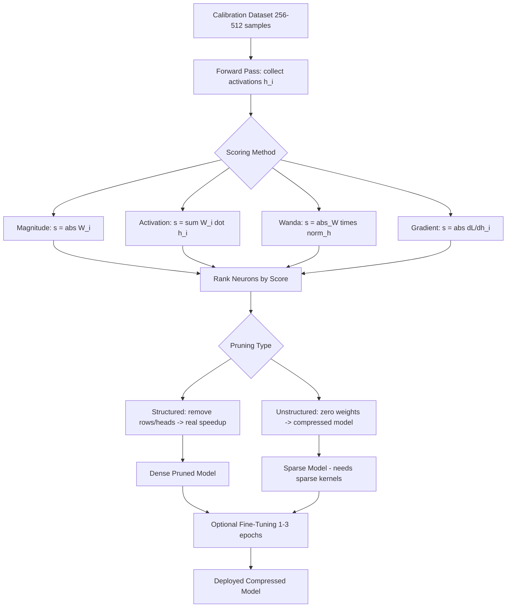

# Neuron Importance Scoring

## Detailed Explanation

Neuron importance scoring is a structured model compression technique that assigns a scalar importance value to each neuron, attention head, or filter, then removes the lowest-scoring units to reduce compute and memory. Unlike random pruning, importance scoring ensures accuracy is preserved as much as possible after removing a given percentage of parameters.

The three dominant scoring families are: (1) **magnitude-based** — `s_i = |W_i|` — fast but ignores input data; (2) **activation-based** — `s_i = Σ_{x∈D} |W_i · h_i(x)|` — correlates weight magnitude with actual activation from calibration data; and (3) **gradient-based** — `s_i = |∂L/∂h_i|` — measures how much perturbing neuron i changes loss. Wanda (2023) combines activation norm and weight magnitude: `score = |W| × ||X||_2`, outperforming both alone at 50% sparsity.

A critical practical distinction is **structured vs unstructured pruning**. Unstructured pruning zeroes individual weights (arbitrary sparsity patterns) — it compresses the model on disk but yields no real runtime speedup without sparse-kernel support. Structured pruning removes entire rows, columns, or attention heads, producing dense weight matrices that speed up standard GEMM kernels without any special hardware.

The importance scoring phase uses a small calibration dataset (256–512 samples), requiring only a forward pass (activation scoring) or forward + backward pass (gradient scoring). Fine-tuning after pruning recovers 50–80% of the accuracy drop.

Practitioners use neuron importance scoring to hit a target latency or memory budget while maximizing accuracy, particularly when deploying large LLMs to edge hardware with strict constraints.

## Core Intuition

Think of a large company where many employees do very little work — neuron importance scoring is the performance review that identifies which employees are actually load-bearing. Removing the low scorers (pruning) lets the company run the same operations with fewer people, but only if you identify the truly unimportant ones first. The danger is misfiring: removing someone who seemed idle but handled rare-but-critical tasks.

## How It Works

1. **Select calibration dataset**: Sample 256–512 representative inputs (same distribution as production). Too few → noisy scores; too many → unnecessary compute.
2. **Run forward (and optional backward) pass**: Collect per-neuron activations `h_i(x)` across all calibration samples. For gradient scoring, also backpropagate to collect `∂L/∂h_i`.
3. **Compute per-neuron importance score**: Magnitude: `s_i = |W_i|`. Activation: `s_i = Σ_x |W_i · h_i(x)|`. Wanda: `s_i = |W_i| × ||h_i||_2`. Gradient: `s_i = |∂L/∂h_i|`.
4. **Rank neurons within each layer**: Sort by `s_i` ascending. Apply layer-wise sparsity budget (e.g., prune bottom 30% per layer) or global budget (prune bottom 30% across all layers).
5. **Remove or zero selected units**: For structured pruning, delete entire rows/columns from weight matrices. For unstructured, zero individual weights (requires sparse kernels for speedup).
6. **Optional fine-tuning**: Run 1–3 epochs of LoRA or full fine-tuning on the pruned model to recover accuracy (typically regains 50–80% of the accuracy drop).

## Architecture / Trade-offs

### Pruning Structure Comparison

| Pruning Type | Real GPU Speedup | Accuracy at 50% | Hardware Support | Implementation |
|---|---|---|---|---|
| Unstructured | 0–5% (no sparse kernels) | Best (~1% drop) | Needs sparse GEMM | Easy |
| Semi-structured (2:4) | 1.5–2x (A100 Sparse Tensor Cores) | Good (~2–3% drop) | A100/H100 only | Medium |
| Structured (rows/heads) | 1.5–4x (standard GEMM) | Fair (~3–5% drop) | All GPUs/CPUs | Easy |
| Head pruning (attention) | 1.2–2x per pruned head | Good (~2–4% drop) | All hardware | Medium |

### Scoring Method Comparison at 50% Sparsity (LLaMA-7B, C4 perplexity)

| Method | Calibration Cost (ms/sample) | Accuracy Drop (PPL increase) | Requires Gradients | Notes |
|---|---|---|---|---|
| Magnitude | 2 ms | +8–12 PPL | No | Fast but naive |
| Activation (SparseGPT) | 5 ms | +2–4 PPL | No | Layer-wise OBS |
| Wanda | 5 ms | +1–3 PPL | No | Best cost/accuracy |
| Gradient (Movement) | 15 ms | +1–3 PPL | Yes | Requires backprop |
| Taylor expansion | 20 ms | +1–2 PPL | Yes | Most accurate |

## Interview Q&A

**Q: When would you choose structured pruning over unstructured pruning in a production deployment?**
A: Choose structured whenever your inference hardware doesn't have sparse tensor core support (anything other than A100/H100), because unstructured sparsity provides zero actual speedup on dense GEMM kernels — you only save disk space. For A100 deployments at 2:4 sparsity you get ~1.7x speedup; for CPU or edge inference, structured row/head removal is the only approach that reduces FLOPs.

**Q: How do you decide how many calibration samples to use for importance scoring?**
A: 256–512 samples is the sweet spot: below 128, scores are too noisy (high variance between runs); above 1024, you pay 4x compute for <1% improvement in score quality. The calibration set must match the production input distribution — if you calibrate on Wikipedia but serve code queries, head importance scores will be misleading.

**Q: Your pruned model has significantly higher perplexity than expected at 30% sparsity. What do you check first?**
A: Check whether you're using global vs layer-wise sparsity — global pruning concentrates sparsity in shallow layers which are more sensitive. Then verify the calibration set distribution matches your target domain. Finally, check if you accidentally applied unstructured pruning expecting speedup (the model is correct but you're measuring wall-clock inference, not FLOP count).

**Q: What's the trade-off between pruning to 50% sparsity with fine-tuning vs training a smaller dense model from scratch?**
A: Pruning with fine-tuning is 5–10x faster to obtain than training from scratch and preserves the pre-trained knowledge. But a purpose-built smaller model often achieves better accuracy at the same parameter count because its capacity is allocated efficiently from the start. Use pruning when you have a deployed model that needs to be trimmed quickly; use training from scratch when you have compute budget and want maximum accuracy at the target size.

**Q: How do you diagnose that your importance scores are miscalibrated?**
A: Run the pruned model on a held-out validation set and plot accuracy vs sparsity level. If accuracy drops sharply before 20% sparsity, your scores are miscalibrated (important neurons are being pruned). Cross-check by pruning to 10% and verifying that only near-zero activations are removed. Also check if the calibration set is too small or mismatched.

**Q: When would you skip importance scoring entirely and use random structured pruning?**
A: For very small sparsity budgets (<10%), random structured pruning often performs within 0.5% of importance-scored pruning because almost any neuron at that density is genuinely redundant. The scoring overhead (forward pass on calibration set) isn't justified. For sparsity >20%, always use scored pruning.

## Best Practices

- Use 256–512 calibration samples from the production input distribution — never use random noise or out-of-distribution data, as scores will be meaningless.
- Default to Wanda scoring (`|W| × ||X||_2`) before trying gradient-based methods; it achieves near-gradient-quality scores at activation-pass cost.
- Apply structured pruning (rows, heads) for deployment on standard hardware; reserve unstructured pruning only for A100/H100 2:4 sparsity or model storage compression.
- Set per-layer sparsity budgets (e.g., prune 30% from each layer independently) rather than global budgets, because early layers are more sensitive and a global budget over-prunes them.
- Always run fine-tuning with LoRA (rank 8–16) after pruning at >30% sparsity — typically 1–3 epochs recovers 50–80% of accuracy loss with minimal compute.
- Target 20–40% structured pruning as a safe operating range for <2% accuracy degradation on most LLMs; above 50% typically requires fine-tuning to maintain quality.
- Measure actual wall-clock latency after pruning, not theoretical FLOP reduction — structured pruning of rows may not speed up batched inference if dimensions don't align with tensor core tile sizes.

## Common Pitfalls

- **Pitfall: Unstructured pruning with no real speedup**
  **Symptom:** Model file is 50% smaller but inference latency is identical or slower.
  **Fix:** Switch to structured pruning (remove full rows/heads) or use 2:4 semi-structured sparsity on A100. Unstructured zeros in dense weight matrices are treated as regular multiplications by cuBLAS.

- **Pitfall: Calibration set distribution mismatch**
  **Symptom:** Pruned model scores well on the calibration domain but accuracy degrades sharply on production inputs.
  **Fix:** Sample calibration data from the actual production query log. Recompute importance scores with the correct distribution before pruning.

- **Pitfall: Over-pruning sensitive early layers**
  **Symptom:** Large accuracy drop even at modest overall sparsity (e.g., 25% global pruning causes 10% accuracy loss).
  **Fix:** Use per-layer sparsity budgets; reduce sparsity in the first 2–3 transformer layers (typically 0–10% safe to prune there) and increase in later layers (40–50% safe).

- **Pitfall: Skipping fine-tuning at high sparsity**
  **Symptom:** Pruned model at 40%+ sparsity has unacceptably high perplexity and is not usable.
  **Fix:** Always add 1–3 epochs of LoRA fine-tuning after pruning above 30% sparsity; this recovers most of the accuracy loss without expensive full fine-tuning.

- **Pitfall: Measuring compression ratio instead of actual memory reduction**
  **Symptom:** Model reports 40% fewer parameters but GPU memory usage barely changes.
  **Fix:** Structured pruning actually shrinks weight matrix dimensions; unstructured pruning requires sparse storage formats (COO, CSR) to reduce memory. Verify you're using the appropriate storage format.

## Related Concepts

- [36-token-pruning-merging.md](./36-token-pruning-merging.md) — token-level pruning during inference vs weight pruning
- [37-adaptive-layer-selection.md](./37-adaptive-layer-selection.md) — selecting which layers to execute at runtime
- [38-layer-skipping.md](./38-layer-skipping.md) — skipping entire layers as a coarser pruning strategy
- [31-quantization-aware-distillation.md](./31-quantization-aware-distillation.md) — complementary compression: reducing bit-width instead of removing weights
- [55-online-knowledge-distillation.md](./55-online-knowledge-distillation.md) — distillation to recover accuracy after pruning
