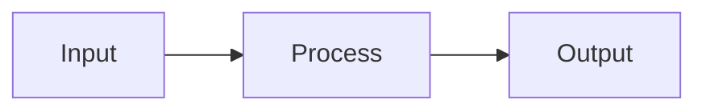

# Neuron Importance Scoring and Pruning

## Detailed Explanation
Score neuron importance via gradient-based or activation-based metrics. Prune unimportant neurons or weight connections. Achieves 20-30% parameter reduction.

## Core Intuition
Neuron Importance Scoring and Pruning optimizes model compression by Score neuron importance via gradient-based or acti.

## How It Works

1. Step 1
2. Step 2
3. Step 3
4. Step 4
5. Step 5

## Architecture / Trade-offs

| Aspect | Value |
|--------|-------|
| Complexity | Intermediate |
| Category | Model Compression |

## Design Challenges

1. Challenge 1: See notebook for solutions
2. Challenge 2: Production deployment requires tuning
3. Challenge 3: Monitor metrics during rollout

## Interview Q&A

**Q1: When would you use this?**
A: See notebook for detailed scenarios.

**Q2: What are the main pitfalls?**
A: See Real-World Examples in notebook.

## Best Practices

- Profile before optimizing
- Monitor key metrics
- Compare with alternatives
- Start with basic, optimize later

## Common Pitfalls

- Not profiling first
- Skipping edge cases
- Ignoring error handling

## Related Concepts

See corresponding notebook and implementation for code examples.

---

## References

Magnitude Pruning (2021), Lottery Ticket (2019), Movement Pruning (2021)

**Notebook**: `modern-ai/notebooks/neuron-importance-scoring.ipynb`
**Implementation**: `modern-ai/implementations/neuron-importance-scoring.py`
