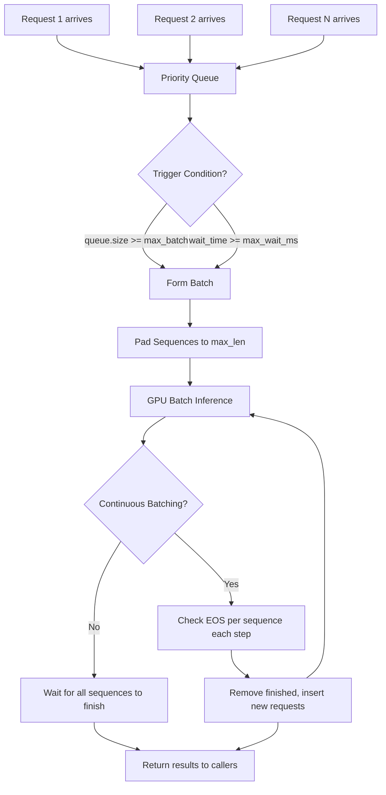

# Dynamic Batching

## Detailed Explanation

Dynamic batching is a serving-layer technique that accumulates multiple incoming inference requests and dispatches them together as a single batch, trading a small increase in per-request latency for a large increase in GPU throughput. Without batching, each request occupies the GPU serially and the majority of GPU compute time is idle waiting for memory transfers — a regime known as memory-bound inference. Batching converts this into a compute-bound regime where the GPU achieves near-peak FLOP utilization.

Static batching (fixed batch size, pad all inputs to the same length) is simple but wasteful: a batch of 32 requests must wait until 32 arrive, and all short sequences are padded to the length of the longest. Dynamic batching solves both problems by triggering a dispatch when either the queue reaches `min_batch` requests OR a `max_wait_ms` deadline fires — whichever comes first.

**Continuous batching** (also called in-flight batching, popularized by Orca 2022) goes further: instead of waiting for the entire batch to finish, it swaps completed sequences out and new sequences in at token-generation boundaries. This eliminates the "head-of-line blocking" problem where a single long request holds back 31 short ones.

The scheduler objective is: `B* = argmax(throughput(B)) s.t. p99_latency(B) ≤ SLA`. In practice, batch sizes of 8–64 hit the Pareto front for most transformer serving workloads. vLLM, TGI, and TensorRT-LLM all implement continuous batching by default.

Misunderstanding dynamic batching is a common source of production latency regressions — engineers set `max_batch_size=256` without setting `max_wait_ms`, causing p99 latency to spike during low-traffic periods.

## Core Intuition

Dynamic batching is the inference equivalent of a bus route: the bus leaves when it's full OR when the scheduled departure time arrives, whichever comes first. Running a taxi for every single passenger is faster for that passenger but crushes the total throughput of the fleet. The scheduler's job is to find the departure interval that maximizes passengers-per-hour without making any passenger wait unreasonably long.

## How It Works

1. **Requests enter a priority queue**: Each request carries a timestamp and sequence length. The scheduler sees the queue depth and oldest request age continuously.
2. **Batch formation trigger**: Dispatch when `queue.size ≥ max_batch_size` OR `time_since_oldest ≥ max_wait_ms`. For continuous batching, also trigger when any in-flight sequence finishes.
3. **Sequence padding within batch**: Pad all sequences to `max(len)` in the batch. Optionally, use length bucketing (group sequences within ±10% of each other) to reduce wasted padding tokens.
4. **Dispatch batch to GPU**: Send the padded token tensor to the model. The GPU processes all sequences in parallel; compute cost scales with `batch_size × seq_len^2` for attention.
5. **Return results to callers**: Demultiplex outputs back to each waiting request. For auto-regressive generation, return each token as it is produced (streaming) or the full sequence (blocking).
6. **Continuous batching — swap sequences at token boundaries**: After each token generation step, check which sequences have hit their EOS token. Remove them from the batch and insert new waiting requests in their slot, reusing the KV cache memory that was freed.

## Architecture / Trade-offs

### Batching Strategy Comparison

| Strategy | Throughput (tokens/s) | p50 Latency | p99 Latency | GPU Utilization | Head-of-Line Blocking |
|---|---|---|---|---|---|
| No batching (serial) | 120 | 80 ms | 90 ms | 15–25% | N/A |
| Static batching (B=32) | 1,800 | 200 ms | 800 ms | 60–70% | Yes |
| Dynamic batching | 2,400 | 150 ms | 400 ms | 75–85% | Partial |
| Continuous batching | 3,600 | 120 ms | 180 ms | 85–95% | No |

(Numbers for LLaMA-7B on A100 80GB, 512-token average output length, mixed 64–1024 token inputs.)

### Batch Size vs Latency vs Throughput (LLaMA-7B, A100)

| Batch Size | Throughput (tokens/s) | p50 Latency (ms) | p99 Latency (ms) | GPU Memory (GB) |
|---|---|---|---|---|
| 1 | 120 | 85 | 95 | 14 |
| 8 | 720 | 110 | 180 | 18 |
| 32 | 2,100 | 160 | 350 | 32 |
| 64 | 3,200 | 250 | 600 | 52 |
| 128 | 3,800 | 480 | 1,400 | OOM (80GB) |

## Interview Q&A

**Q: How do you tune `max_wait_ms` for a service with a 200ms p99 SLA?**
A: Set `max_wait_ms` to no more than 10–15% of the SLA budget (20–30ms for 200ms). At high QPS (>50 req/s) batches fill before the deadline anyway — the parameter only bites during low-traffic windows. Profile queue wait time separately from GPU compute time to verify the budget split.

**Q: What happens to p99 latency when you increase `max_batch_size` from 32 to 128?**
A: p99 latency increases super-linearly because you wait for the longest sequence in a larger batch. At B=128, a single 2048-token request holds back 127 short requests. Continuous batching eliminates this; for static dynamic batching, add an upper length limit per batch or use sequence length bucketing.

**Q: Your GPU utilization drops to 40% despite high QPS. What do you investigate?**
A: Check batch size histogram — if median batch size is 1–2, `max_wait_ms` is too aggressive. Check sequence length variance — high variance means heavy padding waste. Verify tokenization isn't a preprocessing bottleneck starving the GPU queue. For continuous batching, check KV cache fragmentation.

**Q: When does continuous batching hurt compared to static dynamic batching?**
A: Continuous batching adds per-step overhead (EOS checking, sequence swapping, KV cache bookkeeping). For uniform-length outputs (classification, fixed-length generation) this overhead wastes time and static batching is simpler and equally efficient. Use continuous batching only when output length variance is high.

**Q: How do you handle requests with 10x length variance efficiently?**
A: Use sequence length bucketing: define buckets like [0–128], [129–512], [513–2048] and route each request to its bucket queue. Within each bucket, padding waste stays below 20%. Schedule buckets round-robin weighted by occupancy to prevent short-request starvation.

**Q: How would you set `max_batch_size` given a 40GB GPU and a 13B model?**
A: Weights consume ~26GB in fp16. Remaining ~14GB covers KV cache and activations. At 512-token max sequence length, KV cache per sequence ≈ `2 × layers × hidden × seq_len × 2 bytes` ≈ 400MB for a 40-layer model. That gives max batch ≈ 35; set `max_batch_size=32` with 10% safety margin.

## Best Practices

- Always configure both `max_batch_size` AND `max_wait_ms`; setting only one creates pathological behavior (starvation or latency spikes).
- Use continuous batching (vLLM, TGI, TRT-LLM) for production LLM serving — it achieves 2–3x higher throughput than static dynamic batching at the same p99 latency.
- Set `max_wait_ms` to 10–15% of your p99 SLA budget (e.g., 20ms for a 150ms SLA).
- Implement sequence length bucketing (3–5 buckets) to reduce padding waste by 30–50%.
- Monitor batch size distribution in production — if median batch size is consistently 1–2, your traffic is too low to benefit from batching or `max_wait_ms` is too short.
- Cap maximum sequence length per batch (e.g., queue separately inputs >2048 tokens) to prevent a single long request from degrading the entire batch's latency.
- Profile p50, p95, and p99 latency separately — p99 is most sensitive to batching strategy and is typically the SLA metric.
- For variable-output-length workloads (chat, code), use continuous batching with PagedAttention to eliminate KV cache fragmentation.

## Common Pitfalls

- **Pitfall: Setting max_batch_size without max_wait_ms**
  **Symptom:** During low-traffic periods, requests wait indefinitely for a full batch, causing p99 latency of 10–60 seconds.
  **Fix:** Always configure `max_wait_ms=20–50ms` as a hard deadline; batches will be smaller off-peak but no request waits forever.

- **Pitfall: Padding waste from variable-length inputs**
  **Symptom:** GPU utilization is 60% despite a full batch — 40% of compute is spent on padding tokens.
  **Fix:** Implement sequence length bucketing (3–5 buckets). If using FlashAttention 2+, use packed sequences (varlen attention) to eliminate padding entirely.

- **Pitfall: Ignoring KV cache memory when sizing max_batch_size**
  **Symptom:** OOM crashes during peak traffic despite model fitting in GPU memory at low batch sizes.
  **Fix:** Account for KV cache memory per sequence: `2 × layers × head_dim × seq_len × 2 bytes`. Reduce `max_batch_size` to leave 20–30% GPU memory headroom.

- **Pitfall: Not separating queue wait time from model latency in monitoring**
  **Symptom:** p99 reported as 500ms but model forward pass is only 80ms — root cause unclear.
  **Fix:** Instrument separately: queue wait time, batch formation time, GPU compute time, and result return time. `max_wait_ms` adds directly to queue wait.

## Related Concepts

- [29-kv-cache-optimization.md](./29-kv-cache-optimization.md) — KV cache management determines how many sequences fit in a batch
- [33-prefill-decode-disaggregation.md](./33-prefill-decode-disaggregation.md) — separating prefill and decode phases changes batching strategy
- [35-decode-length-prediction.md](./35-decode-length-prediction.md) — predicting output length enables better batch composition
- [49-latency-sla-prediction.md](./49-latency-sla-prediction.md) — predicting per-request latency to meet SLA within batches
- [50-cache-aware-scheduling.md](./50-cache-aware-scheduling.md) — prefix-aware scheduling interacts with dynamic batching queues
