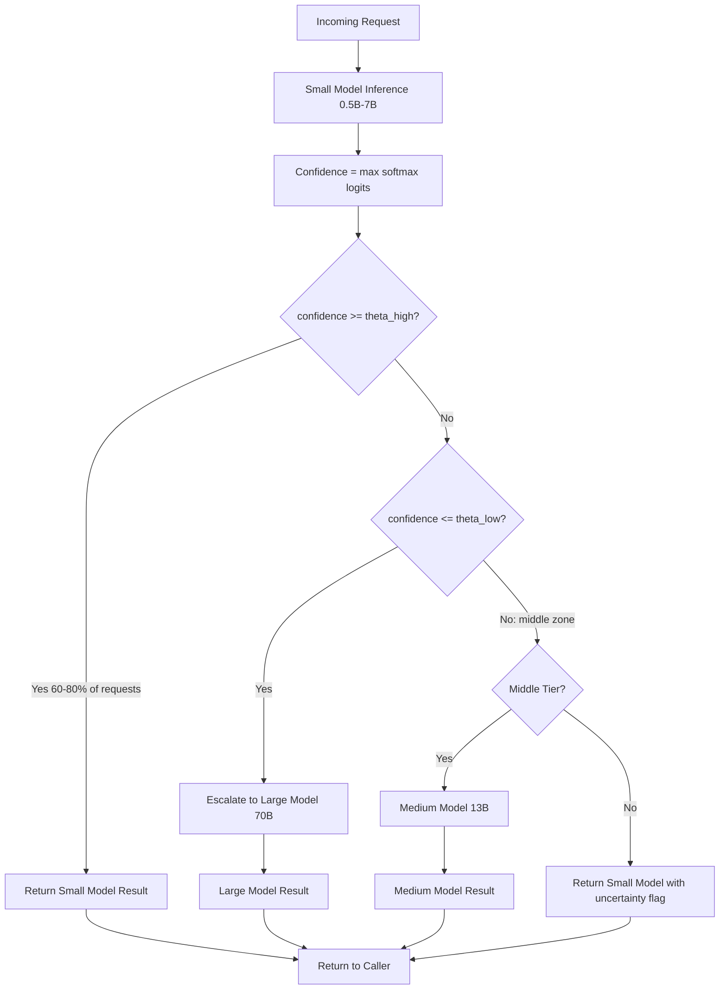

# Model Cascading

## Detailed Explanation

Model cascading is a cost-optimization inference strategy that routes each request through a hierarchy of models ordered by increasing capability and cost, returning a result as soon as any tier produces a sufficiently confident answer. The canonical two-tier system uses a small fast model (e.g., 0.5B or 3B parameters) as the first gate and a large accurate model (e.g., 70B) as the fallback — most requests (60–80%) are resolved cheaply by the small model, yielding dramatic cost reduction with minimal accuracy loss.

The routing decision is confidence-based: compute `confidence = max(softmax(logits))` from the small model. If `confidence ≥ θ_high` (typically 0.90–0.95), return the result immediately. If `confidence ≤ θ_low` (typically 0.50–0.70), escalate directly to the large model. Requests falling between thresholds can be routed to a medium tier or resolved by the small model with logged uncertainty.

Threshold calibration is critical: thresholds are set on a held-out validation set to target 95% accuracy (matching the large model's baseline). Isotonic regression is used to calibrate raw softmax scores into well-calibrated probabilities before thresholding.

The cost equation is: `C_avg = p_small × C_small + p_escalate × (C_small + C_large)`. At 75% small-model resolution, if `C_small = $0.001` and `C_large = $0.02`, average cost drops from $0.02 to ~$0.006 — a 70% reduction.

A common misconception is that model cascading always reduces latency. It does not — escalated requests incur `small_latency + routing_overhead + large_latency` which can be 2–4x longer than direct large-model routing.

## Core Intuition

Model cascading is how triage works in emergency medicine: a nurse quickly assesses each patient (small model) and either discharges the easy cases immediately or escalates complex ones to a specialist (large model). The system is efficient because most cases are straightforward — the specialist's time is reserved only for cases that genuinely need it.

## How It Works

1. **Route request to small model**: The cheap fast model (0.5B–7B parameters) runs first. This costs 5–20ms at batch size 1.
2. **Compute confidence score**: `confidence = max(softmax(logits))`. For classification tasks this is well-defined; for generation tasks use sequence log-probability normalized by length.
3. **Apply high-confidence threshold**: If `confidence ≥ θ_high` → return result immediately. The request is resolved at small-model cost.
4. **Apply low-confidence threshold**: If `confidence ≤ θ_low` → escalate immediately to the large model. The large model processes the original request from scratch.
5. **Optional middle tier**: For `θ_low < confidence < θ_high`, route to a medium model (e.g., 13B) or use the small model result with a logged uncertainty flag.
6. **Calibrate thresholds on validation set**: Binary search `θ_high` and `θ_low` to hit target accuracy (e.g., 95%) while maximizing small-model resolution rate. Re-calibrate when input distribution shifts.

## Architecture / Trade-offs

### Cascade Configuration Comparison

| Configuration | Cost per Query | Accuracy | p50 Latency | p99 Latency | Complexity |
|---|---|---|---|---|---|
| Small model only (7B) | $0.001 | 82% | 30 ms | 60 ms | Low |
| Large model only (70B) | $0.020 | 92% | 180 ms | 350 ms | Low |
| 2-tier cascade (7B→70B) | $0.006 | 91% | 35 ms | 380 ms | Medium |
| 3-tier cascade (7B→13B→70B) | $0.005 | 91.5% | 35 ms | 420 ms | High |

### Confidence Threshold θ_high vs Accuracy vs Escalation Rate

| θ_high | Small-model Resolution | Accuracy (vs large model baseline) | Avg Cost | p99 Latency (ms) |
|---|---|---|---|---|
| 0.70 | 90% | 87% | $0.003 | 380 |
| 0.80 | 82% | 89% | $0.005 | 380 |
| 0.90 | 72% | 91% | $0.007 | 380 |
| 0.95 | 58% | 92% | $0.010 | 380 |
| 0.99 | 30% | 92% | $0.015 | 380 |

## Interview Q&A

**Q: When does a model cascade actually increase latency instead of reducing it?**
A: Any escalated request incurs additive latency: `t_cascade = t_small + t_routing + t_large`. If the large model takes 300ms and the small model takes 30ms, escalated requests take 330ms vs 300ms direct. Cascade only reduces average latency when escalation rate is low (<25%) and most requests resolve cheaply. Always measure and report cascade latency as the full pipeline time, not just individual model times.

**Q: How do you calibrate confidence thresholds in practice?**
A: Collect model outputs on a labeled validation set representative of production traffic. Plot accuracy vs threshold (threshold sweep) and identify the threshold achieving your target accuracy (e.g., 95%). Use isotonic regression to calibrate raw softmax scores into true probabilities first — uncalibrated softmax scores are overconfident and will under-escalate. Re-calibrate after any model update or significant distribution shift.

**Q: What failure mode indicates your thresholds need recalibration?**
A: If small-model resolution rate drops from 75% to 40% without a known input distribution change, the model's confidence distribution has shifted (common after fine-tuning or serving a new query type). Also watch for accuracy drop without escalation rate change — this means the small model is confidently wrong on new input patterns (distribution shift).

**Q: How would you design a cascade for a RAG-based Q&A system?**
A: Use the small model for single-hop factual queries with high-overlap retrieved documents (detected by BM25 score > 0.8) and escalate to the large model for multi-hop reasoning, low-overlap retrievals, or queries requiring synthesis. This is more reliable than raw softmax confidence since generation tasks have poorly calibrated confidence scores.

**Q: What's the cost of miscalibrated thresholds (set too high vs too low)?**
A: Threshold too high (e.g., θ=0.99): almost all requests escalate, cascade adds latency overhead with no cost savings. Threshold too low (e.g., θ=0.50): small model returns low-confidence results, accuracy degrades, users complain. The asymmetry matters: setting θ too low hurts quality visibly; setting θ too high wastes money invisibly. Start at θ=0.90 and adjust based on accuracy/cost monitoring.

**Q: How do you handle the case where escalation rate spikes during peak traffic?**
A: Implement a fallback rate limiter: if escalation rate exceeds 50% for >30 seconds, switch to direct large-model routing for all requests (bypass the cascade) until the small model is recalibrated. This prevents a degenerate cascade from adding latency overhead while not routing correctly.

## Best Practices

- Calibrate thresholds using isotonic regression on validation data before deploying — raw softmax scores are overconfident and will under-escalate.
- Default to θ_high=0.90 and θ_low=0.60 as starting points; sweep the validation set to find task-optimal values.
- Monitor escalation rate continuously in production — it is the primary signal for distribution shift and model degradation.
- Always report cascade latency as the full round-trip (including small model time on escalated requests), not just the large model time.
- For generation tasks (open-ended), use sequence log-probability normalized by length as the confidence signal rather than softmax on the final token.
- Implement a bypass mode for outages: if the small model is unavailable, route all requests directly to the large model to maintain availability.
- Set per-query SLA limits: if a cascaded request is approaching the SLA deadline, abort the large-model call and return a degraded small-model answer with a logged flag.
- Re-calibrate thresholds quarterly or whenever input distribution shifts (detected by KL-divergence monitoring on request feature distributions).

## Common Pitfalls

- **Pitfall: Measuring only individual model latency, not cascade latency**
  **Symptom:** Team reports "cascade reduces latency to 30ms" but users experience 330ms on escalated requests; p99 is worse than direct large-model routing.
  **Fix:** Instrument the full pipeline latency including small model call, confidence check, and escalation path. Report latency as the end-to-end time from request receipt to response sent.

- **Pitfall: Uncalibrated softmax confidence scores**
  **Symptom:** Escalation rate is only 5% but accuracy is well below large model baseline — small model is confidently wrong.
  **Fix:** Apply isotonic regression calibration to map raw softmax scores to true probabilities. Recalibrate whenever the small model is updated or input distribution shifts.

- **Pitfall: No fallback when small model is unavailable**
  **Symptom:** Cascade service goes down completely when the cheap model has an outage, even though the large model is healthy.
  **Fix:** Implement a circuit breaker: if small model error rate exceeds 5% for 60 seconds, bypass the cascade and route all traffic directly to the large model.

- **Pitfall: Using cascade for latency-sensitive applications without measuring escalation penalty**
  **Symptom:** p50 latency improves (most easy requests resolve quickly) but p99 degrades (escalated requests pay double latency).
  **Fix:** Analyze the latency distribution of escalated vs non-escalated requests separately. For strict p99 SLAs, only use cascade if escalation rate is projected below 15%.

## Related Concepts

- [39-router-learning.md](./39-router-learning.md) — learned routing between models as an alternative to confidence thresholding
- [19-ai-gateway-routing.md](./19-ai-gateway-routing.md) — gateway-level routing that implements cascade logic
- [47-dynamic-batching.md](./47-dynamic-batching.md) — batching interactions with cascade (small model batch vs large model batch)
- [52-heterogeneous-ensemble.md](./52-heterogeneous-ensemble.md) — combining model outputs vs selecting one model via cascade
- [13-llm-serving-frameworks.md](./13-llm-serving-frameworks.md) — serving infrastructure that implements cascade routing
