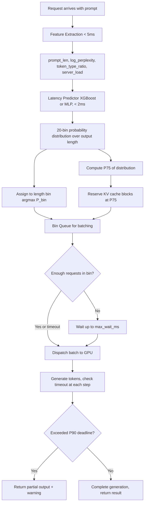

# Latency SLA Prediction

## Detailed Explanation

Latency SLA prediction is the practice of estimating, at request arrival time, how long a particular inference request will take to complete — and using that estimate to make scheduling, resource allocation, and batching decisions before execution begins. Without prediction, serving systems treat all requests uniformly and discover latency violations after the fact. With prediction, the scheduler can proactively reserve appropriate resources, route to faster replicas, or warn the client that a request will exceed its SLA budget.

LLM inference latency is notoriously input-dependent: a 128-token prompt generates output in <100ms, while a 4096-token prompt generating 512 tokens may take 3–10 seconds. The main sources of variation are prompt length, output length (the key unknown), and prompt complexity (perplexity, which correlates with compute time on attention).

The prediction model uses features available at arrival: `[prompt_len, log_perplexity, token_type_ratio, time_of_day, current_server_load]`. A 20-bin soft-label classifier trained with Gaussian-smoothed bin labels outperforms regression for heavy-tailed latency distributions (regression fits the mean; classification fits the percentile distribution).

A critical design choice: **reserve KV cache at P75 of the predicted distribution, not at the mean**. Latency distributions are right-skewed — the mean underestimates the actual 75th percentile by 30–50%. Allocating at P75 eliminates most OOM-driven request drops while wasting only 15–20% memory compared to exact allocation.

Bin batching — grouping requests by predicted length bin before dispatch — yields 20–40% throughput gains because within-bin padding waste is minimized.

## Core Intuition

Predicting inference latency is like a restaurant estimating how long a meal will take before cooking starts. A simple salad is predictably fast; a complex multi-course dish takes longer and needs the right station reserved. Without the estimate, all orders hit the kitchen simultaneously and expensive equipment sits idle while cheap-to-prepare items wait. With the estimate, the kitchen routes orders to the right station in advance and tells the customer approximately when to expect their food.

## How It Works

1. **Extract prompt features at request arrival**: Compute `prompt_len`, `log_perplexity` (using a small reference LM like GPT-2), `token_type_ratio` (fraction of code/special tokens), and server load metrics. This takes <5ms.
2. **Run lightweight latency predictor**: A gradient-boosted tree (XGBoost, 50 trees) or small MLP (3 layers) outputs a 20-bin probability distribution over predicted output length. Inference takes <2ms.
3. **Assign request to length bin**: Each bin covers a latency range (e.g., bin 0 = 0–64 tokens, bin 1 = 65–128, ..., bin 19 = 2048+ tokens). The predicted bin is `argmax(P(bin))`.
4. **Reserve KV cache at P75 of predicted distribution**: Compute the 75th percentile of the predicted length distribution and pre-allocate that many KV cache blocks. This prevents OOM evictions during generation without over-allocating.
5. **Set per-request generation timeout**: Based on the P90 predicted latency, set a hard deadline. If the request exceeds this deadline, stop generation and return partial output with a warning.
6. **Batch requests within the same length bin**: Group same-bin requests together before dispatching to GPU. Within-bin padding waste drops to <15% vs 50% for mixed-length batches, yielding 20–40% throughput improvement.

## Architecture / Trade-offs

### Predictor Approach Comparison (LLaMA-13B serving, mixed workload)

| Predictor Type | Predictor Latency | MAE (tokens) | OOM Rate | Throughput Gain | Training Cost |
|---|---|---|---|---|---|
| No predictor (uniform allocation) | 0 ms | N/A | 8% | 0% baseline | None |
| Linear regression on prompt_len | 1 ms | 120 tokens | 5% | 10% | Minimal |
| 20-bin classifier (XGBoost) | 2 ms | 65 tokens | 1.5% | 25% | 1 hour |
| 20-bin + calibration (isotonic) | 3 ms | 65 tokens | 0.8% | 28% | 2 hours |
| BERT-based predictor | 25 ms | 45 tokens | 0.5% | 15% (overhead eats gain) | Days |

### KV Cache Reservation Percentile vs Performance

| Reservation Percentile | OOM Rate | Wasted Memory | Throughput | p99 Latency |
|---|---|---|---|---|
| P50 (mean) | 12% | 5% | 85 tokens/s | 800 ms |
| P75 | 1.5% | 18% | 110 tokens/s | 420 ms |
| P90 | 0.3% | 35% | 95 tokens/s | 380 ms |
| P99 | 0.05% | 55% | 75 tokens/s | 370 ms |
| Max (over-allocate) | 0% | 80% | 55 tokens/s | 360 ms |

## Interview Q&A

**Q: Why reserve KV cache at P75 instead of at the mean predicted output length?**
A: Output length distributions are right-skewed (heavy tail) — the mean consistently underestimates the 75th percentile by 30–50%. Allocating at the mean causes 10–15% of requests to exceed their reserved KV cache, triggering expensive reallocation or request drops. P75 reduces OOM rate from ~12% to ~1.5% while wasting only 18% of memory — the sweet spot of the OOM vs waste trade-off.

**Q: Your predictor achieves low MAE on the test set but OOM rates remain high in production. What's wrong?**
A: The likely cause is distribution shift between training data and production traffic. Output length distributions change with user behavior, new query types, or seasonal patterns. Check if the training set captured the tail of the distribution — if training data had max 512 output tokens but production generates up to 2048, the predictor never learned to predict the tail. Retrain periodically on recent production logs.

**Q: How do you train the 20-bin classifier when the training data has highly imbalanced bins?**
A: Apply class weighting inversely proportional to bin frequency. Use Gaussian-smoothed soft labels (assign probability mass to adjacent bins) — this prevents the model from ignoring rare bins and improves calibration on the distribution tails. Also oversample the tail bins (>1024 token outputs) which are rare but expensive.

**Q: What happens if the predictor latency is 25ms (e.g., BERT-based) on a service with 100ms p50 latency target?**
A: The 25ms predictor overhead consumes 25% of the total latency budget before inference even starts. As the trade-off table shows, BERT-based predictors increase throughput by 15% but the overhead often exceeds the gain at high-QPS services. Use lightweight predictors (XGBoost, small MLP, <5ms) — the accuracy improvement of BERT-level features rarely justifies the overhead.

**Q: How would you use latency prediction to implement admission control during traffic spikes?**
A: At request arrival, estimate the resource cost of the request (predicted output length × cost_per_token). Maintain a rolling 10-second budget of available GPU tokens/s. If admitting the current request would exceed the budget, return HTTP 429 (rate limited) with a retry-after header. This prevents cascade failure — without admission control, overloaded servers queue all requests and all experience timeouts; with it, some requests are quickly rejected while others are served within SLA.

**Q: When would you skip latency prediction entirely?**
A: When input lengths are highly uniform (e.g., a classification endpoint where all prompts are 100–150 tokens and outputs are always 1 token). Prediction overhead (2–5ms) isn't justified when variance is <10%. Also skip for internal batch jobs with no SLA requirement where maximizing throughput is the only objective.

## Best Practices

- Train the predictor on recent production logs (last 7–30 days) rather than synthetic data; output length distributions are workload-specific and change over time.
- Use Gaussian-smoothed bin labels for the 20-bin classifier to prevent ignoring rare tail bins; set sigma=1.5 bins for smooth calibration.
- Reserve KV cache at P75 of the predicted output length distribution — this is the sweet spot minimizing OOM rate without excessive memory waste.
- Keep predictor inference latency below 5ms (XGBoost or 3-layer MLP); heavier models (BERT-based) add overhead that outweighs accuracy gains.
- Log predicted vs actual output length for every request; compute MAE and percentile error weekly to detect distribution drift.
- Retrain predictor monthly or when MAE degrades by >20% on a recent validation window.
- Implement per-bin queues (20 queues) and dispatch same-bin batches together — this reduces padding waste from 40–60% to <15%.
- Set per-request generation timeouts at P90 predicted latency and return partial output with a clear warning flag rather than hanging indefinitely.

## Common Pitfalls

- **Pitfall: Using mean prediction for KV cache reservation**
  **Symptom:** OOM rate of 10–15%, frequent request drops during bursts of long-output queries.
  **Fix:** Switch reservation to P75 percentile of the predicted distribution. Output lengths are right-skewed; mean consistently underestimates resource needs.

- **Pitfall: Training predictor on data that doesn't represent the tail**
  **Symptom:** Predictor achieves good MAE overall but completely misses 2048-token outputs; OOM rate remains high for complex queries.
  **Fix:** Ensure training data includes at least 1000 examples from each length bin. Oversample the tail (>1024 tokens). Apply Gaussian-smoothed soft labels to improve tail calibration.

- **Pitfall: Using a slow predictor (>20ms) and losing the throughput benefit**
  **Symptom:** Bin batching improves throughput by 20%, but predictor overhead of 25ms increases p50 latency from 80ms to 105ms — net negative.
  **Fix:** Profile predictor latency independently. Keep it below 5ms using XGBoost or a tiny MLP. The goal is overhead < 5% of total request latency.

- **Pitfall: Not monitoring predictor accuracy drift**
  **Symptom:** OOM rates and padding waste gradually increase over 2–3 months without any code changes.
  **Fix:** Log predicted vs actual output length for every request. Set alerts when P75 calibration error exceeds 20%. Retrain predictor on a 30-day rolling window of production logs.

## Related Concepts

- [47-dynamic-batching.md](./47-dynamic-batching.md) — latency prediction enables smarter batch formation
- [35-decode-length-prediction.md](./35-decode-length-prediction.md) — predicting decode length specifically, a related problem
- [29-kv-cache-optimization.md](./29-kv-cache-optimization.md) — KV cache allocation uses predicted lengths
- [50-cache-aware-scheduling.md](./50-cache-aware-scheduling.md) — scheduling decisions depend on latency predictions
- [33-prefill-decode-disaggregation.md](./33-prefill-decode-disaggregation.md) — disaggregated systems need per-phase latency predictions
