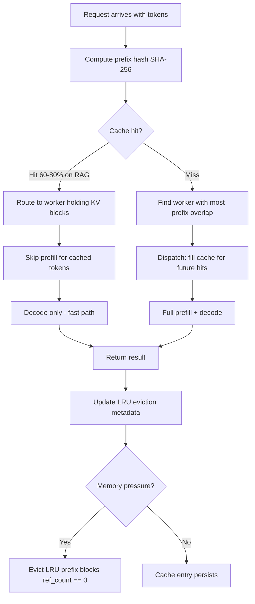

# Cache-Aware Scheduling

## Detailed Explanation

Cache-aware scheduling is a request-dispatching strategy that groups and orders inference requests to maximize KV cache reuse, reducing redundant computation and memory traffic. In transformer inference, the KV (key-value) cache stores the intermediate attention outputs for every prompt token — recomputing these for repeated prefix content is wasteful. Cache-aware scheduling detects shared prefixes across requests and routes them to the same GPU worker where the relevant KV blocks are already resident.

The technique is especially impactful for workloads with high prefix overlap: RAG systems (all requests share a system prompt + retrieved docs prefix), multi-turn conversations (each turn shares the full conversation history), and batch processing (multiple queries against the same document). In these scenarios, hit rates of 60–80% are achievable, translating directly to 40–70% latency reduction for cache-hit requests.

The core algorithm: (1) compute a prefix hash (SHA-256 of the first k tokens) for each request; (2) check a server-side prefix cache mapping hashes to KV memory blocks; (3) route cache-hit requests to workers holding the matching blocks; (4) schedule cache-miss requests to fill idle capacity.

**Copy-on-write (CoW)** handles the case where multiple requests share the same prefix but diverge thereafter — the shared prefix KV blocks are reference-counted and not duplicated until a sequence starts modifying them. This is the same mechanism as vLLM's PagedAttention.

LRU eviction with reference counting ensures popular prefixes (e.g., the system prompt, seen in 100% of requests) are never evicted, while rare prefixes are cleaned up when memory pressure occurs.

## Core Intuition

Cache-aware scheduling is like a library where books (KV blocks) are kept on the desk of whoever recently used them. When multiple students need the same reference book, the librarian assigns them all to the same desk instead of fetching separate copies. The librarian never sends a student to a desk that doesn't have their book — that would defeat the purpose.

## How It Works

1. **Compute prefix hash on arrival**: Hash the request's token prefix using SHA-256: `h = SHA256(tokens[:k])`. The prefix length k is typically the system prompt length or a fixed window (e.g., 512 tokens). This takes <1ms.
2. **Check prefix cache**: Perform an O(1) hash table lookup. A cache hit means some worker already has the KV blocks for this prefix resident in GPU memory.
3. **Route cache hits to matching workers**: Dispatch the cache-hit request to the specific GPU worker holding the matching KV blocks. The worker skips prefill for the cached prefix — latency drops by `(cached_tokens / total_tokens) × prefill_time`.
4. **Group cache-miss requests by prefix similarity**: For requests that miss the cache, compute prefix similarity and batch misses with the same prefix together. The first request in a group fills the cache; subsequent requests in the same dispatch window hit it.
5. **LRU eviction with reference counting**: When GPU memory pressure occurs, evict the least recently used prefix blocks. Active sequences (reference count > 0) are never evicted. The system prompt (reference count = 100% of requests) is pinned permanently.
6. **Copy-on-write for diverging sequences**: Two requests sharing prefix P diverge when they start generating. The prefix KV blocks are reference-counted; each sequence gets its own copy only when it writes beyond the shared prefix — saving memory proportional to shared prefix length.

## Architecture / Trade-offs

### Scheduling Strategy Comparison (RAG workload, 10% unique prefix variance)

| Strategy | Cache Hit Rate | p50 Latency | p99 Latency | Throughput | Memory Overhead |
|---|---|---|---|---|---|
| No caching (round-robin) | 0% | 320 ms | 900 ms | 100 tokens/s | 0% |
| Simple KV cache (no routing) | 10–20% | 280 ms | 850 ms | 115 tokens/s | 5% |
| Prefix-aware routing | 60–75% | 120 ms | 400 ms | 180 tokens/s | 15% |
| Prefix-aware + CoW sharing | 60–75% | 110 ms | 380 ms | 200 tokens/s | 10% |

### Cache Size (as fraction of GPU memory) vs Performance

| Cache Fraction | Hit Rate | Throughput (tokens/s) | Eviction Rate (/min) | Effective Memory |
|---|---|---|---|---|
| 5% | 25% | 130 | High (>100/min) | Low |
| 10% | 45% | 155 | Medium (30/min) | Medium |
| 20% | 65% | 190 | Low (5/min) | Good |
| 30% | 72% | 200 | Very low (<1/min) | Near-optimal |
| 40% | 73% | 198 | Near-zero | Diminishing returns |

## Interview Q&A

**Q: Why use SHA-256 for prefix hashing instead of CRC32 or MD5?**
A: At production scale (millions of requests/day), CRC32's 32-bit hash space produces meaningful collision rates (~1 collision per 65K requests). A hash collision causes the scheduler to route a request to the wrong KV cache, silently returning incorrect results. SHA-256 has a 256-bit space — collisions are cryptographically negligible (2^{-128} probability per pair). MD5 is also acceptable for this use case but SHA-256 is the standard and has hardware acceleration on modern CPUs.

**Q: How does copy-on-write (CoW) reduce memory in a multi-turn conversation system?**
A: In a 10-turn conversation, turns 1–9 form the shared prefix for turn 10. Without CoW, each active conversation session maintains a full copy of all historical KV blocks. With CoW, all sessions sharing the same prefix reference the same physical KV blocks until they diverge (at the current turn). For 1000 concurrent sessions with 90% shared prefix, CoW reduces KV memory by up to 90× for the shared portion.

**Q: Your cache hit rate drops from 70% to 20% after a product change. What happened?**
A: The most likely causes are: (1) the system prompt changed, invalidating all existing cache entries; (2) a new feature introduced per-user personalization in the prefix, making prefixes unique per user; (3) request routing was changed to round-robin (bypassing prefix-aware routing). Check the prefix hash distribution — if prefixes are now nearly all unique, coarse-level caching won't help and you need a different strategy (per-user prefix caching or segment-level caching).

**Q: How do you handle a workload where each request has a completely unique prefix?**
A: Cache-aware scheduling provides no benefit for fully unique prefixes — hit rate is 0% by definition. In this case, focus on other optimizations: quantization to reduce KV cache size per token, speculative decoding to reduce generation steps, or continuous batching to maximize GPU utilization. Cache-aware scheduling is most valuable when prefix overlap is >30%.

**Q: How do you prevent the system prompt from being evicted under memory pressure?**
A: Implement prefix pinning: mark the system prompt KV blocks as pinned (eviction-eligible = false). Pinned blocks are excluded from LRU eviction regardless of memory pressure. This is safe because the system prompt is accessed by 100% of requests — its effective reference count is always >0. Limit pins to blocks accessed by >80% of requests to prevent the pinned set from consuming too much memory.

**Q: What's the interaction between cache-aware scheduling and dynamic batching?**
A: Prefix routing can conflict with dynamic batching — if all cache-hit requests for prefix A are routed to worker 0, worker 0 may be overloaded while workers 1–3 are idle. Implement load-aware routing: prefer the worker holding the cache for prefix A, but fall back to the least-loaded worker if the cache-holding worker is >80% utilized. This sacrifices some cache hit rate (~10%) for better load balance.

## Best Practices

- Use SHA-256 (not CRC32 or MurmurHash) for prefix hashing — hash collisions at scale corrupt KV cache and are extremely difficult to debug.
- Allocate 20–30% of GPU memory for prefix cache; below 10% gives diminishing hit rates and above 35% yields marginal gains while reducing capacity for active sequences.
- Pin the system prompt KV blocks (mark eviction-ineligible) — it appears in 100% of requests and evicting it eliminates the cache benefit entirely.
- Implement reference counting on all cached KV blocks; never evict blocks with active references to avoid corrupting in-flight sequences.
- Use copy-on-write for multi-turn conversations to share prefix KV memory across sessions — reduces KV memory by 50–90% for long conversation histories.
- Monitor cache hit rate per prefix hash cluster, not just globally; a global 60% hit rate can hide that one cluster is 90% and another is 5%.
- Combine prefix routing with load balancing: prefer the cache-holding worker but fall back to the least-loaded worker when the holder is overloaded (>80% GPU utilization).
- Segment large prefixes into chunks (512 tokens per segment) so partial prefix matches still yield cache hits even when the full prefix doesn't match.

## Common Pitfalls

- **Pitfall: Using CRC32 hash causing silent cache corruption**
  **Symptom:** Occasional incorrect outputs that are difficult to reproduce; users report responses that don't match their conversation history.
  **Fix:** Switch to SHA-256. CRC32's 32-bit space has ~1 collision per 65K hash pairs, which at production scale produces detectable corruption rates.

- **Pitfall: Cache routing that ignores load balancing**
  **Symptom:** One worker is at 95% GPU utilization (all cache hits routing to it) while others are at 30%, causing p99 latency spikes from the overloaded worker.
  **Fix:** Add load-aware routing: route to the cache-holding worker only if its utilization is below 70%; otherwise route to the least-loaded worker and accept a cache miss.

- **Pitfall: System prompt KV blocks being evicted under memory pressure**
  **Symptom:** Cache hit rate drops to near-zero during traffic spikes even for workloads with 100% shared system prompt.
  **Fix:** Pin the system prompt blocks with a no-evict flag. These blocks should never leave the cache — they are the most valuable cached content.

- **Pitfall: Not invalidating cache after system prompt or model update**
  **Symptom:** After a system prompt change, the cache serves stale KV blocks computed for the old prompt, causing subtly incorrect outputs for hours until natural LRU eviction.
  **Fix:** Implement cache versioning keyed to the system prompt hash. When the system prompt changes, increment the version — old entries are treated as misses without explicit deletion.

## Related Concepts

- [29-kv-cache-optimization.md](./29-kv-cache-optimization.md) — KV cache structure and memory management that prefix caching builds on
- [47-dynamic-batching.md](./47-dynamic-batching.md) — batching interacts with prefix routing decisions
- [33-prefill-decode-disaggregation.md](./33-prefill-decode-disaggregation.md) — prefill disaggregation is complementary to prefix caching
- [49-latency-sla-prediction.md](./49-latency-sla-prediction.md) — SLA prediction uses cache hit predictions as a feature
- [05-advanced-rag-patterns.md](./05-advanced-rag-patterns.md) — RAG workloads are the primary beneficiary of cache-aware scheduling
