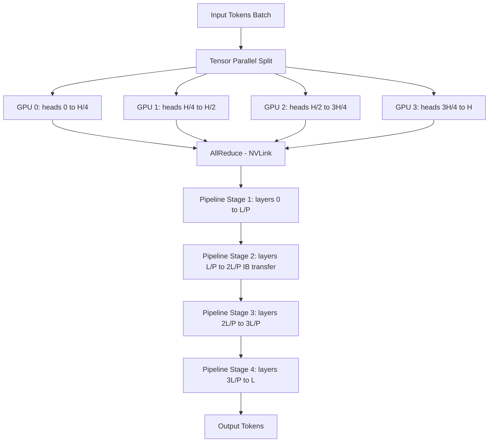

# Distributed Inference

## Detailed Explanation

Distributed inference partitions a model across multiple GPUs or nodes so that models too large for a single device can be served, and large models on multiple devices can achieve higher throughput than a single accelerator. It is required for any model exceeding single-GPU memory (e.g., 70B parameters require ~140GB in fp16, exceeding the 80GB limit of a single A100).

The three primary parallelism strategies are: **tensor parallelism (TP)**, **pipeline parallelism (PP)**, and **sequence parallelism (SP)**. These are often combined: TP within a node (using fast NVLink) and PP across nodes (using slower InfiniBand).

**Tensor parallelism** splits individual weight matrices across GPUs. For multi-head attention, each GPU holds a subset of attention heads (`head_i → GPU_{i mod TP_degree}`). After each layer, an AllReduce operation aggregates the partial results. TP requires high-bandwidth inter-GPU communication and is therefore limited to within-node deployments (NVLink: 600 GB/s; IB: 400 Gb/s).

**Pipeline parallelism** assigns consecutive transformer layers to different GPUs: GPU_0 handles layers 0–L/P, GPU_1 handles layers L/P to 2L/P, etc. Activations are streamed between GPUs at layer boundaries. The key challenge is **bubble overhead** — GPUs sit idle at pipeline startup and drain: `bubble_fraction = (P-1)/(M+P-1)` where P is pipeline depth and M is micro-batch count. At P=4 and M=4, bubble fraction = 3/7 ≈ 43% — unacceptably high. Increasing M to 16 reduces it to 3/19 ≈ 16%.

**Expert parallelism** is used specifically for Mixture-of-Experts (MoE) models — each GPU holds a subset of expert FFN layers, and tokens are routed to the appropriate GPU.

A critical practical rule: use TP for intra-node (NVLink bandwidth sufficient for AllReduce) and PP for inter-node (pipeline communication is point-to-point activation transfer, requiring only 1/P-fraction of TP's bandwidth).

## Core Intuition

Distributed inference is like a factory assembly line: tensor parallelism means multiple workers on the same workbench each building a part of the same component simultaneously (requires constant coordination), while pipeline parallelism means different workbenches each doing one stage of assembly and passing the part along (requires no coordination within a stage, but the line runs at the slowest stage's speed). The best factories use both: parallel workers at each stage, and multiple stages in sequence.

## How It Works

1. **Choose parallelism configuration**: Select TP degree based on GPU count within a node and model head count. Choose PP degree based on number of nodes. Rule: TP = min(num_GPUs_per_node, num_attention_heads); PP = num_nodes. Combined: total GPUs = TP × PP.
2. **Tensor parallelism — split weight matrices**: For attention, each GPU holds `num_heads / TP` complete attention heads. For FFN layers, split the weight matrix by column (first linear) and by row (second linear). Each GPU computes a partial dot product.
3. **AllReduce for TP communication**: After each TP layer, trigger AllReduce to sum partial results across all TP GPUs. This synchronizes hidden states. Cost: 2 × hidden_size × batch_size × 2 bytes × (TP-1)/TP — approximately 100–400 MB per layer at TP=8.
4. **Pipeline parallelism — layer assignment**: Assign transformer layers evenly to PP stages: `stage_k = layers[k*L/P : (k+1)*L/P]`. GPU_{k} receives activations from GPU_{k-1}, processes its layers, sends activations to GPU_{k+1}.
5. **Micro-batching to fill pipeline bubbles**: Split each macro-batch into M micro-batches. GPU_0 processes micro-batch 1, then immediately starts micro-batch 2 while GPU_1 is processing micro-batch 1 — the pipeline is continuously occupied. Bubble fraction: `(P-1)/(M+P-1)`. Target M ≥ 4×P to achieve <20% bubble.
6. **KV cache distribution**: Under TP, KV cache is split across TP GPUs (each GPU stores KV for its subset of heads). Under PP, each GPU stores KV only for its assigned layers — total KV memory scales with num_layers/PP per GPU.

## Architecture / Trade-offs

### Tensor Parallelism Degree vs Performance (LLaMA-70B, A100 cluster)

| TP Degree | Memory/GPU (GB) | Throughput (tokens/s) | Latency (ms) | AllReduce Overhead | Notes |
|---|---|---|---|---|---|
| 1 (single GPU) | OOM (140GB) | N/A | N/A | 0% | Doesn't fit |
| 2 | 72 GB | 380 | 220 ms | 3% | Fits on 80GB A100s |
| 4 | 37 GB | 620 | 165 ms | 8% | Sweet spot intra-node |
| 8 | 20 GB | 750 | 150 ms | 18% | Diminishing returns |

### Pipeline Parallelism Depth vs Bubble Overhead

| PP Depth | Micro-batches (M) | Bubble Fraction | Throughput vs PP=1 | IB Bandwidth Required |
|---|---|---|---|---|
| 1 | 1 | 0% | 100% | 0 |
| 2 | 4 | 20% | 160% | 50 Gb/s |
| 4 | 8 | 30% | 280% | 50 Gb/s |
| 4 | 16 | 16% | 310% | 50 Gb/s |
| 8 | 32 | 18% | 540% | 100 Gb/s |

## Interview Q&A

**Q: When would you choose tensor parallelism over pipeline parallelism?**
A: Use TP when you have multiple GPUs within a single node connected by NVLink (600 GB/s bandwidth) — the AllReduce overhead is small relative to compute. Use PP when scaling across nodes over InfiniBand (200–400 Gb/s) — PP's point-to-point activation transfer requires far less bandwidth than TP's AllReduce. In practice, use both: TP within each node, PP across nodes.

**Q: Your pipeline-parallel system has 60% GPU utilization despite sufficient input. What's the issue?**
A: High bubble overhead. With PP=4 and M=1 micro-batch, bubble fraction = 3/4 = 75% — GPUs are idle 75% of the time. Increase micro-batch count to M=16: bubble drops to 3/19 ≈ 16%. Alternatively, use interleaved pipeline scheduling (each stage holds alternating layer blocks) which halves bubble at the cost of double inter-stage communication.

**Q: How does tensor parallelism affect KV cache size per GPU?**
A: Under TP, each GPU holds `num_heads / TP_degree` attention heads. The KV cache for each head is stored on the GPU holding that head. So total KV cache size per GPU scales as `1/TP_degree` of the full model's KV cache. For LLaMA-70B at TP=4, KV cache per GPU drops to 25% of the single-GPU requirement, which is a major reason TP enables serving larger batch sizes.

**Q: You need to serve a 70B model on 8 GPUs. How do you partition?**
A: 70B in fp16 = ~140GB. 8 × A100 80GB = 640GB available. Options: (1) TP=8 within a single 8-GPU node — each GPU holds 17.5GB of weights, high NVLink bandwidth available, simple setup. (2) TP=4 × PP=2 if splitting across two 4-GPU nodes — within-node NVLink for TP, IB for PP. Option 1 is preferred if all 8 GPUs are in the same node; option 2 if they span two nodes.

**Q: What is sequence parallelism and when do you use it?**
A: Sequence parallelism splits the sequence length dimension across GPUs during attention computation — each GPU processes a subset of tokens. It's complementary to TP (which splits the head dimension). SP is used for extremely long sequences (>32K tokens) where the attention matrix itself doesn't fit in a single GPU's memory. Combined SP+TP is the standard approach for long-context serving (e.g., 128K context Llama 3.1).

**Q: How does pipeline parallelism handle variable-length sequences in a batch?**
A: All sequences in a micro-batch must be padded to the same length before being passed through the pipeline, because activation tensors must have fixed dimensions to be transferred between stages. Under continuous batching with PP, sequences finishing mid-pipeline are handled by inserting dummy tokens to maintain tensor shape, then the scheduler swaps in new sequences at the next micro-batch boundary.

## Best Practices

- Use TP within node (NVLink) and PP across nodes (InfiniBand) — mixing them across the wrong boundaries dramatically increases communication overhead.
- Target M ≥ 4×P micro-batches to keep pipeline bubble fraction below 20%; below M=4, bubble overhead dominates and PP degrades throughput.
- Profile AllReduce time as a fraction of layer compute time before adding TP GPUs — if AllReduce > 20% of layer time, adding more TP GPUs will hurt, not help.
- Pin the system prompt prefix to a shared KV cache accessible by all PP stages to avoid recomputing it at each stage.
- Use fp8 or int8 quantization for weights during distributed inference to halve the inter-stage activation transfer size and reduce AllReduce volume.
- Monitor GPU utilization per device — healthy distributed inference shows >80% GPU utilization on all devices simultaneously; gaps indicate pipeline bubbles or load imbalance.
- For MoE models, use expert parallelism (EP): route tokens to GPUs holding the expert they need, then gather results — combine with TP for the attention layers.

## Common Pitfalls

- **Pitfall: Using pipeline parallelism with too few micro-batches**
  **Symptom:** GPU utilization is 30–50% despite enough input data; throughput scales poorly with more GPUs.
  **Fix:** Increase micro-batch count M to at least 4×P. At PP=4 and M=4, bubble is 43%; at M=16, it drops to 16%. Alternatively, use interleaved 1F1B scheduling.

- **Pitfall: Applying tensor parallelism across nodes over InfiniBand**
  **Symptom:** Inference latency is 3–5x higher than expected; AllReduce operations dominate profiling traces.
  **Fix:** TP AllReduce requires O(B × hidden × TP) bandwidth per layer — IB (200 Gb/s) can't sustain this for large models. Keep TP intra-node on NVLink; use PP across nodes.

- **Pitfall: Not accounting for activation memory in TP split**
  **Symptom:** OOM errors despite weights fitting comfortably per GPU.
  **Fix:** Activation memory scales with batch size × seq_len × hidden and is NOT split by TP (activations are replicated across TP GPUs before AllReduce). Account for activation memory separately when sizing TP degree.

- **Pitfall: Uneven layer distribution causing pipeline stage imbalance**
  **Symptom:** One pipeline stage is the bottleneck — all other GPUs wait for it; GPU utilization varies widely across stages.
  **Fix:** Profile per-layer compute time and rebalance layer assignment so each stage has equal compute. The first and last stages often have extra overhead (embedding, LM head) — assign them fewer transformer layers.

## Related Concepts

- [29-kv-cache-optimization.md](./29-kv-cache-optimization.md) — KV cache partitioning changes under tensor parallelism
- [33-prefill-decode-disaggregation.md](./33-prefill-decode-disaggregation.md) — disaggregation interacts with distributed inference topology
- [26-mixture-of-experts.md](./26-mixture-of-experts.md) — MoE models use expert parallelism, a variant of distributed inference
- [11-flash-attention.md](./11-flash-attention.md) — FlashAttention is essential for efficient attention in distributed settings
- [47-dynamic-batching.md](./47-dynamic-batching.md) — micro-batch formation for pipeline parallelism resembles dynamic batching
