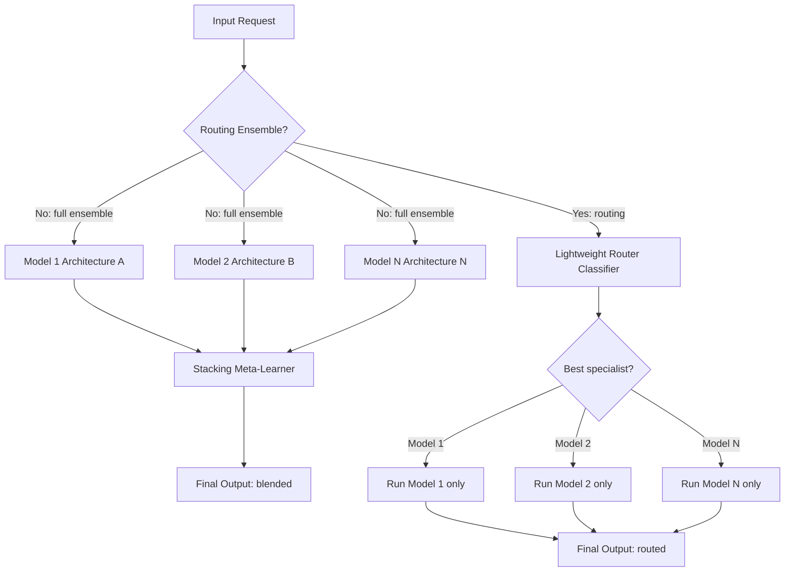

# Heterogeneous Ensemble

## Detailed Explanation

A heterogeneous ensemble combines predictions from multiple models that differ in architecture, training data, size, or training procedure, then merges their outputs to achieve higher accuracy than any individual model. The key theoretical insight is that ensemble gains scale with **diversity** — how often the models disagree on errors. Two identical models in an ensemble provide no benefit; two models that each fail on different inputs can together cover the weaknesses of both.

The three main combination strategies are: (1) **averaging** — simple mean of probabilities, robust but ignores model quality differences; (2) **stacking** — a meta-learner (logistic regression or small MLP) trained on base model outputs on a held-out set, learning to weight models by their relative strengths on different input types; and (3) **routing ensembles** — a learned classifier that sends each request to the single best specialist model rather than running all models.

The diversity metric: `D = (1/|M|²) Σ_{i≠j} (1 - cos_sim(f_i(x), f_j(x)))` measures pairwise prediction disagreement. A model is redundant if `D(m_i, m_j) < 0.1` for any existing ensemble member `m_j` — adding it provides negligible accuracy gain at full cost.

Routing ensembles offer the best cost-accuracy trade-off for production: instead of running 5 models at 5x cost, a cheap router model selects one specialist, achieving near-ensemble accuracy at single-model cost. This is the approach used by Mixtral (routing to expert FFNs) and multi-model gateways.

A critical misconception: **correlated models kill the ensemble benefit**. Fine-tuning the same base model on the same data with different random seeds produces highly correlated models — ensemble gain is negligible. True diversity requires different architectures, training objectives, or data distributions.

## Core Intuition

A heterogeneous ensemble is like a medical second-opinion panel: having three different types of specialists examine a patient (radiologist, cardiologist, internist) is far more valuable than having three cardiologists. The value comes from each specialist catching what the others miss, not from having three people agree on the same things. A panel of three identical cardiologists gives the same answer as one — the redundancy adds no diagnostic power.

## How It Works

1. **Train diverse base models**: Ensure diversity across architectures (transformer vs convolutional), training data (different sources, different augmentation), training objectives (supervised vs contrastive vs self-supervised), or random seeds with different fine-tuning tasks. At least two distinct architectural families should be represented.
2. **Measure pairwise disagreement**: Compute prediction disagreement on a validation set: `D(i,j) = mean_x(f_i(x) ≠ f_j(x))` for classification, or `1 - cos_sim(f_i(x), f_j(x))` for embedding models. Reject any model with D < 0.1 with any existing member.
3. **Train meta-learner (stacking)**: Hold out 10–20% of training data. Generate each base model's prediction vector (probabilities or embeddings) on this held-out set. Train a logistic regression or 2-layer MLP on these stacked predictions as inputs, true labels as targets. This learns per-model reliability by input type.
4. **Inference — run all base models**: At inference, run each base model in parallel. Collect raw prediction vectors. This step costs `N_models × single_model_latency` if run sequentially or `max(individual_latencies)` if run in parallel.
5. **Meta-learner combines outputs**: The trained meta-learner takes the stacked predictions as input and produces a final output. For routing ensembles, it produces a single selector rather than a blend.
6. **Optional routing — select single specialist**: For cost-sensitive deployment, replace the meta-learner with a routing classifier. Route each request to the predicted best specialist. Average cost: `single_model_cost + router_cost (typically <5% of model cost)`.

## Architecture / Trade-offs

### Ensemble Combination Strategy Comparison

| Strategy | Accuracy Gain | Latency | Cost | Interpretability | Training Complexity |
|---|---|---|---|---|---|
| Single best model | Baseline | 80 ms | $0.010/q | High | Low |
| Simple averaging (3 models) | +2–4% | 240 ms | $0.030/q | Medium | Low |
| Weighted averaging | +3–5% | 240 ms | $0.030/q | Medium | Low |
| Stacking (LR meta-learner) | +4–7% | 250 ms | $0.031/q | Low | Medium |
| Routing ensemble | +3–5% | 85 ms | $0.011/q | Medium | High |

### Number of Ensemble Members vs Accuracy vs Cost

| Members | Accuracy (MMLU) | p50 Latency (ms) | Cost (relative) | Marginal Gain |
|---|---|---|---|---|
| 1 | 78.5% | 80 | 1.0x | — |
| 3 | 82.1% | 80 (parallel) | 3.0x | +3.6% |
| 5 | 83.4% | 80 (parallel) | 5.0x | +1.3% |
| 10 | 84.0% | 80 (parallel) | 10.0x | +0.6% |
| 10 (routing) | 83.1% | 85 | 1.1x | — |

## Interview Q&A

**Q: How do you decide whether a new model adds value to an existing ensemble?**
A: Measure pairwise prediction disagreement on a held-out validation set: `D = mean(f_new(x) ≠ f_existing(x))`. If D < 0.1, the new model is highly correlated with existing members and adds negligible accuracy gain at full compute cost — reject it. Only add a model if it fails on different inputs than existing members (D > 0.15 on error cases specifically).

**Q: Why does fine-tuning the same base model twice with different random seeds produce a poor ensemble?**
A: Same base model → same learned features and failure modes. Different random seeds change only the optimization trajectory, not the model's fundamental knowledge or blind spots. Both fine-tuned copies will fail on the same hard examples (those requiring knowledge not in the base model). True ensemble diversity requires different architectures, pre-training data, or training objectives.

**Q: When would you use routing ensemble instead of averaging ensemble?**
A: Use routing when (1) latency is critical — routing adds only 5ms overhead vs 3x latency for averaging; (2) models are specialists (e.g., one model is best for code, another for math); (3) cost is the primary constraint. Use averaging when (1) accuracy is critical over cost; (2) models have similar cost; (3) you want uncertainty estimates (variance of predictions = prediction confidence). Routing is almost always preferred in production; averaging for high-stakes or calibration-sensitive applications.

**Q: Your ensemble accuracy is only 0.5% better than the best single model despite using 5 models. What went wrong?**
A: The models are highly correlated. Check pairwise disagreement — if it's below 0.10, you have near-identical models. Possible causes: all models fine-tuned from the same base model, same training data, same hyperparameters. Rebuild with architecturally distinct models (e.g., GPT-style + BERT-style + retrieval-augmented), or use different training objectives (supervised + contrastive + self-supervised).

**Q: How do you train the stacking meta-learner without data leakage?**
A: Use a held-out set that base models never saw during training. The standard approach: split data 80% train / 10% meta-train / 10% test. Train base models on the 80%. Generate base model predictions on the 10% meta-train set. Train the meta-learner on these stacked predictions with the true labels. Evaluate the full system on the 10% test set. Never use test set labels for any part of the pipeline.

**Q: How do you handle different output formats across heterogeneous models?**
A: Normalize all outputs to a common representation before the meta-learner. For classification: all models output class probability distributions of the same shape. For generation: use an embedding model (e.g., sentence-transformers) to project outputs to a shared embedding space, then average or use stacking on embeddings. For routing: the router only needs to predict which model's output format is most appropriate for the query type.

## Best Practices

- Measure pairwise disagreement before adding any model to the ensemble — D < 0.1 means the model is redundant; don't add it.
- Use models from different architectural families for maximum diversity (encoder-decoder vs decoder-only vs retrieval-augmented vs smaller fine-tuned).
- For production cost-sensitivity, default to routing ensemble — it achieves 80–90% of the accuracy gain of full averaging at 1.1x the cost of a single model.
- Train the stacking meta-learner on a held-out set that base models never saw to prevent data leakage inflating meta-learner accuracy.
- Profile the meta-learner separately — a logistic regression meta-learner adds <1ms overhead; an MLP or BERT-based router adds 5–25ms.
- For routing ensembles, include a fallback: if the router confidence is below 0.6, run all models and average (the uncertain cases benefit most from full ensemble).
- Monitor per-model contribution in production — if one ensemble member's predictions are overridden by others >90% of the time, it's redundant and can be removed to reduce cost.

## Common Pitfalls

- **Pitfall: Ensemble of correlated models with no accuracy gain**
  **Symptom:** 5-model ensemble achieves only 0.3% better accuracy than the single best model despite 5x cost.
  **Fix:** Compute pairwise disagreement on the error cases — if D < 0.10, the models are too similar. Replace with models from different architectures or training regimes.

- **Pitfall: Data leakage in meta-learner training**
  **Symptom:** Meta-learner validation accuracy is 95% but production accuracy is 82% — overfitting.
  **Fix:** Ensure base models and meta-learner training sets are strictly disjoint. Use 3-way split: base model train / meta-learner train / test. Never let any component see the test set.

- **Pitfall: Sequential model execution causing 5x latency**
  **Symptom:** Ensemble latency is 5× the single-model latency and violates SLA.
  **Fix:** Run ensemble members in parallel (asyncio, separate GPU streams, or distributed workers). For routing ensemble, only run one model and add the lightweight router overhead (<5ms).

- **Pitfall: Not monitoring ensemble member quality degradation**
  **Symptom:** Ensemble accuracy degrades over 3 months as one member's input distribution shifts; the degraded member is dragging down the ensemble.
  **Fix:** Monitor per-model accuracy separately in production. Weight models by recent rolling accuracy. Remove or retrain degraded members promptly.

## Related Concepts

- [39-router-learning.md](./39-router-learning.md) — routing classifier is the core of routing ensembles
- [48-model-cascading.md](./48-model-cascading.md) — cascading selects models sequentially; ensembling combines them in parallel
- [26-mixture-of-experts.md](./26-mixture-of-experts.md) — MoE is an architectural form of routing ensemble within a single model
- [53-conditional-computation.md](./53-conditional-computation.md) — conditional computation selects which subnetworks to run, similar to routing
- [19-ai-gateway-routing.md](./19-ai-gateway-routing.md) — gateway implementation of multi-model routing
