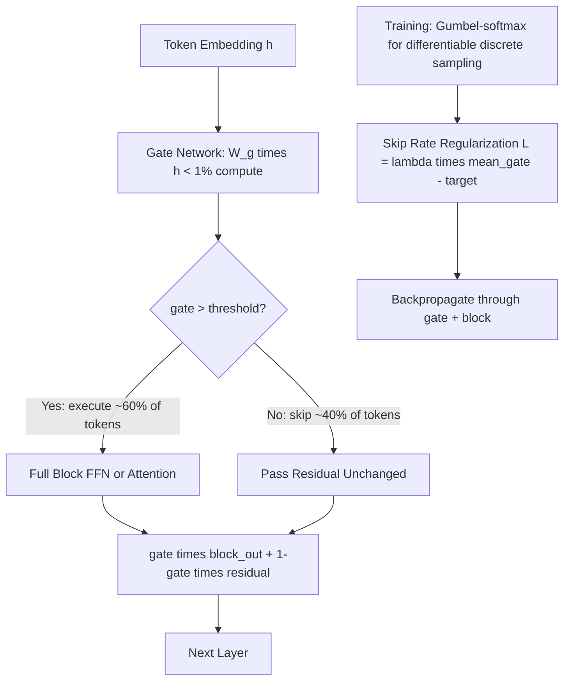

# Conditional Computation

## Detailed Explanation

Conditional computation is a model efficiency technique where different inputs activate different subsets of the network's parameters, so each inference pass executes only a fraction of the total compute — typically 10–30% of available parameters. Unlike pruning (which permanently removes weights) or quantization (which reduces precision), conditional computation keeps all weights but selectively applies them based on learned input-dependent gates.

The canonical architecture is a **gating network** that runs before each expensive compute block (e.g., FFN layer, attention head group) and outputs a scalar gate value: `gate = sigmoid(W_g · h)`. If `gate > threshold`, the block executes; otherwise, the residual connection passes through unchanged. This is the approach used in SkipNet, SkippingBERT, and Adaptive Depth networks.

The training challenge is that discrete gating decisions (`gate ∈ {0, 1}`) are non-differentiable. Three solutions are used: (1) **Gumbel-softmax** — a differentiable relaxation that approximates discrete sampling; (2) **straight-through estimator (STE)** — treat the discrete function as identity during backpropagation; (3) **REINFORCE** — policy gradient, accurate but high variance and slow to converge.

**Sparse gating** (as in Mixture-of-Experts) is the most computationally efficient form: each token is routed to the top-k of N expert FFN layers (`k=2, N=8` is typical). Active compute = `k/N × total_FFN_compute`. This achieves the effect of a very large model at the cost of a small one — a 56B MoE model with 8 experts activates only 7B parameters per token.

Conditional computation's speedup depends heavily on implementation: naive PyTorch execution with masking still allocates compute for skipped blocks (the mask only zeros gradients). Real speedup requires sparse batching — gathering only the tokens that activate each block and running only those through it.

## Core Intuition

Conditional computation is how the brain processes information: different words activate different regions, and visual regions don't light up when you're solving a math problem. A standard neural network lights up every neuron for every input, like a house where all rooms are lit whether anyone is in them or not. Conditional computation only turns on the rooms that are needed for each guest — cheaper for the house, and arguably more how thinking actually works.

## How It Works

1. **Compute lightweight gate from token features**: Before each expensive compute block, run a gating module: `gate = sigmoid(W_g · h)`. The gate network is tiny (single linear layer, <1% of block compute) to avoid negating the savings.
2. **Apply gating decision — binary skip or execute**: If `gate > threshold`: execute the block (FFN or attention sublayer). If `gate ≤ threshold`: skip the block and pass the residual directly to the next layer. For batch inference, collect skip/execute masks across all tokens.
3. **Sparse batching for real compute savings**: Gather only the tokens where `gate > threshold` into a dense sub-batch. Run the expensive block on this sub-batch only. Scatter outputs back to the full batch positions. This requires custom CUDA kernels (e.g., triton-based gather/scatter).
4. **Aggregate output with gate-weighted residual**: `output = gate × block_output + (1 - gate) × residual`. This soft combination (rather than hard binary switch) is better for training stability and allows gradient flow through the gate at training time.
5. **Train gate with Gumbel-softmax or STE**: Use `gate = hard_sigmoid(softmax(logits + Gumbel_noise) / temperature)` during training for differentiable discrete sampling. During inference, use hard threshold (temperature → 0). Alternatively, use the straight-through estimator: forward pass uses hard gate, backward pass uses the gradient of sigmoid.
6. **Enforce target skip rate via regularization**: Add a skip rate regularization loss: `L_gate = λ × |mean(gates) - skip_target|`. This pushes the model to skip `skip_target` fraction of blocks (e.g., 40%) rather than learning to always execute or always skip.

## Architecture / Trade-offs

### Gating Strategy Comparison

| Strategy | Accuracy (vs no-skip baseline) | Skip Rate | Training Complexity | Speedup | Notes |
|---|---|---|---|---|---|
| Always execute (no gate) | 100% | 0% | None | 1.0x | Baseline |
| Random skip 40% | 94% | 40% | None | 1.3x | No intelligence |
| Learned gate (sigmoid + STE) | 98.5% | 40% | Low | 1.35x | Simple, effective |
| Gumbel-softmax gate | 99.0% | 40% | Medium | 1.35x | Better calibration |
| RL gate (REINFORCE) | 99.2% | 40% | High | 1.35x | Slow, unstable training |
| MoE top-2 routing | 99.5% | 75% (activate k/N) | Medium | 3.5x | Best for FFN layers |

### Target Skip Rate vs Accuracy vs Speedup

| Skip Rate | Accuracy Drop | Theoretical Speedup | Practical Speedup | Training Difficulty |
|---|---|---|---|---|
| 0% | 0% | 1.0x | 1.0x | None |
| 20% | 0.3% | 1.25x | 1.15x | Low |
| 40% | 1.2% | 1.67x | 1.4x | Medium |
| 60% | 3.5% | 2.5x | 1.8x | High |
| 80% | 8.0% | 5.0x | 2.2x | Very high |

(Practical speedup < theoretical due to sparse batching overhead and load imbalance.)

## Interview Q&A

**Q: Why is REINFORCE unstable for training gating networks, and what do you use instead?**
A: REINFORCE has high gradient variance because the gate's reward signal (downstream loss) is sparse and delayed — many gradient samples are needed to converge. Variance reduction techniques (baselines, advantage estimation) help but add complexity. Gumbel-softmax is preferred: it provides exact gradients through a differentiable approximation of discrete sampling, converges faster, and achieves similar or better accuracy. Use REINFORCE only when exact discrete semantics matter (e.g., training agents with hard budget constraints).

**Q: You implement conditional computation with PyTorch masking but observe no real speedup. What's the issue?**
A: Masking in PyTorch zeros the output but still allocates compute — the GPU executes the full block on all tokens and multiplies by 0. Real speedup requires sparse batching: gather only tokens where `gate=1` into a dense sub-batch, execute the block on the sub-batch, then scatter results back. This requires custom triton kernels or libraries that support variable-length batches (e.g., vLLM's paged attention). Without this, conditional computation only reduces memory gradients, not FLOPs.

**Q: How do you set the target skip rate during training?**
A: Start with a conservative target (20% skip) and increase gradually as the model learns which inputs are safe to skip. If skip rate is too high early, the model hasn't learned the gate, so unimportant tokens are executed while important ones are skipped. The regularization coefficient λ controls the trade-off: increase λ to enforce the target more strictly at the cost of accuracy. In practice, tune λ until the skip rate matches the target ±5% on the validation set.

**Q: What types of inputs does a well-trained gate learn to skip?**
A: For transformer FFN layers, gates learn to skip: (1) function words (articles, prepositions, punctuation) that don't carry semantic information; (2) padding tokens (trivially); (3) tokens in later layers where the representation is already converged. For full layers, shallower skip patterns emerge for factual lookups vs deeper processing for reasoning-heavy inputs. Visualization: check gate activation maps — well-trained gates have consistent spatial patterns, not random noise.

**Q: When would conditional computation hurt accuracy even at low skip rates?**
A: When the gated block is a bottleneck layer that every token must pass through for the model to work correctly. Examples: the final LM head layer, the first attention layer (which builds the initial contextualized representations), and layer normalization (which cannot be skipped without instability). Gate only layers that are demonstrably redundant for most inputs — depth experiments (layer ablation) identify which layers can be removed without accuracy loss.

**Q: How does load imbalance across blocks affect practical speedup in sparse batching?**
A: If some blocks have 90% skip rate and others have 10% skip rate, the 10%-skip blocks become bottlenecks — you wait for them regardless of the sparse batching savings elsewhere. Uniform skip rates across blocks maximize practical speedup. Enforce per-block skip rate targets in the regularization loss: `L_gate = Σ_l λ_l × |mean(gate_l) - target|`. This prevents imbalanced gating from killing the benefit.

## Best Practices

- Use Gumbel-softmax or straight-through estimator for gate training — REINFORCE is slow and unstable unless you need exact discrete semantics with a budget constraint.
- Implement sparse batching (gather/execute/scatter) for real compute savings; PyTorch masking provides no speedup despite appearing correct in code.
- Target 20–40% skip rate for the first deployment; above 40%, accuracy degradation requires careful fine-tuning to recover.
- Apply skip rate regularization per block, not globally — prevents load imbalance where a few blocks dominate execution time.
- Gate only the FFN sublayers initially; attention layers are harder to gate without accuracy loss because attention is the primary mechanism for cross-token reasoning.
- For MoE-style conditional computation, always use top-k routing with auxiliary load balancing loss to prevent expert collapse (all tokens routing to the same k experts).
- Monitor gate activation variance across training — low variance early in training indicates the gate hasn't learned anything and may be stuck (check gradient flow through the gate network).

## Common Pitfalls

- **Pitfall: Gating with PyTorch masking and expecting speedup**
  **Symptom:** Gate is trained successfully, skip rate is 40% on validation, but inference latency is identical to the baseline.
  **Fix:** Implement sparse batching with gather/scatter around each gated block. Use triton kernels or frameworks that natively support conditional execution (DeepSpeed Sparse Attention, Switch Transformer routing).

- **Pitfall: All-or-nothing gate collapse — gate always 0 or always 1**
  **Symptom:** Skip rate is 0% or 100% after training, not the 40% target.
  **Fix:** Check that gradients flow through the gate (use Gumbel-softmax or STE, not hard argmax). Add the skip rate regularization loss with λ=0.01 initially. If gradient flow is fine, reduce learning rate for the gate network (gates need slower updates than the main parameters).

- **Pitfall: Not handling padding tokens specially**
  **Symptom:** Gate learns to skip padding tokens (easy, always correct) and reports high skip rate, but real content skip rate is much lower; speedup is minimal.
  **Fix:** Mask out padding positions from the skip rate computation — count only non-padding tokens in the skip rate metric and regularization target.

- **Pitfall: High skip rate on training set but gate generalizes poorly**
  **Symptom:** Validation skip rate drops from 40% to 10% when switching to production distribution; no speedup in serving.
  **Fix:** Ensure training data covers the production distribution. The gate must learn input-dependent patterns that generalize — if training data is narrow, the gate becomes a memorization shortcut, not a generalizable feature detector.

## Related Concepts

- [26-mixture-of-experts.md](./26-mixture-of-experts.md) — MoE is conditional computation over expert FFN layers with top-k routing
- [37-adaptive-layer-selection.md](./37-adaptive-layer-selection.md) — selecting which layers to execute is coarser-grained conditional computation
- [38-layer-skipping.md](./38-layer-skipping.md) — layer-level skip decisions as a specific case of conditional computation
- [52-heterogeneous-ensemble.md](./52-heterogeneous-ensemble.md) — routing to different models in ensemble vs routing within a model
- [46-neuron-importance-scoring.md](./46-neuron-importance-scoring.md) — static pruning vs dynamic gating: different approaches to reducing compute
