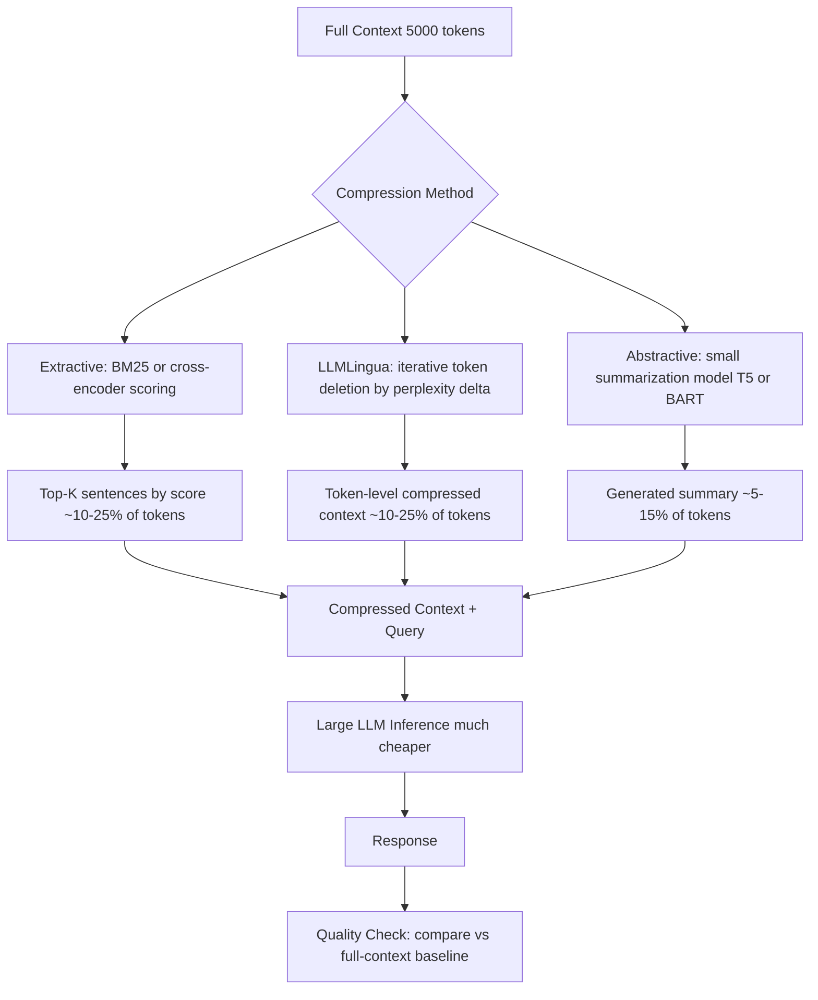

# Context Compression

## Detailed Explanation

Context compression reduces the number of tokens that a language model must process in its context window, decreasing KV cache size, prefill latency, and cost while attempting to preserve the information relevant to the query. As models are deployed with long contexts (32K–128K tokens) for RAG, multi-turn conversation, and document processing, context compression becomes a critical efficiency lever — a 10x compression ratio reduces prefill time by ~10x and KV cache memory by 10x.

Three main families of methods: (1) **Extractive compression** selects complete sentences or passages that are most relevant to the query, using BM25, attention weights, or cross-encoder reranking to score sentences. Fast (<10ms), lossless for selected content, but can't synthesize information spread across multiple passages. (2) **LLMLingua** (iterative token deletion): scores each token's importance using a smaller reference LM and iteratively deletes the lowest-importance tokens until the budget is met — `Δperplexity = perplexity(context without token) - perplexity(context)`. Token-level granularity achieves higher compression ratios than sentence-level. (3) **Abstractive compression**: a separate smaller model reads the context and generates a condensed summary. Highest information density but loses exact quotes, numbers, and rare facts — unsuitable for factual Q&A.

For RAG workloads, the workflow is: retrieve 10–20 documents → compress to 10–20% of original length → concatenate with query → send to large LLM. The compression step shifts compute to a cheap small model and saves expensive large-LLM prefill compute.

A critical domain-specific rule: use extractive compression for factual tasks (preserving exact quotes, dates, numbers); use abstractive compression for conversational summarization where paraphrase is acceptable.

## Core Intuition

Context compression is like preparing a briefing document before a meeting with a senior executive: instead of handing them 200 pages of raw reports (full context), an analyst extracts the 3 key findings with supporting data (extractive) or writes a 2-page summary (abstractive). The executive can make the same decision with the summary, but the summary cannot contain a calculation that doesn't appear in the original — extractive is safer when exact numbers matter.

## How It Works

1. **Score context elements by relevance**: For extractive: BM25-score each sentence against the query, or use cross-encoder similarity (`score(sentence, query) = cross_encoder(cat(query, sentence))`). For LLMLingua: use a reference LM to compute `Δperplexity` for each token if deleted.
2. **Set compression target budget**: Determine target token count — typically 10–25% of original for RAG (e.g., 5000 tokens → 500 tokens) or the model's effective context window if the full context exceeds it.
3. **Extractive: keep top-K scored elements**: Sort sentences by relevance score descending. Keep top-K sentences until token budget is met. Preserve original order (temporal coherence matters for reasoning). Discard low-scoring sentences entirely.
4. **LLMLingua: iterative token deletion**: Score all tokens: `s_i = |perplexity(C) - perplexity(C \ token_i)|`. Delete the lowest-scoring token. Recompute scores for neighbors (deletion changes context). Repeat until target compression ratio is met.
5. **Abstractive: run compressor model**: Pass the full context to a small summarization model (T5-3B, BART-large). Generate a compressed summary. Cache the compression output if the same context is reused (shared context in RAG workloads).
6. **Concatenate compressed context with query**: Prepend the compressed context to the user query. Send to the large target LLM. Monitor for quality degradation vs full-context baseline by evaluating on a held-out set at each compression ratio.

## Architecture / Trade-offs

### Compression Method Comparison (RAG Q&A, 5000-token context → target tokens)

| Method | Compression Ratio | Accuracy vs Baseline | Latency Overhead | Handles Exact Facts | Cost |
|---|---|---|---|---|---|
| No compression | 1x | 100% | 0 ms | Yes | $0.050/q |
| Extractive (BM25) | 4–8x | 91% | 5 ms | Yes | $0.010/q |
| Extractive (cross-encoder) | 4–8x | 95% | 40 ms | Yes | $0.012/q |
| LLMLingua | 4–10x | 93% | 120 ms | Partial | $0.011/q |
| Abstractive (T5-3B) | 8–20x | 82% | 400 ms | No | $0.013/q |

### Compression Ratio vs Accuracy Degradation

| Compression Ratio | Extractive Accuracy Drop | LLMLingua Accuracy Drop | Abstractive Accuracy Drop | Latency Reduction |
|---|---|---|---|---|
| 2x (50% retained) | 1% | 0.5% | 3% | 45% |
| 4x (25% retained) | 4% | 2% | 8% | 72% |
| 8x (12.5% retained) | 10% | 5% | 18% | 86% |
| 10x (10% retained) | 15% | 8% | 25% | 89% |

## Interview Q&A

**Q: When should you use extractive vs abstractive compression?**
A: Use extractive when the downstream task requires exact information: dates, numbers, proper nouns, quotes, code snippets. Abstractive compression may paraphrase "sales increased 12.3% in Q3" to "sales improved significantly" — losing the exact figure. Use abstractive only for conversational summarization, topic detection, or tasks where paraphrase is semantically equivalent. When in doubt, extractive is safer.

**Q: LLMLingua achieves good compression ratios but you find it slow for your serving latency. What's your approach?**
A: LLMLingua's iterative token deletion takes 100–300ms — too slow for real-time serving at <200ms p99. Two options: (1) run LLMLingua offline as a preprocessing step and cache compressed versions of your document corpus (works for RAG with a static knowledge base); (2) switch to extractive compression (BM25 + top-K sentences takes <10ms) accepting a slight accuracy trade-off. Never run LLMLingua in the hot path of a real-time serving system without pre-caching.

**Q: How do you set the compression ratio for a RAG system?**
A: Start by measuring accuracy vs compression ratio on your specific dataset and query distribution (not generic benchmarks). Target the highest compression ratio where accuracy loss is <3% relative to no compression. Typical safe ranges: extractive at 4–6x (25–17% retention) for factual Q&A; abstractive at 4–8x for conversational. Always set a minimum retained token count (e.g., at least 200 tokens) to prevent extreme compression from destroying context coherence.

**Q: Your context compression is set to 10x but accuracy drops 25%. What do you try first?**
A: Reduce compression ratio to 4–6x and remeasure — this is the most likely cause. If 4x still shows large accuracy loss, check if the task requires exact numerical or factual recall (use extractive, not abstractive). Also verify the compression is query-aware: generic compression (not conditioned on the query) discards query-relevant sentences at high ratios. Cross-encoder scoring (query-conditioned) significantly outperforms BM25 (query-independent) at high compression ratios.

**Q: How do you handle a RAG workload where multiple users share the same retrieved documents?**
A: Cache the compressed versions: compute compression once per unique (document, query_type) pair and cache the output. For a RAG system with 10K documents and 50 query types, you pre-compute 500K (documents, query_type) compressions and serve from cache. This shifts compression cost to offline and makes serving latency effectively 0 for the compression step.

**Q: What happens when the compressed context omits a key fact that the LLM needs?**
A: The LLM hallucinates or gives an incomplete answer — the damage is silent and hard to detect without ground-truth comparison. Mitigation: (1) always evaluate compression quality on a held-out question set with known answers; (2) use extractive compression for high-stakes factual domains — it never fabricates, it only omits; (3) set a confidence threshold: if the LLM's answer confidence is below 0.7, fall back to full-context retry.

## Best Practices

- Use extractive compression (BM25 or cross-encoder) for factual Q&A and RAG — it never fabricates content and runs in <50ms.
- Target 4–6x compression as the sweet spot: typically <4% accuracy loss with 70–80% latency reduction for extractive methods.
- Run LLMLingua offline and pre-cache compressed documents for static knowledge bases — never run it in the real-time serving path.
- Use cross-encoder scoring (query-conditioned) over BM25 (query-independent) at compression ratios above 4x — accuracy difference is small at 2x but large at 8x.
- Always evaluate compression quality on your specific query distribution — generic benchmark results don't transfer well to domain-specific workloads.
- Preserve sentence boundaries and original order in extractive compression — jumping sentence order confuses LLMs and degrades accuracy by 3–8%.
- Cache compression outputs keyed by `(document_hash, query_type)` for RAG workloads — documents are typically queried many times and caching amortizes compression cost.
- Set a minimum retained token count (e.g., 200 tokens minimum) to prevent degenerate compression that destroys all context.

## Common Pitfalls

- **Pitfall: Using abstractive compression for factual Q&A**
  **Symptom:** LLM gives semantically reasonable but factually wrong answers — paraphrased numbers, approximate dates, wrong proper nouns.
  **Fix:** Switch to extractive compression for any task requiring exact factual recall. Abstractive compression is only suitable for conversational summarization and semantic understanding tasks.

- **Pitfall: Running LLMLingua in the real-time request path**
  **Symptom:** Compression step adds 200–400ms to every request, causing p99 latency to exceed SLA.
  **Fix:** Pre-compute and cache compressions for your document corpus. For dynamic content that can't be cached, use BM25 extractive compression (<10ms) rather than LLMLingua.

- **Pitfall: Query-agnostic compression discarding query-relevant content**
  **Symptom:** Compressed context scores well on generic metrics but accuracy on specific queries is poor — the key sentences for each query were compressed away.
  **Fix:** Use query-conditioned scoring (cross-encoder or attention-based) that ranks sentences by relevance to the specific query. BM25 with the query as the "document" to score against is a fast approximation.

- **Pitfall: Not setting a minimum token retention threshold**
  **Symptom:** At high compression ratios (10x), some documents are compressed to 20–50 tokens — insufficient for any meaningful context.
  **Fix:** Set `min_retained_tokens = max(200, original_tokens * 0.05)`. Below this floor, return the original document uncompressed rather than a degenerate compressed version.

## Related Concepts

- [05-advanced-rag-patterns.md](./05-advanced-rag-patterns.md) — RAG is the primary use case for context compression
- [27-long-context-management.md](./27-long-context-management.md) — long context management strategies that complement compression
- [29-kv-cache-optimization.md](./29-kv-cache-optimization.md) — KV cache size is directly reduced by context compression
- [36-token-pruning-merging.md](./36-token-pruning-merging.md) — token pruning during inference vs context compression before inference
- [06-context-distillation.md](./06-context-distillation.md) — distilling context into model weights is an alternative to runtime compression
