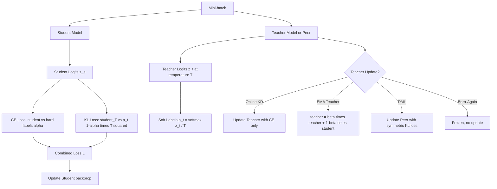

# Online Knowledge Distillation

## Detailed Explanation

Online knowledge distillation is a training technique where the teacher model updates alongside the student during the same training run, as opposed to offline distillation where a frozen pretrained teacher generates targets before student training begins. The key innovation is that the teacher evolves in response to the student's learning, producing progressively harder and more informative soft targets throughout training rather than a static supervision signal.

The standard distillation loss is: `L = (1-α)·CE(student, hard_labels) + α·T²·KL(student_T || teacher_T)` where `T` is temperature (2–4 for LLMs), `α` controls the distillation weight (0.1–0.5), and the `T²` factor compensates for the reduced gradient magnitude at high temperature. The KL-divergence term forces the student to match the teacher's full probability distribution over the vocabulary, transferring the teacher's "dark knowledge" — its uncertainty about wrong answers which encodes structural relationships between classes.

**Deep Mutual Learning (DML)** extends this symmetrically: two student peers train simultaneously, each acting as the other's teacher. The loss for peer i: `L_i = CE(f_i, y) + KL(f_i || f_j)`. DML empirically outperforms single-teacher distillation because each peer learns diverse representations, and a weaker teacher that's learning alongside the student is often more informative than a strong frozen teacher that's already perfectly calibrated.

**Born-Again Networks (BAN)**: after the first student completes training, it becomes the teacher for the next generation. Repeated distillation (student → teacher → new student) produces successively better models even when teacher and student have the same architecture — counter-intuitive because no new information is added, but distillation smooths the loss landscape.

A critical practical pitfall: the online teacher hasn't converged early in training and produces worse soft labels than the hard labels. Always warm up the teacher for 2–3 epochs solo before activating the distillation loss, or use exponential moving average (EMA) of student weights as the teacher to ensure the teacher is always slightly ahead.

## Core Intuition

Online knowledge distillation is like a study group where everyone teaches each other instead of all reading from the same textbook. The most advanced student helps the others by explaining concepts in terms they already understand, and the group's shared progress updates the explanations continuously. Offline distillation is like a professor recording lectures once at the semester start — the material never adapts to where students actually are in their understanding.

## How It Works

1. **Initialize student and teacher models**: For online KD, initialize teacher with the same or larger architecture. For DML, initialize two peers with identical architecture but different random seeds. For EMA-teacher (the most stable approach), initialize teacher as a copy of student.
2. **Warm-up phase (2–3 epochs, teacher-only)**: Train the teacher on hard labels only. This ensures the teacher has stable, calibrated predictions before its soft labels are used to supervise the student. Skip this phase only if using EMA teacher (always tracks student) or DML (peers learn together).
3. **Forward pass — both models process the same batch**: Run student and teacher on the same mini-batch simultaneously. Compute logits for both: `z_student`, `z_teacher`.
4. **Compute soft labels from teacher at temperature T**: `p_teacher = softmax(z_teacher / T)`. Higher T (2–4) produces softer distributions that reveal inter-class relationships; lower T (1) collapses to near one-hot labels.
5. **Compute composite student loss**: `L = (1-α)·CE(softmax(z_student), y_hard) + α·T²·KL(softmax(z_student/T) || p_teacher)`. The `T²` factor restores gradient scale. Set α=0.3–0.5 for aggressive distillation; α=0.1 for conservative.
6. **Update models**: For online KD: update student with `L`; update teacher with CE loss (hard labels) or EMA of student weights. For DML: update both peers symmetrically. For born-again: only update student; teacher is frozen at its trained weights.

## Architecture / Trade-offs

### Online KD Variant Comparison (BERT-base student, WikiText-2 perplexity)

| Method | Teacher Cost | Final Student PPL | Training Time | Teacher Quality | Best For |
|---|---|---|---|---|---|
| No distillation | 0 | 4.80 | 1.0x | N/A | Baseline |
| Offline KD (frozen teacher) | 1x (pre-computed) | 4.52 | 1.3x | Static, high quality | Small target model |
| Online KD (co-training) | 1x (live) | 4.41 | 2.0x | Evolving, adaptive | Medium target model |
| EMA Teacher | 0.1x overhead | 4.38 | 1.1x | Near-student quality | Most practical |
| DML (two peers) | 1x (symmetric) | 4.35 | 2.0x | Mutual, diverse | Competitive peers |
| Born-Again (3 generations) | 1x per gen | 4.28 | 3.0x | Previous-gen student | Sequential improvement |

### Temperature T vs Soft Label Quality

| Temperature | Soft Label Entropy | Student Accuracy | Training Stability | Dark Knowledge Transfer |
|---|---|---|---|---|
| T=1 (hard) | Low (near one-hot) | 81.2% | High | None |
| T=2 | Medium | 83.5% | High | Low |
| T=4 | High | 84.8% | Medium | Medium |
| T=8 | Very high | 84.2% | Low | High |
| T=20 | Near-uniform | 82.1% | Very low | Over-smoothed |

## Interview Q&A

**Q: Why does EMA teacher work well for online knowledge distillation?**
A: The EMA teacher (`teacher = β·teacher + (1-β)·student`, β=0.999) is always slightly ahead of the student — it's a temporally smoothed version of the student's weights, not noisy with the gradient updates of the current step. This produces soft labels that are more stable than the student's current predictions (less variance) but still track the student's current state (unlike a frozen pre-trained teacher that may be too far ahead to provide learnable supervision). It's also computationally free — no separate teacher forward pass is needed, just an EMA weight update.

**Q: When would you choose DML over single-teacher online distillation?**
A: Use DML when you have two equally-sized models and want both to improve simultaneously (e.g., training two model variants for an ensemble). DML's advantage is diversity: peers develop different failure modes, and mutual distillation encourages each model to learn what the other knows. Use single-teacher distillation when you have a clear size asymmetry (large teacher, small student) and want the small model to reach the large model's performance level.

**Q: Why does activating the distillation loss from epoch 1 sometimes hurt performance?**
A: Early in training, the online teacher's predictions are nearly random — its soft labels are essentially uniform noise. Distilling from a random teacher adds noise rather than useful signal, often hurting convergence compared to training on hard labels alone. The fix: warm up the teacher (or both peers in DML) for 2–3 epochs on hard labels before enabling the KL loss. Alternatively, ramp α from 0 to its target value linearly over the first 5 epochs.

**Q: How do you tune the temperature T for a specific task?**
A: Plot validation accuracy vs temperature sweep (T ∈ {1, 2, 4, 8}) on a held-out validation set. T=4 is the standard starting point for classification. For generation tasks (language modeling), T=2–3 is typically better because the vocabulary distribution is already diverse and high temperatures over-smooth it. Avoid T > 8 in practice — the soft labels become too uniform to provide meaningful signal.

**Q: What is "dark knowledge" in the context of distillation and why does it matter?**
A: Dark knowledge is the information encoded in a model's probability distribution over wrong answers. For example, a model predicting an image as "cat" assigns 0.1% to "dog" and 0.001% to "car" — the 0.1% to dog encodes a structural relationship (cats and dogs are more similar than cats and cars). Hard labels provide only 0% to both wrong answers, discarding this relationship information. Distillation's KL loss forces the student to match the full distribution including wrong-answer probabilities, transferring relational structure that improves generalization.

**Q: How do you validate that online distillation actually helps vs just using more training compute?**
A: Run three baselines with identical total FLOPs: (1) student trained alone for 2x steps; (2) student with online KD from a co-trained teacher; (3) student with offline KD from a pre-trained teacher. Compare final validation loss. If online KD doesn't outperform simply training longer (baseline 1), the distillation overhead isn't justified. The advantage of online KD is typically not compute efficiency but access to teacher soft labels that provide richer supervision than more hard-label iterations.

## Best Practices

- Always warm up the teacher for 2–3 epochs on hard labels before activating the distillation loss — early online teachers produce noisy soft labels that hurt student convergence.
- Use EMA teacher (`β=0.999`) as the default online teacher strategy — low overhead (no extra forward pass), stable soft labels, and consistently strong performance.
- Start with `T=4, α=0.3` as default hyperparameters; sweep temperature on a validation set before large training runs.
- Apply the `T²` scaling factor to the KL loss term — without it, the gradient magnitude is T² times smaller than the CE term, making distillation ineffective at high temperatures.
- For DML, initialize peers with different random seeds and verify they diverge early in training (check prediction disagreement > 0.15 by epoch 2); if they converge too quickly, they'll provide no mutual benefit.
- Monitor distillation loss and hard label loss separately in training logs — if KL loss is consistently 10x larger than CE loss, reduce α; if it's negligible, increase α or temperature T.
- For born-again networks, limit to 3 generations — the marginal gain per generation decreases exponentially and training cost scales linearly.

## Common Pitfalls

- **Pitfall: Activating distillation loss from epoch 1 without teacher warmup**
  **Symptom:** Student training loss spikes or converges slower than training without distillation in the first 5 epochs; final model underperforms hard-label baseline.
  **Fix:** Warm up the teacher for 2–3 epochs on CE loss only. Alternatively, linearly ramp α from 0 to 0.3 over the first 5 epochs so the distillation signal gradually overtakes the hard-label signal as the teacher improves.

- **Pitfall: Forgetting the T² scaling factor on the KL loss**
  **Symptom:** Distillation has no observable benefit despite correct implementation — loss curves look identical with and without distillation.
  **Fix:** Add the `T²` multiplier to the KL term: `L_kl = T² × KL(student_T || teacher_T)`. Without it, the KL gradient is 16x smaller than CE gradient at T=4, making distillation effectively inactive.

- **Pitfall: Teacher and student diverge in DML — one collapses to trivial predictions**
  **Symptom:** One peer's training loss drops quickly while the other stagnates or diverges; mutual distillation loss becomes very large.
  **Fix:** Reduce the KL weight α for the weaker peer (asymmetric α). Check that both peers use independent optimizers with the same hyperparameters. If collapse persists, add a small entropy regularization term to prevent the dominant peer from becoming overconfident.

- **Pitfall: Online teacher quality lower than offline pretrained teacher**
  **Symptom:** Online KD achieves lower accuracy than offline KD from a pre-trained large teacher.
  **Fix:** This is expected when a high-quality large pretrained teacher is available. Use online KD when no such teacher exists (training a model from scratch) or when you want both teacher and student to improve. For student-teacher size asymmetry > 2x, offline KD from a strong frozen teacher is typically better.

## Related Concepts

- [46-neuron-importance-scoring.md](./46-neuron-importance-scoring.md) — pruning and distillation are complementary compression techniques
- [31-quantization-aware-distillation.md](./31-quantization-aware-distillation.md) — distillation during quantization-aware training
- [34-post-training-specialization.md](./34-post-training-specialization.md) — post-training distillation for domain specialization
- [26-mixture-of-experts.md](./26-mixture-of-experts.md) — MoE models can be distilled into dense student models
- [17-continual-learning-llms.md](./17-continual-learning-llms.md) — online distillation supports continual learning by preserving old knowledge
