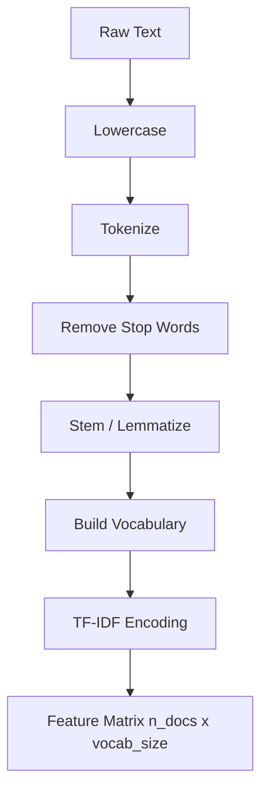

# Text Preprocessing

## Detailed Explanation

Text preprocessing transforms raw, unstructured text into a clean, consistent representation that machine learning models can learn from. Without it, noise like punctuation variations, capitalization inconsistencies, and rare word forms inflate vocabulary size and dilute signal. A typical pipeline progresses through: lowercasing, punctuation removal, tokenization (splitting text into words or subwords), stop-word removal (filtering high-frequency but low-information words like "the", "is"), stemming or lemmatization (reducing words to their root form), and finally numeric representation via bag-of-words or TF-IDF.

TF-IDF (Term Frequency-Inverse Document Frequency) is the standard baseline feature representation for text. It weights each term by how often it appears in a document (TF) relative to how many documents contain it (IDF = log(N / df_t)). Words that appear frequently in one document but rarely across the corpus receive high scores — exactly the discriminative signal a classifier needs. Common words like "the" appear in every document and therefore receive near-zero IDF weight.

A critical design decision is vocabulary size. Too small: rare but informative terms are dropped as OOV (out-of-vocabulary). Too large: feature space becomes sparse and models struggle to generalize. In practice, keeping the top 10,000-50,000 tokens by frequency, combined with subword tokenization, offers a good balance. Character-level tokenization avoids OOV entirely but produces very long sequences; word-level is compact but suffers on morphologically rich languages. Subword (BPE, WordPiece) is the modern default for LLMs and should be understood as the culmination of this preprocessing evolution.

## Core Intuition

Text preprocessing is like preparing ingredients before cooking: you normalize raw text so the model sees a consistent vocabulary rather than treating "Run", "running", and "ran" as three unrelated items. TF-IDF then tells you which ingredients are distinctive to a dish — a word that appears in every recipe tells you nothing, but one unique to a few dishes is informative. Getting this pipeline right often matters more than the choice of model.

## How It Works

1. **Lowercasing:** Convert all characters to lowercase to treat "Apple" and "apple" identically. Exception: named entity recognition tasks may benefit from preserving case.
2. **Tokenization:** Split text into tokens — words by whitespace/punctuation, or subwords via learned merge rules (BPE). Produces a list of string tokens.
3. **Stop-word removal:** Remove a predefined list of high-frequency, low-information words ("the", "a", "is"). This reduces dimensionality without losing meaning-bearing terms.
4. **Stemming / Lemmatization:** Reduce words to a base form. Stemming: rule-based suffix stripping ("running" → "run"). Lemmatization: vocabulary-aware normalization ("better" → "good"). Lemmatization is more accurate but slower.
5. **Vocabulary construction:** Collect all unique tokens; assign an integer index. Optionally limit to top-K by frequency.
6. **TF-IDF encoding:** For each (document, term) pair, compute TF(t,d) * IDF(t) where TF = count(t,d)/total_terms(d) and IDF = log(N/df_t). Resulting matrix shape: (num_documents, vocab_size).

## Architecture / Trade-offs

### Tokenization Strategy Comparison

| Strategy | Vocab Size | OOV Handling | Sequence Length | Use When |
|----------|-----------|--------------|-----------------|----------|
| Character-level | ~100 | None (no OOV) | Very long | Low-resource languages, spelling correction |
| Word-level | 50K-500K | UNK token | Short | Fixed-vocabulary tasks, bag-of-words |
| Subword (BPE) | 8K-50K | None (splits) | Medium | LLMs, multilingual, morphology-rich |
| Byte-level | 256 | None | Longer than word | GPT-2, robustness to encoding issues |

### Stemming vs Lemmatization

| Property | Stemming | Lemmatization |
|----------|----------|---------------|
| Speed | Fast (rule-based) | Slow (dictionary lookup) |
| Accuracy | Lower (cuts blindly) | Higher (context-aware) |
| "Flies" | "fli" | "fly" or "flies" depending on POS |
| Use case | High-throughput search | QA, NER where precision matters |
| Library | nltk.stem.PorterStemmer | spacy / nltk.wordnet |

### TF-IDF vs Alternatives

| Method | Captures Frequency | Captures Position | Semantic Similarity | Sparse |
|--------|--------------------|-------------------|---------------------|--------|
| Bag-of-Words | Count only | No | No | Yes |
| TF-IDF | Weighted frequency | No | No | Yes |
| Binary | Presence only | No | No | Yes |
| Word Embeddings | No | No | Yes | No (dense) |

TF-IDF remains competitive for document retrieval, classification with linear models, and scenarios with limited training data. Embeddings win on semantic tasks where word meaning matters more than frequency patterns.

## Interview Q&A

**Q: When would you choose TF-IDF over a neural embedding like Word2Vec for a classification task?**

A: Use TF-IDF when you have limited training data (fewer than ~1000 samples), the task is primarily keyword-driven (topic classification, spam detection), or interpretability matters — TF-IDF weights are directly inspectable. Neural embeddings require sufficient data to fine-tune and add latency, while a TF-IDF + logistic regression pipeline can train in seconds and often matches or beats neural approaches on short-text tasks.

**Q: What breaks if you skip stop-word removal?**

A: For TF-IDF, IDF naturally down-weights stop words since they appear in almost every document, so the damage is limited. For bag-of-words with frequency-based features, stop words dominate the top features and can mislead classifiers. The real risk is vocabulary bloat: stop words inflate vocab size, increasing sparsity. Skip removal only when you have enough data to absorb the noise or when stop words carry syntactic information (e.g., question answering).

**Q: A model trained on news articles performs poorly on tweets. What preprocessing changes would you try first?**

A: Tweets have non-standard spelling, abbreviations, hashtags, and emojis — all OOV in a news-trained vocabulary. First, add tweet-specific normalization: expand abbreviations, remove or normalize hashtags (#nlp → "nlp"), strip @mentions. Second, switch from word-level to subword tokenization so "gr8" splits into recognizable substrings. Third, retrain the vocabulary on a mix of news and tweet data.

**Q: How do you decide vocabulary size for a production text classifier?**

A: Plot test accuracy vs vocabulary size (try 100, 1K, 5K, 10K, 50K). Accuracy typically rises sharply, then plateaus. Pick the "elbow" — usually 10K-20K tokens covers 95%+ of corpus frequency for English. Beyond that, you add sparse, rare tokens that hurt generalization. Also monitor OOV rate: above 5% on test data, increase vocabulary or switch to subword.

**Q: What is the most common preprocessing mistake that causes train/test leakage?**

A: Fitting the TF-IDF vectorizer (or vocabulary builder) on the full dataset including test split before splitting. IDF values computed on test data leak test-set term frequencies into training features. Always fit the vectorizer on train-only data, then transform test separately with the same fitted object.

**Q: When would stemming hurt rather than help?**

A: When the stem is not meaningful — "universe" and "university" both stem to "univers" under Porter stemmer, collapsing semantically unrelated words. For information retrieval this causes false positives. For tasks where word sense matters (NER, QA), use lemmatization or no normalization at all. Stemming also breaks on domain-specific terms ("BERT" → "bert" is fine; medical abbreviations may not be).

**Q: How would you handle a multilingual corpus in a preprocessing pipeline?**

A: Use language detection first (langdetect or fasttext), then apply language-specific stop-word lists and stemmer/lemmatizer per language. For the vocabulary, use either separate per-language vocabularies merged at the embedding layer, or a shared subword vocabulary trained on multilingual data (like mBERT's WordPiece). Avoid applying English stop words to non-English text — it either removes valid terms or misses the actual stop words.

## Best Practices

- **Always fit preprocessing on train data only** — fit TfidfVectorizer, vocabulary, and any statistics on train split, transform test with the same fitted object to prevent leakage.
- **Keep punctuation for sentiment tasks** — exclamation marks and question marks carry sentiment signal. Stripping them loses information.
- **Use subword tokenization for production systems** — reduces OOV rate to zero, handles morphologically rich languages, and aligns with LLM tokenizers if you plan to migrate later.
- **Set min_df=2 and max_df=0.95 in TfidfVectorizer** — removes hapax legomena (appear once, uninformative) and near-universal terms (appear in 95%+ of documents) without manual stop-word lists.
- **Normalize TF-IDF vectors to unit length before cosine similarity** — prevents long documents from dominating similarity scores purely by having more terms.
- **Profile vocabulary coverage before choosing vocab size** — compute what fraction of test tokens are OOV at each vocab threshold; 0-2% OOV is a reasonable target.
- **Store the fitted vectorizer as a serialized artifact** — don't refit at inference time. Use joblib.dump() and load it in your serving stack alongside the model.

## Common Pitfalls

- **Preprocessing leakage:** Computing IDF on the full dataset (including test) before the train/test split. The fix: always split first, then fit the vectorizer only on training documents.

- **Aggressive stemming collapses meaning:** Porter stemmer maps "general", "generalize", "generally", and "generalization" all to "general", which is fine — but also maps "universe" and "university" to "univers". For tasks where such distinctions matter, switch to lemmatization or no normalization. Symptom: model treats clearly different words as identical; check by inspecting vocabulary for stem collisions.

- **Ignoring encoding issues:** Raw text from the web often has mixed encodings (UTF-8, Latin-1, Windows-1252). Failing to normalize produces garbled tokens and inflated vocabulary. Fix: decode everything to UTF-8 at ingestion, use `errors='replace'` or `errors='ignore'` as a fallback.

- **Stop-word list mismatch for domain:** Standard English stop-word lists don't include domain jargon that is nevertheless ubiquitous and uninformative within the domain (e.g., "patient" in a medical corpus). Build a domain-aware stop-word list by examining the top 50 TF-IDF terms and checking whether they discriminate between classes.

- **Not lowercasing before vocabulary construction:** "The" and "the" become two vocabulary entries, doubling representation for common tokens. Always lowercase unless your downstream task specifically requires case sensitivity (e.g., named entity recognition).

## Related Concepts

- [Word Embeddings](./02-word-embeddings.md) — dense vector representations that replace TF-IDF for semantic tasks
- [RNNs and LSTMs](./03-recurrent-neural-networks.md) — sequence models that consume tokenized, embedded text
- [Seq2Seq and Attention](./04-seq2seq-attention.md) — the architecture that bridges RNNs and transformers
