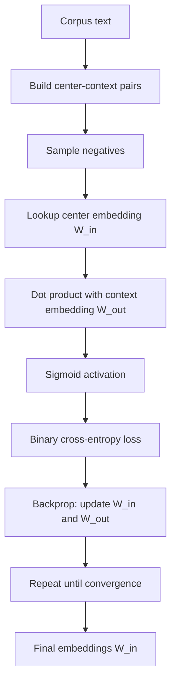

# Word Embeddings

## Detailed Explanation

Word embeddings map discrete vocabulary tokens to dense, continuous vector representations in a low-dimensional space (typically 50-300 dimensions). The key insight is the distributional hypothesis: words that appear in similar contexts have similar meanings. Training on large corpora forces embeddings to encode syntactic and semantic relationships as geometric structure — the famous result being that vector(king) - vector(man) + vector(woman) ≈ vector(queen).

Word2Vec introduced two architectures in 2013: Continuous Bag-of-Words (CBOW), which predicts a center word from its context, and Skip-gram, which predicts context words given a center word. Skip-gram performs better on rare words because it generates more training signal per word occurrence. The original softmax over the full vocabulary is computationally expensive (O(V)); negative sampling replaces it with a binary classification problem — is this (word, context) pair real or noise-sampled? — bringing training cost to O(k) per update where k is the number of negative samples (typically 5-20).

GloVe takes a different approach: factorize the global word co-occurrence matrix. The loss function enforces that the dot product of two word vectors approximates the log of their co-occurrence count. GloVe is faster to train (matrix factorization is parallelizable) and captures global corpus statistics directly rather than through local window sampling.

FastText extends Word2Vec by representing words as sums of character n-gram vectors. "running" = sum of vectors for "run", "unn", "nni", "nin", "ing", "<running>". This makes FastText robust to OOV and morphological variation — it can produce vectors for words never seen in training by composing their subword vectors. In production, if you need to handle typos or rare words, FastText is usually preferred over Word2Vec.

## Core Intuition

Word embeddings compress the meaning of a word into a direction in space: words used in similar contexts end up pointing in similar directions. The training process never sees "meaning" directly — it only sees co-occurrence patterns in text — yet it recovers semantic structure because meaning is ultimately expressed through usage. King and queen end up geometrically close because they appear in overlapping contexts, and the gender difference is encoded as a consistent offset vector found throughout the embedding space.

## How It Works

1. **Build co-occurrence pairs:** Slide a window of size W over the corpus. For each center word, record (center, context) pairs for all words within W positions. With negative sampling, also sample k words at random (the "negatives").
2. **Initialize embeddings:** Randomly initialize two embedding matrices: W_in (input/center embeddings) and W_out (output/context embeddings), both shape (vocab_size, embedding_dim).
3. **Forward pass:** For a (center, context) pair, compute dot product: score = W_in[center] · W_out[context]. Apply sigmoid: p = sigma(score). For negative pairs, target is 0; for real pairs, target is 1.
4. **Backward pass:** Compute binary cross-entropy loss and backpropagate gradients to both embedding matrices. Update with SGD or Adam.
5. **Repeat over corpus:** Multiple epochs until convergence. Learning rate typically decays linearly.
6. **Use W_in as final embeddings:** Discard W_out. The resulting W_in encodes word meaning as geometric relationships.

## Architecture / Trade-offs

### Word2Vec vs GloVe vs FastText

| Property | Word2Vec (Skip-gram) | GloVe | FastText |
|----------|---------------------|-------|----------|
| Training approach | Local window, online SGD | Global co-occurrence matrix | Local window + subword |
| OOV handling | None (UNK token) | None | Yes (subword composition) |
| Rare words | Decent (skip-gram) | Poor (low co-occurrence count) | Best |
| Training speed | Medium | Fast (parallelizable) | Slow (subword overhead) |
| Morphology | No | No | Yes |
| Best for | General NLP, balanced | Large corpora, word similarity | OOV robustness, non-English |

### Embedding Dimension Trade-offs

| Dimension | Pros | Cons | Typical Use |
|-----------|------|------|-------------|
| 25-50 | Fast training, small memory | Less expressive | Small corpora, mobile |
| 100-200 | Good balance | Needs medium corpus | General purpose |
| 300 | Standard pretrained (Word2Vec, GloVe) | More memory | Production baselines |
| 512+ | Rich representations | Needs huge corpus, transformers do better | Contextual models only |

### Negative Sampling k

| k | Effect | Use When |
|---|--------|----------|
| 2-5 | Faster training, noisier | Large corpus (>1B tokens) |
| 5-20 | Balanced | Standard |
| >20 | Better for rare words | Small corpus |

## Interview Q&A

**Q: What is negative sampling and why is it necessary for Word2Vec training at scale?**

A: The standard softmax output layer requires computing the probability of every word in the vocabulary for each training step — O(V) per update where V can be 100K-1M. Negative sampling replaces this with a binary classification: is this (center, context) pair real or noise? Each update trains on the one true context word plus k randomly sampled "negative" words, bringing cost to O(k) with k typically 5-20. The model still learns to push real pairs together and push noise pairs apart, producing equivalent quality embeddings at a fraction of the cost.

**Q: When would you use pretrained embeddings vs training from scratch?**

A: Use pretrained embeddings (GloVe-300d, FastText) when your training corpus is smaller than roughly 100M tokens or when your task vocabulary largely overlaps with general-domain text. Training from scratch is justified when your domain is highly specialized (medical, legal, code) where general embeddings carry misleading semantic relationships — "discharge" means something different in clinical notes vs. general text. If you have 50K+ domain sentences, fine-tuning pretrained embeddings on domain text is often the best of both worlds.

**Q: How would you debug if word analogies like king - man + woman give wrong answers?**

A: First check embedding dimension and corpus size — analogies require ~100d and 100M+ tokens to work reliably. Second, verify training convergence: plot the training loss; if it has not plateaued, train longer. Third, check vocabulary coverage: the analogy test words must all be in-vocabulary. Fourth, examine nearest neighbors for the individual words — if "king" and "queen" are not near each other, the embeddings failed to capture semantic similarity. Finally, check the analogy evaluation methodology: cosine similarity on unit-normalized vectors gives better results than dot product.

**Q: Word2Vec embeddings produce the same vector for "bank" (financial) and "bank" (river). How do you solve this?**

A: Word2Vec produces a single static embedding per word — it averages over all senses. For polysemous words, this is a fundamental limitation. Solutions in increasing order of complexity: (1) sense disambiguation as preprocessing: label each occurrence of "bank" by sense, then train separate embeddings for "bank_financial" and "bank_river". (2) Multiple prototype embeddings: cluster the context windows for each word and train one embedding per cluster. (3) Contextual embeddings (ELMo, BERT): compute dynamic embeddings conditioned on the full sentence — the right solution for production, which is why static embeddings have largely been replaced.

**Q: You have a corpus where "GPU" appears 500 times but "quantum_annealing" appears 3 times. How do you handle the rare-word problem?**

A: Three strategies: (1) FastText subword — "quantum_annealing" decomposes into character n-grams that appear in other words; its embedding is the sum of subword vectors, making it computable even with few examples. (2) Subsampling + min count: set min_count=5 to discard words that appear fewer than 5 times, replacing them with UNK. This sharpens embeddings for the remaining vocabulary at the cost of ignoring rare terms. (3) Pretrain on a large general corpus then fine-tune on your smaller domain corpus — the general corpus provides stable embeddings for common words; the domain corpus specializes them.

**Q: What is the training signal difference between CBOW and Skip-gram, and when does it matter?**

A: CBOW predicts one center word from k context words, averaging k embeddings to produce one prediction — this averaging acts as regularization but reduces the training signal per token. Skip-gram predicts k context words from one center word, producing k training examples per center token. Skip-gram generates more gradient updates for rare words (which appear fewer times overall), making it better for learning rare-word representations. CBOW is faster and works well when the corpus is large enough that rare words appear many times anyway.

## Best Practices

- **Normalize embeddings to unit length before computing cosine similarity** — raw dot products are sensitive to vector magnitude, which reflects word frequency rather than semantic relatedness.
- **Use window size 2-5 for syntactic tasks and 10-15 for semantic tasks** — smaller windows capture grammatical context (nearby words have syntactic relationships); larger windows capture topical context (words in the same paragraph share topics).
- **Set min_count=5 for standard corpora** — words appearing fewer than 5 times produce noisy embeddings that dilute model quality; removing them often improves downstream task performance.
- **Evaluate embeddings with both intrinsic (analogies, similarity) and extrinsic (downstream task) metrics** — intrinsic metrics can be misleading; always verify on your actual task.
- **Use dim=100 as default, only increase if performance plateaus** — the gain from 100 to 300 dimensions is real, but 300 to 512 rarely helps and increases memory footprint significantly.
- **Train embeddings on domain data if your vocabulary diverges from general English by >10%** — medical, legal, code, and financial text have very different distributional patterns from Wikipedia.
- **Cache embeddings as a float32 numpy array and load via np.load with mmap_mode='r'** — avoids re-parsing the text file at every startup and is 10-100x faster for large embedding files.

## Common Pitfalls

- **Not subsampling frequent words:** High-frequency words ("the", "is") appear in almost every context window and dominate gradient updates, pushing their embeddings to the center of the space where they interfere with meaningful word relationships. Word2Vec's subsampling discards frequent words with probability proportional to their frequency. Skipping this makes the geometry of the embedding space significantly worse.

- **Testing analogies with OOV words:** The standard Google analogy dataset includes many proper nouns that may not be in your vocabulary. Reporting accuracy on the full test set counts OOV failures against you, masking that the model actually works well on in-vocabulary analogies. Always report coverage-adjusted accuracy (score only on pairs where all four words are in vocab).

- **Using embeddings trained on lower-case text for a case-sensitive downstream task:** NER systems, for example, rely on capitalization as a feature. If you lowercase before training embeddings, the embedding for "Paris" equals the embedding for "paris" — losing a key signal. Train case-preserving embeddings for case-sensitive tasks.

- **Forgetting to freeze pretrained embeddings when you have little labeled data:** If you initialize with GloVe then fine-tune with a small supervised dataset (fewer than a few thousand examples), the embeddings will overfit and the pretrained knowledge will be overwritten. Freeze the embedding layer or use a very small learning rate.

- **Treating the word embedding as a fixed lookup for language generation:** Static embeddings cannot distinguish word senses and have no mechanism to handle OOV gracefully at generation time. For any modern production system involving generation, use contextual embeddings (BERT, GPT) instead.

## Related Concepts

- [Text Preprocessing](./01-text-preprocessing.md) — vocabulary construction and tokenization upstream of embeddings
- [RNNs and LSTMs](./03-recurrent-neural-networks.md) — consume word embeddings as input sequences
- [Seq2Seq and Attention](./04-seq2seq-attention.md) — encoder-decoder models built on top of embedding layers
