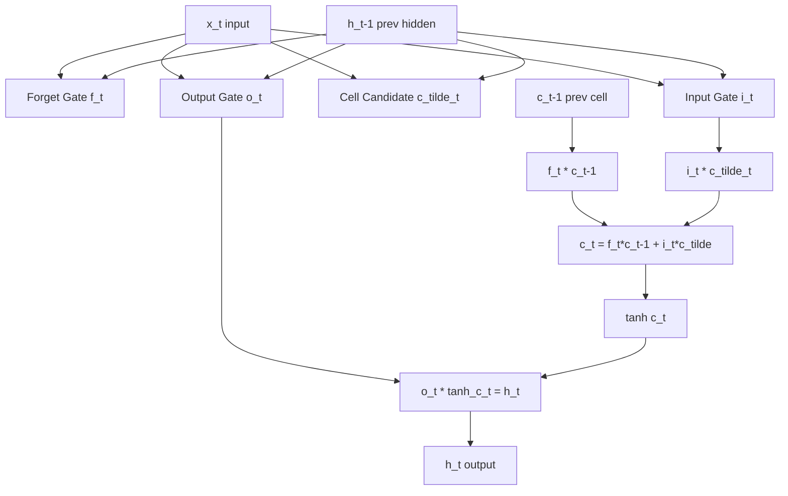

# Recurrent Neural Networks and LSTMs

## Detailed Explanation

Recurrent neural networks (RNNs) process sequences by maintaining a hidden state that is updated at each timestep: h_t = tanh(W_hh * h_{t-1} + W_xh * x_t + b). This allows the model to carry information across arbitrary sequence lengths in principle. In practice, vanilla RNNs fail on sequences longer than ~10-20 tokens due to the vanishing gradient problem: the gradient of the loss with respect to early hidden states involves a product of T Jacobian matrices. When the spectral radius of W_hh is below 1, this product shrinks exponentially; when it exceeds 1, gradients explode. Either way, the model cannot learn long-range dependencies.

LSTMs (Long Short-Term Memory, Hochreiter & Schmidhuber 1997) solve this with an explicit memory cell c_t whose updates are additive rather than multiplicative. Four gates control information flow: the forget gate (f_t) decides what to discard from c_{t-1}; the input gate (i_t) decides what new information to write; the cell update (c_tilde_t) computes candidate values; the output gate (o_t) controls what is read from c_t into h_t. Because the cell state c_t flows through time via addition (c_t = f_t * c_{t-1} + i_t * c_tilde_t), gradients traverse long sequences without the multiplicative shrinkage that kills vanilla RNNs.

GRUs (Gated Recurrent Units, Cho 2014) simplify LSTM to two gates: a reset gate that controls how much of the previous hidden state to forget, and an update gate that interpolates between the old hidden state and a candidate new one. GRUs have 25% fewer parameters than LSTMs and often match their performance, making them the preferred default when computational budget is tight.

## Core Intuition

An RNN is a function applied repeatedly to a running summary of everything it has read so far — like a reader who updates their mental model of a story with each new sentence. The vanishing gradient problem means that after many updates, the early parts of the story are "forgotten" because the gradient signal that would reinforce them has been mathematically multiplied away to zero. LSTM solves this by adding a dedicated "memory lane" (the cell state) that carries information across time with controlled gating rather than blind multiplication, allowing the model to remember that a conversation started with a question when it reaches the answer 50 tokens later.

## How It Works

1. **Vanilla RNN step:** Compute h_t = tanh(W_hh * h_{t-1} + W_xh * x_t). The hidden state h_t is both the output and the "memory" passed to the next step. W_hh and W_xh are shared across all timesteps.
2. **LSTM gates (per timestep):**
   - Forget gate: f_t = sigmoid(W_f * [h_{t-1}, x_t] + b_f) — values near 0 erase, near 1 preserve cell memory.
   - Input gate: i_t = sigmoid(W_i * [h_{t-1}, x_t] + b_i) — controls how much new info enters.
   - Cell candidate: c_tilde_t = tanh(W_c * [h_{t-1}, x_t] + b_c) — new candidate values.
   - Cell update: c_t = f_t * c_{t-1} + i_t * c_tilde_t — additive update, gradient highway.
   - Output gate: o_t = sigmoid(W_o * [h_{t-1}, x_t] + b_o).
   - Hidden state: h_t = o_t * tanh(c_t).
3. **GRU (two gates):** Reset gate r_t and update gate z_t. h_t = (1 - z_t) * h_{t-1} + z_t * tanh(W * [r_t * h_{t-1}, x_t]).
4. **Sequence classification:** Feed the entire sequence, take h_T (final hidden state) as the document representation, pass to a linear classifier.
5. **Bidirectional RNN:** Run one RNN left-to-right, another right-to-left, concatenate both final states. Captures both left and right context for each token.
6. **Training with BPTT:** Backpropagation Through Time unrolls the RNN into a T-layer feedforward network and computes gradients. Gradient clipping (clip norm to 5.0) prevents explosion.

## Architecture / Trade-offs

### RNN vs LSTM vs GRU Comparison

| Property | Vanilla RNN | LSTM | GRU |
|----------|-------------|------|-----|
| Parameters | Fewest | Most (4x hidden_size^2) | Medium (3x hidden_size^2) |
| Max useful seq length | ~10-20 tokens | ~200-500 tokens | ~100-300 tokens |
| Training stability | Poor (vanishing grad) | Good | Good |
| Training speed | Fastest | Slowest | ~1.3x faster than LSTM |
| Memory | Lowest | Highest | Medium |
| Performance (NLP) | Poor | Strong baseline | Similar to LSTM |
| Use when | Toy tasks, ablations | Long sequences, high stakes | Default choice |

### Bidirectional vs Unidirectional

| Aspect | Unidirectional | Bidirectional |
|--------|---------------|---------------|
| Context | Left-to-right only | Full sentence context |
| Latency | Online (causal) | Requires full sequence |
| Use case | Language modeling, generation | Classification, NER, tagging |
| Parameters | N | 2N |

### Gradient Health Indicators

| Symptom | Cause | Fix |
|---------|-------|-----|
| Loss is NaN after few steps | Gradient explosion | Clip gradient norm to 1.0-5.0 |
| Loss plateaus, early tokens ignored | Vanishing gradient | Switch to LSTM/GRU |
| Training loss ok, validation diverges | Overfitting on short sequences | Dropout between RNN layers (0.2-0.5) |
| Loss oscillates | Learning rate too high | Reduce lr by 5-10x |

## Interview Q&A

**Q: Explain why the vanilla RNN has a vanishing gradient problem. What specifically causes it?**

A: During backpropagation, the gradient of the loss with respect to h_0 is dL/dh_T * (dh_T/dh_{T-1}) * ... * (dh_1/dh_0). Each Jacobian dh_t/dh_{t-1} = diag(1 - h_t^2) * W_hh. If the singular values of W_hh are less than 1, this product of T matrices shrinks exponentially toward zero. With T=50, a singular value of 0.9 gives 0.9^50 ≈ 0.005 — essentially no gradient signal reaches the early timesteps. LSTM solves this by making c_t = f_t * c_{t-1} + ... where the forget gate f_t is close to 1 during long-range memory, creating a gradient highway with coefficient approximately 1.

**Q: When would you use a GRU instead of an LSTM?**

A: GRU is the better default when you want to minimize parameters and training time while matching LSTM quality on medium-length sequences (up to ~200 tokens). It has one fewer gate, roughly 25% fewer parameters, and trains faster. LSTM is preferred when sequence lengths are very long (500+ tokens), when you need fine-grained control over memory (the separate forget/input/output gates provide more flexibility), or on tasks where empirical evidence shows LSTM outperforms GRU for your specific domain. In practice, try GRU first — if it underperforms, switch to LSTM.

**Q: A classmate says "just use transformers, RNNs are obsolete." When would you still choose an LSTM?**

A: LSTMs are still appropriate when: (1) you need to process tokens online/streaming (transformers require the full sequence upfront); (2) you have very long sequences where quadratic attention is prohibitively expensive and you cannot afford sliding window attention; (3) you have tight memory constraints — an LSTM cell uses O(hidden_size) memory per timestep vs O(seq_len^2) for full attention; (4) you are deploying on edge hardware without GPU, where simple LSTM cells run efficiently. Transformers dominate on accuracy, but LSTMs win on latency-constrained streaming tasks.

**Q: What does gradient clipping do and when should you apply it?**

A: Gradient clipping rescales the gradient tensor to have a maximum norm (e.g., 5.0) before the parameter update. It prevents gradient explosion where a single large gradient update destabilizes all parameters. Apply it whenever training RNN/LSTM — these architectures are particularly prone to explosion because gradients propagate through many timesteps. You should see stable training loss; if loss suddenly jumps to NaN, clipping was needed earlier. The typical value is clip_norm=1.0 for LSTM, up to 5.0 for tasks that need sharper gradients. Clipping does not help with vanishing gradients — only architecture changes (LSTM, GRU) address that.

**Q: How would you implement a language model with an LSTM that generates text?**

A: Train the LSTM to predict the next token at each position: loss = cross-entropy(h_t @ W_proj, x_{t+1}) summed over all timesteps. At inference, sample from the softmax distribution over the vocabulary: x_{t+1} ~ softmax(h_t @ W_proj / temperature). Temperature above 1 increases diversity (flatter distribution); below 1 sharpens the distribution toward the argmax. The hidden state h_t and cell state c_t are passed forward from each generated token to the next. This is autoregressive generation — the same principle used by GPT models, just with attention instead of recurrence.

**Q: You are training a bidirectional LSTM for NER. Training loss is low but the model tags sequences of length 80 poorly. What would you investigate?**

A: First check gradient norms at each timestep during training — if they collapse near timestep 0 (the start of the sequence), you have a vanishing gradient issue despite LSTM. Fixes: increase hidden size, add a second LSTM layer, or use gradient checkpointing. Second, check if the training data contains many examples at length 80 — if training distribution is skewed to shorter sequences, the model has not seen enough long examples. Third, investigate whether the long sequences have long-range dependencies — if the correct tag at position 80 depends on a token at position 5, the LSTM cell state may have been overwritten. In this case, adding attention over all LSTM hidden states would help.

## Best Practices

- **Always clip gradients during LSTM training** — use `torch.nn.utils.clip_grad_norm_(model.parameters(), max_norm=5.0)` before every optimizer step. This prevents NaN losses on long sequences.
- **Initialize hidden and cell states to zeros** — do this at the start of each batch/sequence, not once at model creation. Carrying state across batches causes dependency artifacts.
- **Use dropout between LSTM layers (not within layers)** — apply dropout to the output of each LSTM layer before feeding to the next. Within-layer recurrent dropout requires specialized implementations; standard dropout on inputs/outputs is safer.
- **Pack padded sequences for variable-length batching** — use `torch.nn.utils.rnn.pack_padded_sequence` and `pad_packed_sequence` to avoid computing over padding tokens. This is both correct and 20-30% faster.
- **Stack 2-3 LSTM layers for most tasks** — a single layer underfits on complex tasks. More than 3 layers adds parameters without consistent improvement and is harder to train.
- **Use hidden_size of 128-512** — 256 is a good default. Larger sizes help on complex tasks but require more data; smaller sizes train faster and generalize better with limited data.
- **Monitor the cell state magnitude** — if tanh(c_t) saturates consistently (values near +/-1), the LSTM is struggling to forget or update. Try reducing learning rate or adding layer normalization.

## Common Pitfalls

- **Forgetting to detach hidden state between batches:** When processing batches in sequence (e.g., language modeling with continuous text), you must call `hidden = hidden.detach()` before each batch. Without this, gradients flow back through all previous batches, consuming unbounded memory and eventually crashing. Symptom: memory grows linearly with training steps.

- **Not using pack_padded_sequence for padded batches:** Processing padding tokens adds noise (the model learns patterns in padding) and wastes computation. Padding tokens contribute to the loss unless explicitly masked. Always mask out padding in the loss computation or use packed sequences.

- **Incorrect sequence length for teacher forcing:** During training, the decoder input at each step should be the ground-truth target from the previous step, not the model's prediction. If you accidentally feed model predictions during training, you introduce exposure bias (the model never learns to recover from its own errors). This is subtle in seq2seq implementations — verify the tensor slicing is correct.

- **Using the same hidden state initialization for train and inference:** Models trained with always-zero initial hidden states will behave unexpectedly if you try to pass meaningful initial states at inference. Conversely, if you initialize with learned states at inference but trained with zeros, the distributions mismatch. Be consistent.

- **Applying layer normalization after the recurrent step instead of inside the gates:** Standard layer normalization applied to h_t after the LSTM step helps but leaves the gate activations unnormalized. For maximum stability, apply layer normalization inside each gate computation. PyTorch's `nn.LSTMCell` does not do this by default; you need a custom implementation.

## Related Concepts

- [Word Embeddings](./02-word-embeddings.md) — provide the input x_t at each RNN timestep
- [Seq2Seq and Attention](./04-seq2seq-attention.md) — uses stacked LSTMs as encoder and decoder
- [Text Preprocessing](./01-text-preprocessing.md) — converts raw text to integer indices fed into the embedding layer
