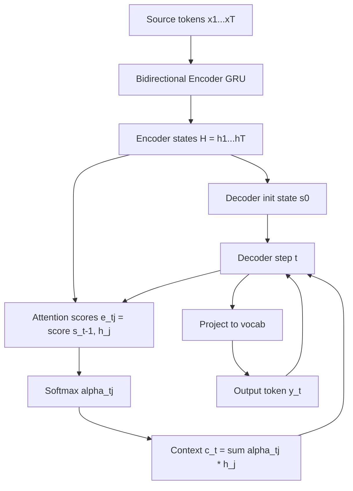

# Seq2Seq and Attention

## Detailed Explanation

Sequence-to-sequence (seq2seq) models transform one sequence into another of potentially different length. An encoder RNN reads the source sequence token by token, compressing the entire input into a fixed-length context vector c (the final hidden state). A decoder RNN then generates the target sequence one token at a time, conditioned on c. This architecture enabled the first neural machine translation systems that outperformed phrase-based statistical MT.

The fundamental bottleneck is c: no matter how long the source sequence, all information must fit into a single vector of dimension d_hidden. For short sentences this works; for paragraphs it catastrophically fails. Bahdanau et al. (2015) introduced attention to solve this. Instead of a single c, the decoder computes a different context vector c_t at each decoder timestep by taking a weighted sum of all encoder hidden states: c_t = sum_j(alpha_{tj} * h_j). The weights alpha_{tj} = softmax(score(s_{t-1}, h_j)) where s_{t-1} is the previous decoder state and h_j is the j-th encoder state. The additive (MLP) score function used by Bahdanau is: score(s, h) = v^T * tanh(W_s * s + W_h * h). Luong et al. (2015) simplified this to dot-product: score(s, h) = s^T * h.

Attention is not merely an engineering trick — it fundamentally changes what the model can represent. The attention weight matrix alpha_{tj} is an explicit alignment: which source words is the decoder attending to when generating target word t? For translation, this matrix diagonalizes (source word j aligns to target word t); for summarization it shows which source sentences were compressed into each output phrase. This interpretability was a precursor to the transformer, where attention replaced recurrence entirely in "Attention Is All You Need" (2017).

## Core Intuition

Seq2seq without attention is like summarizing a 100-page book from a single memory after reading it — you can catch the main theme but will miss details. Attention gives the decoder a photographic copy of the entire book and the ability to flip back to any page while writing each sentence: at each output word, it selects the most relevant source regions and reads from them. The attention weights are the model learning to read; the context vector is what it reads; and the decoder is the writer who uses those notes to generate the next word.

## How It Works

1. **Encoder:** Run a bidirectional LSTM/GRU over the source sequence. Each encoder hidden state h_j = [forward_h_j; backward_h_j] captures local context around position j. Stack: H = [h_1, h_2, ..., h_T] of shape (T_src, 2*d_hidden).
2. **Decoder initialization:** Initialize the decoder hidden state s_0 from the encoder final states (e.g., concatenate forward and backward, project with a linear layer).
3. **Attention score computation (per decoder step t):** For each encoder state h_j, compute e_{tj} = score(s_{t-1}, h_j). Additive: e_{tj} = v^T * tanh(W_a * s_{t-1} + U_a * h_j). Dot-product: e_{tj} = s_{t-1}^T * h_j.
4. **Attention weight normalization:** alpha_{tj} = softmax(e_{tj}) over j=1..T_src. Weights sum to 1 and represent which source positions are most relevant.
5. **Context vector:** c_t = sum_j(alpha_{tj} * h_j). This is a learned weighted average of encoder states.
6. **Decoder step:** Feed [embedding(y_{t-1}), c_t] into the decoder RNN. New state s_t = RNN(s_{t-1}, [embed(y_{t-1}); c_t]). Project to vocabulary: logits = W_out * s_t. Apply softmax and compute cross-entropy loss with target y_t.

## Architecture / Trade-offs

### Attention Score Functions

| Function | Formula | Pros | Cons | Use When |
|----------|---------|------|------|----------|
| Additive (Bahdanau) | v^T tanh(W_s*s + W_h*h) | Works for different dim(s) vs dim(h) | Slower, more parameters | Encoder/decoder dims differ |
| Dot-product (Luong) | s^T * h | Fast, no extra params | Requires same dimensions | Standard, default choice |
| Scaled dot-product | s^T*h / sqrt(d) | Prevents softmax saturation at large d | Marginal cost | Transformer self-attention |
| General (Luong) | s^T * W_a * h | Flexible, handles dim mismatch | Extra parameter matrix | When dims differ and speed matters |

### Seq2Seq Variants

| Model | Encoder | Decoder | Attention | Best For |
|-------|---------|---------|-----------|----------|
| Vanilla seq2seq | LSTM | LSTM | None | Short sequences (<20 tokens) |
| Bahdanau (2015) | Bi-LSTM | LSTM | Additive | Machine translation baseline |
| Luong (2015) | LSTM | LSTM | Dot-product | Faster translation |
| Transformer | Multi-head self-attention | Masked self-attention + cross-attention | Scaled dot-product | SOTA all tasks |

### Teacher Forcing Trade-offs

| Strategy | Training Speed | Inference Quality | Issue |
|----------|---------------|-------------------|-------|
| Always teacher forcing | Fast convergence | Exposure bias — model never sees own errors | Use at start of training |
| Never teacher forcing | Slow convergence | No exposure bias | Use for evaluation |
| Scheduled sampling | Moderate | Reduced bias | Gradually increase model-generated input fraction |
| RAML / MRT | Slow | Best quality | Minimum-risk training, complex to implement |

## Interview Q&A

**Q: What is the bottleneck problem in seq2seq without attention, and what sequence lengths does it affect?**

A: The bottleneck is the fixed-size context vector: the encoder must compress the entire source sequence into a single d-dimensional vector regardless of sequence length. For 5-token sentences, this compression is manageable. For 20+ token sentences, information is lost because the capacity of the vector is fixed while the information content grows with length. Empirical evidence shows BLEU scores (translation quality) drop significantly for sentences longer than 20-30 tokens with vanilla seq2seq. Attention addresses this by giving the decoder access to all T encoder states, scaling capacity with sequence length.

**Q: Explain what the attention weight matrix represents and why it is useful for debugging.**

A: The matrix alpha_{tj} has shape (T_target, T_source). Entry alpha_{tj} is the weight the decoder placed on source position j when generating target position t. For translation, a well-trained model should produce a near-diagonal matrix (source word j aligns to target word t for monotonic languages like English-French). For languages with different word orders (English-German with verb-final), the matrix should reflect the known reordering patterns. This makes attention a built-in alignment extractor. When the attention is diffuse (uniform weights across all source positions), the model is uncertain or has not learned meaningful alignment — useful signal that training has failed or that the sequence is out-of-distribution.

**Q: What is exposure bias and how does it affect seq2seq models at inference time?**

A: During training with teacher forcing, the decoder receives ground-truth tokens y_{t-1} as input at each step. At inference, it receives its own prediction y_hat_{t-1} instead. If the model made a wrong prediction at t-1, it encounters an input distribution never seen during training — this is exposure bias. The model has no learned strategy to recover from its own errors. Concretely, early mistakes compound: a wrong word at position 5 creates an unusual hidden state that causes wrong predictions at positions 6, 7, ... This is why beam search is important at inference — it maintains multiple candidate sequences and can recover when one hypothesis goes wrong.

**Q: How would you compare the seq2seq attention mechanism to the self-attention in a transformer?**

A: Seq2seq attention (cross-attention) computes attention between decoder states (queries) and encoder states (keys/values) — the query and key/value sets come from different sequences. Transformer self-attention computes attention within a single sequence — every position attends to all other positions in the same sequence. The mathematical mechanism is identical (scaled dot-product), but the interpretation differs: seq2seq attention learns source-target alignment; self-attention learns which positions in the source are mutually relevant (e.g., a pronoun attending to its antecedent). The transformer uses both: self-attention in the encoder and decoder, and cross-attention in the decoder to attend to encoder outputs.

**Q: When would you still use a seq2seq LSTM with attention today instead of a transformer?**

A: For online/streaming tasks where each output token must be generated before the next input token arrives, the recurrent decoder is naturally causal and has O(d) state per timestep. For resource-constrained deployment where the quadratic memory of full attention is too expensive. For very small datasets (fewer than 10K sentence pairs) where transformers overfit but LSTMs are more regularized. For tasks with well-defined monotonic alignments (simple copying, format conversion) where the attention mechanism provides strong enough inductive bias and transformers' positional encoding adds unnecessary complexity.

**Q: You train a seq2seq model for 50 epochs and the validation BLEU score peaks at epoch 20 then drops. What is happening?**

A: The model is overfitting. After epoch 20, it begins memorizing training sequence pairs rather than learning generalizable patterns. For seq2seq, overfitting is especially problematic because the decoder can memorize training target sequences conditioned on encoder states, producing fluent-looking but wrong outputs on new inputs. Fixes: (1) Add dropout to the LSTM layers (0.3-0.5) and to the embedding. (2) Add label smoothing to the cross-entropy loss (smooth the one-hot targets toward a uniform distribution). (3) Reduce model capacity — smaller hidden size or fewer layers. (4) Use early stopping based on validation BLEU.

**Q: How would you decode a seq2seq model more reliably than greedy argmax?**

A: Beam search maintains the top-B hypotheses at each decoding step, where B (beam width) is typically 4-10. At each step, it expands all B hypotheses with all V vocabulary options, scores them by cumulative log-probability, and keeps the top B. This prevents the "greedy trap" where choosing the locally best token closes off globally better continuations. Length penalty (divide score by length^alpha) prevents beam search from preferring short sequences. For production, B=4 usually captures most of the quality gain; B>10 has diminishing returns and is 10x slower than greedy.

## Best Practices

- **Use bidirectional encoder, unidirectional decoder** — the encoder has full access to the source and should use both directions; the decoder generates causally and must not see future target tokens.
- **Initialize decoder hidden state from encoder final states** — simply using zeros loses all the compressed source information that the encoder built up. Project the final encoder state with a learned linear layer to match decoder dimension.
- **Apply attention dropout during training** — add dropout to the attention weights alpha_{tj} before computing c_t. This prevents the decoder from over-relying on a small subset of encoder positions and acts as data augmentation over alignments.
- **Use length-normalized beam search** — penalize short hypotheses by dividing score by length^0.6. Without normalization, beam search systematically prefers shorter sequences because log-probs are negative and accumulate.
- **Train with label smoothing (epsilon=0.1)** — replace hard one-hot targets with (1-epsilon)*one_hot + epsilon/V. This prevents the model from being overconfident on the training labels and improves BLEU by 0.5-1.5 points.
- **Monitor attention entropy** — low entropy (sharp attention) means the decoder is confident about alignment; high entropy means it is uncertain. Persistently high entropy on training data indicates attention has not learned to align.
- **Clip gradients to norm 1.0** — seq2seq with attention has longer unrolled computation graphs than single RNNs; explosion is more likely.

## Common Pitfalls

- **Not masking padding in the attention scores:** If source sequences are padded to the same length, the attention mechanism will assign non-zero weights to padding positions unless they are explicitly masked. Add a large negative value (-1e9) to padding positions before the softmax so they receive zero attention weight. Failing to do this causes the context vector to be "contaminated" by padding, degrading performance especially on shorter sequences.

- **Teacher forcing mismatch at inference:** A very common bug — during inference, accidentally passing ground-truth tokens instead of model predictions to the decoder (or vice versa during training). Always verify the decoder input at each step by logging the first few tokens decoded and checking against the expected inference behavior.

- **Not detaching attention weights from the computation graph when visualizing:** If you compute and store attention weights inside the training loop without detaching, all intermediate computations remain in the computation graph, causing memory leaks. Always call alpha.detach().cpu().numpy() before storing for visualization.

- **Using dot-product attention with mismatched dimensions:** Dot-product attention requires dim(query) == dim(key). If the encoder is bidirectional (output dim = 2*d_hidden) and the decoder has hidden size d_hidden, the dimensions do not match. Fix: project encoder outputs with a linear layer to match decoder dimension, or use additive (Bahdanau) attention which handles dimension mismatches via learned weight matrices.

- **Forgetting to mask the decoder self-attention in transformer-based decoders:** When migrating from RNN seq2seq to transformer seq2seq, the decoder's self-attention must be causally masked so that position t cannot attend to positions t+1, t+2, ... during training. Without this mask, the decoder can simply copy the next target token from the attention context, producing perfect training loss but complete failure at inference.

## Related Concepts

- [RNNs and LSTMs](./03-recurrent-neural-networks.md) — the encoder and decoder backbone
- [Word Embeddings](./02-word-embeddings.md) — the input representation consumed by the encoder
- [Text Preprocessing](./01-text-preprocessing.md) — tokenization and vocabulary construction upstream of embedding
