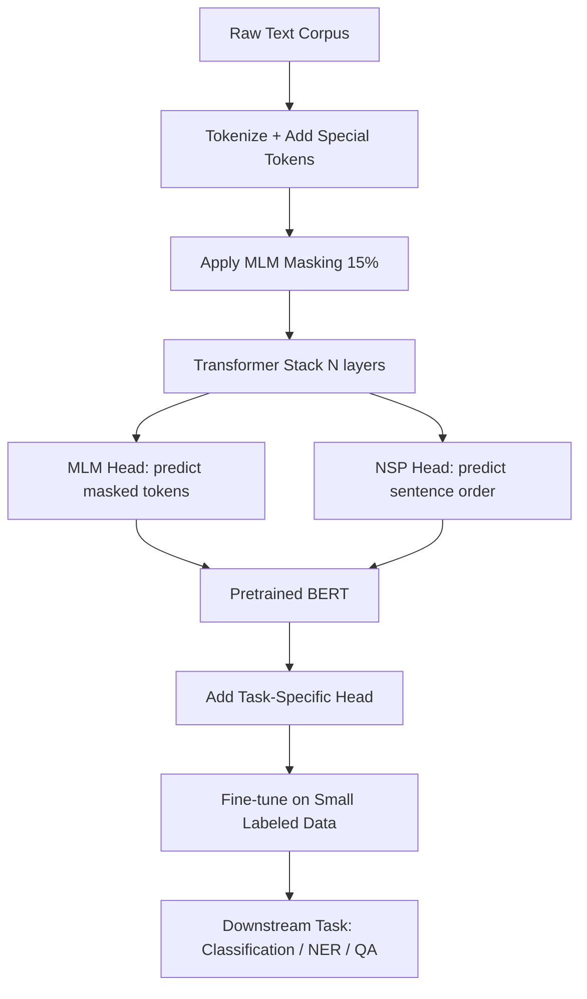

# BERT and Pretraining

## Detailed Explanation

BERT (Bidirectional Encoder Representations from Transformers) transformed NLP by introducing a pretraining paradigm that enables powerful transfer learning. Before BERT, models were typically trained unidirectionally — each token could only attend to past tokens. BERT's key innovation is bidirectionality: every token attends to every other token simultaneously, capturing richer contextual representations.

BERT pretraining consists of two objectives. Masked Language Modeling (MLM) randomly masks 15% of input tokens and trains the model to predict them from surrounding context. Of masked positions, 80% receive the [MASK] token, 10% are replaced with random tokens, and 10% remain unchanged — this prevents the model from learning to only predict [MASK] tokens. Next Sentence Prediction (NSP) trains the model to determine whether two sentences appear consecutively in text, building discourse-level understanding.

After pretraining on massive unlabeled corpora (Wikipedia + BookCorpus, ~3.3B words), BERT is fine-tuned on small labeled datasets for specific tasks. For classification, the [CLS] token embedding is fed to a task-specific head. For token-level tasks like NER, each token's output embedding feeds into a classifier. This pretrain-then-fine-tune paradigm dramatically reduces the labeled data requirement: BERT achieves state-of-the-art on many tasks with just hundreds or thousands of labeled examples.

BERT-base has 12 transformer layers, 768 hidden dimensions, 12 attention heads, and ~110M parameters. BERT-large has 24 layers, 1024 hidden, 16 heads, and ~340M parameters. Understanding the pretraining mechanics is essential for diagnosing fine-tuning failures and selecting appropriate learning rates.

## Core Intuition

BERT reads a sentence like a human re-reading a paragraph — every word can look at every other word simultaneously, so the meaning of "bank" in "river bank" versus "bank account" is disambiguated before any task-specific training begins. The MLM objective forces the model to become an expert fill-in-the-blank solver, which requires deep understanding of grammar, facts, and context. Because pretraining is done once on massive unlabeled text, fine-tuning on small labeled datasets becomes remarkably effective.

## How It Works

1. **Tokenize and add special tokens.** Wrap input with [CLS] (start) and [SEP] (sentence boundary). For NSP, concatenate two sentences: [CLS] Sentence A [SEP] Sentence B [SEP].

2. **Apply MLM masking.** Randomly sample 15% of tokens. Mask 80% with [MASK], replace 10% with random tokens, leave 10% unchanged. Store original tokens as prediction targets.

3. **Forward pass through transformer stack.** Each layer applies multi-head self-attention (all tokens attend to all others) followed by a feed-forward network. Layer normalization and residual connections stabilize training.

4. **Compute MLM loss.** Only compute loss on masked positions — cross-entropy between predicted distribution and original token. Non-masked positions do not contribute to MLM loss.

5. **Compute NSP loss.** Use the [CLS] embedding to classify whether sentence B follows sentence A (binary cross-entropy).

6. **Fine-tune on downstream tasks.** Add a small head on top of [CLS] for classification or on token outputs for sequence labeling. Use small learning rate (1e-5 to 3e-5) to avoid catastrophic forgetting of pretrained representations.

## Architecture / Trade-offs

### BERT Variants Comparison

| Model | Layers | Hidden | Heads | Params | Speed | Accuracy |
|-------|--------|--------|-------|--------|-------|----------|
| BERT-tiny | 2 | 128 | 2 | 4.4M | Very fast | Limited |
| BERT-small | 4 | 512 | 8 | 29M | Fast | Good |
| BERT-base | 12 | 768 | 12 | 110M | Moderate | Strong |
| BERT-large | 24 | 1024 | 16 | 340M | Slow | Best |
| DistilBERT | 6 | 768 | 12 | 66M | 2x faster | 97% of base |

### Fine-tuning Approaches

| Approach | Learning Rate | Epochs | When to Use |
|----------|--------------|--------|-------------|
| Full fine-tune | 1e-5 to 3e-5 | 3-5 | >1K labeled examples |
| Freeze lower layers | 3e-5 to 1e-4 | 5-10 | 100-1K examples |
| Head only | 1e-3 to 1e-2 | 10-20 | <100 examples |
| Few-shot prompting | N/A | N/A | <10 examples |

### MLM vs Autoregressive Pretraining

| Property | MLM (BERT) | Autoregressive (GPT) |
|----------|------------|----------------------|
| Bidirectionality | Yes (all context) | No (left-to-right only) |
| Best for | Understanding tasks | Generation tasks |
| Efficiency | Predict 15% tokens | Predict all tokens |
| Fine-tuning cost | Low | Low |
| Prompting | Weaker | Stronger |

## Interview Q&A

**Q: Why does BERT mask only 15% of tokens rather than more?**
A: Masking too many tokens makes the task too hard — surrounding context becomes insufficient for reliable prediction. At 15%, there are typically 10-15 visible tokens providing context for each masked one. Empirically, 15% was found to balance task difficulty against useful signal per training step. If you mask 50%, the model trains on harder examples but with noisier gradients and slower convergence.

**Q: Why use the 80/10/10 masking split instead of always using [MASK]?**
A: At inference, real text never contains [MASK] tokens — a mismatch that hurts fine-tuning if the model only ever sees [MASK] during training. The 10% random replacement forces the model to maintain good representations for all tokens (not just masked ones), because any token might need to be predicted. The 10% unchanged teaches the model not to blindly predict every position it sees.

**Q: What is the first sign that catastrophic forgetting is occurring during fine-tuning?**
A: Validation loss diverges or spikes after epoch 1-2 while training loss keeps dropping, particularly on tasks with small datasets. You'd also see poor performance on held-out examples that were semantically similar to pretrained training data. Debug by reducing learning rate to 1e-5 or implementing layer-wise learning rate decay (lower layers get smaller lr).

**Q: When would you choose mean pooling of token outputs over the [CLS] embedding for sentence representation?**
A: For semantic similarity tasks, mean pooling over all token embeddings typically outperforms [CLS] because [CLS] is not explicitly trained to summarize sentence meaning — it's trained for NSP which is a weaker signal. Use mean pooling when building retrieval systems or computing sentence similarity. Use [CLS] when you fine-tune end-to-end on a classification task, where the [CLS] representation gets specialized during fine-tuning.

**Q: How does pretraining help when you only have 50 labeled examples for a new task?**
A: BERT's pretrained weights already encode grammar, factual knowledge, and word sense disambiguation. Fine-tuning requires only adjusting the top layers to recognize task-specific patterns — most of the heavy lifting is already done. With random initialization, 50 examples are hopelessly insufficient to learn representations from scratch. You'd expect BERT fine-tuned on 50 examples to outperform a from-scratch model trained on 500+ examples for most NLP tasks.

**Q: What trade-off do you face between BERT-base and BERT-large in a production system?**
A: BERT-large provides ~1-3% better accuracy on most benchmarks but runs 3-4x slower at inference and requires 3x more GPU memory. For latency-sensitive APIs (< 100ms budget), BERT-base or DistilBERT is typically preferred. Use BERT-large only when accuracy gain justifies cost — for high-stakes classification, medical NLP, or offline batch processing where throughput matters more than per-query latency.

**Q: Why does NSP training improve performance on question answering but not always sentence classification?**
A: NSP teaches the model to understand relationships between two text segments — exactly the structure of QA (question + context passage). For single-sentence classification, the inter-sentence relationship signal is irrelevant, and NSP training may slightly dilute focus on token-level semantics. Some later work (RoBERTa) removes NSP entirely and finds equal or better performance on most tasks, confirming this hypothesis.

## Best Practices

- Use learning rate warmup for the first 6-10% of training steps, then linear decay to prevent early-training instability from large gradient updates.
- Apply weight decay (0.01) to all parameters except bias and LayerNorm weights to regularize without harming normalization layers.
- Freeze the bottom half of BERT layers when fine-tuning on very small datasets (<500 examples) — lower layers encode general linguistic features that rarely need task-specific adjustment.
- Use gradient clipping (max_norm=1.0) to prevent gradient explosions, especially in the first few epochs of fine-tuning.
- Run at least 3 fine-tuning runs with different random seeds and report mean/std — BERT fine-tuning shows high variance on small datasets, and a single run can be misleading.
- For sequence labeling tasks (NER, POS), use WordPiece token alignment carefully: when a word splits into multiple subword tokens, propagate the label from the first subword to others or use only the first subword's prediction.
- Monitor the [CLS] embedding norm across training — if it collapses to near-zero or explodes, your learning rate is too high.

## Common Pitfalls

- **Learning rate too high (>1e-4):** The pretrained weights are destroyed in the first epoch. Loss may drop initially but generalization collapses to near-random. Fix: use 1e-5 to 3e-5 for most tasks, with warmup steps = 10% of total.

- **Not handling WordPiece subword alignment for token-level tasks:** When tokenizing "New York" as ["New", "York"], the task might label at word level, not subword level. If you assign labels to all subword tokens, the model gets conflicting supervision. Fix: only compute loss on first-subword positions; mask the rest.

- **Forgetting position embeddings and token type embeddings:** BERT uses three embedding types (token + position + segment). Omitting segment embeddings for two-sentence tasks causes incorrect attention patterns. Fix: always pass `token_type_ids` when processing sentence pairs.

- **Evaluating on the same data used for threshold selection:** In classification with imbalanced classes, picking a threshold on the training set and evaluating on the same set inflates metrics. Fix: use a held-out validation set for threshold selection, test set for final evaluation.

- **Truncating long documents naively:** BERT has a 512-token limit. Naively truncating cuts off the end of documents, missing important content. Fix: use sliding window with overlap, or select the most relevant 512 tokens based on query similarity.

## Related Concepts

- [Text Classification](./06-text-classification.md) — using BERT [CLS] embeddings for classification
- [Named Entity Recognition](./07-named-entity-recognition.md) — BERT token outputs for sequence labeling
- [Information Retrieval](./08-information-retrieval.md) — BERT as bi-encoder or cross-encoder for retrieval
