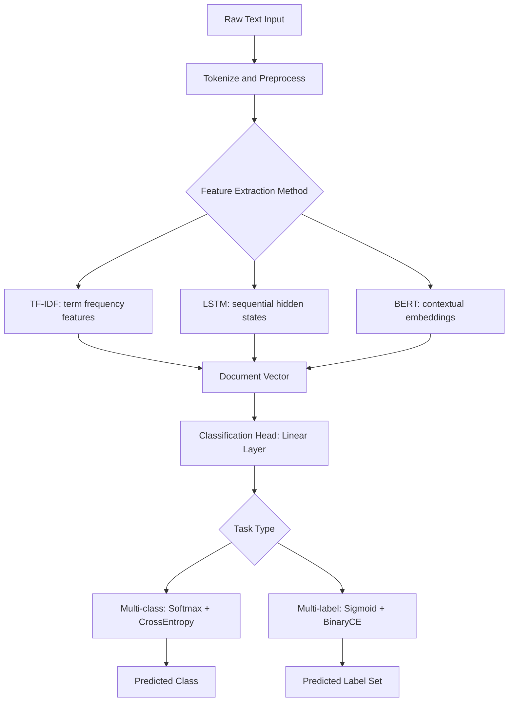

# Text Classification

## Detailed Explanation

Text classification is the task of assigning a predefined category label to a text input. It is one of the most widely deployed NLP tasks in production, covering sentiment analysis, spam detection, topic categorization, intent recognition in dialogue systems, and content moderation. Despite its apparent simplicity, text classification presents real engineering challenges: class imbalance, multi-label scenarios, distribution shift, and the trade-off between model complexity and inference speed.

The landscape of approaches spans four generations. Classical methods — TF-IDF combined with logistic regression or SVM — remain remarkably competitive on clean datasets with sufficient training data, running in milliseconds per query and being highly interpretable. Recurrent models (LSTM, GRU) capture sequential structure and handle variable-length inputs naturally but are slower to train and less parallelizable. Transformer-based models (fine-tuned BERT) achieve the highest accuracy by leveraging pretrained contextual representations but require significant GPU resources and add inference latency. Few-shot approaches using large language model prompting avoid labeled data entirely but trade away control and consistency.

Evaluation requires care. Accuracy is misleading when classes are imbalanced — a model predicting the majority class always achieves high accuracy. Macro-F1 (average F1 across classes weighted equally) is the right metric when rare classes matter as much as common ones. Per-class precision and recall help diagnose which classes are problematic.

Multi-label classification (each document may belong to multiple categories) requires independent sigmoid outputs rather than a softmax, binary cross-entropy loss per label, and per-class threshold tuning. Conflating multi-label with multi-class is one of the most common implementation errors.

## Core Intuition

Classifying text is fundamentally about finding which features of the input are predictive of the label, and text has an enormous, sparse feature space. TF-IDF finds discriminative keywords; LSTMs track how meaning builds across a sequence; BERT asks what each word means in context of every other word. The right tool depends on how much labeled data you have, what your latency budget is, and whether subtle context is needed — for a spam filter with millions of labeled examples, TF-IDF+LR may outperform fine-tuned BERT while being 100x cheaper to serve.

## How It Works

1. **Preprocess and tokenize.** Clean text (lowercase, remove HTML), tokenize into words or subword tokens. For TF-IDF, build vocabulary; for neural models, map to embedding indices.

2. **Extract features.** TF-IDF computes term frequency weighted by inverse document frequency. Neural models produce dense embeddings (word2vec, LSTM hidden states, BERT contextualized embeddings).

3. **Aggregate to sentence/document level.** TF-IDF is already document-level. For LSTMs, use final hidden state or attention pooling. For BERT, use [CLS] embedding or mean pool token outputs.

4. **Apply classification head.** Linear classifier (logistic regression or linear layer) maps the fixed-size vector to class logits. Apply softmax for multi-class or sigmoid for multi-label.

5. **Compute loss and optimize.** Cross-entropy for multi-class; binary cross-entropy per label for multi-label. Apply class weights to counter imbalance.

6. **Select decision threshold.** Default is argmax (multi-class) or 0.5 per class (multi-label). Tune threshold on validation set by optimizing F1, precision, or recall depending on business constraint.

## Architecture / Trade-offs

### Model Comparison for Text Classification

| Model | Accuracy (1K labels) | Accuracy (100K labels) | Inference Time | Interpretable |
|-------|----------------------|------------------------|----------------|---------------|
| TF-IDF + LR | Good | Very Good | <1ms | Yes |
| TF-IDF + SVM | Good | Very Good | <1ms | Partially |
| CNN (text) | Better | Better | 5-10ms | No |
| LSTM | Better | Better | 10-20ms | No |
| BERT fine-tune | Best | Best | 50-100ms | No |
| Few-shot LLM | Variable | Variable | 200-500ms | No |

### Handling Class Imbalance

| Strategy | When to Use | Effect on Precision | Effect on Recall |
|----------|-------------|--------------------|--------------------|
| No adjustment | Balanced data | Neutral | Neutral |
| Class weights in loss | Moderate imbalance (3:1 to 10:1) | May decrease | Increases |
| Oversampling minority | Severe imbalance (>10:1) | Neutral | Increases |
| Undersampling majority | Very large datasets | Neutral | Increases |
| Threshold tuning | Post-training adjustment | Tunable | Tunable |

### Multi-class vs Multi-label

| Property | Multi-class | Multi-label |
|----------|-------------|-------------|
| Output activation | Softmax | Sigmoid per class |
| Loss function | CrossEntropyLoss | BCEWithLogitsLoss |
| Labels per example | Exactly one | Zero or more |
| Threshold | Argmax | Per-class (typically 0.3-0.5) |
| Evaluation | Accuracy, macro-F1 | Micro-F1, Hamming loss |

## Interview Q&A

**Q: When would you recommend TF-IDF + logistic regression over fine-tuning BERT for a classification task?**
A: When you have >50K labeled examples, simple keyword patterns drive the decision (spam: "click here", "winner"), inference latency must be under 5ms, or compute resources are limited. TF-IDF+LR trains in seconds rather than hours, is easily auditable, and degrades gracefully with noisy labels. BERT only pays off when context matters — "I love this" vs "I love how terrible this is" — or when labeled data is scarce and pretrained representations fill the gap.

**Q: Your model achieves 95% accuracy but the product team says it is missing the minority class. What happened and how do you fix it?**
A: The dataset is likely imbalanced — 95% accuracy could be achieved by predicting the majority class every time. Switch to macro-F1 as the primary metric, which weights each class equally. Then address the imbalance: add `class_weight='balanced'` in sklearn's LogisticRegression, or compute `pos_weight = neg_count / pos_count` for PyTorch's BCEWithLogitsLoss. Check whether threshold tuning alone (lowering from 0.5 to 0.3) recovers recall on the minority class without retraining.

**Q: What is the trade-off between micro-F1 and macro-F1 in multi-class classification evaluation?**
A: Micro-F1 pools all predictions across classes before computing F1, so it is dominated by the majority class and gives a picture of overall system performance. Macro-F1 computes F1 per class then averages equally, treating a rare class as important as a common one. Use micro-F1 when raw throughput matters (spam filter processing millions of emails); use macro-F1 when all classes matter equally (a content moderation system where missing any harmful category is costly).

**Q: How would you handle a new text classification task where fine-tuning converges but validation accuracy is poor after epoch 1?**
A: Possible causes in order: (1) learning rate too high — try 3e-5 instead of 1e-4, add warmup; (2) overfitting — add dropout, reduce model capacity, or use early stopping; (3) class imbalance — add class weights; (4) insufficient data — try data augmentation (synonym replacement, back-translation) or switch to few-shot prompting. Systematically rule out each by checking training/validation loss curves and per-class performance breakdown.

**Q: Describe how you would tune the decision threshold for a binary classifier in a production system.**
A: Compute the full precision-recall curve on a held-out validation set by sweeping thresholds from 0 to 1. Select the threshold based on the business constraint: if false positives are costly (wrongly flagging legitimate emails as spam), maximize precision at a target recall floor (e.g., recall >= 0.9). If false negatives are costly (missing fraud), maximize recall at a precision floor. Lock the threshold and monitor it in production — score distributions shift with new data, requiring periodic re-calibration.

**Q: When implementing multi-label classification, what is the specific change to make compared to standard multi-class?**
A: Four changes: (1) replace softmax with sigmoid on the output layer so probabilities for each class are independent; (2) replace CrossEntropyLoss with BCEWithLogitsLoss; (3) for evaluation, apply per-class thresholds (often tuned per class on validation set) rather than argmax; (4) use Hamming loss or micro/macro F1 rather than accuracy, because "all labels correct" is too strict for multi-label.

## Best Practices

- Always establish a TF-IDF + logistic regression baseline before training neural models — it is fast, interpretable, and often surprisingly competitive. Use it to validate that your data preprocessing and evaluation pipeline are correct.
- For neural models, use batch sizes of 16-64 for fine-tuning BERT; smaller batches (16-32) provide better gradient estimates for small datasets.
- Apply learning rate warmup over the first 6-10% of steps when fine-tuning transformers, then decay linearly to zero to avoid training instability.
- Monitor per-class F1 throughout training, not just overall accuracy — aggregate metrics can hide a class that the model completely ignores.
- For production, use threshold optimization on a dedicated validation set, not the test set — reserve the test set for final holdout evaluation only.
- When using BERT for classification, mean pooling of all token outputs often outperforms just [CLS] for short texts; test both on your validation set.
- Log prediction confidence distributions in production to detect distribution shift early — a sudden shift toward lower-confidence predictions indicates the model is encountering out-of-distribution inputs.

## Common Pitfalls

- **Using accuracy on imbalanced data:** A model that predicts the majority class 100% of the time achieves high accuracy but zero utility. Fix: always compute macro-F1 and per-class precision/recall before concluding a model is working.

- **Applying softmax to multi-label problems:** Softmax normalizes probabilities to sum to one, which forces the model to compete classes against each other. In multi-label, a document can belong to all classes simultaneously. Fix: switch to sigmoid activation and BCEWithLogitsLoss.

- **Data leakage through train/val split of sequences:** If documents belong to a user and you split at the document level, user-level patterns bleed from train to val. Fix: split at the user or source level to get an honest estimate of generalization.

- **Forgetting to handle unseen vocabulary at inference:** A TF-IDF model trained on train-set vocabulary silently drops OOV tokens at inference, which can cause severe degradation on domain-specific queries. Fix: use subword tokenization (character n-grams in sklearn) or monitor OOV rates in production.

- **Evaluating multi-label accuracy as exact match:** "Exact match" (all labels correct) is almost always near zero for multi-label problems with many classes. Fix: use label-level micro-F1, Hamming loss, or coverage metrics depending on the product requirement.

## Related Concepts

- [BERT and Pretraining](./05-bert-and-pretraining.md) — BERT [CLS] embedding as classification feature
- [Named Entity Recognition](./07-named-entity-recognition.md) — sequence labeling as alternative output structure
- [Information Retrieval](./08-information-retrieval.md) — retrieval as an alternative to direct classification for large label spaces
