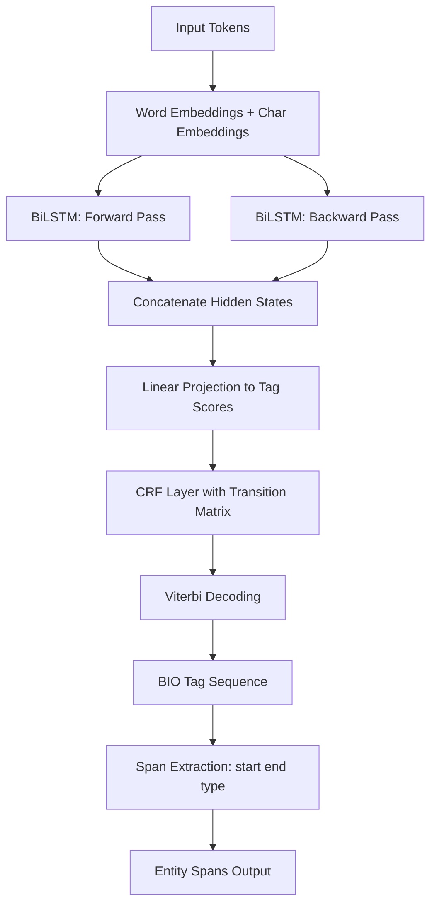

# Named Entity Recognition

## Detailed Explanation

Named Entity Recognition (NER) is a sequence labeling task that identifies and classifies named entities in text — persons (PER), organizations (ORG), locations (LOC), and miscellaneous named entities (MISC) such as product names or events. Unlike text classification where a single label is assigned to a document, NER assigns a label to each individual token, making it a structured prediction problem.

The dominant encoding scheme is BIO tagging: B-TYPE marks the first token of an entity of that type, I-TYPE marks continuation tokens inside the entity, and O marks non-entity tokens. A sequence like "Steve Jobs founded Apple in 1976" becomes: B-PER I-PER O O B-ORG O O. This encoding allows arbitrary-length entity spans to be represented with a flat token-level label sequence.

Two mainstream model families exist for NER. BiLSTM-CRF was the state of the art before transformers: a bidirectional LSTM produces contextual token features, and a Conditional Random Field (CRF) output layer adds explicit transition constraints (e.g., I-PER cannot follow B-ORG). The CRF ensures that the globally optimal valid tag sequence is decoded via the Viterbi algorithm. Transformer-based NER (BERT with a token classification head) achieves higher accuracy but at greater inference cost.

Evaluation in NER uses span-level F1, not token-level accuracy. An entity is correctly identified only if both its boundaries and type are exactly correct. A model that labels "Steve" as B-PER but "Jobs" as O gets zero credit for the "Steve Jobs" entity. This strict evaluation accurately reflects the utility of NER outputs in downstream systems.

## Core Intuition

NER is fundamentally about recognizing patterns at two levels simultaneously: local patterns (capitalization, surrounding words, morphology) that suggest a token is part of a named entity, and global constraints (entity types have consistent internal structure — I-PER must follow B-PER, never B-ORG) that ensure the output is a valid sequence of spans. The CRF layer is the mechanism for enforcing global consistency — it replaces greedy per-token prediction with a global search for the highest-scoring valid sequence.

## How It Works

1. **Tokenize the input sentence.** Convert words to token IDs or character/word embeddings. For BiLSTM models, words are typically represented by pretrained word embeddings (GloVe) plus optional character-level embeddings to handle rare words.

2. **Run bidirectional LSTM to produce contextual features.** Forward LSTM reads left-to-right; backward LSTM reads right-to-left. Concatenate hidden states at each position to get a context-aware feature vector for each token.

3. **Project features to tag space.** A linear layer maps each token's feature vector to a score vector of size |tag_vocabulary| (e.g., B-PER, I-PER, B-ORG, ..., O).

4. **CRF decoding with Viterbi algorithm.** The CRF transition matrix contains learned scores for each valid tag-to-tag transition. Viterbi decoding finds the globally optimal tag sequence by dynamic programming, enforcing constraints like no I-X following B-Y.

5. **Compute CRF loss during training.** The loss is the negative log-likelihood of the correct tag sequence under the CRF: log P(y|x) = score(y,x) - log(sum of scores over all valid sequences). Computed efficiently with the forward algorithm.

6. **Extract entity spans from predicted tags.** Post-process BIO tags into (start, end, type) spans. Handle edge cases: truncated entities at sentence boundaries, malformed tag sequences (I-PER at sentence start treated as B-PER).

## Architecture / Trade-offs

### NER Model Comparison

| Model | Accuracy (F1) | Training Speed | Inference Speed | Memory |
|-------|--------------|----------------|-----------------|--------|
| Rule-based + gazetteer | ~70-80% | Instant | Very fast | Low |
| BiLSTM (no CRF) | ~80-85% | Fast | Fast | Low |
| BiLSTM-CRF | ~85-90% | Fast | Moderate | Low |
| BERT token classification | ~90-93% | Slow (GPU) | Moderate | High |
| BERT + CRF | ~91-94% | Slow (GPU) | Moderate | High |

### BIO vs BIOES Tagging Schemes

| Scheme | Tags | Entity span example | Expressiveness |
|--------|------|---------------------|---------------|
| BIO | B, I, O | B-PER I-PER | Standard |
| IO | I, O | I-PER I-PER | Ambiguous for adjacent same-type entities |
| BIOES | B, I, O, E, S | B-PER E-PER or S-PER | Unambiguous, richer |
| BILOU | B, I, L, O, U | B-PER L-PER or U-PER | Same as BIOES, different naming |

### Token-level vs Span-level Evaluation

| Metric | What it Measures | Common Failure Mode |
|--------|-----------------|---------------------|
| Token accuracy | Fraction of tokens correctly labeled | Rewarded for getting O tokens right (majority class) |
| Token-level F1 | F1 on non-O tokens | Partial credit for boundary errors |
| Span-level F1 | Exact boundary + type match | Strict, matches downstream utility |
| Partial span F1 | Overlap-based credit | Useful for long entities in information extraction |

## Interview Q&A

**Q: Why is span-level F1 the standard evaluation metric for NER rather than token-level accuracy?**
A: Token-level accuracy is dominated by the O class — in a typical sentence, 70-90% of tokens are O. A model that labels everything as O achieves 80%+ token accuracy while extracting zero entities. Span-level F1 requires exactly correct entity boundaries and type, which directly measures whether the NER output is useful for downstream systems (relation extraction, knowledge graph population, information retrieval). Getting "New York" but missing "New" still gives zero credit, matching real-world utility.

**Q: What specific benefit does a CRF layer add over a simple softmax on BiLSTM outputs?**
A: Softmax makes independent per-token decisions, so it can produce globally invalid sequences like I-PER at the start of a sentence or I-ORG following B-PER. The CRF learns a transition matrix that scores sequence-level patterns and uses Viterbi decoding to find the globally optimal valid sequence. In practice, adding CRF improves span-level F1 by 1-3% because it eliminates impossible transitions, which matter most at entity boundaries.

**Q: How would you handle subword tokenization when fine-tuning BERT for NER?**
A: BERT's WordPiece tokenizer may split "Washington" into ["Wash", "##ington"] but the NER label "B-LOC" belongs to the whole word. The standard approach: align labels to the first subword token of each word and ignore loss on continuation subwords (prefix "##"). At inference, take the prediction from the first subword of each word. This prevents the model from getting conflicting supervision (B-LOC for "Wash" and I-LOC for "##ington" are not what the annotation provides).

**Q: Your NER model confuses PER and ORG frequently. What are the likely causes and how would you debug it?**
A: Common causes: (1) training data has ambiguous cases ("Apple" as ORG vs apple as fruit); (2) entity names appear in both categories across documents ("Jordan" as person vs "Jordan" as country); (3) insufficient training examples for one type. Debug by computing a confusion matrix at entity type level, identifying the most common substitution pairs, then reviewing specific examples. Fix by adding more annotated examples of confused types or using entity disambiguation rules (syntactic context: "Jordan said" vs "visited Jordan").

**Q: How would you design a NER system for a domain with many unseen entity names at test time?**
A: Entities shift faster than syntax — new products, people, and companies appear constantly. Approaches in order of robustness: (1) character-level embeddings (CNN or BiLSTM over characters) learn morphological patterns ("Inc.", capitalization) that generalize to unseen names; (2) use a gazetteer (external entity list) as additional binary feature; (3) fine-tune a large pretrained transformer which has seen entity surface forms in pretraining; (4) use retrieval augmentation to look up candidate entities at inference time. Monitor OOV entity rates in production logs to detect drift early.

**Q: What is Viterbi decoding and why is it needed for CRF rather than greedy decoding?**
A: Viterbi is dynamic programming over the tag sequence: it computes the maximum-score path through the trellis of (position x tag) nodes, propagating scores forward while tracking which previous tag led to each state. Greedy decoding selects the highest-score tag at each position independently, which can produce locally optimal but globally suboptimal and invalid sequences. Viterbi runs in O(T x K^2) time where T is sequence length and K is number of tags — cheap for NER with K ~ 10-20 tags, expensive for large tag sets.

## Best Practices

- Always use span-level F1 (not accuracy, not token F1) as the primary evaluation metric — it is the only metric that reflects real extraction utility.
- Apply character-level embeddings (character CNN or character BiLSTM) alongside word embeddings to handle rare words and morphologically rich languages; they add 1-2 F1 points on standard benchmarks.
- Handle sentence boundaries carefully: NER models trained on single sentences perform poorly on documents with multi-sentence context. Use overlapping sliding windows for long documents.
- Use pre-tokenized data for training when available — inconsistent tokenization between train and inference time is a major source of precision loss on boundary tokens.
- For production NER, apply entity post-processing: merge adjacent same-type spans separated by punctuation, normalize entity strings (strip trailing punctuation, lowercase for lookup), deduplicate across sentence windows.
- Monitor entity type distribution in production — if the distribution of detected PER/ORG/LOC/MISC shifts significantly from training distribution, model quality may have silently degraded.
- Validate that your BIO decoder handles malformed sequences robustly: I-X at sentence start should be treated as B-X, not silently dropped.

## Common Pitfalls

- **Token-level evaluation masking poor entity extraction:** Reporting high token accuracy or even token F1 while span-level F1 is 20 points lower. Fix: always compute and report span-level F1 as the primary metric; use seqeval library or implement span extraction with exact boundary checking.

- **Label misalignment with subword tokenization:** When using BERT, assigning labels to all subword tokens of a word creates conflicting supervision (B-PER for "New", I-PER for "####"). Fix: only supervise and predict at the first-subword position; mask the rest during loss computation and inference.

- **Adjacent same-type entities merging incorrectly:** If "John Smith Mary Jones" has no punctuation separator, a model using IO scheme (not BIO) cannot distinguish two PER entities. Fix: use BIO or BIOES tagging; verify your span extractor handles adjacent same-type entities by checking for B tags.

- **Ignoring class imbalance at entity type level:** If your corpus has 10,000 PER examples but only 200 MISC, the model will ignore MISC. Fix: oversample minority entity types or add focal loss weighting based on entity type frequency.

- **Evaluating on cleaned data but deploying on noisy data:** Social media text, OCR output, and user-generated content have much higher OOV rates and misspellings. Fix: add noise augmentation to training (random character swaps, case changes), use character-level features, and evaluate on a noisy dev set that matches production distribution.

## Related Concepts

- [BERT and Pretraining](./05-bert-and-pretraining.md) — BERT token outputs as NER features
- [Text Classification](./06-text-classification.md) — classification vs sequence labeling output structures
- [Information Retrieval](./08-information-retrieval.md) — NER as preprocessing step for entity-centric retrieval
