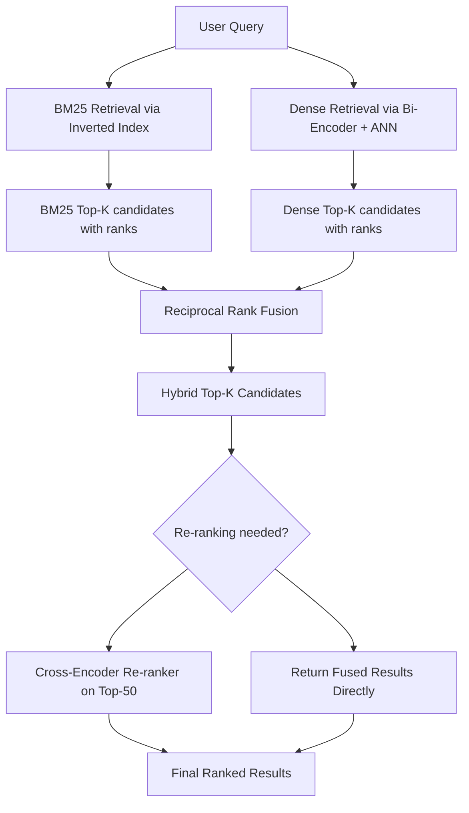

# Information Retrieval

## Detailed Explanation

Information Retrieval (IR) is the task of finding documents relevant to a query from a large collection. It is the backbone of search engines, question answering, and Retrieval-Augmented Generation (RAG) systems. The challenge is twofold: recall (find all relevant documents) and precision (rank relevant documents above irrelevant ones), often in tension with each other.

The classical workhorse is BM25 (Best Match 25), a probabilistic TF-IDF variant with document length normalization. BM25 scores a query term t in document d as IDF(t) multiplied by a saturating TF function: TF(t,d) * (k1+1) / (TF(t,d) + k1 * (1-b + b*|d|/avgdl)), where k1 (typically 1.2) controls TF saturation and b (typically 0.75) controls length normalization. BM25 is extremely fast via inverted indexes, handles exact keyword matching well, but fails on paraphrase and semantic similarity.

Dense retrieval encodes queries and documents into dense vectors using a bi-encoder neural model, then uses approximate nearest neighbor (ANN) search to find relevant documents. Dense retrieval excels at semantic similarity but requires GPU inference and ANN infrastructure.

Hybrid retrieval combines BM25 (for exact keyword recall) and dense retrieval (for semantic recall) using score fusion — typically Reciprocal Rank Fusion (RRF), which is robust to score scale differences. Re-ranking adds a second stage: a cross-encoder (concatenates query + document and produces a single relevance score) re-scores the top-K candidates from the retrieval stage with higher accuracy at the cost of O(K) inference calls.

## Core Intuition

BM25 searches for documents containing your exact words, up-weighting rare terms (high IDF) and capping the benefit of repeated words (TF saturation). Dense retrieval searches for documents in the same semantic neighborhood of your query, catching synonyms and paraphrases but sometimes drifting from the exact intent. Hybrid retrieval wins in practice because keyword and semantic signals are complementary: "myocardial infarction" needs dense retrieval to match "heart attack", but "Python 3.12 release date" needs BM25 to not be overwhelmed by semantic neighbors about Python 2 or other releases.

## How It Works

1. **Build an index.** For BM25, build an inverted index mapping each term to the list of documents containing it, along with term frequency. Compute IDF for each term based on document frequency. For dense retrieval, encode all documents with the bi-encoder and store vectors in an ANN index.

2. **Process the query.** For BM25, tokenize and look up query terms in the inverted index. For dense retrieval, encode the query with the same encoder to get a query vector.

3. **Score and retrieve candidates.** BM25: for each document containing at least one query term, sum BM25 scores across query terms. Dense: compute cosine similarity between query vector and all document vectors (exact) or use HNSW/IVF-based ANN for large collections.

4. **Fuse results (hybrid).** Apply Reciprocal Rank Fusion: for each document, sum 1/(k + rank_from_BM25) + 1/(k + rank_from_dense) where k=60 is a smoothing constant. Sort by fused score.

5. **Re-rank top-K candidates.** Pass the top-K (typically 50-200) query-document pairs to a cross-encoder that processes them jointly and produces calibrated relevance scores.

6. **Evaluate with IR metrics.** MRR@10 (mean reciprocal rank), NDCG@10 (normalized discounted cumulative gain, weights rank position), Recall@100 (how many relevant documents appear in top-100).

## Architecture / Trade-offs

### Retrieval Method Comparison

| Method | Keyword Recall | Semantic Recall | Latency | Infrastructure |
|--------|---------------|-----------------|---------|----------------|
| BM25 | Excellent | Poor | <10ms | Inverted index |
| Dense (bi-encoder) | Poor | Excellent | 10-50ms | ANN index + GPU |
| Hybrid BM25+Dense | Good | Good | 20-60ms | Both |
| Cross-encoder rerank | N/A (second stage) | Excellent | +50-200ms per K | GPU required |

### BM25 Parameter Effects

| Parameter | Low Value | High Value | Practical Range |
|-----------|-----------|-----------|-----------------|
| k1 (TF saturation) | Linear TF growth | Rapid saturation | 1.2 - 2.0 |
| b (length normalization) | No length penalty | Full normalization | 0.5 - 0.9 |

### IR Evaluation Metrics

| Metric | What it Measures | Sensitive to Rank Position | Multi-relevant Docs |
|--------|-----------------|---------------------------|---------------------|
| Precision@K | Fraction relevant in top-K | No (all positions equal) | Yes |
| Recall@K | Fraction of total relevant in top-K | No | Yes |
| MRR@K | Reciprocal rank of first relevant | Yes (first hit only) | No |
| NDCG@K | Graded relevance, rank-discounted | Yes | Yes |
| MAP | Mean average precision across queries | Yes | Yes |

## Interview Q&A

**Q: Why does BM25 outperform standard TF-IDF for long documents?**
A: Standard TF-IDF can overrank long documents simply because they contain query terms more frequently, even if the term density is no higher than in a shorter document. BM25 adds length normalization via the `b` parameter: a term in a document of average length gets full credit, while the same term frequency in a 3x longer document is discounted. This prevents long documents from dominating rankings purely due to length, which is a significant problem in web-scale retrieval.

**Q: When would you use BM25 alone versus a hybrid BM25+dense system?**
A: Use BM25 alone when: queries are keyword-heavy and domain-specific (medical codes, product SKUs), corpus is small enough that exact match suffices, you have tight latency constraints (<10ms), or there is no labeled data to train a dense retriever. Use hybrid when: queries use natural language and paraphrase is common, your corpus has both technical and conversational content, you can tolerate 30-60ms latency, or your evaluation shows BM25 recall@100 below 80% on your query distribution.

**Q: What is Reciprocal Rank Fusion and why is it preferred over score-level fusion for combining BM25 and dense retrieval?**
A: RRF assigns score 1/(k+r) to a document at rank r, then sums scores across systems. Because it operates on ranks rather than raw scores, it is scale-agnostic — BM25 scores (in the hundreds) and cosine similarities (0 to 1) are incomparable directly. Score normalization for fusion requires knowing the score distribution of each system on every query, which varies. RRF's k=60 default is empirically robust and requires no tuning. The downside: RRF loses within-rank information (the 2nd and 3rd ranked documents are treated nearly the same), which is why re-ranking is used as a second stage.

**Q: Your retrieval system has high Recall@100 but poor NDCG@10. What does that tell you and what would you do?**
A: Recall@100 being high means the relevant documents are in your candidate set — the retrieval stage is working. Poor NDCG@10 means they are not being ranked in the top 10 — a ranking problem, not a retrieval problem. This is exactly the profile where adding a cross-encoder re-ranker pays off: it can take the 100 candidates and re-sort them with much higher precision because it processes query and document jointly. Investigate whether the NDCG@10 gap is uniform across query types or concentrated in specific query patterns (long queries, queries with negations, queries about recent entities).

**Q: How does a cross-encoder improve over a bi-encoder for re-ranking, and why can't you use it for initial retrieval?**
A: A bi-encoder independently encodes query and document then computes a single similarity score — this enables pre-computing all document representations offline, making ANN search feasible. A cross-encoder concatenates query and document and processes them jointly through the full transformer stack, allowing every attention head to attend across both, producing a much more accurate relevance score. The cost: you cannot pre-compute document representations for a cross-encoder — every query-document pair requires a fresh forward pass. With a 10M document corpus, this is computationally infeasible for initial retrieval but entirely tractable for re-ranking 50-200 candidates.

**Q: What would you check if your dense retrieval model performs well in offline evaluation but degrades in production?**
A: Most likely causes: (1) distribution shift between training queries (from click logs or annotation) and real user queries; (2) document corpus has been updated but index has not been re-built (stale embeddings); (3) query length distribution shifted (long queries perform differently from short ones); (4) ANN index HNSW parameters misconfigured, giving approximate neighbors with too low recall. Instrument production with query diversity metrics, re-embedding frequency checks, and A/B tests against BM25 to detect when dense retrieval is regressing.

## Best Practices

- Always build a BM25 baseline before deploying dense retrieval — it is free to implement, has no training requirements, and often achieves 80-90% of state-of-the-art recall on keyword-dominant queries.
- Use k1=1.2 and b=0.75 as defaults for BM25, then tune k1 upward for technical corpora (where multiple occurrences are more informative) and b downward for uniform-length corpora.
- For hybrid fusion, use RRF with k=60 as a default and only tune if you have labeled query-document relevance judgments for your specific domain.
- When building dense retrieval, encode documents in batches of 256-512 to maximize GPU throughput; expect ~2-3 hours to embed a 1M-document corpus on a single GPU.
- Set Recall@100 as the primary retrieval metric and NDCG@10 as the primary end-to-end metric — they measure different failure modes (missing relevant docs vs mis-ranking found docs).
- Monitor ANN index build time and recall trade-offs: FAISS HNSW with efSearch=128 typically achieves 95%+ recall versus exact search with 10-50x speedup on 1M vectors; increase efSearch if exact-search recall is unacceptable.
- For production, re-build dense indexes on a rolling basis (weekly or daily for fast-changing corpora) and track retrieval metric drift against a held-out query set.

## Common Pitfalls

- **Not normalizing document embeddings before cosine similarity:** Unnormalized bi-encoder embeddings produce dot products, not cosine similarities. Documents with longer text often produce larger-magnitude embeddings, biasing toward longer documents regardless of relevance. Fix: L2-normalize query and document embeddings before any similarity computation.

- **Using cross-encoder scores for initial retrieval:** Cross-encoders require O(N) inference calls for N documents — infeasible at scale. If you see latency blowups in retrieval, check whether a cross-encoder was accidentally placed in the first stage. Fix: bi-encoder for retrieval, cross-encoder only for re-ranking top-K.

- **Evaluating on queries seen during index construction:** If your document corpus was used to train the dense retriever and you evaluate retrieval quality on documents from that corpus, in-distribution memorization inflates metrics. Fix: evaluate on a held-out document split or use queries from a separate annotation round.

- **Ignoring BM25 for queries with rare technical terms:** Dense models trained on general text may embed "CUDA OOM error" similarly to "memory allocation issue", losing the specificity of the original query. BM25 will exact-match the rare technical term. Fix: always run both and compare; use hybrid as default.

- **RRF with k=0:** Setting k=0 in RRF makes the first-ranked document infinitely better than the second, making the fusion too rank-sensitive. Fix: always use k >= 10 (60 is standard); small k values cause instability when ranks differ by one between the two systems.

## Related Concepts

- [BERT and Pretraining](./05-bert-and-pretraining.md) — BERT as bi-encoder or cross-encoder for retrieval
- [Text Classification](./06-text-classification.md) — relevance classification as a re-ranking approach
- [Named Entity Recognition](./07-named-entity-recognition.md) — entity extraction to improve structured retrieval
