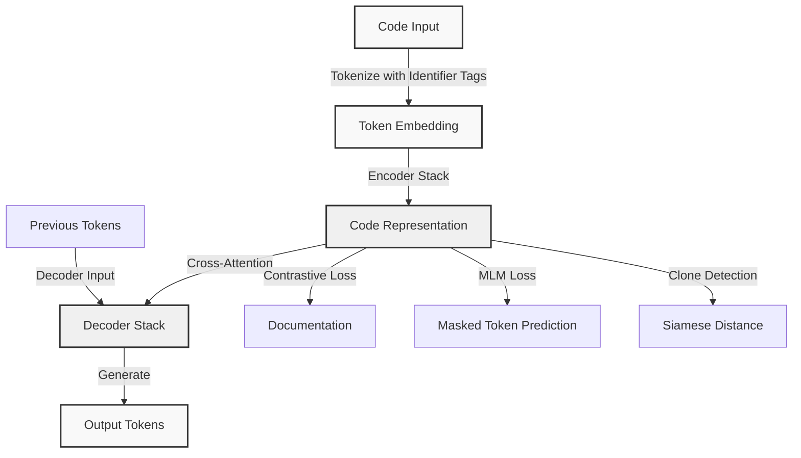

# CodeT5: Identifier-Aware Unified Encoder-Decoder for Code

## Paper Overview

CodeT5 (Wang et al., 2021) introduces a unified encoder-decoder transformer architecture designed specifically for code understanding and generation tasks. Unlike general-purpose language models, CodeT5 incorporates identifier-aware vocabulary and multi-task pre-training to understand the semantic structure of code. The model treats code as more than text—it recognizes that identifiers (variable names, function names, class names) carry semantic meaning distinct from keywords. This identifier-aware design enables CodeT5 to achieve state-of-the-art results on six code-related downstream tasks: code search, code summarization, code-to-code translation, clone detection, defect detection, and code completion.

The key innovation lies in how CodeT5 handles code's structural properties. Traditional language models treat code as plain text where all tokens are equal. CodeT5 assigns special tokens to identifiers and uses vocabulary pruning to focus model capacity on domain-specific tokens. This design choice reflects a fundamental insight: code is highly structured, with identifiers appearing frequently and carrying meaning that can be learned more efficiently with special treatment.

CodeT5 demonstrates that a single unified model can excel at both understanding (search, clone detection) and generation (summarization, code translation, completion) tasks when trained with appropriate multi-task objectives. The paper shows that transfer learning from code pre-training significantly improves downstream task performance compared to general-purpose models like BERT.

## Core Intuition

Imagine code as having two layers: the structural layer (keywords like `if`, `for`, `def`) and the semantic layer (identifiers like variable names). CodeT5 treats these layers differently—it gives keywords normal tokens but special handling to identifiers so the model learns to recognize that `user_id` and `customer_id` are similar types of variables even if they appear in different code samples.

## How It Works

CodeT5 operates through five key mechanisms:

1. **Identifier Tagging and Vocabulary Design**: The model uses vocabulary splitting where identifiers (user-defined names) are separated from keywords. This allows CodeT5 to learn a smaller, more efficient vocabulary (30K tokens) while capturing code semantics. Common identifiers are included directly; rare ones use subword tokenization.

2. **Multi-Task Pre-Training**: The model is pre-trained on six diverse objectives—bimodal contrastive learning (code-to-documentation), masked language modeling, identifier tagging, and others—on a large corpus of public code (CodeSearchNet with 1.3B tokens). This diverse pre-training teaches the model to understand code from multiple perspectives.

3. **Encoder-Decoder Architecture**: CodeT5 uses a unified encoder-decoder structure where the encoder processes code input and the decoder generates output. This architecture is superior to encoder-only models (like BERT) for generation tasks and decoder-only models (like GPT) for understanding tasks. The shared weights between encoder and decoder enable efficient transfer learning.

4. **Task-Specific Fine-Tuning**: For downstream tasks, the model is fine-tuned with task-specific objectives. For example, code search fine-tunes a contrastive loss where code snippets with similar documentation are pushed together in embedding space. Code summarization fine-tunes a standard sequence-to-sequence loss.

5. **Cross-Modal Pre-Training**: CodeT5 learns associations between code and natural language through contrastive objectives. Code snippets and their documentation are treated as positive pairs, allowing the model to learn that `def calculate_total():` and "compute the total sum" represent similar concepts.



## Architecture & Trade-offs

CodeT5 introduces several architectural choices that differ from general-purpose transformers. The table below compares CodeT5 with alternative approaches:

| Architecture Aspect | CodeT5 | BERT-based | GPT-based | Justification |
|---|---|---|---|---|
| **Encoder-Decoder** | Yes (shared weights) | Encoder-only | Decoder-only | Unified model handles both understanding and generation |
| **Identifier Handling** | Special tokens + vocabulary splits | Uniform tokenization | Uniform tokenization | Identifiers are semantically important in code |
| **Pre-training Objectives** | 6 objectives (contrastive, MLM, tagging) | 2 objectives (MLM, NSP) | 1 objective (LM) | Diverse objectives teach multiple code perspectives |
| **Vocabulary Size** | 30K tokens | 30K+ tokens | 50K tokens | Smaller size reduces compute; identifier-aware design maintains quality |
| **Context Window** | 512 tokens | 512 tokens | 1024 tokens | Sufficient for most function-level code; encoder-decoder limits |
| **Model Sizes** | Base (220M), Large (770M) | Base (110M), Large (340M) | Base (125M), Large (774M) | Larger model captures code complexity; transformer scaling laws apply |

### Task-Performance Trade-offs

Different downstream tasks benefit from different aspects of CodeT5's design:

- **Code Search**: Contrastive pre-training is most beneficial. CodeT5 learns to embed semantically similar code snippets close together in embedding space. Trade-off: requires paired code-documentation data during pre-training.

- **Code Summarization**: Encoder-decoder architecture is key. The model learns to map code semantics to natural language concisely. Trade-off: requires aligned code-summary pairs during fine-tuning.

- **Code-to-Code Translation**: Multi-task pre-training on related languages helps. Learning patterns from Java helps when translating to C# because both share object-oriented semantics. Trade-off: benefits increase with more pre-training languages.

- **Clone Detection**: Identifier tagging helps the model recognize structural similarity despite different variable names. Two functions with identical logic but `x` vs `y` variables should be marked as clones. Trade-off: requires labeled clone datasets for fine-tuning.

### When to Use CodeT5 vs. Alternatives

| Use Case | CodeT5 | BERT | GPT-2/3 | Reason |
|---|---|---|---|---|
| Code search with limited labels | CodeT5 | No | No | Contrastive pre-training transfers well |
| Summarizing functions | CodeT5 | Limited | No | Encoder-decoder designed for generation |
| Few-shot code generation | No | No | GPT-3 | GPT-3's scale and decoder-only design |
| Clone detection | CodeT5 | Possible | No | Identifier-aware matching detects structural similarity |
| Defect detection (classification) | CodeT5 | BERT slightly better | No | BERT's MLM pre-training optimized for classification |
| Real-time inference | GPT-2 | BERT | No | Smaller models, single-pass decoding |

## Interview Q&A

**Q: Why does CodeT5 treat identifiers differently from keywords? Give an example where this matters.**

A: Identifiers (variable/function names) are user-defined and carry semantic meaning specific to the program's domain. Keywords (`if`, `for`, `return`) have fixed meaning. For example, two functions with logic `if x > 5: return x` are structurally identical, but one uses variable `user_age` and another uses `customer_years`. CodeT5's identifier tagging allows it to recognize that both functions do the same thing despite different variable names. This is critical for clone detection—you want to find functionally equivalent code even if variables are named differently. Without identifier awareness, the model would treat `user_age` and `customer_years` as completely different tokens, missing the structural similarity.

**Q: Describe a scenario where CodeT5's encoder-decoder architecture would outperform a decoder-only model like GPT-2.**

A: In code summarization, CodeT5's encoder-decoder architecture excels because it can deeply analyze the input code (using the full encoder) before generating a summary (using the decoder). GPT-2, being decoder-only, must attend to the code in a left-to-right causal manner, which is inefficient for understanding complex code structures. For example, summarizing a function with nested loops and conditionals: CodeT5 can use bidirectional attention in the encoder to understand the full control flow, then decode a concise summary. GPT-2 must learn to summarize while sequentially reading code, which requires more parameters and training data. The trade-off: CodeT5 requires paired (code, summary) training data; GPT-2 only needs code.

**Q: What are the failure modes of CodeT5's identifier-aware vocabulary design? How would you diagnose them?**

A: Failure modes include: (1) **Out-of-vocabulary identifiers**: Rare identifiers not in the pre-training vocabulary get subword-tokenized, losing semantic meaning. Diagnosis: Compare performance on functions with common vs. rare variable names; rare names should degrade more. (2) **Imbalanced identifier distribution**: If pre-training data has highly skewed identifier frequencies (e.g., `i` appears 1000x more than `accumulator`), the model may not learn meaningful representations for rare identifiers. Diagnosis: Measure recall on clone detection where clones differ only in rare identifier names. (3) **Language-specific identifier conventions**: Camel case vs. snake case conventions differ across languages; CodeT5 may tokenize them differently. Diagnosis: Test on code that switches conventions (e.g., `userAge` vs `user_age`); accuracy should be similar but may vary.

**Q: CodeT5 uses multi-task pre-training with 6 objectives. Why not just use one—the one most similar to your downstream task?**

A: Multi-task pre-training acts as regularization and enables positive transfer. If you only use the objective most similar to your downstream task (e.g., only contrastive loss if your task is code search), the model overfits to that task's patterns and misses general code semantics. For example, masked language modeling teaches the model to recognize and predict code syntax patterns, which helps even with contrastive learning. Contrastive learning teaches semantic similarity, which helps with generation tasks. The diversity of objectives forces the model to learn multiple facets of code and creates implicit regularization. However, there is a trade-off: multi-task training requires balancing loss weights and may require longer pre-training. In practice, you might find that for your specific downstream task, one or two objectives matter most—then you could speed up pre-training by dropping the others.

**Q: When would you NOT use CodeT5? Describe a scenario where an alternative is better.**

A: Don't use CodeT5 for: (1) **Real-time code completion** where sub-100ms latency is critical. CodeT5's encoder-decoder requires bidirectional processing, making it slower than decoder-only models like GPT-2. Better: smaller decoder-only models or retrieval-based completion. (2) **Very long code files** (>512 tokens). CodeT5's 512-token context is a limitation; you'd need chunking strategies. Better: models with larger context windows or hierarchical approaches. (3) **Low-resource languages** where code pre-training data is scarce. CodeT5 needs substantial pre-training; if you have only thousands of examples in your language, transfer from general language models may be faster. Better: fine-tune a general model or use cross-lingual transfer. (4) **Extreme code generation** (e.g., generating entire class hierarchies or frameworks). CodeT5 excels at function-level tasks; for document-level generation, you need larger models or retrieval-augmented generation.

## Best Practices

- **Use the pre-trained CodeT5 checkpoint as your starting point**, not random initialization. The pre-training captures code-specific patterns that take significant data and compute to learn from scratch. Transfer learning typically reduces downstream fine-tuning data requirements by 50-80%.

- **For code search applications, use contrastive fine-tuning** rather than classification fine-tuning. Contrastive learning creates an embedding space where semantically similar code is close; this enables zero-shot search on new code without explicit labels. Classification fine-tuning requires labeled positive/negative pairs for each query, which doesn't scale.

- **Normalize identifier names during tokenization** to improve generalization. Before tokenization, replace variable names with canonical forms (e.g., all camel case → snake case). This reduces vocabulary sparsity and helps the model focus on structural patterns rather than naming conventions.

- **When fine-tuning on small datasets** (< 10K examples), use layer freezing: freeze the encoder for the first few epochs and only train the decoder, then unfreeze both. This provides stability and prevents catastrophic forgetting of pre-trained knowledge.

- **Monitor identifier coverage** in your fine-tuning data. If your downstream task uses identifiers not present in CodeT5's pre-training vocabulary, subword tokenization will fragment them. Consider whether retraining or a custom tokenizer might help.

- **For inference, batch code snippets together** to maximize GPU utilization. CodeT5-Base processes 32-64 snippets per batch with minimal latency overhead compared to single-example inference. Batching improves throughput 10-20x.

- **Use mixed precision training** (fp16) to reduce memory footprint and speed up fine-tuning by 1.5-2x with negligible accuracy loss. Most modern frameworks (PyTorch, TensorFlow) support automatic mixed precision out of the box.

## Common Pitfalls

- **Treating all tokens equally during tokenization**: CodeT5 assigns special tokens to identifiers, but if you use generic byte-pair encoding (BPE) tokenizers, you lose this advantage. Diagnosis: Compare CodeT5 with BERT on clone detection—CodeT5 should significantly outperform BERT on clones where variables are renamed. If not, check your tokenizer configuration. Fix: Use CodeT5's official tokenizer or implement identifier tagging in your custom tokenizer.

- **Fine-tuning the entire model on small datasets**: With only 1-5K fine-tuning examples, fine-tuning all 220M parameters of CodeT5-Base risks overfitting and catastrophic forgetting. Symptom: validation loss decreases but test performance degrades after a few epochs. Fix: Use regularization (dropout increase, early stopping at validation peak), layer freezing (freeze encoder, train only decoder), or parameter-efficient fine-tuning (LoRA, adapters).

- **Ignoring context length limitations**: CodeT5 has a 512-token context window. If your code examples average 600 tokens, they're being truncated silently, losing important context. Symptom: Performance drops on longer functions; clone detection fails for large functions. Fix: Use hierarchical approaches (summarize each function, then embed the summary) or measure your average code length and adjust truncation strategy (e.g., keep the last 512 tokens for functions, not the first).

- **Mixing pre-training and fine-tuning objectives**: If you pre-train with contrastive loss but fine-tune with classification loss on the same model, gradients conflict and learning becomes unstable. Symptom: Loss oscillates, validation metrics plateau or degrade. Fix: Use separate heads for different tasks or stick to one objective per fine-tuning cycle.

- **Not normalizing code formatting**: If pre-training data has random indentation/formatting but fine-tuning data is heavily auto-formatted (or vice versa), distribution shift hurts performance. Symptom: Model works well on pre-training domain but fails on production code with different formatting. Fix: Normalize whitespace and formatting during preprocessing. Consider formatting as a separate pre-training task.

## Code Examples

### Example 1: Basic Code Search with Embeddings

```python
import torch
from transformers import AutoTokenizer, AutoModel
import numpy as np
from typing import List, Tuple

# Load CodeT5 model and tokenizer
device = torch.device("cuda" if torch.cuda.is_available() else "cpu")
model_name = "Salesforce/codet5-base"
tokenizer = AutoTokenizer.from_pretrained(model_name)
model = AutoModel.from_pretrained(model_name).to(device)
model.eval()

def get_code_embedding(code: str) -> np.ndarray:
    """Generate embedding for a code snippet."""
    inputs = tokenizer(code, return_tensors="pt", max_length=512, truncation=True)
    inputs = {k: v.to(device) for k, v in inputs.items()}
    
    with torch.no_grad():
        outputs = model(**inputs)
        # Use [CLS] token representation (first token)
        embedding = outputs.last_hidden_state[:, 0, :].cpu().numpy()
    
    return embedding[0]  # Return 1D array

# Example: Simple code search
code_snippets = [
    "def add_numbers(a, b):\n    return a + b",
    "def calculate_sum(x, y):\n    result = x + y\n    return result",
    "def multiply_numbers(a, b):\n    return a * b",
]

# Generate embeddings for all snippets
embeddings = np.array([get_code_embedding(code) for code in code_snippets])

# Query: search for code similar to addition function
query = "def sum_two_values(p, q):\n    return p + q"
query_embedding = get_code_embedding(query)

# Compute cosine similarity
from sklearn.metrics.pairwise import cosine_similarity
similarities = cosine_similarity([query_embedding], embeddings)[0]

print("Query:", query)
print("\nSearch Results (by similarity):")
for idx, sim in sorted(enumerate(similarities), key=lambda x: -x[1]):
    print(f"Similarity: {sim:.3f}")
    print(f"Code: {code_snippets[idx]}\n")
```

### Example 2: Code Summarization with Fine-tuning

```python
import torch
from torch.utils.data import Dataset, DataLoader
from transformers import AutoTokenizer, AutoModelForSeq2SeqLM, Trainer, TrainingArguments
from typing import List, Dict

device = torch.device("cuda" if torch.cuda.is_available() else "cpu")
model_name = "Salesforce/codet5-base"

class CodeSummarizationDataset(Dataset):
    """Dataset for code summarization task."""
    
    def __init__(self, code_snippets: List[str], summaries: List[str], tokenizer, max_length: int = 512):
        self.tokenizer = tokenizer
        self.code_snippets = code_snippets
        self.summaries = summaries
        self.max_length = max_length
    
    def __len__(self) -> int:
        return len(self.code_snippets)
    
    def __getitem__(self, idx: int) -> Dict[str, torch.Tensor]:
        code = self.code_snippets[idx]
        summary = self.summaries[idx]
        
        # Tokenize code (input)
        inputs = self.tokenizer(code, max_length=self.max_length, truncation=True, 
                               padding="max_length", return_tensors="pt")
        
        # Tokenize summary (target)
        targets = self.tokenizer(summary, max_length=256, truncation=True,
                                padding="max_length", return_tensors="pt")
        
        return {
            "input_ids": inputs["input_ids"].squeeze(),
            "attention_mask": inputs["attention_mask"].squeeze(),
            "labels": targets["input_ids"].squeeze(),
        }

# Example training setup
training_codes = [
    "def calculate_factorial(n):\n    if n <= 1:\n        return 1\n    return n * calculate_factorial(n - 1)",
    "def is_prime(num):\n    if num < 2:\n        return False\n    for i in range(2, int(num ** 0.5) + 1):\n        if num % i == 0:\n            return False\n    return True",
]

training_summaries = [
    "Recursively calculate factorial of a number",
    "Check if a number is prime",
]

tokenizer = AutoTokenizer.from_pretrained(model_name)
dataset = CodeSummarizationDataset(training_codes, training_summaries, tokenizer)

# Training configuration
training_args = TrainingArguments(
    output_dir="./codet5_summarization",
    num_train_epochs=3,
    per_device_train_batch_size=8,
    learning_rate=2e-5,
    weight_decay=0.01,
    logging_steps=10,
    save_steps=100,
    fp16=torch.cuda.is_available(),
)

model = AutoModelForSeq2SeqLM.from_pretrained(model_name).to(device)

trainer = Trainer(
    model=model,
    args=training_args,
    train_dataset=dataset,
)

print("Training CodeT5 for summarization...")
trainer.train()
print("Training complete!")
```

### Example 3: Clone Detection with Siamese Network

```python
import torch
import torch.nn as nn
from transformers import AutoTokenizer, AutoModel
from sklearn.metrics.pairwise import cosine_similarity
import numpy as np
from typing import List, Tuple

device = torch.device("cuda" if torch.cuda.is_available() else "cpu")
model_name = "Salesforce/codet5-base"

class CloneDetectionModel(nn.Module):
    """Siamese network for code clone detection."""
    
    def __init__(self, model_name: str):
        super().__init__()
        self.encoder = AutoModel.from_pretrained(model_name)
        self.embedding_dim = self.encoder.config.hidden_size
        # Optional: add a projection layer
        self.projection = nn.Linear(self.embedding_dim, 256)
    
    def forward(self, input_ids: torch.Tensor, attention_mask: torch.Tensor) -> torch.Tensor:
        """Encode code to embedding."""
        outputs = self.encoder(input_ids=input_ids, attention_mask=attention_mask)
        # Use [CLS] token representation
        cls_embedding = outputs.last_hidden_state[:, 0, :]
        # Project to lower dimension
        embedding = self.projection(cls_embedding)
        # Normalize for cosine similarity
        embedding = torch.nn.functional.normalize(embedding, p=2, dim=1)
        return embedding

# Example: Detect if two functions are clones
def are_clones(code1: str, code2: str, model: CloneDetectionModel, 
               tokenizer, threshold: float = 0.85) -> Tuple[bool, float]:
    """Check if two code snippets are clones based on embedding similarity."""
    
    # Tokenize both codes
    inputs1 = tokenizer(code1, return_tensors="pt", max_length=512, truncation=True)
    inputs2 = tokenizer(code2, return_tensors="pt", max_length=512, truncation=True)
    
    # Move to device
    inputs1 = {k: v.to(device) for k, v in inputs1.items()}
    inputs2 = {k: v.to(device) for k, v in inputs2.items()}
    
    # Get embeddings
    with torch.no_grad():
        embedding1 = model(**inputs1)
        embedding2 = model(**inputs2)
    
    # Compute cosine similarity
    similarity = torch.nn.functional.cosine_similarity(embedding1, embedding2).item()
    
    is_clone = similarity >= threshold
    return is_clone, similarity

# Test examples
tokenizer = AutoTokenizer.from_pretrained(model_name)
model = CloneDetectionModel(model_name).to(device)
model.eval()

# Same logic, different variable names
code_a = """
def calculate_sum(a, b):
    result = a + b
    return result
"""

code_b = """
def compute_total(x, y):
    total = x + y
    return total
"""

# Different logic
code_c = """
def multiply_numbers(a, b):
    return a * b
"""

is_clone_ab, sim_ab = are_clones(code_a, code_b, model, tokenizer)
is_clone_ac, sim_ac = are_clones(code_a, code_c, model, tokenizer)

print(f"Code A vs Code B (same logic, different names):")
print(f"  Clone: {is_clone_ab}, Similarity: {sim_ab:.4f}")
print(f"\nCode A vs Code C (different logic):")
print(f"  Clone: {is_clone_ac}, Similarity: {sim_ac:.4f}")
```

## Related Concepts

- [Codex: Evaluating Large Language Models Trained on Code](./02-codex.md) – GPT-style decoder-only model optimized for code generation with few-shot capability
- [Code Evaluation: Benchmarking Language Models on Code](./03-code-evaluation.md) – HumanEval and MBPP benchmarks for evaluating code generation quality
- [Transformers: The Foundation of Modern Language Models](../../../ml/concepts/transformers.md) – Underlying encoder-decoder architecture
- [Transfer Learning in NLP](../../../ml/concepts/transfer-learning.md) – Multi-task pre-training strategies and fine-tuning approaches
