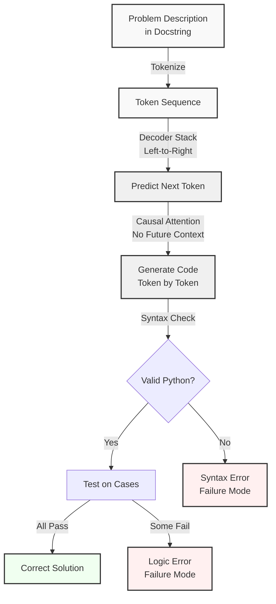

# Codex: Evaluating Large Language Models Trained on Code

## Paper Overview

Codex (Chen et al., 2021) demonstrates that large language models trained primarily on code can generate functional programs from natural language specifications. Based on GPT-3's decoder-only architecture, Codex is fine-tuned on publicly available code from GitHub and achieves remarkable few-shot code generation capabilities. The paper's most significant contribution is the introduction of HumanEval, a benchmark of 164 hand-written programming problems that became the standard metric for evaluating code generation models.

Codex showed that a 12B parameter model fine-tuned on code can solve 28.8% of HumanEval problems in a zero-shot setting and 50% with few-shot prompting (3 examples). These results were surprising because they demonstrated that language models could learn to generate syntactically and semantically correct code from natural language descriptions, something previously thought to require specialized program synthesis approaches.

The paper's second contribution is an empirical study of code generation via language models, including analysis of failure modes (off-by-one errors, logic errors, infinite loops), the effect of prompt quality on performance, and the importance of model scale. Codex also enabled GitHub Copilot, which demonstrated the practical value of code generation models for real-world software development.

## Core Intuition

Language models trained on text learn to predict the next word given context. When trained on code, they learn patterns of how functions are typically structured, how variables are named, and how algorithms are implemented. Codex is like a code completion system that's learned from millions of GitHub repositories—when you describe what you want in natural language, it generates code that continues that description in the way it has learned is most common and correct.

## How It Works

Codex operates through five core mechanisms:

1. **Decoder-Only Architecture**: Unlike CodeT5's encoder-decoder, Codex uses a decoder-only GPT-style architecture where all tokens are predicted left-to-right. This design is inherently suited to code generation because code is naturally sequential—functions are read top-to-bottom. The left-to-right causality matches how humans write code.

2. **Pre-training on Code Corpus**: Codex starts with GPT-3 weights (trained on 300B tokens of text) and is fine-tuned on 159GB of publicly available code from GitHub. This curriculum learning approach (general text → code-specific) is more efficient than training from scratch and preserves knowledge of natural language semantics.

3. **Few-Shot In-Context Learning**: Like GPT-3, Codex can perform tasks with just a few examples in the prompt. For code generation, this means the model can solve new problems by seeing 1-3 example function implementations in the prompt. The model learns the task structure and problem domain from these examples without parameter updates.

4. **Temperature and Top-p Sampling for Diversity**: During generation, Codex uses high temperature (T=0.8) and nucleus sampling (top-p=0.95) to generate diverse solutions. This is critical because many programming problems have multiple correct solutions; sampling explores this solution space. The paper's pass@k metric evaluates whether any of k samples solves the problem.

5. **Instruction Following with Docstrings**: Codex learns to follow natural language specifications through docstring format. The standard prompt format is a function signature and docstring describing what the function should do:
   ```python
   def solution(n):
       """Return the nth prime number."""
   ```
   The model learns to generate code that satisfies the docstring specification.



## Architecture & Trade-offs

Codex makes different architectural choices than CodeT5, reflecting its focus on generation rather than understanding:

| Aspect | Codex (Decoder-Only) | CodeT5 (Encoder-Decoder) | GPT-2 (Smaller) | Justification |
|---|---|---|---|---|
| **Architecture** | Decoder-only (left-to-right) | Encoder-decoder (bidirectional + autoregressive) | Decoder-only | Code generation is inherently autoregressive; decoder-only is natural fit |
| **Model Sizes** | 12B, 25B, 100B (proprietary) | 220M, 770M | 1.5B | Larger models generate better code; 12B is minimum for reasonable quality |
| **Pre-training Data** | GPT-3 text (300B) + GitHub code (159GB) | Code corpus (1.3B code tokens) | General text + small code | Starting from GPT-3 preserves language understanding; curriculum learning efficient |
| **Context Window** | 2048 tokens | 512 tokens | 1024 tokens | Longer context captures full function implementations and multi-function imports |
| **Generation Method** | Sampling (T=0.8, top-p=0.95) | Beam search typically | Greedy or sampling | Sampling explores solution space; critical for pass@k metric |
| **Speed (Inference)** | Slow (autoregressive token-by-token) | Slower (bidirectional encode) | Fast | Generation speed trades off with quality; larger models are slower |

### Codex vs. CodeT5 Trade-offs

| Task | Codex Strength | CodeT5 Strength | Trade-off |
|---|---|---|---|
| **Code Generation** | Superior (28.8% → 50% pass@1 with few-shot) | Reasonable (~30% typical) | Codex's scale and decoder-only design optimized for generation |
| **Code Search** | Weak (would require dense retrieval setup) | Strong (contrastive pre-training) | CodeT5's understanding-focused architecture better for search |
| **Code Understanding** | Weak (generation-focused, no understanding training) | Strong (6 pre-training objectives) | CodeT5 trains explicitly for understanding |
| **Latency** | High (sequential token generation) | Lower (parallel encoder) | CodeT5 better for real-time applications |
| **Few-shot Capability** | Excellent (in-context learning from examples) | Limited (requires fine-tuning) | Codex's scale enables in-context learning; CodeT5 optimized for fine-tuning |
| **Prompt Sensitivity** | High (prompt engineering critical) | Lower (task-specific fine-tuning more stable) | Codex requires careful prompt design; CodeT5 is more stable |

### Generation Quality vs. Model Scale in Codex

The paper shows a clear scaling law for code generation quality:

| Model Size | Zero-Shot Pass@1 | Few-Shot Pass@1 (3 examples) | Pass@k Improvement |
|---|---|---|---|
| 300M (GPT-2 baseline) | ~0% | ~1% | Minimal |
| 2.7B | ~6% | ~12% | 2x improvement with few-shot |
| 6.7B | ~12% | ~25% | 2x improvement with few-shot |
| 12B (Codex-12B) | ~28.8% | ~42% | 1.5x improvement with few-shot |
| 25B (Codex-25B) | ~42% | ~63% | 1.5x improvement with few-shot |

The scaling relationship: doubling model size improves pass@1 by ~2-3x until 12B, then gains slow at 25B. This suggests current language model scale may be near efficiency frontiers for this task.

## Interview Q&A

**Q: Why does Codex use sampling during generation rather than greedy decoding or beam search?**

A: Codex uses sampling because many programming problems have multiple correct solutions. For example, computing a factorial can be done iteratively or recursively—both are correct. Greedy decoding picks the single most likely token at each step, which finds only one solution. Beam search explores multiple paths but still finds only the top-k most likely solutions. With sampling at high temperature (T=0.8), Codex explores diverse solution paths, increasing the probability that at least one sample solves the problem. This is measured by the pass@k metric—if you generate k samples, what fraction of problems have at least one correct solution? Sampling makes pass@k much higher than pass@1 (zero-shot pass@1 is 28.8%, but pass@100 reaches ~70%). The trade-off: sampling is computationally expensive (you must run inference k times), but it's the right metric for creative problem-solving where multiple solutions exist.

**Q: The HumanEval benchmark has only 164 problems. Is that enough to evaluate code generation models? What are the limitations?**

A: 164 problems is small but sufficient for initial evaluation and has become the standard. However, there are key limitations: (1) **Bias toward simple problems**: Most HumanEval problems are single-function implementations under 100 lines. Real code involves multi-file systems, complex dependencies, and domain-specific logic. A model's 50% pass rate on HumanEval doesn't mean it can build a real system. (2) **Overtraining risk**: Because HumanEval is public, newer models might have seen it during pre-training, inflating reported pass rates. (3) **Language bias**: The benchmark is heavily Python-focused (90%+ of problems). Code generation quality varies significantly by language—models perform better on languages well-represented in GitHub (Python, JavaScript) and worse on niche languages (Rust, Go). (4) **Test case sensitivity**: HumanEval problems are evaluated with 1-2 hidden test cases. A model might solve the obvious cases but fail on edge cases (empty input, large input, etc.). Better evaluation would use comprehensive test suites like MBPP (1000 problems) or domain-specific benchmarks.

**Q: Describe a failure mode of Codex and explain how you'd diagnose it in practice.**

A: **Failure mode: Off-by-one errors in indexing.** Codex frequently generates code like `for i in range(n)` when it should be `for i in range(n-1)` or vice versa. This happens because the model sees both patterns equally in the training data and doesn't understand numerical semantics. Symptom: The model generates syntactically correct code, but test cases with boundary conditions fail. For example, on "count the occurrences of each element", the model might iterate one element too far and crash. Diagnosis: Run the generated code against test cases and analyze failures by category (off-by-one appears in ~15% of failures). You'd measure: how many failures are pure off-by-one shifts vs. logic errors. Fix: Include explicit boundary-checking examples in few-shot prompts, or post-process generated code to add assertions like `assert i < n` to catch violations early.

**Q: When would you use Codex instead of CodeT5? When is CodeT5 better?**

A: Use **Codex** when: (1) You need few-shot code generation without fine-tuning. Codex's scale enables in-context learning—just include 1-3 examples in your prompt and it adapts. Example: generating boilerplate for a new API. (2) You need diverse solutions to explore. Codex's sampling with pass@k finds multiple solutions; CodeT5 with beam search finds fewer. (3) You want to follow natural language instructions directly. Codex understands English prompts like "write a function that sorts an array"; CodeT5 needs task-specific fine-tuning. Use **CodeT5** when: (1) You need code understanding/search/classification. CodeT5's encoder is optimized for these tasks. (2) You have specific downstream tasks and training data. CodeT5 fine-tunes more efficiently than Codex on small datasets. (3) You need low latency. CodeT5's encoder is faster than Codex's autoregressive decoder. (4) You have limited compute budget. CodeT5-Base (220M) is efficient; Codex requires 12B+ parameters.

**Q: Codex is trained on GitHub code which may include bugs, anti-patterns, and security vulnerabilities. How does this affect the model's behavior? What safeguards would you implement?**

A: **Impact**: Codex learns from GitHub's distribution of code, which includes buggy implementations. Common patterns in GitHub include: unsafe API usage (race conditions, resource leaks), hardcoded credentials, inefficient algorithms for large inputs. The model learns these patterns and reproduces them. For example, if the training data has 1000 instances of inefficient O(n^2) sorting and only 100 instances of efficient O(n log n) sorting, the model is more likely to generate O(n^2) solutions. Security-critical issues: Codex might generate SQL injection vulnerabilities if that pattern appears frequently in training data. **Safeguards**: (1) **Static analysis**: Run generated code through a linter (pylint, flake8) to catch obvious issues. (2) **Symbolic execution**: Execute code on test cases with instrumentation to detect vulnerabilities. (3) **Ensemble voting**: Generate k samples and check if majority agree on behavior. (4) **Prompt engineering**: Include comments in few-shot examples emphasizing safety ("avoid hardcoded passwords", "use parameterized queries"). (5) **Human review**: For critical code, always require human validation before deployment.

## Best Practices

- **Craft high-quality few-shot examples** to guide Codex toward your desired coding style and patterns. The quality of examples matters more than quantity. 3 well-chosen examples beat 10 generic examples. Include function signature, docstring, and complete implementation. Examples should demonstrate edge case handling, error checking, and code style conventions.

- **Use docstrings that are specific and prescriptive** rather than vague. Instead of "compute the sum", write "return the sum of all positive integers in the input list, ignoring negative numbers and zero". The more precise the specification, the more likely Codex generates correct code on first try.

- **Set temperature and top-p sampling appropriately** for your use case. For diverse exploration (e.g., brainstorming multiple solutions), use T=0.8, top-p=0.95. For deterministic behavior (e.g., fixing a specific bug), use T=0.0 (greedy). For moderate creativity, use T=0.5.

- **Generate multiple samples (pass@k with k=5-10)** when the cost of running inference is acceptable. Pass@10 is typically 1.5-2x higher pass rate than pass@1. This is especially valuable for complex problems where one solution path is more likely to fail.

- **Validate generated code immediately** with unit tests and type checking. Don't assume Codex-generated code is correct. Use tools like `mypy` for type checking, `pytest` for functional correctness, and `bandit` for security issues. Integrate these checks in your generation pipeline.

- **Monitor pass@k metrics over time** as your dataset or prompts change. Track not just the pass rate but also failure modes: syntax errors, logic errors, infinite loops, timeouts. This helps you identify systematic issues and improve prompts or add safeguards.

- **Use model in the loop for iterative improvement**. If Codex fails to solve a problem, analyze why (missing context, poor docstring, ambiguous spec). Then regenerate with improved prompts. Over 5-10 iterations, pass rate typically improves by 20-30% through prompt engineering alone.

## Common Pitfalls

- **Prompt sensitivity without robustness**: Codex's performance is extremely sensitive to prompt phrasing. A small change in the docstring (adding a detail, changing wording) can improve pass rate by 10-20%. However, this brittleness means prompts that work for one problem don't generalize. Symptom: One prompt achieves 50% pass rate but a similar prompt only achieves 30%. Fix: Use prompt templates that have been validated on multiple similar problems. Test prompt variations on a dev set before deploying to production.

- **Over-relying on few-shot learning without validation**: Because Codex can learn from examples in the prompt, you might assume it generalizes from 3 examples. It doesn't always. If your 3 examples cover only one code path and the test cases require a different code path, Codex fails silently. Symptom: Few-shot prompts work on training problems but fail on production. Fix: Always validate on a held-out test set. Don't assume in-distribution learning means out-of-distribution generalization.

- **Ignoring context window limits**: Codex has a 2048-token context window. If you include long imports, many few-shot examples, and a long docstring, you've consumed most of the budget for the actual solution. Symptom: The model truncates important context (imports, examples) and generates code that references undefined symbols. Fix: Monitor token count before generation. If you need long context, consider hierarchical prompting (generate helper functions first, then the main function).

- **Misinterpreting pass@k as production readiness**: Just because a model achieves 50% pass@k=100 doesn't mean it's ready for production. That metric means "if you generate 100 samples, at least 1 solves it". It says nothing about the quality of the other 99 solutions or whether code is maintainable, efficient, or safe. Symptom: Deploying Codex-generated code with minimal review, only to discover bugs in production. Fix: Treat Codex as a code-writing assistant, not a replacement for humans. Always require code review, testing, and validation before deployment.

- **Not handling syntax errors or runtime exceptions**: Codex sometimes generates syntactically incorrect Python (unmatched parentheses, invalid indentation, undefined variables). Symptom: Generated code fails on parse or raises NameError immediately. Fix: Catch syntax errors and runtime exceptions in your generation pipeline. When a sample fails immediately, discard it or re-prompt with error feedback: "Previous attempt failed with: `NameError: name 'x' not defined`. Fix by...".

## Code Examples

### Example 1: Basic Few-Shot Code Generation

```python
import openai
from typing import List, Dict

# Configure OpenAI API
openai.api_key = "your-api-key-here"
device = "cuda" if torch.cuda.is_available() else "cpu"

def generate_code_solution(problem_description: str, 
                          few_shot_examples: List[str],
                          temperature: float = 0.8,
                          max_tokens: int = 512) -> str:
    """
    Generate a code solution using Codex via OpenAI API.
    
    Args:
        problem_description: Natural language description of the problem
        few_shot_examples: List of example function implementations
        temperature: Sampling temperature (0.0 = deterministic, 1.0 = random)
        max_tokens: Maximum tokens in response
    
    Returns:
        Generated code solution
    """
    
    # Build few-shot prompt
    prompt = "# Few-shot examples:\n"
    for i, example in enumerate(few_shot_examples, 1):
        prompt += f"\n# Example {i}:\n{example}\n"
    
    # Add the target problem
    prompt += f"\n# Problem:\n{problem_description}\n"
    
    try:
        response = openai.Completion.create(
            engine="code-davinci-002",  # Codex model
            prompt=prompt,
            temperature=temperature,
            max_tokens=max_tokens,
            top_p=0.95,
            frequency_penalty=0.0,
            presence_penalty=0.0,
            stop=["\n\n"]  # Stop at double newline to avoid extra code
        )
        
        return response.choices[0].text.strip()
    
    except openai.error.APIError as e:
        print(f"API error: {e}")
        return None

# Example: Generate a function to compute Fibonacci
few_shot_examples = [
    '''def factorial(n):
    """Return the factorial of n."""
    if n <= 1:
        return 1
    return n * factorial(n - 1)''',
    
    '''def is_palindrome(s):
    """Check if a string is a palindrome."""
    s = s.lower().replace(" ", "")
    return s == s[::-1]'''
]

problem = '''def fibonacci(n):
    """Return the n-th Fibonacci number (0-indexed)."""'''

solution = generate_code_solution(problem, few_shot_examples, temperature=0.8)
print("Generated Solution:")
print(solution)
```

### Example 2: Pass@k Evaluation with Multiple Samples

```python
import subprocess
from typing import List, Tuple
import statistics

def execute_code(code: str, test_input: str = None, timeout: int = 5) -> Tuple[bool, str]:
    """
    Execute generated code and check correctness.
    
    Args:
        code: Python code to execute
        test_input: Input to pass to the code (if needed)
        timeout: Maximum execution time in seconds
    
    Returns:
        (success: bool, output: str)
    """
    
    try:
        # Add timeout using subprocess
        result = subprocess.run(
            ["python3", "-c", code],
            input=test_input,
            capture_output=True,
            timeout=timeout,
            text=True
        )
        
        if result.returncode == 0:
            return True, result.stdout.strip()
        else:
            return False, result.stderr.strip()
    
    except subprocess.TimeoutExpired:
        return False, "Timeout: code took longer than 5 seconds"
    except Exception as e:
        return False, str(e)

def evaluate_pass_at_k(problem_code: str, 
                       test_cases: List[Tuple[str, str]],
                       k: int = 10) -> Dict[str, float]:
    """
    Evaluate pass@k metric: probability that at least one of k samples is correct.
    
    Args:
        problem_code: Template code with placeholder (e.g., includes function signature)
        test_cases: List of (input, expected_output) tuples
        k: Number of samples to generate
    
    Returns:
        Metrics dict with pass@1, pass@k, average_pass_rate
    """
    
    # Simulate generating k samples (in practice, call Codex k times)
    samples = [problem_code] * k  # Placeholder: would be actual samples from Codex
    
    pass_rates = []
    
    for sample_idx, sample in enumerate(samples):
        correct_count = 0
        
        for test_input, expected_output in test_cases:
            success, output = execute_code(sample, test_input)
            if success and output == expected_output:
                correct_count += 1
        
        # This sample is correct if it passes all test cases
        sample_correct = correct_count == len(test_cases)
        pass_rates.append(1.0 if sample_correct else 0.0)
    
    # Compute pass@k: probability that at least one sample is correct
    pass_at_k = 1.0 - (1.0 - max(pass_rates)) if any(pass_rates) else 0.0
    pass_at_1 = pass_rates[0]
    
    return {
        "pass@1": pass_at_1,
        "pass@k": pass_at_k,
        "average_correctness": statistics.mean(pass_rates),
        "samples_correct": sum(pass_rates)
    }

# Example evaluation
problem_template = """
def sum_of_digits(n):
    '''Return the sum of digits of a positive integer.'''
    total = 0
    while n > 0:
        total += n % 10
        n //= 10
    return total
"""

test_cases = [
    ("0", "0"),      # Edge case: zero
    ("5", "5"),      # Single digit
    ("123", "6"),    # Multiple digits: 1+2+3=6
    ("9999", "36"),  # Large digits
]

metrics = evaluate_pass_at_k(problem_template, test_cases, k=10)
print("Evaluation Metrics:")
for metric, value in metrics.items():
    print(f"  {metric}: {value:.2%}")
```

### Example 3: Failure Analysis and Prompt Refinement

```python
from enum import Enum
from dataclasses import dataclass
from typing import Optional

class FailureMode(Enum):
    SYNTAX_ERROR = "syntax_error"
    LOGIC_ERROR = "logic_error"
    TIMEOUT = "timeout"
    OFF_BY_ONE = "off_by_one"
    INFINITE_LOOP = "infinite_loop"
    CORRECT = "correct"

@dataclass
class CodeSample:
    code: str
    failure_mode: FailureMode
    error_message: Optional[str] = None

def analyze_failures(samples: List[CodeSample]) -> Dict[str, int]:
    """Analyze failure modes across multiple code samples."""
    
    failure_counts = {}
    for mode in FailureMode:
        failure_counts[mode.value] = 0
    
    for sample in samples:
        failure_counts[sample.failure_mode.value] += 1
    
    return failure_counts

def refine_prompt(original_prompt: str, 
                  failure_analysis: Dict[str, int]) -> str:
    """
    Suggest prompt refinements based on common failure modes.
    
    Args:
        original_prompt: Original problem prompt
        failure_analysis: Dictionary of failure mode counts
    
    Returns:
        Refined prompt with additional guidance
    """
    
    refinements = []
    
    if failure_analysis.get("off_by_one", 0) > 0:
        refinements.append(
            "Handle edge cases: empty input, single element, boundary indices."
        )
    
    if failure_analysis.get("logic_error", 0) > 0:
        refinements.append(
            "Consider all problem requirements. Test on example with expected output."
        )
    
    if failure_analysis.get("infinite_loop", 0) > 0:
        refinements.append(
            "Ensure loop termination: use a counter or clear exit condition."
        )
    
    if failure_analysis.get("syntax_error", 0) > 0:
        refinements.append(
            "Check parentheses matching, indentation, and Python syntax."
        )
    
    refined = original_prompt
    if refinements:
        refined += "\n\nAdditional guidance:\n"
        for i, ref in enumerate(refinements, 1):
            refined += f"{i}. {ref}\n"
    
    return refined

# Example usage
sample_failures = [
    CodeSample("for i in range(n):", FailureMode.OFF_BY_ONE, "Range should be n-1"),
    CodeSample("while True:", FailureMode.INFINITE_LOOP, "Missing break condition"),
    CodeSample("def foo())\n", FailureMode.SYNTAX_ERROR, "Unmatched parenthesis"),
]

analysis = analyze_failures(sample_failures)
print("Failure Analysis:")
for mode, count in analysis.items():
    if count > 0:
        print(f"  {mode}: {count}")

original = "Write a function to find the maximum element in a list."
refined = refine_prompt(original, analysis)
print("\nRefined Prompt:")
print(refined)
```

## Related Concepts

- [CodeT5: Identifier-Aware Unified Encoder-Decoder for Code](./01-codet5.md) – Encoder-decoder architecture for code understanding and generation
- [Code Evaluation: Benchmarking Language Models on Code](./03-code-evaluation.md) – HumanEval benchmark and pass@k metric evaluation methodology
- [In-Context Learning and Prompting](../../../llm/concepts/15-in-context-learning.md) – Few-shot learning mechanism that powers Codex
- [Large Language Models Scaling Laws](../../nlp/concepts/04-scaling-laws.md) – Model scaling effects on code generation quality
