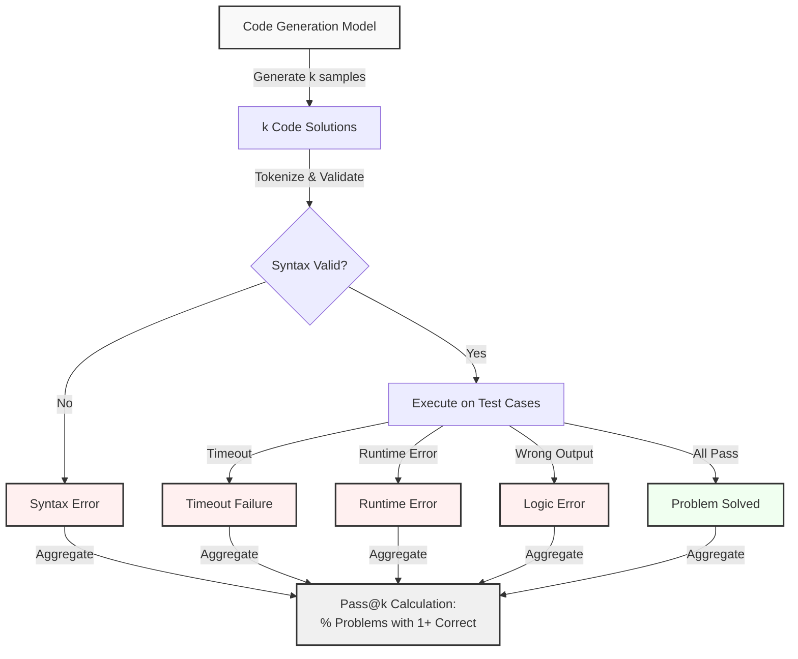

# Code Evaluation: Benchmarking Language Models on Code

## Paper Overview

Evaluating code generation models requires standardized benchmarks and metrics that go beyond typical NLP evaluation. Traditional NLP metrics like BLEU or ROUGE are ineffective for code because they measure string similarity, not functional correctness. Two key benchmarks emerged from research: HumanEval (Chen et al., 2021) with 164 hand-written programming problems, and MBPP (Austin et al., 2021) with 1000 problems from Kaggle competitions. These benchmarks introduced execution-based evaluation—code is executed against test cases to determine correctness rather than comparing to reference implementations.

The paper's core contribution is the **pass@k metric**, which measures the probability that at least one of k samples solves the problem. This metric acknowledges that code generation models often produce multiple plausible solutions, and evaluating whether any is correct is more meaningful than evaluating the single most likely solution. Pass@k became the standard metric for code generation evaluation, enabling comparison across models of different sizes and sampling strategies.

Code evaluation also revealed important insights about code generation model behavior: (1) Models often generate syntactically valid but semantically incorrect code, (2) Failure modes cluster (off-by-one errors, missing edge case handling, infinite loops), (3) Problem difficulty varies widely (some problems solved 90% of the time, others solved 10%), (4) Model scale dramatically affects pass rates (pass@1 scales as O(model_size^α) where α ≈ 0.3-0.5).

## Core Intuition

Evaluating code isn't like evaluating text—you can't just compare strings. Code is correct if it produces the right output for all possible inputs. The pass@k metric asks: "If you generate k different solutions, is at least one of them correct?" This is realistic because when humans solve problems, we often try multiple approaches until one works.

## How It Works

Code evaluation operates through five core mechanisms:

1. **Problem Specification with Test Cases**: Each benchmark problem includes a function signature, docstring, and hidden test cases (typically 1-10 per problem). For example:
   ```python
   def is_prime(n):
       """Return True if n is a prime number."""
       # Hidden test cases: is_prime(2) -> True, is_prime(1) -> False, is_prime(100) -> False
   ```
   The problem specifies what the function should do; test cases verify correctness.

2. **Execution-Based Evaluation**: Generated code is executed against all test cases. If all test cases pass, the solution is correct. This requires sandboxing (to prevent malicious code) and timeout management (to catch infinite loops). The evaluation runs: `exec(generated_code); assert func(*test_input) == expected_output`.

3. **Pass@k Metric Calculation**: For a given problem, the model generates k independent samples (by sampling with high temperature). Each sample is tested. The problem is considered "solved" if at least one sample produces correct output. Pass@k is the fraction of problems with at least one correct solution:
   ```
   pass@k = (# of problems with ≥1 correct solution) / (# of total problems)
   ```
   Pass@1 (zero-shot) is typically 20-50% for state-of-the-art models. Pass@100 can reach 70-90%.

4. **Failure Mode Classification**: When code fails, it falls into categories:
   - **Syntax errors**: Invalid Python (mismatched parentheses, invalid indentation)
   - **Runtime errors**: Code runs but crashes (NameError, IndexError, TypeError)
   - **Timeout**: Infinite loop or very slow algorithm (typically 5-10s timeout)
   - **Logic errors**: Code runs and completes but produces wrong output
   
   Understanding which failures dominate helps identify model weaknesses.

5. **Statistical Analysis of Results**: Pass@k estimates are computed with confidence intervals using bootstrap sampling. For example, on HumanEval, a model achieving 50% pass@1 with 164 problems has a 95% CI of approximately 50% ± 5% (exact CI depends on the number of problems).



## Architecture & Trade-offs

Code evaluation benchmarks make design choices that affect what they measure:

| Design Choice | HumanEval | MBPP | Effect |
|---|---|---|---|
| **Problem Count** | 164 problems | 1000 problems | More problems (MBPP) reduce variance in pass@k estimates but require more compute |
| **Problem Source** | Hand-written by researchers | Kaggle competitions | HumanEval: more controlled, reproducible. MBPP: more diverse, potentially noisier |
| **Problem Difficulty** | Mostly easy-medium (LeetCode easy) | Mixed easy-hard | MBPP better measures difficulty spectrum; HumanEval easier to solve |
| **Language** | Python only | Python only | Easier evaluation but misses language-specific patterns |
| **Test Case Visibility** | Hidden (part of evaluation only) | Hidden (part of evaluation only) | Prevents gaming the benchmark; authentic evaluation |
| **Execution Timeout** | 10 seconds per problem | 5 seconds per problem | Shorter timeout (MBPP) penalizes inefficient algorithms more |
| **Test Case Count** | Typically 1-2 | Typically 4-5 | More test cases (MBPP) reduce chance of passing by luck |

### Benchmark Difficulty Comparison

| Problem Difficulty | HumanEval Examples | MBPP Examples | Pass Rate (Codex) |
|---|---|---|---|
| **Easy** | "write a function to sum a list" | "compute factorial" | 70-90% |
| **Medium** | "implement mergesort" | "find longest palindrome substring" | 40-60% |
| **Hard** | "solve a graph problem" | "dynamic programming with constraints" | 10-30% |

### Trade-offs: Pass@1 vs. Pass@k

| Metric | Advantages | Disadvantages | Use Case |
|---|---|---|---|
| **Pass@1** | Single sample, deterministic, fast inference | Doesn't capture model's true capability; fails when solution space is large | Real-time applications where you generate once |
| **Pass@10** | Better reflects model capability by exploring solution space | More compute (10x inference); slower evaluation | Research evaluation, offline code generation |
| **Pass@100** | Captures maximum theoretical capability | Prohibitive compute cost (100x inference); not practical; may exceed problem's inherent ambiguity | Upper bound estimation, research |

Pass@k grows with sample count k, but with diminishing returns. If 70% of problems are solved by sample 5, generating more samples finds diminishing gains.

## Interview Q&A

**Q: Why is execution-based evaluation critical for code generation? Why can't you just use string similarity metrics like BLEU?**

A: String similarity metrics are useless for code because multiple correct solutions exist for almost every problem. For example, to compute the sum of a list:
- Solution A: `return sum(lst)` (Pythonic)
- Solution B: `result = 0; [result += x for x in lst]; return result` (explicit loop)
- Solution C: `reduce(lambda a, b: a+b, lst)` (functional)

All three are correct and produce identical output, but they have completely different strings. BLEU would rate them as having low similarity to a reference implementation and assign low scores despite both being correct. Execution-based evaluation actually runs the code on test cases and checks if it produces correct output. This is the only meaningful way to evaluate code correctness. The downside: you need to execute untrusted code (requires sandboxing) and handle infinite loops (requires timeouts).

**Q: Explain pass@k. Why is it more useful than pass@1 for evaluating code models?**

A: Pass@k measures the probability that at least one of k generated samples solves the problem. It's more useful than pass@1 because:

1. **Multiple correct solutions**: Most problems have multiple valid solutions. A model might not find the most likely one but still find a correct one. Pass@k captures this possibility.

2. **Realistic sampling strategy**: In practice, you don't just generate once; you explore multiple solutions. Pass@k matches how humans solve problems—try approach A, if it fails, try approach B.

3. **Better capacity assessment**: Pass@1=28.8% for Codex-12B means in zero-shot mode (no examples), it solves 28.8% first try. But pass@100 ≈70% means the model actually knows how to solve 70% of problems but might not pick the right approach first. Pass@k reveals the model's true knowledge.

However, pass@k requires k times more compute. Pass@1 is deterministic and fast; pass@100 requires 100 inference passes. In practice, you pick k based on compute budget—k=5-10 for reasonable evaluation, k=100 for upper-bound estimation.

**Q: What are the limitations of HumanEval and MBPP as benchmarks? How would you design a better benchmark?**

A: **Limitations of HumanEval**:
- Only 164 problems (small statistical sample)
- Heavily biased toward easy problems (LeetCode easy level)
- Mostly algorithmic (search, sort, math) rather than real-world programming (I/O, error handling, libraries)
- Python-only (doesn't test models on other languages)
- Hand-written problems may bias toward patterns the authors encountered

**Limitations of MBPP**:
- Kaggle competition problems are biased toward data science and optimization (not representative of all programming)
- Still Python-only
- Test cases might be biased toward solutions similar to the Kaggle winners

**Better benchmark design**:
1. **Diverse problem sources**: Mix algorithmic, systems programming, web development, data processing
2. **Multiple languages**: Python, JavaScript, Java, C++, Rust—measure language generalization
3. **Larger sample**: 1000+ problems to reduce variance in pass@k estimates
4. **Tiered difficulty**: Explicitly categorize easy/medium/hard; measure performance by difficulty
5. **Real-world context**: Include problems that require reading/writing files, parsing formats, integrating libraries
6. **Test case diversity**: Include edge cases (empty input, boundary values, large inputs) and stress tests
7. **Temporal evaluation**: Problems from different time periods to measure if models overfit to recent patterns

**Current gap**: HumanEval and MBPP are good for research but don't measure real-world programming ability. A model with 50% pass@k on HumanEval can't necessarily build a full-featured application.

**Q: Describe a scenario where a code generation model could have high pass@k on HumanEval but fail in production. What would you monitor?**

A: **Scenario**: Model achieves 50% pass@k on HumanEval (strong benchmark performance) but fails in production because it:
- Generates code with security vulnerabilities (SQL injection, buffer overflow, hardcoded credentials)
- Produces inefficient algorithms (O(n^3) when O(n log n) is required; timeouts on production data)
- Doesn't handle real-world I/O errors (network failures, file not found, permission denied)
- Relies on undefined functions or library APIs that don't exist in production environment
- Has non-deterministic bugs (uses uninitialized memory, race conditions)

**Why this happens**: HumanEval problems are isolated functions with simple inputs/outputs and full test case visibility. Production code is messy: handles errors, integrates multiple libraries, processes real data with edge cases, runs concurrently. The model's learning is brittle to distribution shift.

**What to monitor**:
1. **Performance metrics**: Timeout rate on actual data (if 20% of requests timeout, your efficient-algorithm assumption is wrong)
2. **Error logs**: Track crashes and exceptions (NameError, TypeError, etc. indicate the model generated invalid code)
3. **Security scanning**: Run static analysis (bandit for Python, clippy for Rust) on generated code; flag suspicious patterns
4. **User feedback**: Track bug reports; if users report X-type bugs, analyze generated code to see if model is systematically generating them
5. **Drift detection**: Compare generated code distribution over time; if it changes, retrain or update prompts
6. **Test coverage**: Measure line/branch coverage of generated code; low coverage suggests edge cases aren't tested

## Best Practices

- **Always report pass@1 and pass@k together** to give a complete picture. Pass@1 shows deterministic generation quality; pass@k shows true model capability with sampling. Both numbers matter.

- **Use sufficient sample size for statistical significance**. With 164 problems (HumanEval), a 50% pass rate has a 95% CI of roughly ±7%. To get more precision, either use larger benchmarks (MBPP) or report bootstrap confidence intervals.

- **Test across multiple benchmarks** rather than optimizing for a single benchmark. A model might achieve 70% on HumanEval but only 40% on MBPP or domain-specific benchmarks. Multiple benchmarks reveal true generalization.

- **Analyze failure modes, not just pass rate**. A 50% pass rate where 40% of failures are syntax errors is different from 30% syntax + 20% logic errors. Syntax errors indicate tokenization or formatting issues; logic errors indicate semantic misunderstanding. Fixes differ.

- **Measure pass@k with reasonable k values** (k=5-10 for practical evaluation, not k=100). Pass@100 is unrealistic for production where you generate once or twice. Focus on k that matches your use case.

- **Include edge case analysis**: Explicitly test models on boundary conditions, empty inputs, large inputs, special characters. Production data has these; benchmarks often don't. Report performance on hard subsets.

- **Compare with human performance** to contextualize results. If a task is 90% human-solvable and the model solves 70%, it's reasonable. If it's 99% human-solvable and the model solves 50%, there's a significant gap.

## Common Pitfalls

- **Overfitting to benchmarks**: Because HumanEval and MBPP are public, newer models might have seen them during pre-training, inflating pass rates. Symptom: A model achieves X% on HumanEval but Y% < X on a held-out benchmark. Fix: Use held-out benchmarks (LiveCodeBench) that are continuously updated and not in pre-training data.

- **Ignoring statistical significance**: Reporting "50% pass rate" without confidence intervals is misleading. With 164 problems, 50% might have a ±7% CI. If you improve to 51%, it's not significant. Fix: Always report 95% CIs or p-values when comparing models.

- **Using wrong timeout values**: If your timeout is 10 seconds but production timeout is 1 second, you're evaluating a different problem. An algorithm that solves the problem in 5 seconds passes evaluation but fails in production. Fix: Set timeout to match production SLAs.

- **Not validating test cases**: Benchmark test cases might have bugs (expected output is wrong, test cases are ambiguous). Symptom: Model produces output that seems reasonable but fails test case. Fix: Manually verify a sample of test cases and check if expected outputs make sense.

- **Pass@k calculation errors**: Computing pass@k incorrectly is common. The correct formula is: "at least one sample is correct" = NOT "all samples are correct". If you compute it as "all samples are correct" (incorrect), you get much lower scores. Fix: Double-check your implementation with a toy example.

- **Comparing pass rates across different k values**: "Model A achieved 40% pass@10 and Model B achieved 35% pass@5" are incomparable. You must use the same k. Fix: Always evaluate on the same k, or use interpolation to estimate comparable values.

## Code Examples

### Example 1: Basic Execution-Based Evaluation

```python
import subprocess
import signal
from typing import List, Tuple, Dict
from pathlib import Path

def execute_code_safely(code: str, 
                        test_cases: List[Tuple[str, str]],
                        timeout_sec: int = 10,
                        entrypoint: str = "solution") -> Dict[str, any]:
    """
    Execute generated code and evaluate against test cases.
    
    Args:
        code: Generated Python code (must contain a function)
        test_cases: List of (function_input, expected_output) as strings
        timeout_sec: Timeout per execution in seconds
        entrypoint: Name of the main function to test
    
    Returns:
        {
            'passed': bool,
            'num_passed': int,
            'num_total': int,
            'failure_mode': str or None,
            'error_message': str or None
        }
    """
    
    num_passed = 0
    num_total = len(test_cases)
    failure_mode = None
    error_message = None
    
    # First: check if code is syntactically valid
    try:
        compile(code, '<string>', 'exec')
    except SyntaxError as e:
        return {
            'passed': False,
            'num_passed': 0,
            'num_total': num_total,
            'failure_mode': 'syntax_error',
            'error_message': str(e)
        }
    
    # Execute and test each test case
    for test_input, expected_output in test_cases:
        try:
            # Create execution context
            local_vars = {}
            exec(code, {}, local_vars)
            
            # Call the function
            if entrypoint not in local_vars:
                failure_mode = 'missing_function'
                error_message = f"Function '{entrypoint}' not found in code"
                break
            
            func = local_vars[entrypoint]
            
            # Parse input and call function
            # Assume test_input is a comma-separated list of arguments
            import json
            try:
                args = json.loads(f"[{test_input}]")
            except:
                args = [test_input]
            
            # Execute with timeout
            import signal
            import platform
            
            if platform.system() != "Windows":
                def timeout_handler(signum, frame):
                    raise TimeoutError("Execution timeout")
                
                signal.signal(signal.SIGALRM, timeout_handler)
                signal.alarm(timeout_sec)
            
            try:
                result = func(*args)
                if platform.system() != "Windows":
                    signal.alarm(0)
            except TimeoutError:
                failure_mode = 'timeout'
                error_message = f"Execution timeout after {timeout_sec}s"
                break
            
            # Compare output
            if str(result) == expected_output:
                num_passed += 1
            else:
                failure_mode = 'logic_error'
                error_message = f"Expected {expected_output}, got {result}"
                # Continue testing other cases to get count
        
        except Exception as e:
            failure_mode = 'runtime_error'
            error_message = f"{type(e).__name__}: {str(e)}"
            # Continue to next test
    
    passed = num_passed == num_total
    
    return {
        'passed': passed,
        'num_passed': num_passed,
        'num_total': num_total,
        'failure_mode': failure_mode if not passed else None,
        'error_message': error_message
    }

# Example usage
sample_code = """
def solution(n):
    '''Return the sum of digits of n.'''
    total = 0
    while n > 0:
        total += n % 10
        n //= 10
    return total
"""

test_cases = [
    ("123", "6"),      # 1+2+3=6
    ("9", "9"),        # Single digit
    ("1000", "1"),     # Zeros
]

result = execute_code_safely(sample_code, test_cases)
print("Evaluation Result:")
print(f"  Passed: {result['passed']}")
print(f"  Score: {result['num_passed']}/{result['num_total']}")
if result['failure_mode']:
    print(f"  Failure: {result['failure_mode']}")
    print(f"  Error: {result['error_message']}")
```

### Example 2: Pass@k Calculation

```python
import numpy as np
from typing import List, Tuple
from dataclasses import dataclass

@dataclass
class EvaluationResult:
    problem_id: int
    samples: List[bool]  # True if sample i is correct
    
    @property
    def pass_at_1(self) -> float:
        """Probability that first sample is correct."""
        return float(self.samples[0]) if len(self.samples) > 0 else 0.0
    
    @property
    def pass_at_k(self, k: int = None) -> float:
        """Probability that at least one of first k samples is correct."""
        if k is None:
            k = len(self.samples)
        k = min(k, len(self.samples))
        return 1.0 if any(self.samples[:k]) else 0.0

def compute_pass_at_k(results: List[EvaluationResult], 
                      k: List[int] = [1, 5, 10]) -> dict:
    """
    Compute pass@k metrics across all problems.
    
    Args:
        results: List of evaluation results for each problem
        k: List of k values to report
    
    Returns:
        {
            'pass@1': float,
            'pass@5': float,
            ...
            'num_problems': int,
            'confidence_interval': {...}
        }
    """
    
    metrics = {}
    num_problems = len(results)
    
    for k_val in k:
        pass_at_k_values = [r.pass_at_k(k_val) for r in results]
        pass_at_k_mean = np.mean(pass_at_k_values)
        
        # Bootstrap 95% CI
        bootstrap_replicates = []
        for _ in range(10000):
            # Resample with replacement
            boot_sample = np.random.choice(pass_at_k_values, size=len(pass_at_k_values))
            bootstrap_replicates.append(np.mean(boot_sample))
        
        ci_lower = np.percentile(bootstrap_replicates, 2.5)
        ci_upper = np.percentile(bootstrap_replicates, 97.5)
        
        metrics[f'pass@{k_val}'] = {
            'mean': pass_at_k_mean,
            'ci_lower': ci_lower,
            'ci_upper': ci_upper,
            'ci_str': f"{pass_at_k_mean:.1%} [{ci_lower:.1%}, {ci_upper:.1%}]"
        }
    
    return {
        'metrics': metrics,
        'num_problems': num_problems,
        'num_samples_per_problem': len(results[0].samples) if results else 0
    }

# Example evaluation
example_results = [
    EvaluationResult(1, [True, False, True, False]),    # Problem 1: solved by sample 0 and 2
    EvaluationResult(2, [False, False, False, False]),   # Problem 2: not solved by any
    EvaluationResult(3, [True, True, True, True]),       # Problem 3: solved by all
    EvaluationResult(4, [False, True, False, False]),    # Problem 4: solved only by sample 1
]

summary = compute_pass_at_k(example_results, k=[1, 2, 4])
print("Pass@k Results:")
for metric, stats in summary['metrics'].items():
    print(f"  {metric}: {stats['ci_str']}")
print(f"Total problems: {summary['num_problems']}")
```

### Example 3: Failure Mode Analysis

```python
from enum import Enum
from collections import defaultdict
import json

class FailureMode(Enum):
    SYNTAX_ERROR = "syntax_error"
    RUNTIME_ERROR = "runtime_error"
    TIMEOUT = "timeout"
    LOGIC_ERROR = "logic_error"
    CORRECT = "correct"

def classify_failure(result: dict) -> FailureMode:
    """Classify result into failure mode."""
    if result['passed']:
        return FailureMode.CORRECT
    
    mode = result.get('failure_mode')
    if mode == 'syntax_error':
        return FailureMode.SYNTAX_ERROR
    elif mode == 'timeout':
        return FailureMode.TIMEOUT
    elif mode == 'runtime_error':
        return FailureMode.RUNTIME_ERROR
    else:
        return FailureMode.LOGIC_ERROR

def analyze_failures(evaluation_results: List[dict]) -> dict:
    """Analyze distribution of failure modes."""
    
    failure_distribution = defaultdict(int)
    failure_examples = defaultdict(list)
    
    for result in evaluation_results:
        mode = classify_failure(result)
        failure_distribution[mode.value] += 1
        
        if mode != FailureMode.CORRECT:
            failure_examples[mode.value].append({
                'problem_id': result.get('problem_id'),
                'error': result.get('error_message')
            })
    
    # Compute percentages
    total = len(evaluation_results)
    percentages = {
        mode: count / total * 100 
        for mode, count in failure_distribution.items()
    }
    
    return {
        'distribution': dict(failure_distribution),
        'percentages': percentages,
        'examples': {k: v[:5] for k, v in failure_examples.items()}  # Top 5 examples
    }

# Example analysis
mock_results = [
    {'passed': True, 'problem_id': 1},
    {'passed': False, 'failure_mode': 'logic_error', 'error_message': 'Wrong output', 'problem_id': 2},
    {'passed': False, 'failure_mode': 'syntax_error', 'error_message': 'Mismatched paren', 'problem_id': 3},
    {'passed': True, 'problem_id': 4},
    {'passed': False, 'failure_mode': 'timeout', 'error_message': 'Timeout', 'problem_id': 5},
    {'passed': True, 'problem_id': 6},
]

analysis = analyze_failures(mock_results)
print("Failure Mode Analysis:")
print(f"Total problems: {len(mock_results)}")
print("\nDistribution:")
for mode, count in analysis['distribution'].items():
    pct = analysis['percentages'][mode]
    print(f"  {mode}: {count} ({pct:.1f}%)")

print("\nExamples:")
for mode, examples in analysis['examples'].items():
    if examples:
        print(f"  {mode}:")
        for ex in examples[:2]:
            print(f"    Problem {ex['problem_id']}: {ex['error']}")
```

## Related Concepts

- [Codex: Evaluating Large Language Models Trained on Code](./02-codex.md) – Code generation model achieving 28.8% pass@1 on HumanEval
- [CodeT5: Identifier-Aware Unified Encoder-Decoder for Code](./01-codet5.md) – Encoder-decoder for code understanding and generation
- [Metrics for Generation Tasks](../../nlp/concepts/XX-generation-metrics.md) – Beyond string similarity to semantic correctness
- [Benchmarking Language Models](../../foundation-models/concepts/XX-benchmarking.md) – Statistical evaluation and confidence intervals
