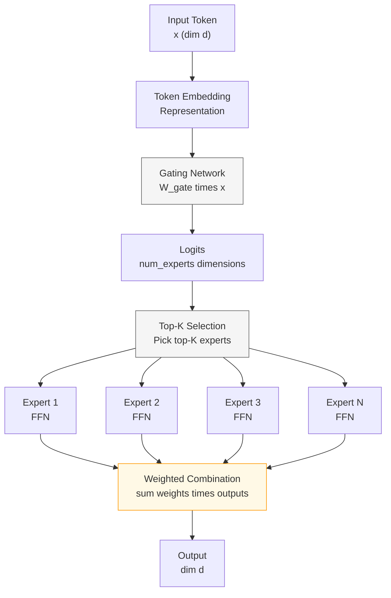

# Mixture of Experts: Scaling Models with Conditional Computation

## Paper Overview

**Title:** Mixture of Experts (MoE) - Scaling Models with Conditional Computation

**Key Authors:** Noam Shazeer, Azalia Mirhoseini, Krzysztof Marek (2016-2017); Denis Lepikhin, Dehao Chen, Yuanzhong Xu (Google, 2020); OpenAI (GPT-4 variants, 2023)

**Published:** NIPS 2016, ICLR 2020, various venues | [arXiv](https://arxiv.org/abs/1701.06538)

**Impact:** Foundational technique for scaling trillion-parameter models. Switch Transformers (Google, 2021) trained 1.6 trillion parameter models faster than dense 900B models—demonstrating that conditional computation is essential for efficient scaling.

Mixture of Experts (MoE) is a scaling technique that fundamentally changes how we think about model capacity. Rather than building one giant dense network, MoE uses a learned **routing mechanism** to direct each token to a small subset of specialist "expert" networks. The remarkable result: a 1 trillion-parameter model can have the computational footprint of a 1 billion-parameter model, because only sparse experts activate per token.

**The core insight:** Not all computation is equally useful for all inputs. A token about mathematics might benefit from one expert, while a token about biology benefits from another. By learning *which* expert to use for *which* token, we achieve massive parameter efficiency without the compute overhead.

**Why this matters for interviews:** MoE is now standard across industry (OpenAI, Google, Meta). Understanding sparse routing, gating mechanisms, load balancing, and the trade-offs between dense and sparse computation is essential for ML systems roles. MoE also demonstrates the broader principle of **conditional computation**—a fundamental shift in how we think about neural network capacity and efficiency.

---

## Core Contribution

### The Scaling Efficiency Problem

Dense neural networks face a dilemma:
- **More capacity = better quality** → need more parameters for complex tasks
- **More parameters = more computation** → inference becomes prohibitively expensive
- A 7B parameter model costs ~7× more to run than a 1B model
- Scaling to 100B parameters requires 100× the compute—often infeasible

**Example:** Training a single 100B-parameter dense model requires enormous compute and memory. Inference is similarly expensive: every token requires processing through 100B parameters.

### The MoE Solution: Sparse Conditional Activation

Instead of activating all parameters, use a learned **gating mechanism** to activate only a small subset:

```
For each token:
  1. Input token embedding → Gating network → logits (one per expert)
  2. Select top-K experts based on logits
  3. Route token to selected experts
  4. Combine outputs: weighted sum of expert outputs
```

**Result:** A 1000B parameter model where only 1-2 experts activate per token might cost as little as a 1B model to run in inference.

### Key Innovation: Sparse Routing with Top-K Selection

- **Gating mechanism:** A simple learned linear layer that outputs logits for each expert
- **Top-K selection:** Pick the K experts with highest gating logits (K << total experts)
- **Load balancing:** Add auxiliary loss to prevent all tokens from routing to the same expert
- **Expert networks:** Each expert is a small feedforward network (or any sub-module)

**Example from Switch Transformers (Google, 2021):**
- Total experts: 2048
- Experts per token: 1 (top-1 routing)
- Total parameters: 1.6 trillion
- Computation per token: ~260 billion (1.6T / 6, since ~6 experts worth of compute due to efficient routing)
- Training speed: Faster than dense 900B models despite being much larger

---

## Key Ideas & Algorithm

### How Mixture of Experts Works

**Step 1: Token-to-Expert Routing**

Each token flows through a gating mechanism that decides which experts to use:

```
Input token: x ∈ ℝ^d
Gating network: g(x) = softmax(W_gate · x) ∈ ℝ^num_experts
Router output: Determines which experts receive this token
```

**Step 2: Sparse Top-K Selection**

Select only the top-K experts (K is typically 1-4):

```
top_k_gates, top_k_indices = topk(g(x), k=K)
Renormalize: top_k_gates = softmax(top_k_gates)
```

**Step 3: Expert Computation**

Each selected expert processes the token independently:

```
For each selected expert e ∈ top_k_indices:
  expert_output_e = Expert_e(x)
  
Combine outputs:
  output = sum(top_k_gates[e] * expert_output_e)
```

**Step 4: Load Balancing (Critical for Training Stability)**

Problem: Gating learns to use only the "best" experts → dead experts → training instability

Solution: Add auxiliary loss that penalizes imbalanced expert usage:

```
expert_frequency = mean(g(x)) across batch  ∈ ℝ^num_experts
load_balance_loss = num_experts * sum(expert_frequency^2)
total_loss = main_loss + lambda * load_balance_loss
```

This encourages the router to spread tokens evenly across experts.

### Architecture Diagram



---

## Architecture / Trade-offs

### Dense Routing vs Sparse Routing

| Aspect | Dense (All Experts) | Sparse Top-K |
|--------|-------------------|--------------|
| **Computation per Token** | O(num_experts) — always activate all | O(K) — only K experts activate |
| **Memory Requirements** | Load all expert parameters | All parameters in memory, activate K |
| **Training Speed** | Slower with many experts | Faster; larger models can train faster |
| **Load Balancing Difficulty** | Automatic; all experts used equally | Manual; requires auxiliary loss |
| **Routing Complexity** | Weighted combination of all experts | Sparse gather/scatter operations |
| **Inference Latency** | Proportional to num_experts | Proportional to K only |
| **Gradient Flow** | Through all experts | Only through selected experts |
| **Dead Expert Risk** | None; all experts always active | High; some experts may never activate |

**Conclusion:** Dense routing is simple but wasteful. Sparse routing is complex but enables massive scaling.

---

### Expert Scaling Strategies

| Strategy | Num Experts | K (Activate) | Use Case | Trade-offs |
|----------|-------------|--------------|----------|-----------|
| **Few Large Experts (8 total, activate 2)** | 8 | 2 | Balanced; easy load balancing | Limited scale (only 4× capacity gain) |
| **Many Sparse Experts (128 total, activate 1)** | 128 | 1 | High capacity (128× parameters) | Complex load balancing; one expert might fail |
| **Hierarchical** | 64 (8 groups × 8) | 2-4 | Efficient routing with structure | Adds routing complexity |
| **Conditional Activation** | 1024+ | 2 | Massive capacity (1000B+ parameters) | Requires careful load balancing + auxiliary losses |

**Key observation:** More experts → larger capacity gains, but load balancing becomes harder.

---

### Load Balancing Techniques

**1. Auxiliary Loss (Google, 2020)**

Add imbalance penalty to training loss:

```
loss_balance = num_experts * sum(expert_usage^2)
total_loss = main_loss + weight * loss_balance
```

Weight typically 0.01-0.1. Encourages uniform expert utilization.

**2. Random Expert Routing (Meta)**

During training, route a small fraction of tokens to *random* experts:

```
if random() < epsilon:
  route_to_random_expert()
else:
  route_to_top_k_experts()
```

Prevents collapse to few experts by forcing diversity.

**3. Batch-Level Load Balancing (OpenAI)**

Within a batch, explicitly distribute tokens to minimize expert overflow:

```
tokens_per_expert = batch_size / num_experts (target)
while any expert has tokens > target:
  move excess tokens to underloaded experts
```

Synchronization overhead but prevents overflow.

**4. Expert Dropout (Empirically Effective)**

Randomly disable experts during training:

```
for expert in experts:
  if random() < dropout_rate:
    expert_output = 0
else:
  expert_output = expert(x)
```

Forces robustness to expert failures; helps generalization.

---

## Interview Q&A

**Q: What's the core idea behind Mixture of Experts?**

A: Instead of activating all parameters for every input, learn a gating mechanism to route tokens to a small subset of expert networks. This allows building models with enormous parameters but constant computational cost. Example: a 1000B parameter model might only activate 2 experts per token, giving it similar compute cost to a 50B model while having vastly more capacity. The trade-off is added complexity in load balancing and routing.

---

**Q: How does the gating mechanism decide which experts to use?**

A: A learned linear layer takes the token representation and outputs logits (one per expert). We apply softmax and select the top-K experts by gate weight. These selected experts process the token, and outputs are combined as: `output = sum(gate_weight[i] * expert[i](token))`. The gating network learns during training which experts are good for which token types.

---

**Q: What's the load balancing problem and why is it critical?**

A: Without load balancing, the gating learns to use only the best 1-2 experts. Other experts become completely inactive ("dead"), which wastes parameters and causes training instability. Solutions include: (1) auxiliary loss penalizing uneven expert usage, (2) random routing to force diversity, or (3) batch-level load balancing. Without solving this, training MoE models becomes unstable and convergence suffers.

---

**Q: When would you use MoE instead of scaling with more dense parameters?**

A: **Use MoE when:** You need massive parameter capacity but have compute budget constraints (e.g., inference on GPUs). Trade-off: more training complexity, load balancing overhead, less mature tooling. **Use dense when:** Simplicity matters, compute is cheap, or model size < 50B parameters. For very large models (100B+), MoE typically wins. For 7B-20B, dense is often simpler and competitive.

---

**Q: How does MoE compare to other efficiency techniques like pruning or quantization?**

A: **Pruning/Quantization:** Reduce existing model size, but don't increase capacity. **MoE:** Increases capacity without proportional compute increase. They're complementary! You can apply pruning and quantization to MoE experts to further optimize. MoE is fundamentally about *scaling up efficiently*, while pruning/quantization are about *scaling down*.

---

**Q: What's the practical challenge with serving MoE models in production?**

A: Standard deep learning frameworks assume dense activation. MoE requires:
1. **Custom kernels** for gather/scatter operations (route tokens to experts)
2. **Dynamic tensor shapes** (different tokens → different numbers of experts)
3. **Load balancing** to avoid some GPUs being idle (when all tokens route to same expert)

This is why MoE is typically deployed by well-resourced teams (Google, OpenAI, Meta) rather than in standard frameworks.

---

**Q: Can you merge an MoE model into a dense model for simpler deployment?**

A: Yes! Weighted average experts using their usage frequencies: `merged = sum(usage_freq[i] * expert[i])`. This gives a single dense model. Trade-off: loses conditional computation benefit (back to dense costs), but simplifies deployment. Useful when serving on resource-constrained hardware or when inference latency matters more than model size.

---

**Q: How does expert specialization work in practice?**

A: Some experts *do* specialize (e.g., "expert 3 always handles punctuation tokens"), but it's not guaranteed. You can monitor router outputs to discover specialization patterns. Some papers use auxiliary losses to encourage specialization (e.g., routing based on token perplexity), but typically the router learns whatever specialization is useful for the task.

---

## Best Practices

- **Start with 8-16 experts and k=2:** Good balance of efficiency gain and training stability. Scale up experts for larger models (128+ for trillion-parameter models).

- **Use load balancing loss from training start:** Don't wait for dead experts to appear. Weight the auxiliary loss 0.01-0.1× the main loss. Monitor expert usage per batch to verify balance.

- **Monitor router entropy:** If gates collapse to one expert, entropy drops. Log `entropy = -sum(p * log(p))` and use it as a metric during training.

- **Use expert dropout during training:** Randomly disable experts with probability 0.1-0.2. Forces robustness and improves generalization to held-out expert failures.

- **Profile communication overhead in distributed training:** In multi-GPU/multi-node setups, gather/scatter of tokens to experts can be slow. Profile before scaling; sometimes fused operations or expert slicing help.

- **Batch load balancing is worth the complexity:** If tokens cluster (e.g., all math tokens), load imbalance hurts. Distribute within-batch tokens to balance expert load; synchronization cost is usually worth it.

- **Consider expert sharing for first/last layers:** Not all layers need many experts. First layers (simple features) and last layers (output projection) can be dense, while middle layers have many experts.

- **Validate on held-out data before deployment:** MoE models can overfit to training distribution if load balancing isn't working. Always validate that expert usage is balanced on validation data.

---

## Common Pitfalls to Avoid

- **Dead experts (all tokens route to same expert):** Symptoms: expert usage is highly imbalanced (e.g., expert 0 gets 90% of tokens, others unused). Fix: increase load balancing loss weight, add random routing, or use expert dropout. Monitor expertusage distribution every batch.

- **Router collapse:** Gating network outputs become degenerate (all logits the same, or all zeros). Symptoms: entropy → 0, no differentiation between experts. Fix: reduce load balancing weight (can conflict with router learning), or use entropy regularization (bonus for high-entropy routing).

- **Communication overhead exceeds computation savings:** In distributed training, gather/scatter tokens to experts can be slower than just using dense networks. Profile first: if gather/scatter takes 60% of time but saves 20% computation, it's a net loss. Solutions: expert slicing (each GPU gets a few experts), fused kernels, or switch to dense.

- **Inference serving complexity underestimated:** Standard serving frameworks (TensorFlow Serving, ONNX) don't handle sparse routing well. Dynamic shapes and conditional computation require custom kernels. Plan for infrastructure cost before committing to MoE.

- **Expert imbalance on long sequences:** If tokens cluster by position (e.g., certain positions always route to expert 0), later tokens starve. Solution: position-aware routing (rare), or randomized batching across sequence boundaries.

---

## Code Examples

### Example 1: Simple MoE Layer from Scratch

```python
import torch
import torch.nn as nn

class SimpleMoE(nn.Module):
    """Mixture of Experts with dense routing (all experts used)."""
    
    def __init__(self, dim=512, num_experts=8, expert_hidden=2048):
        super().__init__()
        self.num_experts = num_experts
        
        # Gating network: produces logits for each expert
        self.gating = nn.Linear(dim, num_experts)
        
        # Expert networks: independent feedforward networks
        self.experts = nn.ModuleList([
            nn.Sequential(
                nn.Linear(dim, expert_hidden),
                nn.ReLU(),
                nn.Linear(expert_hidden, dim)
            )
            for _ in range(num_experts)
        ])
    
    def forward(self, x):
        """
        Args:
            x: (batch, seq_len, dim) token representations
        Returns:
            output: (batch, seq_len, dim) mixture of expert outputs
        """
        batch_size, seq_len, dim = x.shape
        
        # Gating: compute logits for each expert
        gates = torch.softmax(self.gating(x), dim=-1)  # (B, L, E)
        
        # Expert outputs: stack outputs from all experts
        expert_outputs = []
        for expert in self.experts:
            expert_outputs.append(expert(x))
        expert_outputs = torch.stack(expert_outputs, dim=-1)  # (B, L, D, E)
        
        # Weighted combination: each token is weighted sum of expert outputs
        output = torch.einsum('bse,bsde->bsd', gates, expert_outputs)  # (B, L, D)
        
        return output
```

**Usage:**
```python
moe = SimpleMoE(dim=512, num_experts=8, expert_hidden=2048)
x = torch.randn(batch_size=4, seq_len=32, dim=512)
output = moe(x)  # Output: (4, 32, 512)
```

---

### Example 2: Sparse MoE with Top-K Routing and Load Balancing

```python
class SparseMoE(nn.Module):
    """Mixture of Experts with sparse top-K routing and load balancing."""
    
    def __init__(self, dim=512, num_experts=32, expert_hidden=2048,
                 k=2, load_balance_weight=0.01):
        super().__init__()
        self.num_experts = num_experts
        self.k = k
        self.load_balance_weight = load_balance_weight
        
        # Gating network
        self.gating = nn.Linear(dim, num_experts)
        
        # Expert networks
        self.experts = nn.ModuleList([
            nn.Sequential(
                nn.Linear(dim, expert_hidden),
                nn.ReLU(),
                nn.Linear(expert_hidden, dim)
            )
            for _ in range(num_experts)
        ])
    
    def forward(self, x):
        """
        Args:
            x: (batch, seq_len, dim)
        Returns:
            output: (batch, seq_len, dim) routed through sparse experts
            load_balance_loss: scalar loss for auxiliary training
        """
        batch_size, seq_len, dim = x.shape
        
        # Gating: compute probabilities for each expert
        gate_logits = self.gating(x)  # (B, L, E)
        gate_probs = torch.softmax(gate_logits, dim=-1)
        
        # Top-K selection
        top_k_gates, top_k_indices = torch.topk(gate_probs, self.k, dim=-1)
        top_k_gates = torch.softmax(top_k_gates, dim=-1)  # renormalize
        
        # Load balancing auxiliary loss
        # Encourage balanced usage across experts
        expert_freq = gate_probs.mean(dim=(0, 1))  # (E,)
        load_balance_loss = self.num_experts * torch.sum(expert_freq ** 2)
        
        # Compute output: sparse routing through top-K experts
        output = torch.zeros_like(x)
        for b in range(batch_size):
            for s in range(seq_len):
                for k_idx in range(self.k):
                    expert_idx = top_k_indices[b, s, k_idx].item()
                    gate_weight = top_k_gates[b, s, k_idx]
                    
                    # This token contributes to the selected expert
                    expert_out = self.experts[expert_idx](x[b, s:s+1])
                    output[b, s] += gate_weight * expert_out.squeeze(0)
        
        return output, load_balance_loss
```

**Usage with training:**
```python
moe = SparseMoE(dim=512, num_experts=32, expert_hidden=2048, k=2)
optimizer = torch.optim.Adam(moe.parameters(), lr=1e-4)

x = torch.randn(batch_size=4, seq_len=32, dim=512)
target = torch.randn(batch_size=4, seq_len=32, dim=512)

output, load_loss = moe(x)
main_loss = torch.nn.functional.mse_loss(output, target)
total_loss = main_loss + 0.01 * load_loss

total_loss.backward()
optimizer.step()
```

---

### Example 3: Training MoE with Expert Usage Analysis

```python
class MoETrainer:
    """Helper class for training MoE models and tracking expert utilization."""
    
    def __init__(self, model, optimizer, device='cpu'):
        self.model = model
        self.optimizer = optimizer
        self.device = device
        self.expert_usage = []
    
    def train_step(self, x, target, load_balance_weight=0.01):
        """
        Perform one training step.
        
        Args:
            x: input tokens (batch, seq_len, dim)
            target: target output (batch, seq_len, dim)
            load_balance_weight: weight for auxiliary loss
        
        Returns:
            loss: total training loss
        """
        self.optimizer.zero_grad()
        
        output, load_loss = self.model(x)
        main_loss = torch.nn.functional.mse_loss(output, target)
        total_loss = main_loss + load_balance_weight * load_loss
        
        total_loss.backward()
        self.optimizer.step()
        
        # Track expert usage for analysis
        gate_logits = self.model.gating(x)
        gate_probs = torch.softmax(gate_logits, dim=-1)
        expert_freq = gate_probs.mean(dim=(0, 1)).detach().cpu()
        self.expert_usage.append(expert_freq)
        
        return total_loss.item()
    
    def get_expert_utilization_stats(self):
        """Compute statistics about expert utilization."""
        usage_matrix = torch.stack(self.expert_usage)  # (steps, num_experts)
        mean_usage = usage_matrix.mean(dim=0)
        std_usage = usage_matrix.std(dim=0)
        
        return {
            'mean_usage': mean_usage,
            'std_usage': std_usage,
            'max_usage': mean_usage.max().item(),
            'min_usage': mean_usage.min().item(),
            'balance_ratio': (mean_usage.max() / (mean_usage.min() + 1e-8)).item()
        }
```

**Usage:**
```python
moe = SparseMoE(dim=512, num_experts=32)
optimizer = torch.optim.Adam(moe.parameters())
trainer = MoETrainer(moe, optimizer)

for step in range(100):
    x = torch.randn(4, 32, 512)
    target = torch.randn(4, 32, 512)
    loss = trainer.train_step(x, target, load_balance_weight=0.01)
    
    if (step + 1) % 20 == 0:
        stats = trainer.get_expert_utilization_stats()
        print(f"Step {step+1}: Loss={loss:.4f}")
        print(f"  Balance ratio: {stats['balance_ratio']:.2f} "
              f"(1.0 = perfect balance)")
```

---

## Related Concepts

- [Scaling Laws for Neural Language Models](../../nlp/concepts/04-scaling-laws.md) — Understanding compute-optimal scaling boundaries
- [Inference Optimization Techniques](../../../llm/concepts/28-inference-optimization.md) — Beyond MoE: quantization, KV-cache, flash attention
- [Switch Transformers](https://arxiv.org/abs/2101.03961) — Industrial-scale MoE with 1.6 trillion parameters

---

**Last Updated:** 2026-05-31

**Tags:** #scaling #efficiency #conditional-computation #sparse-routing #load-balancing
