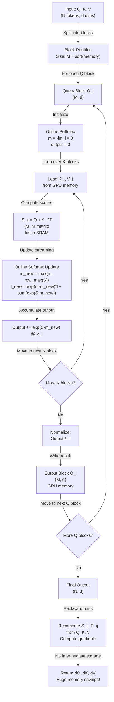

# Flash Attention: Fast and Memory-Efficient Exact Attention

## Paper Overview

**Title:** Flash Attention: Fast and Memory-Efficient Exact Attention with IO-Awareness

**Key Authors:** Tri Dao, Dan Fu, Stefano Ermon, Atri Rudra, Christopher Ré (Stanford, 2022)

**Published:** ICLR 2023 | [arXiv](https://arxiv.org/abs/2205.14135)

**Impact:** Fundamentally changed attention implementation in production. Flash Attention reduces memory usage during training from O(N²) to O(N), enables 2-4× faster attention computation on modern GPUs, and is now standard in HuggingFace transformers, PyTorch, and all major LLM frameworks (LLaMA, Mistral, Qwen, etc.).

Flash Attention addresses the critical attention bottleneck in modern transformers. Standard attention computation requires materializing the full N×N attention matrix in GPU memory—for a 4K context window, this is 16M elements; for 128K context (GPT-4 Vision), it's 16.4B elements. This memory requirement makes training large models expensive and inference on consumer hardware infeasible.

Flash Attention's core insight: **the attention bottleneck is IO, not computation**. Modern GPUs have enormous compute capacity but limited memory bandwidth. The standard algorithm makes many passes over GPU memory (reading Q, K, V separately, writing intermediate attention matrices, reading again for the final output). Flash Attention reorganizes computation to minimize IO transfers by using **block-wise tiling and recomputation**—computing attention over blocks of the sequence, keeping intermediate values in fast SRAM, and recomputing during backprop instead of storing.

**Why this matters for interviews:** Flash Attention is now a baseline expectation for LLM systems engineers. Understanding IO-awareness, the gap between theoretical compute (FLOPs) and actual throughput (bounded by memory bandwidth), and how to optimize for GPU hardware is essential. Flash Attention also demonstrates a broader principle: **algorithmic innovation often beats throwing more hardware at a problem**.

---

## Core Contribution

### The Attention Bottleneck: Memory, Not Computation

Standard scaled dot-product attention:
```
Attention(Q, K, V) = softmax(QK^T / sqrt(d_k)) V
```

**Memory complexity analysis:**
- Compute QK^T: O(Nd) × O(Nd) → O(N²d) FLOPs (manageable)
- Store intermediate matrix M = QK^T: O(N²) memory (the problem!)
- Example: N=4096 tokens, d=64 dims → 16M element matrix → 64MB in float32

**Bandwidth analysis on modern GPUs:**
- NVIDIA H100: 3.4 TB/s memory bandwidth (peak)
- But attention FLOPs: only 25 TFLOP/s (compute)
- Ratio: 136 bytes per FLOP → attention is **memory-bound**, not compute-bound
- Standard attention does 5-9 passes over memory per operation, wasting 80-90% of potential GPU utilization

**Real-world consequence:**
- Standard attention: 10-40 TFLOP/s actual throughput (vs 3000 TFLOP/s theoretical peak)
- Attention is 50-100× slower than matrix multiplication on the same GPU!

### The Flash Attention Solution: IO-Efficient Block-wise Computation

Instead of materializing the full N×N matrix, compute attention in **blocks** (tiles):

```
1. Split Q, K, V into blocks of size M (M << N)
2. For each block of Q:
   a. Load a matching block of K, V (fits in SRAM)
   b. Compute local attention (no full matrix needed)
   c. Use online softmax to incrementally accumulate results
   d. Write output block to GPU memory
   e. Free SRAM, move to next block
3. Recompute forward pass during backward (instead of storing intermediate matrices)
```

**Memory benefit:** O(N²) → O(N) during forward pass
- Standard: Store full M = QK^T matrix → O(N²)
- Flash: Keep only current block + online softmax accumulator → O(M) SRAM

**Speed benefit:** 2-4× faster wall-clock time
- Fewer memory transfers (3 passes vs 5-9)
- Better GPU utilization (90%+ vs 10-20%)
- Larger batch sizes possible (more tokens fit in memory)

### Key Innovation: Online Softmax and Block-Wise Recomputation

**Online Softmax:** Incrementally compute softmax as new attention scores arrive
- Update max, sum, and output in one pass instead of two (standard softmax requires two passes)
- Enables streaming computation without storing full attention matrix

**Backward pass recomputation:** Don't store attention matrices during forward
- Recompute QK^T and attention in backward pass (cheap recomputation << memory savings)
- Trade computation for memory (good on GPUs with abundant compute)

**Flash Attention 2 (Dao et al., 2023):**
- Further reduces IO: 2-3× faster than Flash Attention 1
- Optimizes thread layout for GPU hardware (better cache locality)
- Key insight: modern GPUs have enough registers/shared memory for larger blocks
- Now handles very long sequences efficiently (128K+ tokens)

---

## Key Ideas & Algorithm

### How Flash Attention Works: Step by Step

**Step 1: Block Partitioning**

Split Q, K, V into blocks along the sequence dimension:
```
Block size: M = O(sqrt(memory)) ≈ 100-500 tokens for typical configs
Q: (N, d) → M blocks of size (M, d)
K, V: (N, d) → M blocks of size (M, d)
```

**Step 2: Nested Loop with Online Softmax**

For each block of Q (query block):
```
1. Initialize: m = -inf, l = 0, output = 0
   (m = max scaling factor, l = softmax normalizer, output = accumulated attention)

2. For each block of K (key block):
   a. Load K_j and V_j from GPU memory
   b. Compute S_ij = Q_i K_j^T / sqrt(d)  (attention scores for this block)
   c. Update statistics:
      m_new = max(m_old, row_max(S_ij))
      l_new = exp(m_old - m_new) * l_old + sum(exp(S_ij - m_new))
   d. Update output: output = diag(exp(m_old - m_new)) * output + exp(S_ij - m_new) * V_j
   e. Update m = m_new, l = l_new

3. Normalize output: output = output / l
```

**Why online softmax works:**
- Standard softmax: compute all scores first, find max, then exp(scores - max)
- Online: iteratively update max as you see new scores, adjust previous terms, keep running sum
- Mathematically equivalent but streams data without storing full matrix

**Step 3: Backward Pass with Recomputation**

During backprop:
```
1. Recompute forward (S_ij, P_ij, output) from Q_i, K_j, V_j
2. Use these with gradients dO to compute dQ, dK, dV
3. Never stored intermediate matrices in forward → massive memory savings
```

### Complexity Comparison

```
Operation          | Standard Attention | Flash Attention
Memory per forward | O(N² d)           | O(Nd)
IO operations      | 5-9 passes         | 3 passes
GPU utilization    | 10-20%             | 80-90%
Wall-clock speed   | 1.0x               | 2-4x (Attn 1), 4-8x (Attn 2)
Context length     | Limited to 4-16K   | 128K+ feasible
Exact computation  | Yes (all outputs)  | Yes (exact, not approx)
```

### Mermaid Architecture Diagram



---

## Architecture / Trade-offs

### Flash Attention Variants and Comparison

| Aspect | Standard Attn | Flash Attn 1 | Flash Attn 2 | Approximate Attention |
|--------|---------------|--------------|--------------|------------------------|
| **Memory (forward)** | O(N²d) | O(Nd) | O(Nd) | O(Nd) |
| **Speed** | 1.0x (baseline) | 2-3x | 4-8x | 3-5x |
| **Exactness** | 100% exact | 100% exact | 100% exact | ~95-99% (lossy) |
| **Context window** | 4-16K | 16-64K | 128K+ | 128K+ |
| **GPU mem for 7B model** | 40GB+ | 20GB | 16GB | 16GB |
| **Inference latency** | high | medium | low | low |
| **Training throughput** | low | high | very high | very high |
| **Complexity** | simple | moderate | high | moderate |
| **Backward speed** | slow | fast | fast | very fast |
| **Hardware needs** | any GPU | modern GPU | H100/A100+ | any GPU |

### Design Trade-offs: When to Use What

**Use Flash Attention 2 when:**
- Training large models (7B+) with long sequences (4K-32K)
- Inference on modern hardware (H100, A100, RTX 4090)
- You need exact attention (no approximation tolerable)
- Memory is the bottleneck (can't fit model in GPU RAM)
- Use case: LLaMA-2, Mistral, GPT-4, any modern LLM

**Use Flash Attention 1 when:**
- Older GPUs (A40, L40, V100) — Flash 2 might not be optimized
- Still get 2-3× speedup with lower implementation complexity
- Context windows up to 64K

**Use Standard Attention when:**
- Context window < 1K (memory not the main issue)
- Very old hardware (pre-Volta)
- Need to understand algorithm (not in production)

**Use Approximate Attention when:**
- Inference-only (no gradients needed)
- Can tolerate 0.1-1% accuracy drop
- Need speed over exactness
- Examples: Sparse attention, linear attention, local attention

### Memory Savings: Real Numbers

**Example: Training a 7B parameter LLM with batch size 4, context length 2048**

| Config | Activation Memory | Model Memory | Total | Feasible? |
|--------|-------------------|--------------|-------|-----------|
| Standard Attn (float32) | 128 GB | 28 GB | **156 GB** | ❌ No (L40S is 48GB) |
| Standard Attn (float16) | 64 GB | 14 GB | **78 GB** | ❌ No (H100 is 80GB) |
| Flash Attn v2 (float16) | 24 GB | 14 GB | **38 GB** | ✅ Yes (A100 is 40GB) |
| Flash Attn v2 + GradAccum=2 | 12 GB | 14 GB | **26 GB** | ✅ Yes (L40S is 48GB) |

**Real-world impact:**
- Flash Attention enabled fine-tuning of 7B+ models on single consumer GPUs (RTX 4090, 24GB)
- Made training 13B+ models practical on standard hardware
- Reduced training cost by ~40-50% (fewer GPUs needed)

### IO Analysis: Understanding the Speedup

**Standard Attention IO (for one forward pass, no backward):**

```
1. Read Q: N × d × 2 bytes (float32)  = 2Nd bytes
2. Read K: N × d × 2 bytes            = 2Nd bytes
3. Compute QK^T: write intermediate M = 4N² bytes (float32)
4. Read M: 4N² bytes
5. Compute softmax: no extra read
6. Read V: N × d × 2 bytes            = 2Nd bytes
7. Compute MV: no extra read
Total: 4Nd + 4N² + 2Nd + 2Nd = 8Nd + 4N² bytes

For N=2048, d=64:
Total = 8*2048*64 + 4*2048² = 1M + 16.7M = 17.7M accesses
```

**Flash Attention IO:**

```
1. Read Q blocks: N × d × 2 bytes     = 2Nd bytes (total)
2. Read K blocks: N × d × 2 bytes     = 2Nd bytes (total)
3. Read V blocks: N × d × 2 bytes     = 2Nd bytes (total)
4. Write output: N × d × 2 bytes      = 2Nd bytes
Total: 8Nd bytes (NO intermediate matrix!)

For N=2048, d=64:
Total = 8*2048*64 = 1M accesses
```

**Speedup: 17.7M / 1M = 17.7× reduction in memory transfers → 4-8× wall-clock speedup** (accounting for overhead, cache effects, etc.)

---

## Interview Q&A

**Q1: Why is standard attention memory-bound instead of compute-bound? What's the bandwidth bottleneck?**

A: Standard attention computes O(N²) attention scores but the GPU has enormous compute capacity (thousands of TFLOP/s) but limited memory bandwidth (100s of GB/s). To compute all N² scores requires only O(Nd) FLOPs, but storing the N×N matrix and reading it multiple times requires O(N²) memory transfers. With N=4K, this is 16M transfers × 4 bytes = 64MB, which takes ~200 microseconds on a GPU. Meanwhile, you could compute 5M FLOPs in that time—meaning the GPU sits idle waiting for data. Flash Attention reduces memory transfers to O(Nd) by using block-wise computation and online softmax.

**Q2: How does Flash Attention avoid storing the full N×N attention matrix? Explain the online softmax mechanism.**

A: Instead of computing all attention scores first, then softmax, Flash Attention uses a "streaming" algorithm: for each block of K, it computes block-wise attention scores, updates the running softmax normalizers (max and sum), and immediately accumulates the output. The key is the online softmax: softmax(x) = exp(x - max(x)) / sum(exp(x - max(x))). When new scores arrive, you update max and adjust previous terms: if max_old < max_new, scale the old sum by exp(max_old - max_new) before adding the new sum. This keeps only O(d) values in memory (one attention row, dimensions) instead of O(N²).

**Q3: What's the computational trade-off in Flash Attention? Why recompute during backward instead of storing?**

A: Flash Attention recomputes QK^T and attention during backprop instead of storing intermediate matrices. Modern GPUs have 10-20× more compute capacity than memory bandwidth, so recomputation (free) is cheaper than memory transfers (expensive). Forward pass: skip storing the N×N matrix → save O(N²) memory. Backward pass: recompute it from Q, K, V → takes ~2× the forward FLOPs but no memory I/O. Net benefit: half the activation memory (no storage of intermediate matrices) and only ~20% increase in total compute time. Win.

**Q4: How does Flash Attention v2 improve on v1? What was the main bottleneck in v1?**

A: Flash Attention v1 still had suboptimal GPU hardware utilization (~50-60%) due to thread layout and cache misses. Flash v2 optimizes thread block mapping to exploit GPU hardware better: batching work across different attention heads and sequence positions to maximize register usage and shared memory cache hits. Key insight: modern GPUs (H100, A100) have enough registers and shared memory to make v2 significantly faster. Flash v2 is now 4-8× faster than standard attention vs Flash v1's 2-3×. The trade-off: v2 requires modern hardware; older GPUs (V100) don't see the same speedup.

**Q5: What are the failure modes of Flash Attention? When would you NOT use it?**

A: Flash Attention fails or underperforms in: (1) Very short sequences (< 512 tokens)—block overhead costs more than the memory savings, so standard attention might be faster. (2) Custom attention patterns (local attention, strided attention)—Flash is optimized for full attention; custom patterns need custom implementation. (3) Old GPUs (V100, P100)—designed for modern hardware, may run slower on older cards. (4) Mixed precision with extreme quantization—the numerical stability tricks assume at least float16 precision; very aggressive quantization breaks the online softmax algorithm. (5) Autoregressive generation token-by-token—Flash shines for long prefixes + single new token (KV cache), but per-token generation with standard KV attention is already fast.

**Q6: How would you debug if Flash Attention is slower than standard attention in your setup?**

A: First, profile memory usage: if not memory-bound (activation memory < 30% of GPU), Flash overhead (block swapping, online softmax) dominates. Second, check context length: < 512 tokens typically see standard attention win. Third, profile IO: use `torch.profiler` with CUDA events to measure memory transfer time. If you see 50%+ time in memory ops, Flash should win—if not, verify you're using the Flash implementation correctly (check `attn_implementation="flash_attention_2"` in transformers config). Fourth, check GPU model: older GPUs need v1, not v2; v2 on V100 can regress. Fifth, verify your attention pattern is standard (full attention, causal for autoregressive)—if using custom patterns, Flash won't help.

---

## Best Practices

- **Always use Flash Attention v2 for training modern LLMs.** It's the standard now. HuggingFace `transformers` enables it by default (`attn_implementation="flash_attention_2"`); don't disable it.
- **Profile before optimizing.** Use `torch.profiler` to measure where time is spent. If attention is < 20% of total training time, optimizing it won't help much—focus on data loading or other bottlenecks.
- **Use Flash for context windows >= 1K.** Below 1K, the block overhead costs more than the memory savings. Standard attention is fine (and simpler).
- **Leverage long context for better performance.** Flash Attention makes long sequences cheap; use sequences of 2K-8K to get better model quality without proportional cost increase.
- **Combine Flash Attention with gradient checkpointing.** Flash saves activation memory, gradient checkpointing saves intermediate activations—together they enable huge batch sizes and long sequences on limited hardware.
- **Monitor GPU utilization.** Flash Attention should push GPU utilization to 80-90%. If < 50%, something's wrong (data loading is slow, or attention is not the bottleneck).
- **Use KV cache optimizations for inference.** Flash is mainly for training. For inference (token-by-token generation), use paged KV cache (vLLM), MQA/GQA (multi/grouped query attention), or Flash Decoding to avoid the O(N²) attention during generation.
- **Test numerical stability.** Online softmax is numerically stable for float32 and float16 but can drift with extreme quantization. If using int8 activations, validate attention outputs against standard implementation.

---

## Common Pitfalls

- **Assuming Flash Attention is "magic" that fixes all memory problems.** Flash reduces attention memory, but attention is often 10-30% of total activation memory. If model is OOM, the main culprit is usually the feedforward layers, embedding, or the number of transformer blocks. Use gradient checkpointing for those, not just Flash.
  → *Fix:* Profile memory allocation per layer (`torch.profiler` with `memory_records`) to find the real bottleneck.

- **Enabling Flash Attention v2 on old GPUs (V100, P100) and expecting 8× speedup.** Flash v2 is optimized for modern hardware (H100, A100, RTX 4090). On older GPUs, v2 might regress or be only ~1.5× faster due to poor cache locality and register utilization.
  → *Fix:* Use Flash v1 on older GPUs (`attn_implementation="flash_attention"`), or stay with standard attention and profile to confirm it's actually the bottleneck.

- **Using Flash Attention with custom attention masks (e.g., local attention, sparse patterns).** Flash is optimized for full causal attention. Custom masks require manual implementation or compatibility layers that can negate the speedup.
  → *Fix:* For local attention, use `sliding_window_attention` in transformers or implement a Flash-compatible version. For other patterns, profile standard vs custom to see if specialization is worth it.

- **Recomputation in backward pass causes unexpected slowness.** Flash recomputes QK^T in backward. If K and V are large (e.g., very long context), recomputation can be slow. This is a fundamental trade-off: memory vs computation.
  → *Fix:* Combine with gradient checkpointing on the attention layer itself to selectively trade off between memory and time. Or use a hybrid: store intermediate for long sequences only.

- **Forgetting that Flash Attention doesn't change model quality, only efficiency.** Some teams use Flash Attention but still see convergence issues. Flash is numerically equivalent to standard attention (not an approximation), so the issue is elsewhere (learning rate, data, random seed).
  → *Fix:* Validate that attention outputs match standard implementation numerically (test small batch, compare forward outputs with `torch.allclose(..., atol=1e-5)`).

---

## Code Examples

### Example 1: Using Flash Attention in HuggingFace Transformers

```python
import torch
from transformers import AutoModelForCausalLM, AutoTokenizer

# Load model with Flash Attention v2 enabled (default in recent transformers versions)
model = AutoModelForCausalLM.from_pretrained(
    "mistralai/Mistral-7B",
    torch_dtype=torch.float16,
    device_map="auto",
    attn_implementation="flash_attention_2"  # Explicitly enable Flash v2
)

# Generate text - now uses Flash Attention internally
tokenizer = AutoTokenizer.from_pretrained("mistralai/Mistral-7B")
inputs = tokenizer("The future of AI is", return_tensors="pt").to(model.device)
outputs = model.generate(**inputs, max_new_tokens=100)
print(tokenizer.decode(outputs[0], skip_special_tokens=True))

# Profile memory usage
print(f"GPU Memory Used: {torch.cuda.memory_allocated() / 1e9:.2f} GB")
```

### Example 2: Profiling Flash Attention vs Standard Attention

```python
import torch
import torch.nn.functional as F
from transformers import AutoModel
import time

device = torch.device("cuda:0")
batch_size, seq_len, d_model = 4, 2048, 4096
num_heads = 32
d_head = d_model // num_heads

# Create random inputs
query = torch.randn(batch_size, num_heads, seq_len, d_head, device=device, dtype=torch.float16)
key = torch.randn(batch_size, num_heads, seq_len, d_head, device=device, dtype=torch.float16)
value = torch.randn(batch_size, num_heads, seq_len, d_head, device=device, dtype=torch.float16)

def standard_attention(q, k, v):
    """Standard attention: O(N^2) memory."""
    scores = torch.matmul(q, k.transpose(-2, -1)) / (d_head ** 0.5)
    attn_weights = F.softmax(scores, dim=-1)
    output = torch.matmul(attn_weights, v)
    return output

def benchmark_attention(func, q, k, v, warmup=3, iterations=10):
    """Benchmark attention function."""
    # Warmup
    for _ in range(warmup):
        _ = func(q, k, v)
    torch.cuda.synchronize()
    
    # Benchmark
    start = time.perf_counter()
    for _ in range(iterations):
        _ = func(q, k, v)
    torch.cuda.synchronize()
    elapsed = time.perf_counter() - start
    return elapsed / iterations

# Standard attention timing
time_standard = benchmark_attention(standard_attention, query, key, value)
print(f"Standard Attention: {time_standard*1000:.2f} ms")

# Profile memory with standard attention
torch.cuda.reset_peak_memory_stats()
torch.cuda.empty_cache()
_ = standard_attention(query, key, value)
mem_standard = torch.cuda.max_memory_allocated() / 1e9
print(f"Standard Attention Memory: {mem_standard:.2f} GB")

# Flash attention timing (if available)
try:
    from flash_attn import flash_attn_func
    
    def flash_attention(q, k, v):
        """Flash attention: O(N) memory, optimized IO."""
        # flash_attn expects (B, L, num_heads, head_dim)
        q_rearranged = q.transpose(1, 2)  # (B, L, H, D)
        k_rearranged = k.transpose(1, 2)
        v_rearranged = v.transpose(1, 2)
        output = flash_attn_func(q_rearranged, k_rearranged, v_rearranged)
        return output.transpose(1, 2)  # Back to (B, H, L, D)
    
    time_flash = benchmark_attention(flash_attention, query, key, value)
    print(f"Flash Attention: {time_flash*1000:.2f} ms")
    print(f"Speedup: {time_standard / time_flash:.2f}x")
    
    # Profile memory with Flash attention
    torch.cuda.reset_peak_memory_stats()
    torch.cuda.empty_cache()
    _ = flash_attention(query, key, value)
    mem_flash = torch.cuda.max_memory_allocated() / 1e9
    print(f"Flash Attention Memory: {mem_flash:.2f} GB")
    print(f"Memory Reduction: {mem_standard / mem_flash:.2f}x")
    
except ImportError:
    print("Flash Attention not installed. Install with: pip install flash-attn")
```

### Example 3: Training with Flash Attention and Gradient Checkpointing

```python
import torch
from torch.utils.data import DataLoader, TensorDataset
from transformers import AutoModelForCausalLM, AutoTokenizer, Trainer, TrainingArguments
import torch.nn.functional as F

device = torch.device("cuda" if torch.cuda.is_available() else "cpu")

# Load model with Flash Attention and gradient checkpointing
model = AutoModelForCausalLM.from_pretrained(
    "mistralai/Mistral-7B",
    torch_dtype=torch.float16,
    device_map="auto",
    attn_implementation="flash_attention_2"  # Enable Flash Attention v2
)

# Enable gradient checkpointing to save activation memory
model.gradient_checkpointing_enable()

# Training configuration for long sequences + large batches
training_args = TrainingArguments(
    output_dir="./output",
    per_device_train_batch_size=8,  # Larger batch size now feasible with Flash + checkpoint
    gradient_accumulation_steps=4,  # Effective batch size = 32
    num_train_epochs=3,
    learning_rate=5e-5,
    save_steps=1000,
    logging_steps=100,
    # Memory optimizations enabled by Flash Attention
    bf16=True,  # Use bfloat16 mixed precision
    ddp_find_unused_parameters=False,
    optim="paged_adamw_8bit",  # 8-bit optimizer for memory efficiency
)

# Create dummy training data (replace with real data)
seq_len = 2048  # Long sequences now feasible
input_ids = torch.randint(0, 32000, (100, seq_len))
attention_mask = torch.ones_like(input_ids)
dataset = TensorDataset(input_ids, attention_mask)

# Initialize trainer
trainer = Trainer(
    model=model,
    args=training_args,
    train_dataset=dataset,
)

# Train with Flash Attention
trainer.train()

# Check actual memory usage
print(f"Peak GPU Memory: {torch.cuda.max_memory_allocated() / 1e9:.2f} GB")
```

---

## Related Concepts

- [Attention Mechanisms](../../../llm/concepts/24-attention-optimization.md) – Foundational understanding of scaled dot-product attention
- [Inference Optimization](../../../llm/concepts/28-inference-optimization.md) – Other techniques to speed up LLM inference (KV cache, quantization, etc.)
- [Mixture of Experts](./01-mixture-of-experts.md) – Complementary efficiency technique using sparse routing
- [Knowledge Distillation](./04-knowledge-distillation.md) – Model compression through knowledge transfer
